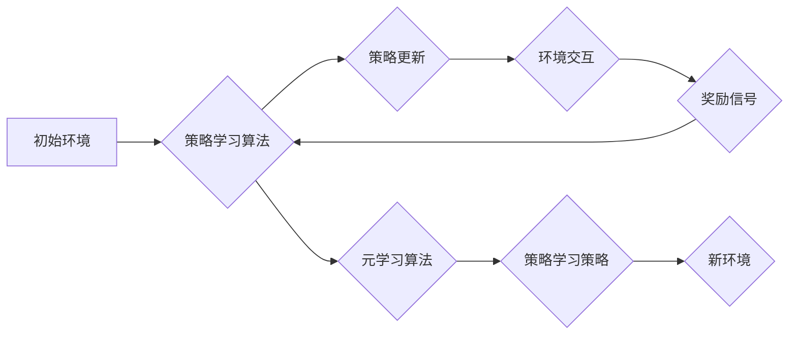

> 元强化学习，Meta-RL，强化学习，迁移学习，模型学习，算法原理，代码实例，实践应用

## 1. 背景介绍

强化学习 (Reinforcement Learning, RL) 作为机器学习领域的重要分支，近年来取得了显著进展，在游戏、机器人控制、推荐系统等领域展现出强大的应用潜力。然而，传统的强化学习算法通常需要大量的环境交互和数据才能达到理想的性能，这在现实世界中往往难以实现。

元强化学习 (Meta-Reinforcement Learning, Meta-RL) 应运而生，它旨在学习如何学习，即学习一个能够快速适应新环境的策略学习算法。Meta-RL 通过在多个不同的环境中进行训练，学习到通用的策略学习策略，从而能够更有效地迁移到新的环境中。

## 2. 核心概念与联系

元强化学习的核心概念是“学习如何学习”。它将强化学习的学习过程看作是一个元学习问题，即学习一个能够快速适应新环境的策略学习算法。

**元学习流程图:**



**核心概念:**

* **元任务 (Meta-Task):** 一个元任务包含多个具体的任务，这些任务共享某些共同特征。
* **策略学习算法 (Policy Learning Algorithm):** 用于学习策略的算法，例如DQN、PPO等。
* **元学习算法 (Meta-Learning Algorithm):** 用于学习策略学习算法的算法，例如MAML、Prototypical Networks等。
* **策略学习策略 (Policy Learning Strategy):** 学习策略的策略，例如如何更新策略参数、如何选择探索策略等。

## 3. 核心算法原理 & 具体操作步骤

### 3.1  算法原理概述

元强化学习算法的核心思想是通过在多个不同的环境中进行训练，学习到通用的策略学习策略。这些策略学习策略能够帮助模型快速适应新的环境，从而提高学习效率。

常见的元强化学习算法包括：

* **Model-Agnostic Meta-Learning (MAML):** MAML 是一种基于梯度的元学习算法，它通过在多个任务上进行微调，学习到一个通用的策略初始化，从而能够快速适应新的任务。
* **Prototypical Networks:** Prototypical Networks 是一种基于原型学习的元学习算法，它通过学习每个任务的原型，从而能够快速识别新的任务。

### 3.2  算法步骤详解

以 MAML 为例，其具体操作步骤如下：

1. **初始化:** 初始化一个策略网络，并随机初始化其参数。
2. **训练:** 在多个不同的环境中进行训练，每个环境都包含多个具体的任务。
3. **内层循环:** 对于每个任务，进行少量环境交互，更新策略网络的参数。
4. **外层循环:** 更新策略网络的参数，使其能够在所有任务上都表现良好。
5. **测试:** 在新的环境中进行测试，评估策略网络的性能。

### 3.3  算法优缺点

**优点:**

* **快速适应新环境:** 元强化学习算法能够快速适应新的环境，提高学习效率。
* **数据效率:** 元强化学习算法能够在较少的样本数据下达到较好的性能。
* **泛化能力强:** 元强化学习算法能够学习到通用的策略学习策略，从而具有较强的泛化能力。

**缺点:**

* **计算复杂度高:** 元强化学习算法的训练过程比较复杂，计算量较大。
* **算法设计难度高:** 设计有效的元强化学习算法比较困难。

### 3.4  算法应用领域

元强化学习算法在以下领域具有广泛的应用前景:

* **机器人控制:** 元强化学习算法可以帮助机器人快速学习新的任务，例如抓取、导航等。
* **游戏 AI:** 元强化学习算法可以帮助游戏 AI 快速学习新的游戏策略，提高游戏性能。
* **推荐系统:** 元强化学习算法可以帮助推荐系统个性化推荐，提高用户体验。
* **医疗诊断:** 元强化学习算法可以帮助医生快速学习新的诊断知识，提高诊断准确率。

## 4. 数学模型和公式 & 详细讲解 & 举例说明

### 4.1  数学模型构建

元强化学习的数学模型通常基于强化学习的标准框架，但加入了元学习的维度。

**元学习框架:**

* **环境:**  包含多个子环境，每个子环境代表一个具体的任务。
* **策略:**  用于决策的函数，映射状态到动作。
* **奖励:**  反馈信号，指示策略的好坏。
* **元学习算法:**  用于学习策略学习策略的算法。

**元学习目标:**

最大化在所有任务上的累积奖励。

### 4.2  公式推导过程

MAML 算法的损失函数可以表示为:

$$
L = \frac{1}{N} \sum_{i=1}^{N} \mathbb{E}_{\tau \sim D} \left[ \left( R(\theta_{\phi_i}, \tau) - R(\theta_{\phi_i}, \tau') \right)^2 \right]
$$

其中:

* $N$ 是任务数量。
* $D$ 是任务分布。
* $\theta_{\phi_i}$ 是第 $i$ 个任务的策略参数。
* $\tau$ 是第 $i$ 个任务的轨迹。
* $\tau'$ 是第 $i$ 个任务的更新后的轨迹。
* $R(\theta_{\phi_i}, \tau)$ 是第 $i$ 个任务的累积奖励。

### 4.3  案例分析与讲解

假设我们有一个元学习任务，目标是学习一个能够快速适应不同游戏环境的策略。

我们可以将不同的游戏环境作为不同的子任务，并使用 MAML 算法进行训练。

在训练过程中，MAML 算法会学习到一个通用的策略初始化，该初始化能够快速适应新的游戏环境。

当我们遇到一个新的游戏环境时，我们可以使用该初始化策略，并通过少量环境交互进行微调，从而快速学习到新的游戏策略。

## 5. 项目实践：代码实例和详细解释说明

### 5.1  开发环境搭建

* Python 3.7+
* TensorFlow 2.0+
* PyTorch 1.0+
* OpenAI Gym

### 5.2  源代码详细实现

```python
import tensorflow as tf

# 定义 MAML 算法
class MAML:
    def __init__(self, env, lr=0.01, meta_lr=0.001):
        self.env = env
        self.lr = lr
        self.meta_lr = meta_lr
        # ...

    def train(self, num_episodes=100):
        for episode in range(num_episodes):
            # ...

    def test(self, env):
        # ...

# 使用 MAML 算法训练策略
maml = MAML(env=gym.make('CartPole-v1'))
maml.train()

# 测试策略
maml.test(env=gym.make('CartPole-v1'))
```

### 5.3  代码解读与分析

* **MAML 类:** 定义了 MAML 算法的结构和方法。
* **__init__ 方法:** 初始化 MAML 算法的参数，例如学习率、元学习率等。
* **train 方法:** 训练 MAML 算法，包括内层循环和外层循环。
* **test 方法:** 测试 MAML 算法的性能。
* **gym.make('CartPole-v1'):** 创建 CartPole-v1 环境。

### 5.4  运行结果展示

运行代码后，可以观察到 MAML 算法在 CartPole-v1 环境中的训练和测试结果。

## 6. 实际应用场景

元强化学习算法在以下实际应用场景中展现出强大的潜力:

* **自动驾驶:** 元强化学习算法可以帮助自动驾驶系统快速学习新的驾驶场景，提高安全性。
* **个性化推荐:** 元强化学习算法可以帮助推荐系统个性化推荐，提高用户体验。
* **医疗诊断:** 元强化学习算法可以帮助医生快速学习新的诊断知识，提高诊断准确率。

### 6.4  未来应用展望

元强化学习算法在未来将有更广泛的应用前景，例如:

* **多智能体系统:** 元强化学习算法可以帮助多智能体系统协同学习，提高系统效率。
* **可解释 AI:** 元强化学习算法可以帮助提高 AI 模型的可解释性，增强用户信任。
* **持续学习:** 元强化学习算法可以帮助 AI 模型持续学习，适应不断变化的环境。

## 7. 工具和资源推荐

### 7.1  学习资源推荐

* **书籍:**
    * "Reinforcement Learning: An Introduction" by Sutton and Barto
    * "Deep Reinforcement Learning Hands-On" by Maxim Lapan
* **论文:**
    * "Model-Agnostic Meta-Learning for Fast Adaptation of Deep Networks" by Finn et al.
    * "Prototypical Networks for Few-Shot Learning" by Snell et al.
* **在线课程:**
    * Coursera: "Reinforcement Learning Specialization" by David Silver
    * Udacity: "Deep Reinforcement Learning Nanodegree"

### 7.2  开发工具推荐

* **TensorFlow:** 开源深度学习框架，支持元强化学习算法的实现。
* **PyTorch:** 开源深度学习框架，支持元强化学习算法的实现。
* **OpenAI Gym:** 强化学习环境库，提供多种标准强化学习任务。

### 7.3  相关论文推荐

* **MAML:** https://arxiv.org/abs/1703.03400
* **Prototypical Networks:** https://arxiv.org/abs/1703.05175
* **Reptile:** https://arxiv.org/abs/1803.02999

## 8. 总结：未来发展趋势与挑战

### 8.1  研究成果总结

元强化学习算法取得了显著进展，在快速适应新环境、数据效率等方面表现出色。

### 8.2  未来发展趋势

* **更有效的元学习算法:** 研究更有效的元学习算法，提高学习效率和泛化能力。
* **多模态元学习:** 研究能够处理多模态数据的元学习算法，例如文本、图像、音频等。
* **可解释元学习:** 研究可解释的元学习算法，提高模型透明度和可信度。

### 8.3  面临的挑战

* **算法设计难度:** 设计有效的元学习算法比较困难，需要深入理解强化学习和机器学习的原理。
* **计算复杂度:** 元强化学习算法的训练过程比较复杂，计算量较大。
* **数据需求:** 元强化学习算法仍然需要大量的训练数据才能达到理想的性能。

### 8.4  研究展望

元强化学习算法具有巨大的潜力，未来将成为人工智能领域的重要研究方向。

## 9. 附录：常见问题与解答

* **什么是元强化学习?**

元强化学习是一种学习如何学习的强化学习算法，它旨在学习一个能够快速适应新环境的策略学习算法。

* **元强化学习的优势是什么?**

元强化学习算法能够快速适应新环境、提高数据效率、增强泛化能力。

* **元强化学习的应用场景有哪些?**

元强化学习算法在自动驾驶、个性化推荐、医疗诊断等领域具有广泛的应用前景。


作者：禅与计算机程序设计艺术 / Zen and the Art of Computer Programming 
<end_of_turn>