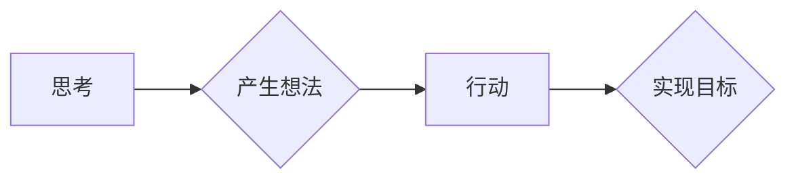

> 创造力，人工智能，算法，思维模型，行动力，创新，技术发展

## 1. 背景介绍

在当今科技飞速发展的时代，创造力已成为推动社会进步和经济增长的关键驱动力。从颠覆性的技术革新到引人入胜的艺术作品，创造力无处不在，它赋予人类解决问题、创造价值和塑造未来的能力。然而，创造力并非天生的天赋，它是一种可以培养和提升的技能，尤其是在人工智能和技术领域。

## 2. 核心概念与联系

创造力可以被分解为两个核心要素：**思考**和**行动**。

* **思考**是指对信息进行深入的理解、分析和整合，并从中产生新的想法、概念和解决方案。它涉及到批判性思维、联想思维、想象力等多种认知能力。
* **行动**是指将想法付诸实践，将其转化为现实。它需要勇气、毅力和执行力，以及对资源和工具的有效利用。

这两个要素相互依存，缺一不可。只有通过深入思考，才能产生有价值的想法；只有通过行动，才能将想法转化为现实。

**Mermaid 流程图：**



## 3. 核心算法原理 & 具体操作步骤

### 3.1  算法原理概述

在人工智能领域，许多算法被设计用来模拟和增强人类的创造力。其中，**生成对抗网络 (GAN)** 是一个典型的例子。GAN 由两个神经网络组成：**生成器**和**鉴别器**。

* **生成器** 负责生成新的数据，例如图像、文本或音乐。
* **鉴别器** 负责判断数据是否为真实数据或由生成器生成的伪造数据。

这两个网络在对抗性的训练过程中不断相互改进。生成器试图生成越来越逼真的数据，而鉴别器试图识别越来越多的伪造数据。最终，生成器能够生成与真实数据几乎 indistinguishable 的数据。

### 3.2  算法步骤详解

1. **初始化生成器和鉴别器网络**：随机初始化两个网络的参数。
2. **生成器训练**：生成器根据随机噪声输入生成数据样本。
3. **鉴别器训练**：鉴别器对真实数据和生成器生成的样本进行分类，并根据分类结果更新参数。
4. **重复步骤 2 和 3**：不断迭代训练生成器和鉴别器，直到生成器能够生成逼真的数据样本。

### 3.3  算法优缺点

**优点：**

* 可以生成逼真的数据样本，应用于图像合成、文本生成、音乐创作等领域。
* 能够学习数据中的复杂模式和结构。

**缺点：**

* 训练过程复杂，需要大量的计算资源和时间。
* 生成的数据样本可能存在偏差或不稳定性。

### 3.4  算法应用领域

* **图像生成和编辑**：生成逼真的图像、修改图像内容、合成图像。
* **文本生成**：生成小说、诗歌、新闻报道等文本内容。
* **音乐创作**：生成新的音乐旋律、伴奏和歌曲。
* **数据增强**：生成新的训练数据，提高机器学习模型的性能。

## 4. 数学模型和公式 & 详细讲解 & 举例说明

### 4.1  数学模型构建

GAN 的训练过程可以看作是一个博弈过程，生成器和鉴别器之间的对抗关系可以用数学模型来描述。

**鉴别器损失函数：**

$$
L_D(D, G) = E_{x \sim p_{data}(x)} [log D(x)] + E_{z \sim p_z(z)} [log(1 - D(G(z)))]
$$

**生成器损失函数：**

$$
L_G(G, D) = E_{z \sim p_z(z)} [log D(G(z))]
$$

其中：

* $D(x)$ 表示鉴别器对数据样本 $x$ 的预测概率。
* $G(z)$ 表示生成器根据噪声输入 $z$ 生成的样本。
* $p_{data}(x)$ 表示真实数据分布。
* $p_z(z)$ 表示噪声分布。

### 4.2  公式推导过程

鉴别器损失函数旨在最大化对真实数据的预测概率，同时最小化对生成数据的预测概率。生成器损失函数旨在最大化鉴别器对生成数据的预测概率。

通过优化这两个损失函数，生成器和鉴别器在对抗性的训练过程中不断改进。

### 4.3  案例分析与讲解

例如，在图像生成领域，GAN 可以用来生成逼真的人脸图像。训练过程中，生成器会尝试生成与真实人脸图像相似的图像，而鉴别器则会试图区分真实图像和生成图像。通过反复训练，生成器最终能够生成与真实人脸图像几乎 indistinguishable 的图像。

## 5. 项目实践：代码实例和详细解释说明

### 5.1  开发环境搭建

* Python 3.x
* TensorFlow 或 PyTorch 深度学习框架
* CUDA 和 cuDNN (可选，用于 GPU 加速)

### 5.2  源代码详细实现

以下是一个简单的 GAN 代码示例，使用 TensorFlow 实现：

```python
import tensorflow as tf

# 定义生成器网络
def generator(z):
  # ...

# 定义鉴别器网络
def discriminator(x):
  # ...

# 定义损失函数和优化器
optimizer_G = tf.keras.optimizers.Adam(learning_rate=0.0002, beta_1=0.5)
optimizer_D = tf.keras.optimizers.Adam(learning_rate=0.0002, beta_1=0.5)

# 训练循环
for epoch in range(num_epochs):
  for batch in dataset:
    # 生成器训练
    noise = tf.random.normal([batch_size, latent_dim])
    fake_images = generator(noise)
    with tf.GradientTape() as tape_G:
      fake_logits = discriminator(fake_images)
      loss_G = -tf.reduce_mean(tf.math.log(fake_logits))
    gradients_G = tape_G.gradient(loss_G, generator.trainable_variables)
    optimizer_G.apply_gradients(zip(gradients_G, generator.trainable_variables))

    # 鉴别器训练
    real_images = batch
    real_logits = discriminator(real_images)
    fake_images = generator(noise)
    fake_logits = discriminator(fake_images)
    loss_D = -tf.reduce_mean(tf.math.log(real_logits)) - tf.reduce_mean(tf.math.log(1 - fake_logits))
    with tf.GradientTape() as tape_D:
      gradients_D = tape_D.gradient(loss_D, discriminator.trainable_variables)
    optimizer_D.apply_gradients(zip(gradients_D, discriminator.trainable_variables))

```

### 5.3  代码解读与分析

这段代码实现了 GAN 的基本训练流程。

* **生成器网络** 负责生成新的数据样本。
* **鉴别器网络** 负责判断数据样本是否为真实数据或生成数据。
* **损失函数** 用于衡量生成器和鉴别器的性能。
* **优化器** 用于更新生成器和鉴别器的参数。

### 5.4  运行结果展示

训练完成后，可以利用生成器生成新的数据样本，并与真实数据进行比较。

## 6. 实际应用场景

### 6.1  图像生成

* **艺术创作**: 生成独特的艺术作品，例如绘画、雕塑、音乐等。
* **游戏开发**: 生成游戏场景、角色和道具，提高游戏体验。
* **医学影像**: 生成合成医学影像，用于医学诊断和研究。

### 6.2  文本生成

* **内容创作**: 生成新闻报道、博客文章、小说等文本内容。
* **机器翻译**: 生成高质量的机器翻译文本。
* **聊天机器人**: 生成自然语言对话，提高聊天机器人的交互体验。

### 6.3  音乐创作

* **音乐作曲**: 生成新的音乐旋律、伴奏和歌曲。
* **音乐配乐**: 为电影、电视剧等视频作品生成合适的配乐。
* **音乐风格转换**: 将一首音乐转换为不同的音乐风格。

### 6.4  未来应用展望

随着人工智能技术的不断发展，GAN 的应用场景将更加广泛。未来，GAN 可能被用于：

* **虚拟现实和增强现实**: 生成逼真的虚拟环境和增强现实体验。
* **个性化定制**: 生成个性化的产品、服务和内容。
* **科学研究**: 模拟复杂系统，加速科学发现。

## 7. 工具和资源推荐

### 7.1  学习资源推荐

* **书籍**:
    * "Generative Deep Learning" by David Foster
    * "Deep Learning" by Ian Goodfellow, Yoshua Bengio, and Aaron Courville
* **在线课程**:
    * Coursera: "Deep Learning Specialization" by Andrew Ng
    * Udacity: "Deep Learning Nanodegree"
* **博客和论坛**:
    * Distill.pub
    * arXiv

### 7.2  开发工具推荐

* **TensorFlow**: 开源深度学习框架，支持 GPU 加速。
* **PyTorch**: 开源深度学习框架，灵活易用。
* **Keras**: 高级深度学习 API，可以运行在 TensorFlow 或 Theano 后端。

### 7.3  相关论文推荐

* "Generative Adversarial Networks" by Ian Goodfellow et al. (2014)
* "Improved Techniques for Training GANs" by Alec Radford et al. (2015)
* "Progressive Growing of GANs for Improved Quality, Stability, and Variation" by Tero Karras et al. (2017)

## 8. 总结：未来发展趋势与挑战

### 8.1  研究成果总结

近年来，GAN 技术取得了显著的进展，在图像生成、文本生成、音乐创作等领域取得了突破性的成果。

### 8.2  未来发展趋势

* **更高质量的生成结果**: 研究者们致力于开发新的 GAN 架构和训练方法，以生成更高质量、更逼真的数据样本。
* **更广泛的应用场景**: GAN 将被应用于更多领域，例如药物研发、材料科学、金融预测等。
* **更强的可解释性**: 研究者们正在探索如何提高 GAN 的可解释性，以便更好地理解其工作原理。

### 8.3  面临的挑战

* **训练稳定性**: GAN 的训练过程往往不稳定，容易出现模式崩溃等问题。
* **数据依赖性**: GAN 的性能很大程度上依赖于训练数据的质量和数量。
* **伦理问题**: GAN 可以生成逼真的虚假信息，可能被用于恶意目的，例如造假、传播谣言等。

### 8.4  研究展望

未来，GAN 技术将继续发展，并对人工智能和技术领域产生深远的影响。研究者们需要不断探索新的算法、方法和应用场景，同时也要关注 GAN 的伦理问题，确保其安全和负责任地应用。

## 9. 附录：常见问题与解答

**Q1: GAN 的训练过程为什么不稳定？**

**A1:** GAN 的训练过程是一个博弈过程，生成器和鉴别器之间相互竞争。如果生成器太弱，鉴别器会很容易识别出生成的数据；如果生成器太强，鉴别器会无法区分真实数据和生成数据。这种相互竞争的关系会导致训练过程不稳定，容易出现模式崩溃等问题。

**Q2: 如何提高 GAN 的训练稳定性？**

**A2:** 

* 使用更好的损失函数和优化器。
* 使用数据增强技术增加训练数据的多样性。
* 使用梯度惩罚等技术防止模型过拟合。
* 使用 Progressive Growing of GANs 等技术