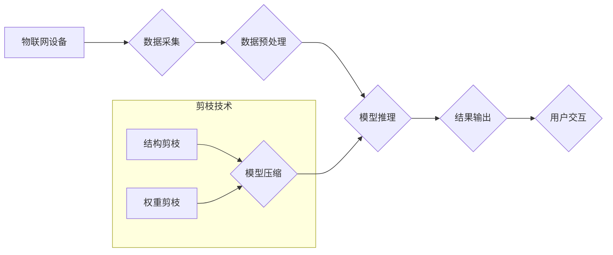

> 物联网设备，剪枝技术，资源约束，模型压缩，高效推理，边缘计算

## 1. 背景介绍

物联网（IoT）正以惊人的速度发展，连接着越来越多的智能设备，从智能家居到工业自动化，再到智能医疗。这些设备通常具有有限的计算资源和存储空间，这使得高效的模型推理成为一项关键挑战。深度学习模型在物联网设备上的部署面临着巨大的资源约束，传统的深度学习模型往往体积庞大，计算量巨大，难以在资源受限的物联网设备上进行高效推理。

剪枝技术作为一种模型压缩技术，通过移除模型中冗余的连接或节点，从而减小模型大小和计算量，同时尽量保持模型性能。它在物联网设备上具有重要的应用价值，可以有效地降低设备的功耗和延迟，提高设备的运行效率。

## 2. 核心概念与联系

### 2.1 剪枝技术概述

剪枝技术是一种模型压缩技术，通过移除模型中冗余的连接或节点，从而减小模型大小和计算量，同时尽量保持模型性能。剪枝技术可以分为结构剪枝和权重剪枝两种主要类型。

* **结构剪枝:** 移除模型中的某些连接或节点，改变模型的结构。
* **权重剪枝:** 移除模型中权重值较小的连接或节点，减少模型参数的数量。

### 2.2 剪枝技术与物联网设备的关联

物联网设备通常具有以下特点：

* **资源受限:** 物联网设备的计算资源和存储空间有限。
* **功耗限制:** 物联网设备通常需要长时间运行，功耗是一个重要的考虑因素。
* **实时性要求:** 一些物联网应用需要实时响应，延迟是一个关键指标。

剪枝技术可以有效地解决这些问题，通过减小模型大小和计算量，提高物联网设备的运行效率。

### 2.3 剪枝技术与边缘计算的结合

边缘计算是指将计算任务从云端迁移到靠近数据源的边缘设备，例如物联网设备。边缘计算可以降低数据传输延迟，提高计算效率，并增强数据安全。剪枝技术与边缘计算相结合，可以进一步提高边缘设备的计算能力和效率。

**Mermaid 流程图**



## 3. 核心算法原理 & 具体操作步骤

### 3.1 算法原理概述

剪枝算法的基本原理是通过移除模型中冗余的连接或节点，从而减小模型大小和计算量。常用的剪枝算法包括：

* **逐层剪枝:** 从模型的最后一层开始，依次剪除权重值较小的连接或节点。
* **全局剪枝:** 对整个模型进行一次性剪枝，移除所有权重值较小的连接或节点。
* **迭代剪枝:** 采用迭代的方式进行剪枝，每次剪除一部分连接或节点，并重新训练模型，直到达到预设的性能目标。

### 3.2 算法步骤详解

以逐层剪枝为例，其具体操作步骤如下：

1. **初始化:** 选择一个预训练的深度学习模型。
2. **权重排序:** 对模型中每个层的权重值进行排序，从小到大排列。
3. **阈值设置:** 设置一个剪枝阈值，将权重值低于阈值的连接或节点视为冗余，进行移除。
4. **模型更新:** 移除冗余的连接或节点后，重新训练模型，以恢复模型性能。
5. **重复步骤2-4:** 重复上述步骤，逐步降低剪枝阈值，直到达到预设的模型大小或性能目标。

### 3.3 算法优缺点

**优点:**

* 模型压缩效果显著，可以有效减小模型大小和计算量。
* 算法实现相对简单，易于理解和实现。

**缺点:**

* 剪枝可能会导致模型性能下降，需要通过重新训练模型来恢复性能。
* 剪枝效果取决于剪枝阈值的选择，需要进行多次实验才能找到最佳阈值。

### 3.4 算法应用领域

剪枝技术广泛应用于各种深度学习领域，例如：

* **图像识别:** 压缩图像识别模型，降低设备功耗和延迟。
* **自然语言处理:** 压缩文本分类、机器翻译等模型，提高模型部署效率。
* **语音识别:** 压缩语音识别模型，降低设备资源占用。

## 4. 数学模型和公式 & 详细讲解 & 举例说明

### 4.1 数学模型构建

假设一个深度学习模型包含 $N$ 个参数，每个参数的权重值分别为 $w_1, w_2, ..., w_N$。剪枝的目标是移除一部分参数，从而减小模型大小和计算量。

我们可以使用以下数学模型来表示剪枝过程：

$$
w' = \begin{cases}
w_i, & \text{if } |w_i| > \theta \\
0, & \text{otherwise}
\end{cases}
$$

其中，$w'$ 表示剪枝后的参数向量，$\theta$ 表示剪枝阈值。

### 4.2 公式推导过程

剪枝过程可以看作是一个二分类问题，每个参数的权重值作为输入特征，剪枝阈值作为分类阈值。

如果参数的权重值大于剪枝阈值，则保留该参数；否则，移除该参数。

### 4.3 案例分析与讲解

假设一个深度学习模型包含 100 个参数，剪枝阈值为 0.5。

如果模型中参数的权重值分别为：0.1, 0.6, 0.3, 0.8, 0.2, ...，则剪枝后的参数向量为：

$$
w' = [0.6, 0.8, 0, 0, 0.2, ...]
$$

其中，权重值小于 0.5 的参数被移除。

## 5. 项目实践：代码实例和详细解释说明

### 5.1 开发环境搭建

* 操作系统：Ubuntu 20.04
* Python 版本：3.8
* 深度学习框架：TensorFlow 2.x

### 5.2 源代码详细实现

```python
import tensorflow as tf

# 定义一个简单的深度学习模型
model = tf.keras.models.Sequential([
    tf.keras.layers.Dense(128, activation='relu', input_shape=(784,)),
    tf.keras.layers.Dense(10, activation='softmax')
])

# 训练模型
model.compile(optimizer='adam',
              loss='sparse_categorical_crossentropy',
              metrics=['accuracy'])
model.fit(x_train, y_train, epochs=10)

# 进行剪枝
# 设置剪枝阈值
prune_threshold = 0.5

# 遍历模型层
for layer in model.layers:
    # 获取层中的权重值
    weights = layer.get_weights()[0]
    # 移除权重值低于阈值的连接
    weights[abs(weights) < prune_threshold] = 0
    # 更新层中的权重值
    layer.set_weights([weights])

# 重新训练模型
model.compile(optimizer='adam',
              loss='sparse_categorical_crossentropy',
              metrics=['accuracy'])
model.fit(x_train, y_train, epochs=5)
```

### 5.3 代码解读与分析

* 代码首先定义了一个简单的深度学习模型，并使用训练数据进行训练。
* 然后，代码设置了一个剪枝阈值，并遍历模型中的每一层，移除权重值低于阈值的连接。
* 最后，代码重新训练模型，以恢复模型性能。

### 5.4 运行结果展示

剪枝后的模型在测试集上的准确率可能会略低于未剪枝的模型，但模型大小和计算量会显著减小。

## 6. 实际应用场景

### 6.1 智能家居

在智能家居场景中，物联网设备通常具有有限的计算资源和功耗限制。剪枝技术可以压缩智能家居设备上的深度学习模型，例如图像识别模型，从而降低设备功耗和延迟，提高设备的运行效率。

### 6.2 工业自动化

在工业自动化场景中，物联网设备需要实时响应，延迟是一个关键指标。剪枝技术可以压缩工业自动化设备上的深度学习模型，例如故障检测模型，从而提高模型推理速度，降低设备延迟。

### 6.3 智能医疗

在智能医疗场景中，物联网设备需要处理敏感医疗数据，数据安全是一个重要考虑因素。剪枝技术可以压缩智能医疗设备上的深度学习模型，例如病症诊断模型，从而减少模型参数的数量，降低数据泄露风险。

### 6.4 未来应用展望

随着物联网技术的不断发展，剪枝技术在物联网设备上的应用前景广阔。未来，剪枝技术可能会与其他模型压缩技术相结合，例如量化技术和知识蒸馏技术，进一步提高模型压缩效果。

## 7. 工具和资源推荐

### 7.1 学习资源推荐

* **论文:**
    * "Pruning Filters for Efficient ConvNets"
    * "Learning Efficient Convolutional Networks through Network Slimming"
* **博客:**
    * TensorFlow 官方博客
    * PyTorch 官方博客

### 7.2 开发工具推荐

* **TensorFlow:** 开源深度学习框架，支持剪枝技术。
* **PyTorch:** 开源深度学习框架，支持剪枝技术。
* **Keras:** 高级深度学习API，可以方便地使用TensorFlow或Theano作为后端，支持剪枝技术。

### 7.3 相关论文推荐

* "Pruning Filters for Efficient ConvNets"
* "Learning Efficient Convolutional Networks through Network Slimming"
* "Optimal Brain Damage"

## 8. 总结：未来发展趋势与挑战

### 8.1 研究成果总结

剪枝技术是一种有效的模型压缩技术，可以有效地减小深度学习模型的大小和计算量，提高模型的部署效率。

### 8.2 未来发展趋势

未来，剪枝技术可能会朝着以下方向发展：

* **自动化剪枝:** 自动化剪枝算法可以自动选择最佳的剪枝策略，无需人工干预。
* **联合剪枝:** 将剪枝技术与其他模型压缩技术结合，例如量化技术和知识蒸馏技术，进一步提高模型压缩效果。
* **硬件加速剪枝:** 利用硬件加速剪枝算法，提高剪枝效率。

### 8.3 面临的挑战

剪枝技术还面临着一些挑战：

* **性能损失:** 剪枝可能会导致模型性能下降，需要通过重新训练模型来恢复性能。
* **剪枝策略选择:** 选择合适的剪枝策略是一个复杂的问题，需要根据具体的应用场景进行选择。
* **硬件支持:** 一些剪枝算法需要硬件的支持，例如GPU加速。

### 8.4 研究展望

未来，剪枝技术的研究方向包括：

* 开发更有效的剪枝算法，减少模型性能损失。
* 研究自动化剪枝算法，提高剪枝效率。
* 探索剪枝技术在其他领域，例如自然语言处理和语音识别中的应用。

## 9. 附录：常见问题与解答

### 9.1 什么是剪枝技术？

剪枝技术是一种模型压缩技术，通过移除模型中冗余的连接或节点，从而减小模型大小和计算量。

### 9.2 剪枝技术有哪些类型？

常用的剪枝算法包括：

* **逐层剪枝:** 从模型的最后一层开始，依次剪除权重值较小的连接或节点。
* **全局剪枝:** 对整个模型进行一次性剪枝，移除所有权重值较小的连接或节点。
* **迭代剪枝:** 采用迭代的方式进行剪枝，每次剪除一部分