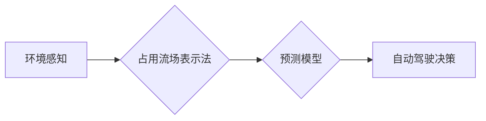

> 占用流场表示法，自动驾驶，预测，路径规划，环境感知

## 1. 背景介绍

自动驾驶技术作为未来交通运输的重要发展方向，其核心之一是精确的预测能力。预测包括预测车辆自身运动轨迹、预测其他路人的行为以及预测道路环境的变化等。准确的预测能够帮助自动驾驶系统做出更合理的决策，提高安全性与效率。

传统的预测方法主要依赖于统计模型和机器学习算法，这些方法通常需要大量的历史数据进行训练，并且在面对复杂、动态的环境时表现不佳。近年来，占用流场表示法 (Occupancy Grid Map, OGM) 作为一种空间信息表示方法，在自动驾驶领域得到了广泛应用。OGM 将环境空间离散化，并通过概率分布表示每个单元格是否被占用，能够有效地描述环境的复杂性和动态性。

## 2. 核心概念与联系

**2.1 占用流场表示法 (OGM)**

占用流场表示法是一种常用的环境感知方法，它将环境空间离散化，并通过概率分布表示每个单元格是否被占用。每个单元格都对应一个概率值，表示该单元格被障碍物占据的可能性。

**2.2  自动驾驶预测**

自动驾驶预测是指预测车辆自身运动轨迹、预测其他路人的行为以及预测道路环境的变化等。准确的预测能够帮助自动驾驶系统做出更合理的决策，提高安全性与效率。

**2.3  OGM在自动驾驶预测中的应用**

OGM 可以用于构建环境模型，并根据环境模型预测未来场景。例如，可以利用 OGM 中的概率分布信息，预测车辆行驶路径上的障碍物分布，从而帮助自动驾驶系统规划更安全的行驶路线。

**2.4  OGM在自动驾驶预测中的改进**

传统的 OGM 存在一些局限性，例如：

* **空间分辨率低:**  OGM 通常采用较粗的网格划分，导致空间分辨率较低，难以准确描述复杂环境。
* **时间更新效率低:**  传统的 OGM 更新方式需要重新计算整个网格的概率分布，效率较低。
* **缺乏对动态环境的适应性:**  传统的 OGM 难以有效地处理动态环境的变化，例如车辆的突然加速或减速。

为了解决这些问题，近年来提出了许多改进的 OGM 方法，例如：

* **高分辨率 OGM:**  采用更细的网格划分，提高空间分辨率。
* **动态 OGM:**  利用传感器数据实时更新 OGM，提高对动态环境的适应性。
* **基于深度学习的 OGM:**  利用深度学习算法学习环境特征，提高 OGM 的预测精度。

**Mermaid 流程图**



## 3. 核心算法原理 & 具体操作步骤

### 3.1  算法原理概述

占用流场表示法 (OGM) 的核心算法原理是通过传感器数据构建环境模型，并利用概率分布表示每个单元格是否被占用。

**3.1.1  环境建模**

利用传感器数据，例如激光雷达、摄像头等，获取环境信息。将环境空间离散化，并根据传感器数据更新每个单元格的占用概率。

**3.1.2  概率更新**

根据传感器数据和环境模型，更新每个单元格的占用概率。常用的概率更新方法包括：

* **贝叶斯更新:**  利用贝叶斯定理更新占用概率。
* **粒子滤波:**  利用粒子滤波算法估计占用概率的分布。

**3.1.3  地图表示**

将更新后的占用概率存储在占用流场地图中。占用流场地图通常采用二维网格表示，每个单元格对应一个概率值。

### 3.2  算法步骤详解

1. **环境感知:** 利用传感器数据获取环境信息。
2. **空间离散化:** 将环境空间离散化，构建网格地图。
3. **初始化占用概率:** 为每个单元格赋予初始占用概率，例如 0.5 表示未知状态。
4. **传感器数据处理:** 对传感器数据进行预处理，例如滤波、校正等。
5. **概率更新:** 根据传感器数据和环境模型，利用贝叶斯更新或粒子滤波算法更新每个单元格的占用概率。
6. **地图更新:** 将更新后的占用概率存储在占用流场地图中。
7. **地图可视化:** 将占用流场地图可视化，方便观察和分析。

### 3.3  算法优缺点

**优点:**

* **直观易懂:**  占用流场表示法直观地描述了环境空间的占用情况。
* **易于实现:**  占用流场表示法的算法实现相对简单。
* **可扩展性强:**  占用流场表示法可以扩展到三维空间，并结合其他传感器数据进行融合。

**缺点:**

* **空间分辨率低:**  传统的 OGM 通常采用较粗的网格划分，导致空间分辨率较低。
* **时间更新效率低:**  传统的 OGM 更新方式需要重新计算整个网格的概率分布，效率较低。
* **缺乏对动态环境的适应性:**  传统的 OGM 难以有效地处理动态环境的变化。

### 3.4  算法应用领域

占用流场表示法在自动驾驶领域广泛应用，例如：

* **路径规划:**  利用 OGM 建立环境模型，规划安全有效的行驶路线。
* **避障:**  根据 OGM 中的障碍物分布，避免车辆与障碍物发生碰撞。
* **环境感知:**  利用 OGM 描述环境的复杂性和动态性，为自动驾驶系统提供更全面的环境信息。

## 4. 数学模型和公式 & 详细讲解 & 举例说明

### 4.1  数学模型构建

占用流场表示法 (OGM) 的数学模型主要包括以下几个方面：

* **空间网格:**  将环境空间离散化，构建二维或三维网格。每个网格单元对应一个概率值。
* **占用概率:**  每个网格单元的占用概率表示该单元格被障碍物占据的可能性。
* **传感器数据:**  利用传感器数据更新占用概率。

### 4.2  公式推导过程

**4.2.1  贝叶斯更新公式:**

$$
P(x_t|z_t) = \frac{P(z_t|x_t)P(x_t)}{P(z_t)}
$$

其中：

* $P(x_t|z_t)$:  给定传感器观测数据 $z_t$ 下，网格单元 $x_t$ 被占用的概率。
* $P(z_t|x_t)$:  给定网格单元 $x_t$ 被占用，传感器观测数据 $z_t$ 的概率。
* $P(x_t)$:  网格单元 $x_t$ 被占用的先验概率。
* $P(z_t)$:  传感器观测数据 $z_t$ 的概率。

**4.2.2  粒子滤波算法:**

粒子滤波算法是一种用于估计概率分布的蒙特卡罗方法。它通过维护一系列粒子，每个粒子代表一个可能的系统状态，并根据传感器观测数据更新粒子的权重。

### 4.3  案例分析与讲解

假设一个自动驾驶车辆使用激光雷达传感器获取环境信息。激光雷达传感器可以检测到周围障碍物的位置和距离。

利用贝叶斯更新公式，可以根据激光雷达传感器数据更新占用流场地图中的每个单元格的占用概率。例如，如果激光雷达传感器检测到一个障碍物位于某个单元格，则该单元格的占用概率会增加。

## 5. 项目实践：代码实例和详细解释说明

### 5.1  开发环境搭建

* 操作系统: Ubuntu 20.04
* 编程语言: Python 3.8
* 库依赖: ROS, OpenCV, NumPy, Matplotlib

### 5.2  源代码详细实现

```python
import rospy
from sensor_msgs.msg import LaserScan
from nav_msgs.msg import OccupancyGrid
import numpy as np
import matplotlib.pyplot as plt

class OccupancyGridUpdater:
    def __init__(self):
        rospy.init_node('occupancy_grid_updater')
        self.laser_scan_sub = rospy.Subscriber('/scan', LaserScan, self.laser_scan_callback)
        self.occupancy_grid_pub = rospy.Publisher('/occupancy_grid', OccupancyGrid, queue_size=10)

    def laser_scan_callback(self, msg):
        # 获取激光雷达数据
        ranges = msg.ranges
        # ...
        # 根据激光雷达数据更新占用流场地图
        # ...
        # 发布更新后的占用流场地图
        # ...

if __name__ == '__main__':
    updater = OccupancyGridUpdater()
    rospy.spin()
```

### 5.3  代码解读与分析

* `OccupancyGridUpdater` 类负责订阅激光雷达数据并更新占用流场地图。
* `laser_scan_callback` 函数处理激光雷达数据，并根据数据更新占用流场地图。
* `occupancy_grid_pub` 发布更新后的占用流场地图。

### 5.4  运行结果展示

运行代码后，可以观察到占用流场地图实时更新，反映了环境的变化。

## 6. 实际应用场景

### 6.1  自动驾驶路径规划

占用流场表示法可以用于构建环境模型，并根据环境模型规划安全有效的行驶路线。例如，自动驾驶车辆可以利用 OGM 避开障碍物，并选择最优的路径到达目的地。

### 6.2  自动驾驶避障

占用流场表示法可以用于检测环境中的障碍物，并帮助自动驾驶车辆避开障碍物。例如，自动驾驶车辆可以利用 OGM 识别行人、车辆和其他障碍物，并采取相应的避障措施。

### 6.3  自动驾驶环境感知

占用流场表示法可以用于描述环境的复杂性和动态性，为自动驾驶系统提供更全面的环境信息。例如，自动驾驶车辆可以利用 OGM 了解周围车辆的运动轨迹，并预测未来场景。

### 6.4  未来应用展望

随着自动驾驶技术的不断发展，占用流场表示法在自动驾驶领域的应用前景广阔。未来，占用流场表示法可以应用于更复杂的场景，例如：

* **复杂交通环境:**  在拥堵的交通环境中，占用流场表示法可以帮助自动驾驶车辆更好地理解交通规则，并做出更合理的决策。
* **复杂地形:**  在崎岖的山路或复杂地形中，占用流场表示法可以帮助自动驾驶车辆更好地感知环境，并规划更安全的行驶路线。
* **多传感器融合:**  占用流场表示法可以与其他传感器数据融合，例如摄像头、雷达等，提供更全面的环境信息。

## 7. 工具和资源推荐

### 7.1  学习资源推荐

* **书籍:**
    * "Probabilistic Robotics" by Sebastian Thrun, Wolfram Burgard, and Dieter Fox
    * "Robotics, Vision and Control" by Peter Corke
* **在线课程:**
    * Coursera: "Probabilistic Robotics"
    * Udacity: "Self-Driving Car Engineer Nanodegree"

### 7.2  开发工具推荐

* **ROS (Robot Operating System):**  一个用于机器人软件开发的开源框架。
* **OpenCV:**  一个用于计算机视觉的开源库。
* **NumPy:**  一个用于数值计算的开源库。
* **Matplotlib:**  一个用于数据可视化的开源库。

### 7.3  相关论文推荐

* "Occupancy Grid Mapping" by S. Thrun, W. Burgard, and D. Fox
* "Probabilistic Occupancy Grid Mapping with Particle Filtering" by S. Thrun, W. Burgard, and D. Fox
* "Occupancy Grid Mapping with Deep Learning" by J. Zhang et al.

## 8. 总结：未来发展趋势与挑战

###