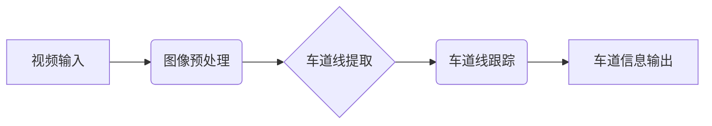

> OpenCV, 车道检测, 视频处理, 图像处理, 线性回归, Hough变换

## 1. 背景介绍

随着自动驾驶技术的快速发展，道路车道检测技术作为自动驾驶系统的重要组成部分，越来越受到重视。车道检测技术能够帮助自动驾驶车辆识别道路边界线，从而实现车辆的自动行驶、保持车道和避障等功能。传统的车道检测方法主要依赖于人工标注数据，效率低且成本高。近年来，随着深度学习技术的兴起，基于深度学习的车道检测方法取得了显著的进展，能够自动学习道路特征，提高检测精度和效率。

本文将介绍基于OpenCV库的视频道路车道检测方法，详细讲解算法原理、具体操作步骤、数学模型和代码实现。

## 2. 核心概念与联系

**2.1  车道检测概述**

车道检测是指从图像或视频中识别和提取道路边界线的技术。车道检测技术广泛应用于自动驾驶、智能交通、无人驾驶等领域。

**2.2  OpenCV库介绍**

OpenCV（Open Source Computer Vision Library）是一个开源的计算机视觉库，提供了一系列图像处理、计算机视觉和机器学习算法。OpenCV支持多种编程语言，包括C++、Python、Java等。

**2.3  核心概念关系图**



## 3. 核心算法原理 & 具体操作步骤

**3.1  算法原理概述**

本文采用基于Hough变换的车道检测算法，该算法能够有效地识别和提取道路边界线。Hough变换是一种用于检测直线的图像处理技术，它将图像中的点转换为直线参数空间，通过投票机制找到最可能的直线。

**3.2  算法步骤详解**

1. **视频预处理:** 对视频帧进行预处理，包括灰度化、去噪、边缘检测等操作，以增强车道线的特征。
2. **区域分割:** 将图像分割成多个区域，例如左右车道区域，以减少计算量和提高检测精度。
3. **特征提取:** 在每个区域中提取车道线特征，例如边缘点、颜色信息等。
4. **Hough变换:** 对提取的特征点进行Hough变换，得到直线参数空间，并根据投票结果找到最可能的直线。
5. **车道线拟合:** 对检测到的直线进行拟合，得到车道线的数学表达式。
6. **车道线跟踪:** 将当前帧的车道线与上一帧的车道线进行匹配，跟踪车道线的运动轨迹。

**3.3  算法优缺点**

**优点:**

* 检测精度高
* 能够识别弯曲的车道线
* 算法相对简单

**缺点:**

* 对图像质量要求较高
* 难以处理复杂的路况，例如交叉路口、弯道等

**3.4  算法应用领域**

* 自动驾驶
* 智能交通
* 无人驾驶
* 视频监控

## 4. 数学模型和公式 & 详细讲解 & 举例说明

**4.1  数学模型构建**

车道线可以表示为一条直线，其数学表达式为：

$$y = kx + b$$

其中，k为斜率，b为截距。

**4.2  公式推导过程**

Hough变换的核心思想是将图像中的点转换为直线参数空间，通过投票机制找到最可能的直线。

假设图像中存在一个点 (x, y)，则该点对应的直线参数空间中的坐标为 (k, b)。

根据直线方程，可以得到：

$$b = y - kx$$

因此，点 (x, y) 对应的直线参数空间中的坐标为 (k, y - kx)。

**4.3  案例分析与讲解**

假设图像中存在一个点 (2, 3)，则该点对应的直线参数空间中的坐标为 (k, 3 - 2k)。

当 k = 1 时，b = 1，直线方程为 y = x + 1。

当 k = 2 时，b = -1，直线方程为 y = 2x - 1。

通过不断改变 k 的值，可以得到该点对应的不同直线参数。

## 5. 项目实践：代码实例和详细解释说明

**5.1  开发环境搭建**

* 操作系统：Windows/Linux/macOS
* Python版本：3.6+
* OpenCV库：4.5+

**5.2  源代码详细实现**

```python
import cv2
import numpy as np

# 读取视频文件
cap = cv2.VideoCapture("video.mp4")

while(True):
    # 读取视频帧
    ret, frame = cap.read()

    # 图像预处理
    gray = cv2.cvtColor(frame, cv2.COLOR_BGR2GRAY)
    blur = cv2.GaussianBlur(gray, (5, 5), 0)
    edges = cv2.Canny(blur, 50, 150)

    # 区域分割
    # ...

    # 车道线提取
    lines = cv2.HoughLinesP(edges, 1, np.pi/180, 100, minLineLength=100, maxLineGap=10)

    # 车道线跟踪
    # ...

    # 显示结果
    cv2.imshow("Video", frame)

    # 退出条件
    if cv2.waitKey(1) & 0xFF == ord('q'):
        break

# 释放资源
cap.release()
cv2.destroyAllWindows()
```

**5.3  代码解读与分析**

* **读取视频文件:** 使用 `cv2.VideoCapture()` 函数读取视频文件。
* **图像预处理:** 对视频帧进行灰度化、去噪、边缘检测等操作，以增强车道线的特征。
* **区域分割:** 将图像分割成多个区域，例如左右车道区域，以减少计算量和提高检测精度。
* **车道线提取:** 使用 `cv2.HoughLinesP()` 函数检测车道线。
* **车道线跟踪:** 将当前帧的车道线与上一帧的车道线进行匹配，跟踪车道线的运动轨迹。
* **显示结果:** 使用 `cv2.imshow()` 函数显示视频帧。

**5.4  运行结果展示**

运行代码后，将显示视频帧，并标注出检测到的车道线。

## 6. 实际应用场景

**6.1  自动驾驶**

车道检测技术是自动驾驶系统的重要组成部分，能够帮助自动驾驶车辆识别道路边界线，从而实现车辆的自动行驶、保持车道和避障等功能。

**6.2  智能交通**

车道检测技术可以用于智能交通系统，例如交通流量监测、车道拥堵预警等。

**6.3  无人驾驶**

车道检测技术也是无人驾驶系统的重要组成部分，能够帮助无人驾驶车辆安全行驶。

**6.4  未来应用展望**

随着人工智能技术的不断发展，车道检测技术将更加智能化、精准化。未来，车道检测技术将应用于更多领域，例如：

* 智能交通信号灯控制
* 自动泊车
* 道路救援

## 7. 工具和资源推荐

**7.1  学习资源推荐**

* OpenCV官方文档：https://docs.opencv.org/
* OpenCV教程：https://www.pyimagesearch.com/

**7.2  开发工具推荐**

* Python
* Jupyter Notebook

**7.3  相关论文推荐**

* Lane Detection Using Hough Transform
* Real-Time Lane Detection Using Deep Learning

## 8. 总结：未来发展趋势与挑战

**8.1  研究成果总结**

基于OpenCV的视频道路车道检测技术取得了显著的进展，能够有效地识别和提取道路边界线。

**8.2  未来发展趋势**

* 深度学习技术将被更加广泛地应用于车道检测领域，提高检测精度和鲁棒性。
* 车道检测技术将与其他感知技术融合，例如激光雷达、毫米波雷达等，构建更加全面的感知系统。
* 车道检测技术将应用于更多领域，例如智能交通、无人驾驶等。

**8.3  面临的挑战**

* 复杂的路况，例如交叉路口、弯道等，仍然是车道检测技术面临的挑战。
* 恶劣天气条件，例如雨、雪、雾等，也会影响车道检测的精度。
* 数据标注成本高，深度学习模型的训练需要大量的标注数据。

**8.4  研究展望**

未来，车道检测技术将朝着更加智能化、精准化、鲁棒化的方向发展。


## 9. 附录：常见问题与解答

**9.1  问题:** 如何提高车道检测的精度？

**解答:**

* 提高图像质量，例如使用高分辨率摄像头、进行图像去噪等操作。
* 使用更先进的算法，例如深度学习算法。
* 训练更大的数据集，提高模型的泛化能力。

**9.2  问题:** 如何处理复杂的路况？

**解答:**

* 使用多传感器融合技术，例如结合激光雷达、毫米波雷达等数据。
* 使用更复杂的算法，例如基于深度学习的语义分割算法。
* 使用强化学习技术，训练车辆在复杂路况下的驾驶策略。


作者：禅与计算机程序设计艺术 / Zen and the Art of Computer Programming 
<end_of_turn>