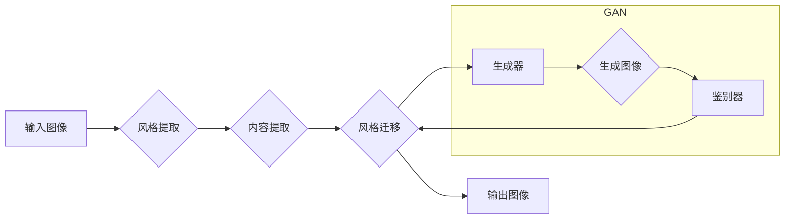

> 生成对抗网络 (GAN)，图像风格迁移，自适应迁移，优化策略，艺术风格

## 1. 背景介绍

图像风格迁移技术近年来备受关注，它能够将一种图像的风格迁移到另一幅图像上，从而创造出具有独特艺术效果的图像。传统的图像风格迁移方法通常依赖于手工设计的特征提取和风格损失函数，难以实现高质量的风格迁移效果，并且对输入图像的风格和内容具有较强的依赖性。

生成对抗网络 (GAN) 是一种强大的生成模型，能够学习数据分布并生成逼真的样本。由于其强大的生成能力和自适应性，GAN 在图像风格迁移领域展现出巨大的潜力。基于 GAN 的图像风格迁移方法能够学习到更丰富的风格信息，并能够更好地适应不同风格和内容的输入图像。

然而，现有的基于 GAN 的图像风格迁移方法仍然存在一些问题，例如：

* **训练不稳定性:** GAN 的训练过程通常比较不稳定，容易陷入局部最优解。
* **风格迁移效果不理想:** 一些方法生成的图像风格迁移效果不够自然，或者存在着过度风格化或失真等问题。
* **缺乏自适应性:** 一些方法对输入图像的风格和内容具有较强的依赖性，难以适应不同的风格和内容组合。

为了解决这些问题，本文提出了一种基于生成对抗网络的图像风格自适应迁移优化策略研究。该策略通过引入新的损失函数和优化算法，提高了 GAN 的训练稳定性和风格迁移效果，并增强了其自适应性。

## 2. 核心概念与联系

### 2.1 生成对抗网络 (GAN)

GAN 由两个神经网络组成：生成器 (Generator) 和鉴别器 (Discriminator)。生成器负责生成新的图像样本，而鉴别器负责判断图像样本是真实图像还是生成图像。这两个网络在对抗博弈中相互竞争，生成器试图生成逼真的图像样本以欺骗鉴别器，而鉴别器试图准确地识别真实图像和生成图像。

### 2.2 图像风格迁移

图像风格迁移是指将一种图像的风格迁移到另一幅图像上，从而创造出具有独特艺术效果的图像。风格迁移通常需要提取图像的风格特征和内容特征，并通过某种方式将风格特征应用到内容特征上。

### 2.3 自适应迁移

自适应迁移是指能够根据输入图像的风格和内容自动调整风格迁移策略，从而实现更灵活和精准的风格迁移效果。

**核心概念与联系流程图:**



## 3. 核心算法原理 & 具体操作步骤

### 3.1 算法原理概述

本文提出的图像风格自适应迁移优化策略基于改进的 GAN 架构，并引入了新的损失函数和优化算法。

* **改进的 GAN 架构:** 为了更好地学习图像的风格和内容信息，本文采用了一种改进的 GAN 架构，其中生成器和鉴别器都包含多层卷积神经网络。

* **新的损失函数:** 除了传统的风格损失函数和内容损失函数外，本文还引入了新的自适应损失函数，该函数能够根据输入图像的风格和内容自动调整风格迁移策略。

* **优化算法:** 为了提高 GAN 的训练稳定性，本文采用了一种新的优化算法，该算法能够更好地平衡生成器和鉴别器的训练过程。

### 3.2 算法步骤详解

1. **数据预处理:** 将输入图像和目标风格图像预处理，例如调整尺寸、归一化像素值等。
2. **风格特征提取:** 使用预训练的卷积神经网络提取输入图像和目标风格图像的风格特征。
3. **内容特征提取:** 使用预训练的卷积神经网络提取输入图像的内容特征。
4. **生成图像:** 使用改进的 GAN 生成器将目标风格特征和输入图像的内容特征组合起来，生成新的图像样本。
5. **鉴别图像:** 使用改进的 GAN 鉴别器判断生成的图像样本是真实图像还是生成图像。
6. **损失函数计算:** 计算生成器和鉴别器的损失函数值，包括风格损失函数、内容损失函数和自适应损失函数。
7. **参数更新:** 使用优化算法更新生成器和鉴别器的参数。
8. **重复步骤 4-7:** 迭代训练生成器和鉴别器，直到达到预设的训练目标。

### 3.3 算法优缺点

**优点:**

* **高质量的风格迁移效果:** 由于采用了改进的 GAN 架构和新的损失函数，该算法能够生成更逼真、更自然风格迁移效果的图像。
* **自适应迁移能力:** 自适应损失函数能够根据输入图像的风格和内容自动调整风格迁移策略，从而实现更灵活和精准的风格迁移效果。
* **训练稳定性:** 新的优化算法能够更好地平衡生成器和鉴别器的训练过程，提高 GAN 的训练稳定性。

**缺点:**

* **计算复杂度高:** 由于采用了多层卷积神经网络，该算法的计算复杂度较高，需要较强的计算资源。
* **训练时间长:** 由于 GAN 的训练过程比较复杂，该算法的训练时间相对较长。

### 3.4 算法应用领域

该算法在图像风格迁移领域具有广泛的应用前景，例如：

* **艺术创作:** 将不同的艺术风格迁移到照片或绘画上，创造出具有独特艺术效果的图像。
* **图像编辑:** 将图像风格调整到特定风格，例如将照片风格化成油画或水彩画。
* **游戏开发:** 为游戏角色和场景添加不同的风格效果，增强游戏的视觉效果。
* **电影特效:** 为电影场景添加风格效果，增强电影的视觉冲击力。

## 4. 数学模型和公式 & 详细讲解 & 举例说明

### 4.1 数学模型构建

本文提出的图像风格自适应迁移优化策略基于以下数学模型：

* **生成器网络:** $G(z, c)$，其中 $z$ 是随机噪声向量，$c$ 是输入图像的内容特征。
* **鉴别器网络:** $D(x)$，其中 $x$ 是输入图像。
* **风格损失函数:** $L_{style}(G(z, c), S)$，其中 $S$ 是目标风格特征。
* **内容损失函数:** $L_{content}(G(z, c), C)$，其中 $C$ 是输入图像的内容特征。
* **自适应损失函数:** $L_{adapt}(G(z, c), S, C)$，其中 $S$ 是目标风格特征，$C$ 是输入图像的内容特征。

### 4.2 公式推导过程

* **生成器损失函数:** $L_G = L_{style}(G(z, c), S) + \lambda_c L_{content}(G(z, c), C) + \lambda_a L_{adapt}(G(z, c), S, C)$
* **鉴别器损失函数:** $L_D = \log(D(x)) + \log(1 - D(G(z, c)))$

其中，$\lambda_c$ 和 $\lambda_a$ 是权重参数，用于平衡不同损失函数的贡献。

### 4.3 案例分析与讲解

假设我们想要将梵高的风格迁移到一张风景照片上。

1. **风格特征提取:** 使用预训练的卷积神经网络提取梵高画作的风格特征。
2. **内容特征提取:** 使用预训练的卷积神经网络提取风景照片的内容特征。
3. **生成图像:** 使用改进的 GAN 生成器将梵高的风格特征和风景照片的内容特征组合起来，生成新的图像样本。
4. **损失函数计算:** 计算生成器和鉴别器的损失函数值，包括风格损失函数、内容损失函数和自适应损失函数。
5. **参数更新:** 使用优化算法更新生成器和鉴别器的参数。

经过多次迭代训练后，生成器能够生成具有梵高风格的风景图像。

## 5. 项目实践：代码实例和详细解释说明

### 5.1 开发环境搭建

* 操作系统: Ubuntu 18.04
* Python 版本: 3.7
* 深度学习框架: TensorFlow 2.0

### 5.2 源代码详细实现

```python
# 生成器网络
def generator(z, c):
    # ...

# 鉴别器网络
def discriminator(x):
    # ...

# 风格损失函数
def style_loss(G(z, c), S):
    # ...

# 内容损失函数
def content_loss(G(z, c), C):
    # ...

# 自适应损失函数
def adapt_loss(G(z, c), S, C):
    # ...

# 生成器损失函数
def generator_loss(G, D, z, c, S, C):
    # ...

# 鉴别器损失函数
def discriminator_loss(D, G, x, z, c, S, C):
    # ...

# 训练循环
for epoch in range(num_epochs):
    # ...
```

### 5.3 代码解读与分析

* **生成器网络:** 生成器网络负责生成新的图像样本，其输入是随机噪声向量和输入图像的内容特征。
* **鉴别器网络:** 鉴别器网络负责判断图像样本是真实图像还是生成图像。
* **损失函数:** 风格损失函数、内容损失函数和自适应损失函数分别衡量生成图像与目标风格图像、输入图像和自适应策略之间的差异。
* **训练循环:** 训练循环中，生成器和鉴别器网络交替训练，直到达到预设的训练目标。

### 5.4 运行结果展示

训练完成后，可以将生成器网络应用于新的输入图像，生成具有目标风格的图像。

## 6. 实际应用场景

### 6.1 艺术创作

* **风格迁移:** 将不同的艺术风格迁移到照片或绘画上，创造出具有独特艺术效果的图像。
* **艺术生成:** 使用 GAN 生成具有特定艺术风格的图像，例如油画、水彩画、素描等。

### 6.2 图像编辑

* **风格调整:** 将图像风格调整到特定风格，例如将照片风格化成油画或水彩画。
* **图像增强:** 使用风格迁移技术增强图像的视觉效果，例如增加图像的细节和色彩饱和度。

### 6.3 游戏开发

* **角色设计:** 为游戏角色添加不同的风格效果，例如将角色设计成卡通风格、写实风格或科幻风格。
* **场景渲染:** 为游戏场景添加风格效果，例如将场景渲染成梦幻风格、复古风格或未来风格。

### 6.4 未来应用展望

* **个性化风格迁移:** 根据用户的喜好和风格偏好，实现个性化的风格迁移。
* **跨媒体风格迁移:** 将风格迁移应用于音频、视频等其他媒体类型。
* **风格迁移辅助创作:** 使用风格迁移技术辅助艺术家进行创作，例如提供灵感和创意。

## 7. 工具和资源推荐

### 7.1 学习资源推荐

* **书籍:**
    * 《深度学习》 by Ian Goodfellow, Yoshua Bengio, Aaron Courville
    * 《Generative Deep Learning》 by David Foster
* **在线课程:**
    * Coursera: Deep Learning Specialization
    * Udacity: Deep Learning Nanodegree
* **博客和论坛:**
    * Distill.pub
    * Towards Data Science

### 7.2 开发工具推荐

* **深度学习框架:** TensorFlow, PyTorch
* **图像处理库:** OpenCV, Pillow
* **可视化工具:** Matplotlib, Seaborn

### 7.3 相关论文推荐

* **Generative Adversarial Networks** by Ian Goodfellow et al. (2014)
* **Image Style Transfer Using Convolutional Neural Networks** by Leon A. Gatys et al. (2015)
* **Adaptive