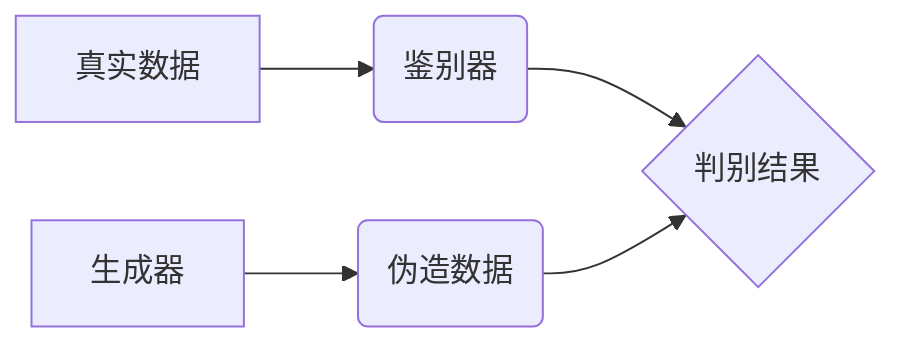

> 生成对抗网络 (GAN)，图像风格迁移，历史档案数字化，深度学习，艺术风格

## 1. 背景介绍

随着数字化时代的发展，历史档案的数字化保存和传承变得越来越重要。然而，传统的历史档案往往存在着纸张老化、褪色、损坏等问题，难以进行长期保存和传播。同时，历史档案的图像往往缺乏现代化的视觉效果，难以吸引年轻一代的关注。因此，如何利用现代技术手段对历史档案进行数字化处理，并使其更加生动、易于理解，成为了一个重要的研究课题。

图像风格迁移技术作为一种新兴的计算机视觉技术，能够将一种图像的风格迁移到另一幅图像上，从而实现图像的艺术化处理。近年来，基于生成对抗网络 (GAN) 的图像风格迁移技术取得了显著的进展，能够生成高质量的风格迁移图像，并应用于艺术创作、图像编辑等领域。

将图像风格迁移技术应用于历史档案数字化处理，可以有效地提升历史档案的视觉效果，使其更加生动、吸引人，从而更好地传承历史文化。

## 2. 核心概念与联系

### 2.1 生成对抗网络 (GAN)

生成对抗网络 (GAN) 是一种由两个神经网络组成的对抗性学习框架，由 Ian Goodfellow 等人于 2014 年提出。GAN 由一个生成器 (Generator) 和一个鉴别器 (Discriminator) 组成。

* **生成器 (Generator):** 负责生成新的数据样本，例如图像。
* **鉴别器 (Discriminator):** 负责判断数据样本是真实数据还是由生成器生成的伪造数据。

生成器和鉴别器之间进行对抗性训练，生成器试图生成越来越逼真的数据样本，而鉴别器试图更好地识别真实数据和伪造数据。最终，生成器能够生成与真实数据相似的样本。



### 2.2 图像风格迁移

图像风格迁移是指将一种图像的风格迁移到另一幅图像上，保留目标图像的内容，同时改变其视觉风格。例如，将梵高的绘画风格迁移到一张风景照片上。

### 2.3 历史档案数字化

历史档案数字化是指将传统纸质档案转换为数字格式，以便于保存、检索和传播。

## 3. 核心算法原理 & 具体操作步骤

### 3.1 算法原理概述

基于生成对抗网络的图像风格迁移算法的核心思想是利用 GAN 的对抗性学习机制，训练一个生成器网络，能够将目标图像的内容与风格图像的风格融合在一起，生成具有目标内容和风格图像风格的新的图像。

### 3.2 算法步骤详解

1. **数据准备:** 首先需要准备两组图像数据：目标图像数据集和风格图像数据集。目标图像数据集包含需要进行风格迁移的图像，风格图像数据集包含需要迁移风格的图像。

2. **网络架构设计:** 设计一个生成对抗网络，包括生成器和鉴别器。生成器网络负责将目标图像和风格图像作为输入，生成具有目标内容和风格图像风格的新的图像。鉴别器网络负责判断输入图像是真实图像还是由生成器生成的伪造图像。

3. **模型训练:** 利用目标图像数据集和风格图像数据集对生成对抗网络进行训练。训练过程中，生成器试图生成越来越逼真的风格迁移图像，而鉴别器试图更好地识别真实图像和伪造图像。

4. **风格迁移:** 将需要进行风格迁移的目标图像作为输入，输入到训练好的生成器网络中，即可生成具有目标内容和风格图像风格的新的图像。

### 3.3 算法优缺点

**优点:**

* 生成高质量的风格迁移图像。
* 可以迁移多种风格图像的风格。
* 能够保留目标图像的内容。

**缺点:**

* 训练过程复杂，需要大量的计算资源。
* 难以控制风格迁移的程度。
* 可能出现图像模糊、失真等问题。

### 3.4 算法应用领域

* **艺术创作:** 将不同的艺术风格迁移到图像上，创作出新的艺术作品。
* **图像编辑:** 将图像的风格进行修改，例如将黑白照片变成彩色照片。
* **历史档案数字化:** 将历史档案的图像进行风格迁移，使其更加生动、吸引人。
* **游戏开发:** 为游戏角色和场景添加不同的风格效果。

## 4. 数学模型和公式 & 详细讲解 & 举例说明

### 4.1 数学模型构建

基于生成对抗网络的图像风格迁移算法的数学模型主要包括以下几个部分：

* **生成器网络 (G):** 

$$
G(z, c)
$$

其中，$z$ 是随机噪声向量，$c$ 是风格特征向量。生成器网络将随机噪声向量和风格特征向量作为输入，输出具有目标内容和风格图像风格的新的图像。

* **鉴别器网络 (D):**

$$
D(x)
$$

其中，$x$ 是输入图像。鉴别器网络将输入图像作为输入，输出一个值，表示输入图像是真实图像还是由生成器生成的伪造图像。

### 4.2 公式推导过程

生成器网络和鉴别器网络的损失函数分别为：

* **生成器损失函数:**

$$
L_G(G, D) = E_{x \sim p_{data}(x)}[log(1 - D(G(z, c)))]
$$

* **鉴别器损失函数:**

$$
L_D(G, D) = E_{x \sim p_{data}(x)}[log(D(x))] + E_{z \sim p_z(z), c \sim p_c(c)}[log(1 - D(G(z, c)))]
$$

其中，$p_{data}(x)$ 是真实图像的分布，$p_z(z)$ 是随机噪声向量的分布，$p_c(c)$ 是风格特征向量的分布。

### 4.3 案例分析与讲解

假设我们想要将梵高的绘画风格迁移到一张风景照片上。

1. 我们需要准备一个梵高的绘画图像数据集和一个风景照片数据集。
2. 我们设计一个生成对抗网络，包括生成器和鉴别器。
3. 我们利用这两个数据集对生成对抗网络进行训练。
4. 训练完成后，我们将风景照片作为输入，输入到训练好的生成器网络中，即可生成具有梵高绘画风格的风景照片。

## 5. 项目实践：代码实例和详细解释说明

### 5.1 开发环境搭建

* 操作系统: Ubuntu 20.04
* Python 版本: 3.8
* CUDA 版本: 11.0
* cuDNN 版本: 8.0
* 深度学习框架: PyTorch

### 5.2 源代码详细实现

```python
import torch
import torch.nn as nn
import torch.optim as optim

# 定义生成器网络
class Generator(nn.Module):
    def __init__(self):
        super(Generator, self).__init__()
        # ...

    def forward(self, z, c):
        # ...

# 定义鉴别器网络
class Discriminator(nn.Module):
    def __init__(self):
        super(Discriminator, self).__init__()
        # ...

    def forward(self, x):
        # ...

# 实例化生成器和鉴别器网络
generator = Generator()
discriminator = Discriminator()

# 定义损失函数和优化器
criterion = nn.BCELoss()
optimizer_G = optim.Adam(generator.parameters(), lr=0.0002, betas=(0.5, 0.999))
optimizer_D = optim.Adam(discriminator.parameters(), lr=0.0002, betas=(0.5, 0.999))

# 训练循环
for epoch in range(num_epochs):
    for i, (real_images, style_images) in enumerate(train_loader):
        # ...

```

### 5.3 代码解读与分析

* **网络架构设计:** 代码中定义了生成器网络和鉴别器网络的结构。
* **损失函数:** 使用了二分类交叉熵损失函数来训练生成器和鉴别器。
* **优化器:** 使用了 Adam 优化器来更新网络参数。
* **训练循环:** 训练循环中，首先将真实图像和风格图像输入到生成器和鉴别器网络中，计算损失函数，然后使用优化器更新网络参数。

### 5.4 运行结果展示

训练完成后，可以将目标图像作为输入，输入到训练好的生成器网络中，即可生成具有目标内容和风格图像风格的新的图像。

## 6. 实际应用场景

### 6.1 历史档案数字化

将历史档案的图像进行风格迁移，使其更加生动、吸引人，可以提高历史档案的阅读性和传播性。例如，将黑白老照片进行风格迁移，使其变成彩色照片，可以更加直观地展现历史场景。

### 6.2 艺术创作

将不同的艺术风格迁移到图像上，可以创作出新的艺术作品。例如，将毕加索的绘画风格迁移到一张风景照片上，可以创作出具有毕加索风格的风景画。

### 6.3 图像编辑

将图像的风格进行修改，例如将黑白照片变成彩色照片，可以用于图像编辑。

### 6.4 未来应用展望

随着深度学习技术的不断发展，基于生成对抗网络的图像风格迁移技术将会得到更广泛的应用，例如：

* **虚拟现实和增强现实:** 在虚拟现实和增强现实场景中，可以利用图像风格迁移技术，为用户提供更加沉浸式的体验。
* **个性化定制:** 用户可以根据自己的喜好，将自己的风格迁移到图像上，进行个性化定制。
* **医疗影像分析:** 可以利用图像风格迁移技术，将医学影像进行风格化处理，提高医生的诊断效率。

## 7. 工具和资源推荐

### 7.1 学习资源推荐

* **论文:**

* Goodfellow, I., Pouget-Abadie, J., Mirza, M., Xu, B., Warde-Farley, D., Ozair, S., ... & Bengio, Y. (2014). Generative adversarial nets. In Advances in neural information processing systems (pp. 2672-2680).

* **博客:**

* https://blog.openai.com/generative-adversarial-nets/

### 7.2 开发工具推荐

* **PyTorch:** https://pytorch.org/
* **TensorFlow:** https://www.tensorflow.org/

### 7.3 相关论文推荐

* **Style Transfer Using Convolutional Neural Networks:** https://arxiv.org/abs/1508.06576
* **Deep Learning for Artistic Style Transfer:** https://arxiv.org/abs/1609.08222

## 8. 总结：未来发展趋势与挑战

### 8.1 研究成果总结

基于生成对抗网络的图像风格迁移技术取得了显著的进展，能够生成高质量的风格迁移图像，并应用于艺术创作、图像编辑等领域。将该技术应用于历史档案数字化，可以有效地提升历史档案的视觉效果，使其更加生动、吸引人。

### 8.2 未来发展趋势

* **更高质量的风格迁移:** 研究更先进的生成对抗网络架构，提高风格迁移图像的质量。
* **更灵活的风格控制:** 研究更灵活的风格控制方法，例如用户可以根据自己的喜好，调整风格迁移的程度。
* **更广泛的应用场景:** 将图像风格迁移技术应用于更多领域，例如虚拟现实、增强现实、医疗影像分析等。

### 8.3 面临的挑战

* **训练成本:** 训练生成对抗网络需要大量的计算资源，成本较高。
* **风格迁移效果:** 难以完全控制风格迁移的效果，有时会出现图像模糊、失真等问题。
* **数据标注:** 需要大量的标注数据来训练生成对抗网络，数据标注成本较高。

###