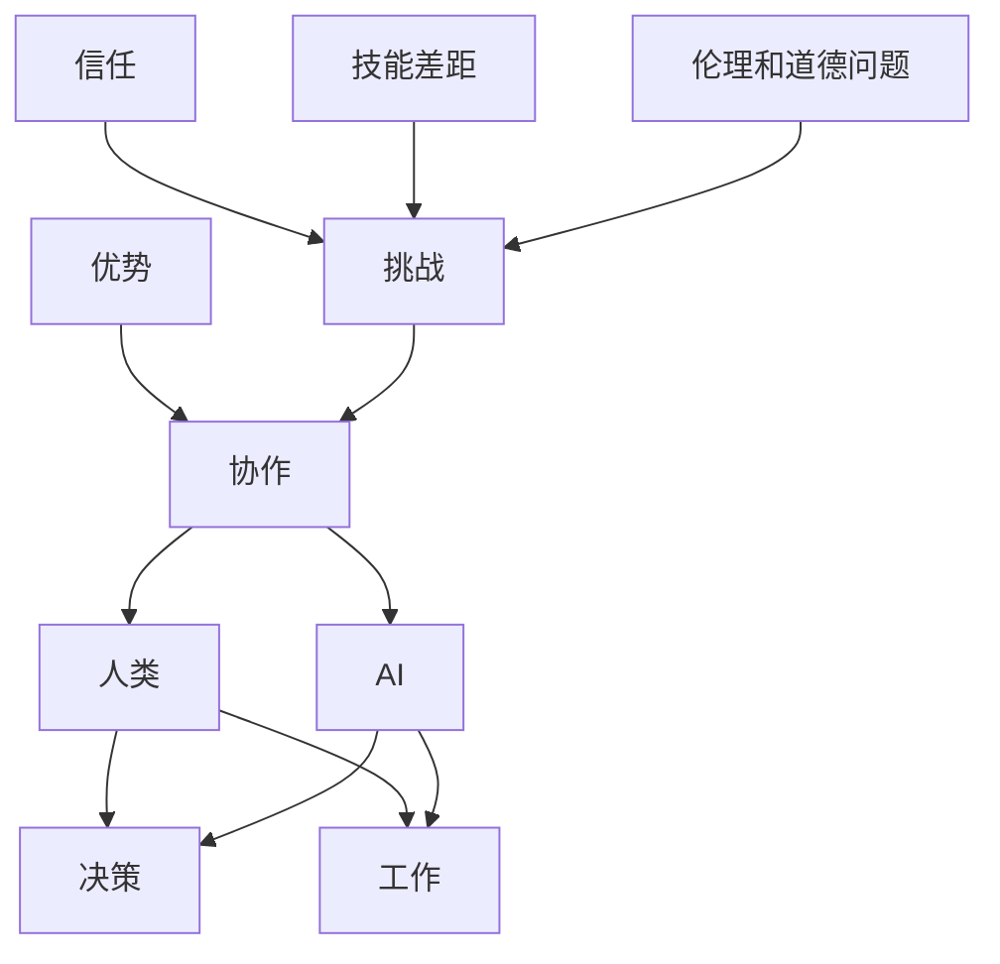

                 

**人类-AI协作：增强人类潜能与AI能力的融合发展趋势预测分析机遇挑战**

## 1. 背景介绍

当前，人工智能（AI）正在各行各业迅速发展，从自动驾驶到医疗诊断，从金融风控到客户服务，AI的应用无处不在。然而，AI并非要取代人类，而是应该与人类协作，共同创造更大的价值。本文将探讨人类与AI的协作趋势，分析机遇与挑战，并展望未来的发展方向。

## 2. 核心概念与联系

### 2.1 人类与AI的协作

人类与AI的协作，也称为人机协作（Human-Machine Collaboration, HMC），指的是人类和AI在任务或决策过程中相互配合、共同工作的现象。这种协作可以是人类主导的，也可以是AI主导的，还可以是平等协作的。

### 2.2 协作的优势

人类与AI的协作可以带来以下优势：

- **增强决策能力**：AI可以提供数据驱动的见解，帮助人类做出更明智的决策。
- **提高效率**：AI可以自动化重复性工作，释放人类的时间和精力。
- **降低成本**：AI可以减少人力成本，提高运营效率。
- **提高准确性**：AI可以帮助人类减少错误，提高工作准确性。

### 2.3 协作的挑战

人类与AI的协作也面临着以下挑战：

- **信任问题**：人类需要信任AI的建议，但这需要时间和数据的积累。
- **技能差距**：人类和AI的技能存在差距，需要找到协作的最佳方式。
- **伦理和道德问题**：AI的决策可能会涉及伦理和道德问题，需要人类的监督和指导。

### 2.4 核心概念联系图



## 3. 核心算法原理 & 具体操作步骤

### 3.1 算法原理概述

人类与AI的协作可以通过多种算法实现，其中之一是**共同注意力模型（Joint Attention Model）**。该模型允许人类和AI共享注意力，从而协作完成任务。

### 3.2 算法步骤详解

1. **注意力共享**：人类和AI各自关注任务的不同方面，并共享注意力信息。
2. **信息整合**：人类和AI整合注意力信息，生成共享表示。
3. **决策或行动**：基于共享表示，人类或AI做出决策或执行行动。
4. **反馈**：任务结果反馈给人类和AI，用于更新注意力共享和信息整合过程。

### 3.3 算法优缺点

**优点**：

- 可以平等地结合人类和AI的能力。
- 可以适应人类和AI的注意力差异。

**缺点**：

- 需要大量数据来训练模型。
- 需要人类和AI之间的有效沟通。

### 3.4 算法应用领域

共同注意力模型可以应用于各种人机协作场景，如：

- **自动驾驶**：人类司机和AI共同注意路况，协作驾驶。
- **医疗诊断**：医生和AI共同注意病例信息，协作做出诊断决策。
- **客户服务**：客服人员和AI共同注意客户需求，协作提供服务。

## 4. 数学模型和公式 & 详细讲解 & 举例说明

### 4.1 数学模型构建

设人类注意力为$\mathbf{h}_h \in \mathbb{R}^n$, AI注意力为$\mathbf{h}_a \in \mathbb{R}^n$, 任务表示为$\mathbf{t} \in \mathbb{R}^n$. 共同注意力模型可以表示为：

$$\mathbf{z} = f(\mathbf{h}_h, \mathbf{h}_a, \mathbf{t})$$

其中，$f$是一个非线性函数，$\mathbf{z}$是共享表示。

### 4.2 公式推导过程

假设$f$是一个双线性函数，则：

$$\mathbf{z} = \mathbf{h}_h \otimes \mathbf{h}_a \otimes \mathbf{t}$$

其中，$\otimes$表示张量积运算。

### 4.3 案例分析与讲解

例如，在自动驾驶场景中，人类注意力$\mathbf{h}_h$关注路边的行人，AI注意力$\mathbf{h}_a$关注路面的车辆，任务表示$\mathbf{t}$表示转弯决策。共同注意力模型可以整合这三者的信息，生成共享表示$\mathbf{z}$, 从而协助人类司机做出转弯决策。

## 5. 项目实践：代码实例和详细解释说明

### 5.1 开发环境搭建

本项目使用Python作为开发语言，并依赖于TensorFlow和PyTorch库。

### 5.2 源代码详细实现

以下是共同注意力模型的简单实现：

```python
import tensorflow as tf

class JointAttentionModel(tf.keras.Model):
    def __init__(self):
        super(JointAttentionModel, self).__init__()
        self.fc = tf.keras.layers.Dense(128, activation='relu')

    def call(self, h_h, h_a, t):
        z = tf.concat([h_h, h_a, t], axis=-1)
        z = self.fc(z)
        return z
```

### 5.3 代码解读与分析

该模型接受人类注意力$\mathbf{h}_h$, AI注意力$\mathbf{h}_a$, 任务表示$\mathbf{t}$作为输入，并通过全连接层生成共享表示$\mathbf{z}$.

### 5.4 运行结果展示

在训练集上训练该模型后，可以在测试集上评估其性能。性能指标可以是任务特定的，如精确度、召回率等。

## 6. 实际应用场景

### 6.1 当前应用

人类与AI的协作已经在各行各业得到应用，如自动驾驶、医疗诊断、客户服务等。

### 6.2 未来应用展望

未来，人类与AI的协作将会更加广泛和深入。例如，AI可以帮助人类设计新的产品或服务，人类可以帮助AI理解复杂的伦理和道德问题。

## 7. 工具和资源推荐

### 7.1 学习资源推荐

- **书籍**："Human-Machine Collaboration: A Survey" (IEEE Transactions on Human-Machine Systems)
- **课程**："Human-AI Interaction" (Coursera)

### 7.2 开发工具推荐

- **Python**：一个强大的开发语言，支持丰富的AI库。
- **TensorFlow和PyTorch**：流行的深度学习库。

### 7.3 相关论文推荐

- "End-to-End Learning for Self-Driving Cars" (NVIDIA)
- "Attention Is All You Need" (Vaswani et al., 2017)

## 8. 总结：未来发展趋势与挑战

### 8.1 研究成果总结

本文介绍了人类与AI的协作趋势，分析了机遇与挑战，并展示了共同注意力模型的实现。

### 8.2 未来发展趋势

未来，人类与AI的协作将会更加密切，AI将会更加理解人类的需求和行为，人类也将会更加信任和依赖AI。

### 8.3 面临的挑战

未来，人类与AI的协作也将面临信任、技能差距和伦理道德等挑战。

### 8.4 研究展望

未来的研究将会关注如何更好地理解人类的需求和行为，如何提高AI的可解释性和可信度，如何平衡人类和AI的权利和义务等问题。

## 9. 附录：常见问题与解答

**Q：人类与AI的协作会取代人类吗？**

**A：不会。人类与AI的协作是为了增强人类的能力，而不是取代人类。**

**Q：人类如何信任AI的决策？**

**A：人类需要通过数据和实践来建立对AI的信任。**

**Q：AI如何理解人类的需求和行为？**

**A：AI可以通过学习人类的行为数据来理解人类的需求和行为。**

## 作者：禅与计算机程序设计艺术 / Zen and the Art of Computer Programming

**版权声明**：本文版权归作者所有，欢迎转载，但请注明出处及作者信息。

** License **：除特别声明外，本文采用 [CC BY-NC-ND 4.0](https://creativecommons.org/licenses/by-nc-nd/4.0/deed.zh) 协议授权。

