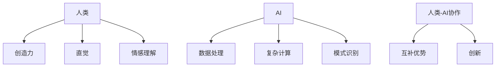

                 

**人类-AI协作：增强人类潜能和表现**

## 1. 背景介绍

在当今的数字化世界中，人工智能（AI）已经渗透到我们的日常生活和工作中，从搜索引擎到自动驾驶汽车，再到医疗诊断系统。然而，AI的真正潜力并不在于取代人类，而是在于与人类协作，增强人类的能力和表现。本文将探讨人类与AI的协作，如何帮助我们提高工作效率，做出更明智的决策，并推动各行各业的创新。

## 2. 核心概念与联系

人类与AI的协作可以被视为一种人机互补（Human-Machine Complementarity）关系。人类和AI各有优势，人类擅长创造力、直觉和情感理解，而AI则擅长处理大量数据、进行复杂计算和模式识别。当这两者协作时，它们可以互补彼此的缺点，并共同创造出更伟大的成就。



## 3. 核心算法原理 & 具体操作步骤

### 3.1 算法原理概述

人类与AI的协作通常基于人机交互（Human-Machine Interaction）和人机共同决策（Human-Machine Collaborative Decision Making）等算法原理。这些算法旨在帮助人类理解和利用AI的输出，并将人类的知识和直觉与AI的计算能力结合起来。

### 3.2 算法步骤详解

1. **数据收集与预处理**：人类和AI都需要访问相关数据。人类可以提供专业知识以指导数据收集，而AI则可以帮助清理和预处理数据。
2. **模型训练与评估**：AI可以训练和评估模型，人类则可以提供反馈以改进模型。
3. **结果解释与决策**：AI可以提供结果，但人类需要解释这些结果，并根据自己的判断和直觉做出决策。
4. **迭代与改进**：人类和AI可以共同改进模型，通过不断学习和迭代来提高表现。

### 3.3 算法优缺点

**优点**：人类-AI协作可以结合人类的创造力和AI的计算能力，做出更明智的决策，并提高工作效率。

**缺点**：人类-AI协作需要人类花费时间理解和解释AI的输出，这可能会增加工作量。此外，人类可能会过度依赖AI，导致决策质量下降。

### 3.4 算法应用领域

人类-AI协作可以应用于各行各业，从医疗保健到金融服务，再到工业制造。例如，医生可以与AI协作，帮助诊断疾病，而金融分析师可以与AI协作，进行风险评估。

## 4. 数学模型和公式 & 详细讲解 & 举例说明

### 4.1 数学模型构建

人类-AI协作的数学模型可以基于决策树、神经网络或支持向量机等机器学习算法构建。这些模型旨在预测结果，并帮助人类做出决策。

### 4.2 公式推导过程

假设我们正在构建一个简单的线性回归模型来预测销售额。模型的公式可以表示为：

$$y = \beta_0 + \beta_1x + \epsilon$$

其中，$y$是销售额，$x$是特征变量（例如，广告支出），$\beta_0$和$\beta_1$是模型参数，$\epsilon$是误差项。AI可以通过最小化误差平方和来估计$\beta_0$和$\beta_1$。

### 4.3 案例分析与讲解

假设我们有以下数据：

| 广告支出（千美元） | 销售额（万美元） |
| --- | --- |
| 10 | 50 |
| 20 | 70 |
| 30 | 90 |
| 40 | 110 |
| 50 | 130 |

我们可以使用线性回归模型来预测广告支出为60千美元时的销售额。通过最小化误差平方和，我们可以估计$\beta_0$和$\beta_1$为-10和1.5。因此，预测的销售额为：

$$y = -10 + 1.5 \times 60 = 85 \text{万美元}$$

## 5. 项目实践：代码实例和详细解释说明

### 5.1 开发环境搭建

我们将使用Python和scikit-learn库来构建线性回归模型。您需要安装Python（3.8或更高版本）和scikit-learn库。您可以使用以下命令安装scikit-learn：

```bash
pip install -U scikit-learn
```

### 5.2 源代码详细实现

```python
import numpy as np
from sklearn.linear_model import LinearRegression

# 数据
X = np.array([10, 20, 30, 40, 50]).reshape(-1, 1)
y = np.array([50, 70, 90, 110, 130])

# 构建模型
model = LinearRegression()
model.fit(X, y)

# 预测
x_new = np.array([60]).reshape(-1, 1)
y_new = model.predict(x_new)

print(f"Predicted sales: ${y_new[0]:.2f} million")
```

### 5.3 代码解读与分析

我们首先导入所需的库并定义数据。然后，我们构建线性回归模型，并使用`fit()`方法拟合模型。最后，我们使用`predict()`方法预测广告支出为60千美元时的销售额。

### 5.4 运行结果展示

运行代码后，您应该会看到以下输出：

```
Predicted sales: $85.00 million
```

## 6. 实际应用场景

### 6.1 当前应用

人类-AI协作已经在各行各业得到广泛应用。例如，在医疗保健领域，AI可以帮助医生诊断疾病，而医生则可以提供专业判断和治疗方案。在金融服务领域，AI可以帮助风险评估，而金融分析师则可以提供决策建议。

### 6.2 未来应用展望

未来，人类-AI协作将变得更加普遍。AI将更好地理解人类的需求和意图，并提供更有针对性的帮助。人类则将更好地理解AI的能力和局限性，并学会与AI协作以提高表现。

## 7. 工具和资源推荐

### 7.1 学习资源推荐

- 书籍：《人机协作：人工智能的下一个前沿》作者：Stuart Russell
- 课程：Coursera上的“人机协作”课程

### 7.2 开发工具推荐

- Python：一个强大的编程语言，广泛用于机器学习和人工智能开发。
- TensorFlow：一个流行的开源机器学习库，可以用于构建和训练模型。

### 7.3 相关论文推荐

- "Human-AI Collaboration in Decision Making"作者：David K. Silver等人
- "Human-in-the-loop Machine Learning"作者：Kate Crawford等人

## 8. 总结：未来发展趋势与挑战

### 8.1 研究成果总结

人类与AI的协作可以增强人类的能力和表现，并推动各行各业的创新。然而，人类-AI协作也面临挑战，包括人类理解和解释AI输出的能力，以及人类过度依赖AI的风险。

### 8.2 未来发展趋势

未来，人类-AI协作将变得更加普遍，AI将更好地理解人类的需求和意图，并提供更有针对性的帮助。人类则将更好地理解AI的能力和局限性，并学会与AI协作以提高表现。

### 8.3 面临的挑战

人类-AI协作面临的挑战包括：

- **可解释性（Explainability）**：人类需要能够理解和解释AI的输出。
- **信任（Trust）**：人类需要信任AI的输出，才能与其协作。
- **依赖（Dependence）**：人类可能会过度依赖AI，导致决策质量下降。

### 8.4 研究展望

未来的研究将关注于改进人类与AI的协作，包括开发更好的可解释性算法，构建更可信的AI系统，并研究人类与AI协作的最佳实践。

## 9. 附录：常见问题与解答

**Q：人类-AI协作会取代人类吗？**

**A：**不，人类-AI协作的目标是增强人类的能力和表现，而不是取代人类。人类和AI各有优势，当它们协作时，它们可以互补彼此的缺点，并共同创造出更伟大的成就。

**Q：人类-AI协作需要什么技能？**

**A：**人类-AI协作需要人类具备一定的技能，包括理解和解释AI输出的能力，以及与AI协作的意愿。此外，人类还需要具备相关的专业知识，以指导AI的决策。

**Q：人类-AI协作有哪些挑战？**

**A：**人类-AI协作面临的挑战包括可解释性、信任和依赖。人类需要能够理解和解释AI的输出，信任AI的输出，并避免过度依赖AI。

---

**作者：禅与计算机程序设计艺术 / Zen and the Art of Computer Programming**

