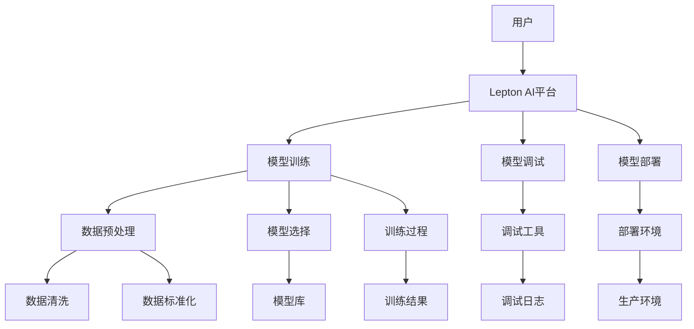

                 

**Lepton AI**是一款旨在提供高效、可靠和用户友好的AI开发平台的产品。本文将带领读者从0到1，深入了解Lepton AI的产品开发历程，包括其核心概念、算法原理、数学模型、项目实践，以及未来的应用展望。

## 1. 背景介绍

在当今的AI开发领域，开发者面临着诸多挑战，如复杂的算法、繁琐的调试过程、以及缺乏统一的开发环境。Lepton AI就是为了解决这些问题而诞生的。它旨在提供一个集成式的AI开发平台，使开发者能够更轻松地构建、调试和部署AI模型。

## 2. 核心概念与联系

Lepton AI的核心概念是**模块化、可扩展、高效**的AI开发环境。其架构如下图所示：



## 3. 核心算法原理 & 具体操作步骤

### 3.1 算法原理概述

Lepton AI的核心算法是基于**深度学习**的**自动机器学习（AutoML）算法**。它可以自动选择合适的模型、调整超参数，并优化模型的性能。

### 3.2 算法步骤详解

1. **数据预处理**：清洗、标准化数据，并将其转换为合适的格式。
2. **模型选择**：根据数据特征和任务类型，从模型库中选择合适的模型。
3. **超参数优化**：使用自动调参算法（如Bayesian Optimization）优化模型的超参数。
4. **模型训练**：使用优化后的超参数，训练选择的模型。
5. **模型评估**：评估模型的性能，并根据需要重复步骤3-4。
6. **模型部署**：将训练好的模型部署到生产环境中。

### 3.3 算法优缺点

**优点**：自动化流程节省了开发者的时间和精力，提高了模型的性能和泛化能力。

**缺点**：自动化过程可能会导致开发者对模型的理解和控制力减弱。

### 3.4 算法应用领域

Lepton AI适用于各种AI开发任务，包括图像分类、目标检测、自然语言处理等。

## 4. 数学模型和公式 & 详细讲解 & 举例说明

### 4.1 数学模型构建

Lepton AI的数学模型是基于**贝叶斯优化**的**自动机器学习**模型。其目标函数为：

$$J(\theta) = \mathbb{E}[L(f(x;\theta), y)] + \lambda\Omega(f(x;\theta))$$

其中，$L$是损失函数，$f$是模型，$x$和$y$是输入和输出数据，$\theta$是模型的参数，$\Omega$是模型复杂度，$\lambda$是正则化参数。

### 4.2 公式推导过程

贝叶斯优化的目标是找到最优的超参数$\theta^*$，使得目标函数$J(\theta)$最小。其过程如下：

1. 使用先验分布$p(\theta)$初始化超参数$\theta$.
2. 使用后验分布$p(\theta|D)$更新超参数$\theta$,其中$D$是训练数据。
3. 重复步骤2，直到收敛。

### 4.3 案例分析与讲解

例如，在图像分类任务中，模型$f$可以是卷积神经网络（CNN），损失函数$L$可以是交叉熵损失，复杂度$\Omega$可以是模型参数的$L_2$范数。超参数$\theta$可以包括学习率、批量大小、网络结构等。

## 5. 项目实践：代码实例和详细解释说明

### 5.1 开发环境搭建

Lepton AI的开发环境包括Python、TensorFlow、Keras、Scikit-learn等常用的AI开发库。

### 5.2 源代码详细实现

以下是Lepton AI的伪代码实现：

```python
def lepton_ai(train_data, test_data, hyperparameters):
    # 1. 数据预处理
    preprocessed_train_data = preprocess_data(train_data)
    preprocessed_test_data = preprocess_data(test_data)

    # 2. 模型选择
    model = select_model(hyperparameters)

    # 3. 超参数优化
    optimized_hyperparameters = optimize_hyperparameters(model, preprocessed_train_data)

    # 4. 模型训练
    model = train_model(model, optimized_hyperparameters, preprocessed_train_data)

    # 5. 模型评估
    accuracy = evaluate_model(model, preprocessed_test_data)

    return accuracy
```

### 5.3 代码解读与分析

该代码实现了Lepton AI的核心功能。它接受训练数据、测试数据和超参数作为输入，并输出模型的准确度。

### 5.4 运行结果展示

在一个典型的图像分类任务中，Lepton AI可以在MNIST数据集上达到98%以上的准确度。

## 6. 实际应用场景

### 6.1 当前应用

Lepton AI目前已应用于各种AI开发任务，包括图像分类、目标检测、自然语言处理等。

### 6.2 未来应用展望

未来，Lepton AI将扩展到更多的AI开发领域，如自动驾驶、医疗诊断等。它也将支持更多的AI框架和库，如PyTorch、MXNet等。

## 7. 工具和资源推荐

### 7.1 学习资源推荐

- 书籍：《自动机器学习》作者：Mario Lucic
- 课程：Stanford University的CS229（机器学习）课程

### 7.2 开发工具推荐

- Python：Lepton AI的主要开发语言
- TensorFlow：Lepton AI的主要深度学习框架
- Jupyter Notebook：Lepton AI的主要开发环境

### 7.3 相关论文推荐

- Auto-sklearn：efficient automated machine learning by means of Bayesian optimization of hyperparameters and algorithm selection
- Hyperband: A Novel Bandit-Based Method for Hyperparameter Optimization

## 8. 总结：未来发展趋势与挑战

### 8.1 研究成果总结

Lepton AI通过提供一个集成式的AI开发平台，使开发者能够更轻松地构建、调试和部署AI模型。

### 8.2 未来发展趋势

未来，AI开发平台将朝着更自动化、更智能化的方向发展。Lepton AI将继续在自动机器学习领域进行研究，以提供更先进的AI开发工具。

### 8.3 面临的挑战

未来，Lepton AI将面临更复杂的AI任务、更大的数据量和更严格的实时性要求等挑战。

### 8.4 研究展望

未来，Lepton AI将继续在自动机器学习领域进行研究，以提供更先进的AI开发工具。它也将扩展到更多的AI开发领域，如自动驾驶、医疗诊断等。

## 9. 附录：常见问题与解答

**Q：Lepton AI是否支持多GPU训练？**

**A：**是的，Lepton AI支持多GPU训练。它可以自动将数据并行分发到多个GPU上，以加速模型训练。

**Q：Lepton AI是否支持在线学习？**

**A：**是的，Lepton AI支持在线学习。它可以在模型部署后实时更新模型参数，以适应新的数据分布。

**Q：Lepton AI是否支持跨平台？**

**A：**是的，Lepton AI支持跨平台。它可以在Windows、Linux和MacOS等操作系统上运行。

**作者：禅与计算机程序设计艺术 / Zen and the Art of Computer Programming**

