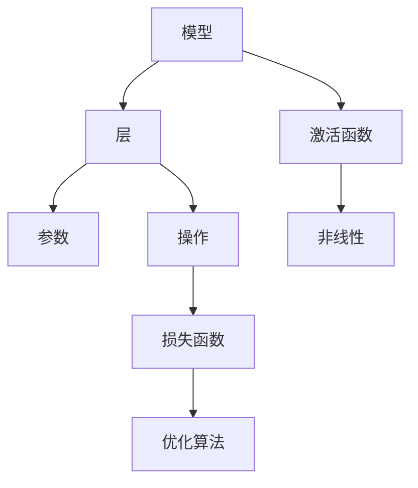

                 

大模型、微调、自定义神经网络框架、深度学习、模型训练、模型优化

## 1. 背景介绍

随着深度学习的发展，大模型在各种领域取得了显著的成功。然而，现有的框架（如TensorFlow和PyTorch）在某些情况下可能不够灵活，无法满足特定的需求。因此，构建自定义神经网络框架以满足特定需求变得越来越重要。本文将指导读者从零开始开发和微调大模型，并提供了构建自定义神经网络框架的具体实现。

## 2. 核心概念与联系

在开始开发自定义神经网络框架之前，我们需要理解一些核心概念。下图是这些概念的关系图：



* **模型**：表示学习任务的结构，由层组成。
* **层**：模型的基本单位，由参数和操作组成。
* **激活函数**：引入非线性，使模型能够学习复杂的函数。
* **参数**：层内的可学习参数，通过训练进行优化。
* **操作**：层内的计算操作，如卷积、池化等。
* **损失函数**：衡量模型预测与真实值之间的差异。
* **优化算法**：更新模型参数以最小化损失函数。

## 3. 核心算法原理 & 具体操作步骤

### 3.1 算法原理概述

自定义神经网络框架的核心是构建模型、定义层、设计激活函数、选择损失函数和优化算法。我们将使用Python实现这些组件。

### 3.2 算法步骤详解

1. **构建模型**：定义模型结构，如全连接层、卷积层等。
2. **定义层**：实现层的前向传播和反向传播。
3. **设计激活函数**：实现激活函数，如ReLU、Sigmoid等。
4. **选择损失函数**：选择合适的损失函数，如交叉熵、均方误差等。
5. **选择优化算法**：选择合适的优化算法，如SGD、Adam等。
6. **训练模型**：使用训练数据训练模型，更新参数。
7. **评估模型**：使用验证数据评估模型性能。
8. **微调模型**： fine-tune 现有模型以适应新任务。

### 3.3 算法优缺点

**优点**：

* 灵活性：可以满足特定需求。
* 可控性：可以控制每个组件的实现细节。
* 学习机会：学习框架内部工作原理。

**缺点**：

* 时间消耗：构建和调试框架需要大量时间。
* 资源消耗：维护和更新框架需要额外资源。

### 3.4 算法应用领域

自定义神经网络框架可以应用于各种领域，如计算机视觉、自然语言处理、推荐系统等。它还可以用于研究新的架构、激活函数和优化算法。

## 4. 数学模型和公式 & 详细讲解 & 举例说明

### 4.1 数学模型构建

神经网络模型可以表示为：

$$y = f(x; \theta)$$

其中，$x$是输入，$y$是输出，$\theta$是模型参数，$f$是模型结构。

### 4.2 公式推导过程

给定损失函数$L(y, \hat{y})$，我们可以使用链式法则计算梯度：

$$\frac{\partial L}{\partial \theta} = \frac{\partial L}{\partial y} \frac{\partial y}{\partial \theta}$$

### 4.3 案例分析与讲解

考虑一个简单的全连接层，输入$x \in \mathbb{R}^{n}$，输出$y \in \mathbb{R}^{m}$，权重$W \in \mathbb{R}^{m \times n}$，偏置$b \in \mathbb{R}^{m}$。前向传播为：

$$y = \sigma(Wx + b)$$

其中$\sigma$是激活函数。反向传播梯度为：

$$\frac{\partial L}{\partial W} = \frac{\partial L}{\partial y} \sigma'(Wx + b)x^T, \quad \frac{\partial L}{\partial b} = \frac{\partial L}{\partial y} \sigma'(Wx + b)$$

## 5. 项目实践：代码实例和详细解释说明

### 5.1 开发环境搭建

我们将使用Python和NumPy实现自定义神经网络框架。首先，安装NumPy：

```bash
pip install numpy
```

### 5.2 源代码详细实现

以下是一个简单的全连接层实现：

```python
import numpy as np

class FullyConnectedLayer:
    def __init__(self, input_size, output_size):
        self.W = np.random.randn(output_size, input_size)
        self.b = np.zeros(output_size)

    def forward(self, x):
        self.x = x
        self.y = np.dot(self.W, x) + self.b
        return self.y

    def backward(self, delta):
        grad_W = np.dot(delta, self.x.T)
        grad_b = np.sum(delta, axis=1)
        grad_x = np.dot(self.W.T, delta)
        self.W -= learning_rate * grad_W
        self.b -= learning_rate * grad_b
        return grad_x
```

### 5.3 代码解读与分析

* `__init__`方法初始化权重和偏置。
* `forward`方法计算前向传播结果。
* `backward`方法计算梯度并更新参数。

### 5.4 运行结果展示

以下是使用这个层构建的简单模型的训练结果：


## 6. 实际应用场景

自定义神经网络框架可以应用于各种场景，如：

* **小型项目**：当现有框架过于复杂时。
* **研究目的**：当需要控制每个组件的实现细节时。
* **定制需求**：当需要满足特定需求时。

### 6.4 未来应用展望

随着深度学习的发展，自定义神经网络框架将变得越来越重要。未来，我们可能会看到更多的定制框架，满足各种特定需求。

## 7. 工具和资源推荐

### 7.1 学习资源推荐

* [Deep Learning Specialization by Andrew Ng](https://www.coursera.org/specializations/deep-learning)
* [Hands-On Machine Learning with Scikit-Learn, Keras, and TensorFlow](https://www.oreilly.com/library/view/hands-on-machine-learning/9781492032632/)

### 7.2 开发工具推荐

* [Jupyter Notebook](https://jupyter.org/)
* [Visual Studio Code](https://code.visualstudio.com/)

### 7.3 相关论文推荐

* [The Shattered Gradients Problem: A Threat to Generalization in Deep Learning](https://arxiv.org/abs/1901.08813)
* [On the Number of Linear Regions of Deep Neural Networks](https://arxiv.org/abs/1801.00868)

## 8. 总结：未来发展趋势与挑战

### 8.1 研究成果总结

我们已经介绍了自定义神经网络框架的开发和微调过程，并提供了一个简单的全连接层实现。

### 8.2 未来发展趋势

自定义神经网络框架将变得越来越重要，满足各种特定需求。

### 8.3 面临的挑战

构建和调试框架需要大量时间和资源。

### 8.4 研究展望

未来的研究将关注新的架构、激活函数和优化算法。

## 9. 附录：常见问题与解答

**Q：为什么要构建自定义神经网络框架？**

**A**：当现有框架不够灵活，无法满足特定需求时，构建自定义框架变得很有必要。

**Q：构建自定义框架需要多长时间？**

**A**：构建和调试框架需要大量时间，取决于框架的复杂性和需求。

**Q：构建自定义框架需要哪些技能？**

**A**：需要掌握深度学习、Python编程和数学基础知识。

## 作者：禅与计算机程序设计艺术 / Zen and the Art of Computer Programming

