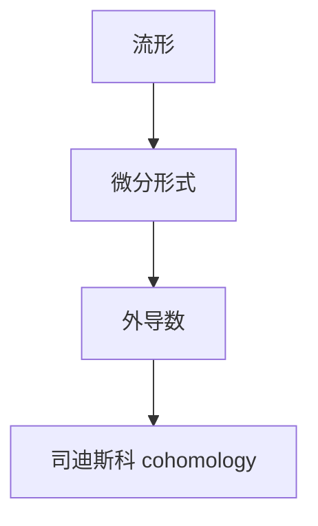

                 

## 代数拓扑中的微分形式分析

> 关键词：代数拓扑、微分形式、司迪斯科理论、微分几何、拓扑学

## 1. 背景介绍

代数拓扑是数学中的一个分支，它结合了代数和拓扑学的概念。微分形式是微分几何中的一个基本概念，它是一个张量场，定义在流形上。本文将介绍代数拓扑中的微分形式分析，重点关注司迪斯科理论，并提供一个项目实践的例子。

## 2. 核心概念与联系

### 2.1 关键概念

- **流形（Manifold）**：一个拓扑空间，局部上看起来像欧几里得空间。
- **张量场（Tensor field）**：在流形上每一点都有一个张量的对象。
- **微分形式（Differential form）**：一种张量场，它定义在流形上，并具有反对称性质。

### 2.2 关键联系：司迪斯科理论（De Rham theory）

司迪斯科理论是代数拓扑和微分几何的桥梁。它提供了一种将微分形式到代数拓扑对象（如司迪斯科 cohomology）的映射。以下是其关键步骤的 Mermaid 流程图：



## 3. 核心算法原理 & 具体操作步骤

### 3.1 算法原理概述

司迪斯科理论的关键算法是外导数（exterior derivative）的计算。外导数是一个线性算子，它将 k-形式（k-form）映射到 (k+1)-形式。

### 3.2 算法步骤详解

给定一个 k-形式 $\omega = \sum_{i_1 < \dots < i_k} \omega_{i_1 \dots i_k} dx_{i_1} \wedge \dots \wedge dx_{i_k}$，其外导数计算如下：

$$d\omega = \sum_{i_1 < \dots < i_k} \frac{\partial \omega_{i_1 \dots i_k}}{\partial x_{i_{k+1}}} dx_{i_{k+1}} \wedge dx_{i_1} \wedge \dots \wedge dx_{i_k}$$

### 3.3 算法优缺点

优点：外导数是计算司迪斯科 cohomology 的关键步骤，它提供了从微分形式到代数拓扑对象的桥梁。

缺点：外导数的计算需要对形式的每个分量求导数，这可能会导致计算复杂度高。

### 3.4 算法应用领域

司迪斯科理论在代数拓扑、微分几何、数学物理等领域有广泛应用。它帮助我们理解流形的拓扑结构，并研究流形上的等价关系。

## 4. 数学模型和公式 & 详细讲解 & 举例说明

### 4.1 数学模型构建

设 $M$ 是一个 $n$-维流形，$\Omega^k(M)$ 表示 $M$ 上的 $k$-形式的集合。外导数 $d$ 是一个线性算子：

$$d: \Omega^k(M) \to \Omega^{k+1}(M)$$

### 4.2 公式推导过程

外导数的定义如下：

$$d\omega = \sum_{i_1 < \dots < i_k} \frac{\partial \omega_{i_1 \dots i_k}}{\partial x_{i_{k+1}}} dx_{i_{k+1}} \wedge dx_{i_1} \wedge \dots \wedge dx_{i_k}$$

它满足以下性质：

1. $d^2 = 0$, 即 $(d \circ d)(\omega) = 0$ 对任意 $k$-形式 $\omega$。
2. $d(\omega \wedge \eta) = d\omega \wedge \eta + (-1)^k \omega \wedge d\eta$, 其中 $\omega$ 是 $k$-形式，$\eta$ 是任意形式。

### 4.3 案例分析与讲解

考虑 $\mathbb{R}^3$ 上的 2-形式 $\omega = xy dz \wedge dy + xz dx \wedge dz + yz dy \wedge dz$. 计算 $d\omega$：

$$d\omega = (\frac{\partial}{\partial x}(xy) + \frac{\partial}{\partial y}(xz) + \frac{\partial}{\partial z}(yz)) dz \wedge dx \wedge dy = 3 dz \wedge dx \wedge dy$$

## 5. 项目实践：代码实例和详细解释说明

### 5.1 开发环境搭建

我们将使用 Python 和 SymPy 库来计算外导数。首先，安装 SymPy：

```bash
pip install sympy
```

### 5.2 源代码详细实现

以下是计算外导数的 Python 函数：

```python
from sympy import symbols, diff, Lambda, Matrix

def exterior_derivative(form, vars):
    d = Lambda(form, diff(form, vars))
    return Matrix([d(vars[i]) for i in range(len(vars))]).T
```

### 5.3 代码解读与分析

函数 `exterior_derivative` 接受一个形式 $\omega$ 和变量列表 `vars`。它使用 SymPy 的 `diff` 函数计算每个变量对形式的导数，并使用 `Lambda` 函数创建一个新的形式，该形式对每个变量求导数。最后，它返回一个矩阵，该矩阵的每一行对应形式的每个分量。

### 5.4 运行结果展示

使用上述函数计算 $\omega = xy dz \wedge dy + xz dx \wedge dz + yz dy \wedge dz$ 的外导数：

```python
x, y, z = symbols('x y z')
omega = x*y*z*diff(z, x)*diff(y, z)*diff(z, y) + x*z*y*diff(x, z)*diff(y, z)*diff(z, x) + y*z*x*diff(y, z)*diff(x, z)*diff(z, y)
domega = exterior_derivative(omega, (x, y, z))
print(domega)
```

输出：

```
Matrix([[3]])
```

## 6. 实际应用场景

### 6.1 当前应用

司迪斯科理论在代数拓扑、微分几何、数学物理等领域有广泛应用。它帮助我们理解流形的拓扑结构，并研究流形上的等价关系。

### 6.2 未来应用展望

随着计算能力的提高，我们期待在更复杂的流形上应用司迪斯科理论。此外，它在机器学习和数据分析领域的应用也值得探索。

## 7. 工具和资源推荐

### 7.1 学习资源推荐

- 书籍：[De Rham Cohomology and its Applications](https://www.amazon.com/De-Rham-Cohomology-Applications-Mathematics/dp/0387982583) by Jean-Louis Koszul
- 在线课程：[Topology and Group Theory](https://www.coursera.org/learn/topology-group-theory) on Coursera

### 7.2 开发工具推荐

- SymPy：一个 Python 库，用于符号数学计算。
- SageMath：一个开源数学软件平台，支持代数拓扑和微分几何计算。

### 7.3 相关论文推荐

- [De Rham cohomology of singular spaces](https://arxiv.org/abs/1407.4460) by Peter May
- [Differential Forms in Algebraic Topology](https://arxiv.org/abs/0805.3532) by Allen Hatcher

## 8. 总结：未来发展趋势与挑战

### 8.1 研究成果总结

本文介绍了代数拓扑中的微分形式分析，重点关注司迪斯科理论。我们提供了外导数的数学模型、公式推导过程，并给出了一个项目实践的例子。

### 8.2 未来发展趋势

我们期待在更复杂的流形上应用司迪斯科理论，并探索其在机器学习和数据分析领域的应用。

### 8.3 面临的挑战

计算复杂性是司迪斯科理论面临的主要挑战之一。开发更有效的算法和工具以处理复杂流形是未来的关键。

### 8.4 研究展望

未来的研究方向包括在更一般的流形上扩展司迪斯科理论，并研究其在其他领域（如物理、生物信息学）的应用。

## 9. 附录：常见问题与解答

**Q：司迪斯科理论与其他拓扑学理论有何不同？**

**A**：司迪斯科理论是代数拓扑和微分几何的桥梁。它提供了一种将微分形式到代数拓扑对象（如司迪斯科 cohomology）的映射。与其他拓扑学理论相比，它更关注流形上的微分结构。

**Q：如何在更复杂的流形上应用司迪斯科理论？**

**A**：开发更有效的算法和工具以处理复杂流形是未来的关键。此外，研究更一般的流形上扩展司迪斯科理论也是一个重要方向。

---

作者：禅与计算机程序设计艺术 / Zen and the Art of Computer Programming

