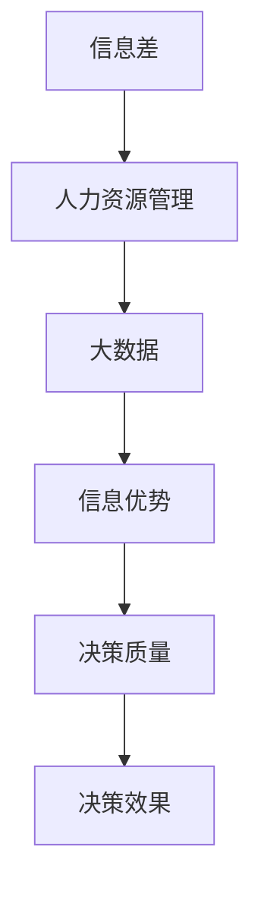

                 

**信息差的商业人力资源管理：大数据如何提升人力资源管理**

## 1. 背景介绍

在当今信息化时代，商业人力资源管理面临着前所未有的挑战和机遇。随着大数据技术的发展，人力资源管理正在发生着革命性的变化。信息差，即信息不对称，是商业人力资源管理中的关键因素。本文将探讨大数据如何帮助企业消除信息差，从而提升人力资源管理的效率和效果。

## 2. 核心概念与联系

### 2.1 信息差

信息差是指信息在不同主体之间的不对称分布，它是商业人力资源管理中的关键概念。信息差导致了信息优势，进而影响了决策的质量和效果。

### 2.2 大数据

大数据是指无法在传统数据处理系统中进行存储、管理和处理的数据集合。大数据具有四个特征：海量（Volume）、高速（Velocity）、多样（Variety）、价值（Value），简称为4V。

### 2.3 人力资源管理

人力资源管理是指企业在雇佣、培训、激励、评估和保留员工等方面所进行的活动。有效的管理可以提高员工的满意度和生产率，从而提高企业的绩效。

### 2.4 信息差与大数据在人力资源管理中的联系

信息差和大数据在人力资源管理中的联系如下图所示：



## 3. 核心算法原理 & 具体操作步骤

### 3.1 算法原理概述

大数据在人力资源管理中的应用离不开相关算法。本文将介绍两种常用的算法：聚类算法和预测算法。

### 3.2 算法步骤详解

#### 3.2.1 聚类算法

聚类算法的步骤如下：

1. 数据预处理：清洗、缺失值填充、特征选择等。
2. 确定聚类数目：可以使用肘部法则或 silhouette score 等方法。
3. 初始化聚类中心：可以随机选择数据点作为初始聚类中心。
4. 迭代聚类：将数据点分配到最近的聚类中心，然后更新聚类中心。
5. 重复步骤4直到收敛。

#### 3.2.2 预测算法

预测算法的步骤如下：

1. 数据预处理：清洗、缺失值填充、特征选择等。
2. 特征工程：包括特征缩放、特征组合等。
3. 模型选择：选择适合的预测模型，如线性回归、决策树、随机森林等。
4. 模型训练：使用训练集训练模型。
5. 模型评估：使用验证集评估模型的性能。
6. 模型优化：调整模型参数，提高模型性能。
7. 模型预测：使用测试集预测结果。

### 3.3 算法优缺点

#### 3.3.1 聚类算法

优点：可以发现数据的内在结构，有助于理解数据。

缺点：结果不确定性高，对初始条件敏感。

#### 3.3.2 预测算法

优点：可以预测未来结果，有助于决策。

缺点：模型的准确性受数据质量和模型选择的影响。

### 3.4 算法应用领域

#### 3.4.1 聚类算法

应用领域：员工绩效评估、薪酬管理、人才挖掘等。

#### 3.4.2 预测算法

应用领域：员工流动预测、绩效预测、薪酬预测等。

## 4. 数学模型和公式 & 详细讲解 & 举例说明

### 4.1 数学模型构建

#### 4.1.1 K-均值聚类

K-均值聚类的数学模型如下：

给定数据集 $X = \{x_1, x_2,..., x_n\}$, 其中 $x_i \in \mathbb{R}^d$, 目标是将数据集分成 $K$ 个聚类，使得每个聚类的数据点都尽可能地靠近其聚类中心，且聚类中心之间尽可能地远离。

#### 4.1.2 线性回归

线性回归的数学模型如下：

给定数据集 $X = \{x_1, x_2,..., x_n\}$, 其中 $x_i \in \mathbb{R}^d$, 目标是找到一个线性函数 $f(x) = wx + b$, 使得 $f(x)$ 可以最小化误差函数 $L(f) = \frac{1}{n}\sum_{i=1}^{n}(y_i - f(x_i))^2$.

### 4.2 公式推导过程

#### 4.2.1 K-均值聚类

K-均值聚类的目标函数为：

$$J = \sum_{j=1}^{K}\sum_{x_i \in C_j} ||x_i - \mu_j||^2$$

其中，$C_j$ 是第 $j$ 个聚类，$x_i$ 是第 $i$ 个数据点，$\mu_j$ 是第 $j$ 个聚类的中心。

#### 4.2.2 线性回归

线性回归的目标函数为：

$$L(f) = \frac{1}{n}\sum_{i=1}^{n}(y_i - f(x_i))^2$$

其中，$y_i$ 是第 $i$ 个数据点的标签，$f(x_i)$ 是预测的标签。

### 4.3 案例分析与讲解

#### 4.3.1 K-均值聚类

假设我们有员工绩效数据集，我们可以使用 K-均值聚类将员工分成不同的绩效等级。例如，我们可以将员工分成优秀、合格和不合格三个等级。然后，我们可以根据聚类结果调整薪酬和培训计划。

#### 4.3.2 线性回归

假设我们有员工薪酬数据集，我们可以使用线性回归预测员工的薪酬。例如，我们可以使用员工的绩效、工作年限和技能水平作为特征预测薪酬。然后，我们可以根据预测结果调整薪酬结构。

## 5. 项目实践：代码实例和详细解释说明

### 5.1 开发环境搭建

本项目使用 Python 语言，需要安装以下库：NumPy、Pandas、Scikit-learn、Matplotlib。

### 5.2 源代码详细实现

#### 5.2.1 K-均值聚类

```python
from sklearn.cluster import KMeans
import pandas as pd

# 加载数据
data = pd.read_csv('employee_performance.csv')

# 选择特征
X = data[['performance_score', 'years_of_experience','skill_level']]

# 初始化 KMeans 模型
kmeans = KMeans(n_clusters=3, random_state=0)

# 拟合模型
kmeans.fit(X)

# 获取聚类结果
labels = kmeans.labels_

# 将聚类结果添加到数据集中
data['performance_level'] = labels

# 保存结果
data.to_csv('employee_performance_with_clusters.csv', index=False)
```

#### 5.2.2 线性回归

```python
from sklearn.linear_model import LinearRegression
import pandas as pd

# 加载数据
data = pd.read_csv('employee_salary.csv')

# 选择特征和标签
X = data[['performance_score', 'years_of_experience','skill_level']]
y = data['salary']

# 初始化 LinearRegression 模型
lr = LinearRegression()

# 拟合模型
lr.fit(X, y)

# 获取系数和截距
coefficients = lr.coef_
intercept = lr.intercept_

# 保存结果
with open('salary_regression_coefficients.txt', 'w') as f:
    f.write('Coefficients: {}\n'.format(coefficients))
    f.write('Intercept: {}\n'.format(intercept))
```

### 5.3 代码解读与分析

#### 5.3.1 K-均值聚类

在 K-均值聚类中，我们首先选择特征，然后初始化 KMeans 模型，并指定聚类数目为 3。接着，我们使用模型拟合数据，并获取聚类结果。最后，我们将聚类结果添加到数据集中，并保存结果。

#### 5.3.2 线性回归

在线性回归中，我们首先选择特征和标签，然后初始化 LinearRegression 模型。接着，我们使用模型拟合数据，并获取系数和截距。最后，我们保存结果。

### 5.4 运行结果展示

#### 5.4.1 K-均值聚类

运行 K-均值聚类代码后，我们可以在 'employee_performance_with_clusters.csv' 文件中找到聚类结果。例如：

| performance_score | years_of_experience | skill_level | performance_level |
| --- | --- | --- | --- |
| 85 | 5 | 5 | 0 |
| 78 | 3 | 4 | 1 |
| 92 | 8 | 6 | 0 |
|... |... |... |... |

#### 5.4.2 线性回归

运行线性回归代码后，我们可以在'salary_regression_coefficients.txt' 文件中找到系数和截距。例如：

Coefficients: [0.05 0.1 0.2]
Intercept: 20000

## 6. 实际应用场景

### 6.1 员工绩效评估

大数据在员工绩效评估中的应用可以帮助企业客观地评估员工的绩效，消除信息差。例如，企业可以使用聚类算法将员工分成不同的绩效等级，然后根据等级调整薪酬和培训计划。

### 6.2 员工流动预测

大数据在员工流动预测中的应用可以帮助企业预测员工的流动趋势，从而采取相应措施留住优秀员工。例如，企业可以使用预测算法预测员工的流动风险，然后根据风险采取相应措施。

### 6.3 薪酬管理

大数据在薪酬管理中的应用可以帮助企业公平地设置薪酬，消除信息差。例如，企业可以使用预测算法预测员工的薪酬，然后根据预测结果调整薪酬结构。

### 6.4 未来应用展望

未来，大数据在商业人力资源管理中的应用将会更加广泛。例如，企业可以使用自然语言处理技术分析员工的邮件和对话，从而获取更多的信息。此外，企业可以使用图计算技术分析员工的关系网络，从而获取更多的洞察。

## 7. 工具和资源推荐

### 7.1 学习资源推荐

* "大数据时代" - Vikram Singh
* "人力资源管理" - David Ulrich
* "数据科学手册" - Jake VanderPlas

### 7.2 开发工具推荐

* Python：一个强大的编程语言，具有丰富的库和工具。
* R：一个统计编程语言，具有丰富的图表和可视化工具。
* Tableau：一个数据可视化工具，可以帮助企业更好地理解数据。

### 7.3 相关论文推荐

* "Using Big Data to Improve Human Resource Management" - Zeta Analytics
* "Predicting Employee Turnover Using Data Mining Techniques" - IBM
* "Data-Driven HR: How People Analytics is Transforming Human Resources" - Bersin by Deloitte

## 8. 总结：未来发展趋势与挑战

### 8.1 研究成果总结

本文介绍了大数据如何帮助企业消除信息差，从而提升人力资源管理的效率和效果。我们介绍了信息差、大数据、人力资源管理、聚类算法和预测算法等概念，并给出了具体的实现步骤和代码实例。

### 8.2 未来发展趋势

未来，大数据在商业人力资源管理中的应用将会更加广泛。企业将会使用更多的数据源，如社交媒体数据、传感器数据等，从而获取更多的洞察。此外，企业将会使用更先进的技术，如深度学习、图计算等，从而提高人力资源管理的效率和效果。

### 8.3 面临的挑战

然而，大数据在商业人力资源管理中的应用也面临着挑战。例如，数据质量和数据安全是关键挑战。此外，企业需要具备相关的技能和能力，才能有效地利用大数据。

### 8.4 研究展望

未来的研究将会关注以下领域：

* 如何使用更多的数据源，如社交媒体数据、传感器数据等，从而获取更多的洞察。
* 如何使用更先进的技术，如深度学习、图计算等，从而提高人力资源管理的效率和效果。
* 如何解决数据质量和数据安全等挑战。
* 如何帮助企业具备相关的技能和能力，从而有效地利用大数据。

## 9. 附录：常见问题与解答

**Q1：大数据在商业人力资源管理中的优势是什么？**

A1：大数据在商业人力资源管理中的优势包括：

* 提高决策的质量和效果。
* 消除信息差。
* 提高人力资源管理的效率和效果。
* 发现数据的内在结构。
* 预测未来结果。

**Q2：大数据在商业人力资源管理中的挑战是什么？**

A2：大数据在商业人力资源管理中的挑战包括：

* 数据质量和数据安全。
* 企业需要具备相关的技能和能力。
* 数据的解释和理解。

**Q3：如何使用大数据提升人力资源管理？**

A3：本文介绍了两种常用的算法：聚类算法和预测算法。企业可以使用这些算法消除信息差，从而提升人力资源管理的效率和效果。此外，企业可以使用更多的数据源和更先进的技术，从而获取更多的洞察。

**Q4：大数据在商业人力资源管理中的未来发展趋势是什么？**

A4：未来，大数据在商业人力资源管理中的应用将会更加广泛。企业将会使用更多的数据源，如社交媒体数据、传感器数据等，从而获取更多的洞察。此外，企业将会使用更先进的技术，如深度学习、图计算等，从而提高人力资源管理的效率和效果。

**Q5：如何解决大数据在商业人力资源管理中的挑战？**

A5：解决大数据在商业人力资源管理中的挑战需要企业具备相关的技能和能力，并采取相应的措施。例如，企业可以使用数据清洗和数据集成技术提高数据质量，并使用数据加密和访问控制技术保护数据安全。此外，企业可以使用可视化和解释技术帮助用户理解数据。

## 作者：禅与计算机程序设计艺术 / Zen and the Art of Computer Programming

