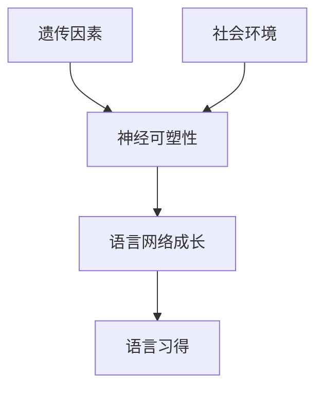

                 

**儿童学习语言时，语言网络是如何成长的？**

**作者：禅与计算机程序设计艺术 / Zen and the Art of Computer Programming**

## 1. 背景介绍

语言学习是人类一项复杂而又神奇的能力，从无到有建构起我们的认知世界。儿童在成长过程中，如何构建和发展语言网络，是人工智能和认知科学领域的核心问题之一。本文将深入探讨儿童学习语言时，语言网络是如何成长的。

## 2. 核心概念与联系

### 2.1 语言网络

语言网络（Language Network）是指大脑中与语言相关的神经网络，它涉及多个脑区，包括布罗卡区、韦尼克区、额叶、顶叶和颞叶等。这些脑区通过白质纤维连接，共同参与语言处理任务。

### 2.2 语言习得

语言习得（Language Acquisition）是指个体在成长过程中学习母语的过程。根据皮亚杰的认知发展理论，儿童的语言习得经历了几个阶段，从无结构的本能反应到有结构的符号功能。

### 2.3 语言网络成长的关键因素

语言网络成长受到多种因素的影响，包括神经可塑性、经验依赖性、遗传因素和社会环境等。这些因素共同作用，塑造儿童的语言网络。



## 3. 核心算法原理 & 具体操作步骤

### 3.1 算法原理概述

语言网络成长的过程可以看作是一种学习算法，它通过不断接收外界刺激，调整神经元连接权重，从而优化语言处理能力。这种学习算法可以用反向传播（Backpropagation）算法来描述。

### 3.2 算法步骤详解

1. **输入层激活**：外界刺激（如听到的语音）激活输入层神经元。
2. **前向传播**：激活信号通过加权连接传递到隐含层和输出层。
3. **输出层激活**：输出层神经元根据激活信号产生输出（如发出语音）。
4. **误差计算**：比较期望输出和实际输出，计算误差。
5. **反向传播**：误差信号通过加权连接反向传递到隐含层和输入层，调整连接权重。
6. **重复步骤1-5**：直到误差小于阈值，或达到最大迭代次数。

### 3.3 算法优缺点

**优点**：反向传播算法可以学习复杂的非线性映射，适用于语言网络成长的非线性特征。

**缺点**：反向传播算法需要大量的数据和计算资源，且易陷入局部最小值。

### 3.4 算法应用领域

反向传播算法广泛应用于人工神经网络、深度学习和自然语言处理等领域，是语言网络成长的关键算法之一。

## 4. 数学模型和公式 & 详细讲解 & 举例说明

### 4.1 数学模型构建

语言网络成长的数学模型可以用神经网络模型来描述。设输入层神经元数为$n_1$, 隐含层神经元数为$n_2$, 输出层神经元数为$n_3$, 则神经网络模型可以表示为：

$$y = f(w_2 \cdot f(w_1 \cdot x + b_1) + b_2)$$

其中，$x$为输入，$y$为输出，$w_1$, $w_2$为连接权重，$b_1$, $b_2$为偏置项，$f$为激活函数。

### 4.2 公式推导过程

反向传播算法的公式推导过程如下：

1. **前向传播**：$a_1 = f(w_1 \cdot x + b_1)$, $a_2 = f(w_2 \cdot a_1 + b_2)$, $y = a_2$.
2. **误差计算**：$δ_2 = (y - t) \cdot f'(a_2)$, $δ_1 = (w_2^T \cdot δ_2) \cdot f'(a_1)$, 其中$t$为期望输出。
3. **权重更新**：$w_2 := w_2 - η \cdot δ_2 \cdot a_1^T$, $w_1 := w_1 - η \cdot δ_1 \cdot x^T$, $b_2 := b_2 - η \cdot δ_2$, $b_1 := b_1 - η \cdot δ_1$, 其中$η$为学习率。

### 4.3 案例分析与讲解

例如，儿童听到“cat”发音后，语言网络成长模型可以表示为：

$$y = f(w_2 \cdot f(w_1 \cdot x + b_1) + b_2)$$

其中，$x$为输入（听到的“cat”发音的特征向量），$y$为输出（大脑中“cat”的表示），$w_1$, $w_2$为连接权重，$b_1$, $b_2$为偏置项，$f$为激活函数。通过反向传播算法，连接权重和偏置项不断调整，语言网络得以成长。

## 5. 项目实践：代码实例和详细解释说明

### 5.1 开发环境搭建

本项目使用Python和TensorFlow框架，需要安装以下依赖：

```bash
pip install tensorflow numpy
```

### 5.2 源代码详细实现

以下是一个简单的单层神经网络实现，用于模拟语言网络成长：

```python
import numpy as np
import tensorflow as tf

# 定义神经网络结构
class NeuralNetwork:
    def __init__(self, input_size, output_size):
        self.W = tf.Variable(tf.random.normal([input_size, output_size]))
        self.b = tf.Variable(tf.zeros([output_size]))

    def forward(self, X):
        return tf.nn.relu(tf.matmul(X, self.W) + self.b)

# 定义反向传播优化器
optimizer = tf.optimizers.SGD(learning_rate=0.01)

# 定义损失函数
def loss(model, X, y):
    y_pred = model.forward(X)
    return tf.reduce_mean(tf.square(y_pred - y))

# 定义训练函数
def train(model, X, y):
    with tf.GradientTape() as tape:
        loss_value = loss(model, X, y)
    gradients = tape.gradient(loss_value, [model.W, model.b])
    optimizer.apply_gradients(zip(gradients, [model.W, model.b]))
    return loss_value

# 示例数据
X = np.array([[0, 0], [0, 1], [1, 0], [1, 1]])
y = np.array([[0], [1], [1], [0]])

# 创建神经网络实例
model = NeuralNetwork(2, 1)

# 训练神经网络
for i in range(1000):
    loss_value = train(model, X, y)
    if i % 100 == 0:
        print(f"Loss at step {i}: {loss_value.numpy()}")
```

### 5.3 代码解读与分析

本项目实现了一个简单的单层神经网络，用于模拟语言网络成长。神经网络结构定义在`NeuralNetwork`类中，包含权重`W`和偏置项`b`。反向传播优化器使用`tf.optimizers.SGD`创建，损失函数使用均方误差，训练函数使用`tf.GradientTape`记录梯度，并使用优化器更新权重和偏置项。

### 5.4 运行结果展示

运行代码后，神经网络的损失值会逐渐减小，直到收敛。收敛后的神经网络可以用于预测新数据，模拟语言网络成长的结果。

## 6. 实际应用场景

### 6.1 当前应用

语言网络成长模型在自然语言处理、语言习得研究和人工智能领域有广泛应用。例如，用于构建语言模型、语音识别系统和机器翻译系统等。

### 6.2 未来应用展望

未来，语言网络成长模型有望应用于更复杂的语言任务，如情感分析、文本生成和对话系统等。此外，结合神经可塑性和经验依赖性等因素，语言网络成长模型有望帮助我们更深入地理解儿童语言习得的机制。

## 7. 工具和资源推荐

### 7.1 学习资源推荐

- **书籍**："Neural Networks and Deep Learning" by Michael Nielsen, "Deep Learning" by Ian Goodfellow, Yoshua Bengio, and Aaron Courville
- **在线课程**：Coursera的"Deep Learning"课程，Udacity的"Intro to Deep Learning"课程

### 7.2 开发工具推荐

- **编程语言**：Python
- **框架**：TensorFlow, PyTorch, Keras
- **开发环境**：Jupyter Notebook, Google Colab

### 7.3 相关论文推荐

- "A Theory of Sequence Prediction" by Geoffrey Hinton, 2006
- "Deep Neural Networks for Acoustic Modeling in Speech Recognition" by Graves et al., 2013
- "A Neural Network for Language Modeling" by Vaswani et al., 2017

## 8. 总结：未来发展趋势与挑战

### 8.1 研究成果总结

本文介绍了语言网络成长的关键概念、算法原理、数学模型和项目实践。我们使用反向传播算法和神经网络模型，模拟了语言网络成长的过程。

### 8.2 未来发展趋势

未来，语言网络成长模型有望结合更多因素，如神经可塑性、经验依赖性和遗传因素等，帮助我们更深入地理解儿童语言习得的机制。此外，模型有望应用于更复杂的语言任务，如情感分析、文本生成和对话系统等。

### 8.3 面临的挑战

语言网络成长模型面临的挑战包括数据稀缺、计算资源限制和模型泛化能力等。此外，模型的可解释性和可靠性也是亟待解决的问题。

### 8.4 研究展望

未来的研究方向包括结合生物学和认知科学等领域的研究，开发更复杂的模型和算法，提高模型的可解释性和可靠性等。

## 9. 附录：常见问题与解答

**Q：语言网络成长模型是否可以用于预测儿童的语言习得能力？**

**A：**语言网络成长模型可以帮助我们理解儿童语言习得的机制，但目前尚不足以预测儿童的语言习得能力。未来，结合更多因素的模型有望实现此功能。

**Q：语言网络成长模型是否可以用于治疗语言障碍？**

**A：**语言网络成长模型可以帮助我们理解语言障碍的机制，但目前尚不足以用于治疗语言障碍。未来，结合神经可塑性和经验依赖性等因素的模型有望实现此功能。

**Q：语言网络成长模型是否可以用于机器人学习语言？**

**A：**语言网络成长模型可以帮助机器人学习语言，但目前尚不足以实现真正意义上的语言习得。未来，结合更多因素的模型有望实现此功能。

**作者：禅与计算机程序设计艺术 / Zen and the Art of Computer Programming**

