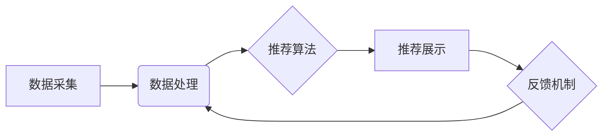

> 商品推荐系统，电商大数据，协同过滤，内容过滤，矩阵分解，深度学习，推荐算法

## 1. 背景介绍

在当今数据爆炸的时代，电商平台积累了海量用户行为数据，这些数据蕴藏着丰富的商品推荐价值。商品推荐系统作为电商平台的核心功能之一，能够根据用户的兴趣偏好、购买历史、浏览记录等信息，精准推荐合适的商品，从而提升用户体验，促进交易转化。

传统的商品推荐系统主要依赖于基于规则的推荐和基于内容的推荐，但这些方法往往缺乏个性化和精准度。随着大数据技术的兴起，基于电商大数据的商品推荐系统应运而生，利用机器学习、深度学习等算法，从海量数据中挖掘用户需求和商品特征，实现更加智能化、个性化的商品推荐。

## 2. 核心概念与联系

### 2.1  电商大数据

电商大数据是指电商平台在运营过程中产生的海量数据，包括用户数据、商品数据、交易数据、浏览数据、评价数据等。这些数据具有以下特点：

* **海量**: 数据量庞大，难以人工处理。
* **多样化**: 数据类型丰富，包括文本、图像、视频等多种格式。
* **实时性**: 数据更新速度快，需要实时处理和分析。
* **价值**: 数据蕴藏着丰富的商业价值，可以用于商品推荐、用户画像、市场分析等。

### 2.2  商品推荐系统

商品推荐系统是指利用数据挖掘、机器学习等技术，根据用户的兴趣偏好和行为模式，推荐用户可能感兴趣的商品的系统。

### 2.3  推荐算法

推荐算法是商品推荐系统的核心，其目的是根据用户的历史行为和商品特征，预测用户对商品的兴趣程度。常见的推荐算法包括：

* **协同过滤**: 基于用户的相似度或商品的相似度进行推荐。
* **内容过滤**: 基于商品的属性和用户偏好的匹配度进行推荐。
* **矩阵分解**: 将用户-商品交互矩阵分解成低维矩阵，挖掘用户和商品的潜在特征进行推荐。
* **深度学习**: 利用深度神经网络学习用户和商品的复杂关系，实现更精准的推荐。

### 2.4  推荐系统架构

推荐系统通常由以下几个模块组成：

* **数据采集模块**: 收集用户行为数据、商品信息等数据。
* **数据处理模块**: 对收集到的数据进行清洗、预处理、特征提取等操作。
* **推荐算法模块**: 利用不同的推荐算法对用户和商品进行匹配，生成推荐结果。
* **推荐展示模块**: 将推荐结果以用户友好的方式展示给用户。
* **反馈机制模块**: 收集用户对推荐结果的反馈，用于优化推荐算法和系统性能。

**推荐系统架构流程图**



## 3. 核心算法原理 & 具体操作步骤

### 3.1  算法原理概述

协同过滤算法是一种基于用户行为相似性的推荐算法，其核心思想是：如果用户A和用户B在过去的行为上很相似，那么用户A可能喜欢的商品，用户B也可能喜欢。

### 3.2  算法步骤详解

1. **构建用户-商品交互矩阵**: 将用户和商品作为矩阵的行和列，将用户对商品的交互行为（例如评分、购买、浏览等）作为矩阵的元素。
2. **计算用户相似度**: 利用余弦相似度、皮尔逊相关系数等方法计算用户之间的相似度。
3. **根据用户相似度进行推荐**: 对于用户A，找到与用户A相似度最高的K个用户，然后从这些用户的推荐列表中，选择评分较高或购买频率高的商品作为推荐结果。

### 3.3  算法优缺点

**优点**:

* 能够发现用户隐性需求，推荐个性化商品。
* 不需要商品的特征信息，可以推荐用户未接触过的商品。

**缺点**:

* 数据稀疏性问题：当用户-商品交互矩阵中存在大量缺失值时，算法效果会下降。
* 冷启动问题：对于新用户和新商品，由于缺乏历史交互数据，难以进行推荐。

### 3.4  算法应用领域

协同过滤算法广泛应用于电商推荐、电影推荐、音乐推荐等领域。

## 4. 数学模型和公式 & 详细讲解 & 举例说明

### 4.1  数学模型构建

协同过滤算法的数学模型可以表示为用户-商品交互矩阵的分解：

$$
R = U \cdot V^T
$$

其中：

* $R$ 是用户-商品交互矩阵。
* $U$ 是用户特征矩阵。
* $V^T$ 是商品特征矩阵的转置。

### 4.2  公式推导过程

通过最小化用户-商品交互矩阵与分解结果之间的误差，可以得到用户特征矩阵和商品特征矩阵的最佳解。常用的误差函数是均方误差：

$$
Loss = \frac{1}{2} \sum_{u,i} (R_{ui} - \hat{R}_{ui})^2
$$

其中：

* $R_{ui}$ 是用户 $u$ 对商品 $i$ 的真实交互行为。
* $\hat{R}_{ui}$ 是用户 $u$ 对商品 $i$ 的预测交互行为。

通过梯度下降算法等优化方法，可以迭代更新用户特征矩阵和商品特征矩阵，最终得到最优的分解结果。

### 4.3  案例分析与讲解

假设有一个用户-商品交互矩阵，其中用户 $u$ 对商品 $i$ 的评分为 $R_{ui}$。

通过协同过滤算法，可以得到用户 $u$ 的特征向量 $u$ 和商品 $i$ 的特征向量 $v$。

预测用户 $u$ 对商品 $i$ 的评分可以表示为：

$$
\hat{R}_{ui} = u \cdot v
$$

其中 $\cdot$ 表示向量的内积。

## 5. 项目实践：代码实例和详细解释说明

### 5.1  开发环境搭建

* Python 3.x
* scikit-learn
* pandas
* numpy

### 5.2  源代码详细实现

```python
import pandas as pd
from sklearn.metrics.pairwise import cosine_similarity

# 加载用户-商品交互数据
data = pd.read_csv('user_item_data.csv')

# 构建用户-商品交互矩阵
user_item_matrix = data.pivot_table(index='user_id', columns='item_id', values='rating')

# 计算用户相似度
user_similarity = cosine_similarity(user_item_matrix)

# 获取用户A的相似用户
user_A = 1
similar_users = user_similarity[user_A].argsort()[:-10:-1]

# 获取相似用户推荐的商品
recommended_items = []
for user_B in similar_users:
    for item_id in user_item_matrix.columns:
        if user_item_matrix.loc[user_B, item_id] > 0 and item_id not in recommended_items:
            recommended_items.append(item_id)

# 输出推荐结果
print(f'用户{user_A}的推荐商品：{recommended_items}')
```

### 5.3  代码解读与分析

* 首先，加载用户-商品交互数据，并构建用户-商品交互矩阵。
* 然后，使用余弦相似度计算用户之间的相似度。
* 接下来，获取用户A的相似用户，并从这些用户的推荐列表中，选择评分较高或购买频率高的商品作为推荐结果。

### 5.4  运行结果展示

运行上述代码，可以得到用户A的推荐商品列表。

## 6. 实际应用场景

### 6.1  电商平台商品推荐

电商平台可以利用协同过滤算法，根据用户的购买历史、浏览记录等数据，推荐用户可能感兴趣的商品。

### 6.2  音乐平台歌曲推荐

音乐平台可以利用协同过滤算法，根据用户的播放历史、收藏歌曲等数据，推荐用户可能喜欢的歌曲。

### 6.3  电影平台电影推荐

电影平台可以利用协同过滤算法，根据用户的观看历史、评分等数据，推荐用户可能喜欢的电影。

### 6.4  未来应用展望

随着大数据技术的不断发展，协同过滤算法在推荐系统中的应用将更加广泛，例如：

* **个性化推荐**: 基于用户的细粒度特征，实现更加个性化的商品推荐。
* **跨领域推荐**: 将不同领域的推荐系统进行融合，实现跨领域商品推荐。
* **实时推荐**: 利用实时数据流，实现更加动态的商品推荐。

## 7. 工具和资源推荐

### 7.1  学习资源推荐

* **书籍**:
    * 《推荐系统》
    * 《机器学习》
* **在线课程**:
    * Coursera: Recommender Systems
    * edX: Machine Learning

### 7.2  开发工具推荐

* **Python**: 
    * scikit-learn
    * pandas
    * numpy
* **Spark**: 
    * Apache Spark MLlib

### 7.3  相关论文推荐

* **协同过滤算法**:
    * "Collaborative Filtering for Implicit Feedback Datasets"
    * "Matrix Factorization Techniques for Recommender Systems"
* **深度学习推荐**:
    * "Deep Learning for Recommender Systems"
    * "Neural Collaborative Filtering"

## 8. 总结：未来发展趋势与挑战

### 8.1  研究成果总结

协同过滤算法在商品推荐系统中取得了显著的成果，能够有效地挖掘用户隐性需求，实现个性化推荐。

### 8.2  未来发展趋势

* **个性化推荐**: 基于用户的细粒度特征，实现更加个性化的商品推荐。
* **跨领域推荐**: 将不同领域的推荐系统进行融合，实现跨领域商品推荐。
* **实时推荐**: 利用实时数据流，实现更加动态的商品推荐。
* **解释性推荐**: 增强推荐系统的可解释性，让用户了解推荐结果背后的原因。

### 8.3  面临的挑战

* **数据稀疏性**: 当用户-商品交互矩阵中存在大量缺失值时，算法效果会下降。
* **冷启动问题**: 对于新用户和新商品，由于缺乏历史交互数据，难以进行推荐。
* **用户隐私**: 商品推荐系统需要处理大量用户数据，如何保护用户隐私是一个重要的挑战。

### 8.4  研究展望

未来，商品推荐系统将朝着更加智能化、个性化、可解释的方向发展，需要进一步研究新的算法、模型和技术，以应对数据稀疏性、冷启动问题和用户隐私等挑战。

## 9. 附录：常见问题与解答

### 9.1  协同过滤算法的优点和缺点是什么？

**优点**:

* 能够发现用户隐性需求，推荐个性化商品。
* 不需要商品的特征信息，可以推荐用户未接触过的商品。

**缺点**:

* 数据稀疏性问题：当用户-商品交互矩阵中存在大量缺失值时，算法效果会下降。
* 冷启动问题：对于新用户和新商品，由于缺乏历史交互数据，难以进行推荐。

### 9.2  如何解决协同过滤算法的冷启动问题？

* **利用用户画像**: 根据用户的基本信息、兴趣爱好等进行补充推荐。
* **利用商品属性**: 利用商品的类别、描述等信息进行推荐。
* **利用其他数据源**: 利用用户在其他平台的交互数据进行补充推荐。

### 9.3  如何评估协同过滤算法的性能？

常用的评估指标包括：

* **准确率**: 推荐结果与真实用户行为的匹配度。
* **召回率**: 推荐结果中包含真实用户喜欢的商品的比例。
* **F1-score**: 准确率和召回率的调和平均值。

作者：禅与计算机程序设计艺术 / Zen and the Art of Computer Programming


<end_of_turn>