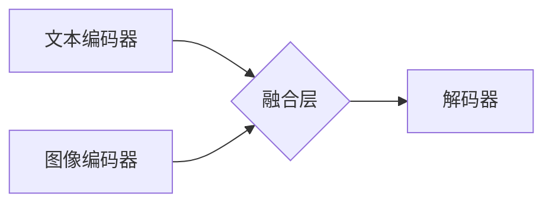

> 多模态大模型，BERT，自然语言处理，计算机视觉，图像识别，语音识别，文本生成，跨模态理解，深度学习

## 1. 背景介绍

近年来，人工智能（AI）技术取得了飞速发展，其中大模型在自然语言处理（NLP）、计算机视觉（CV）等领域展现出强大的能力。传统的单模态大模型主要专注于处理文本或图像等单一类型的数据，但现实世界中信息往往是多模态的，例如文本、图像、音频、视频等多种形式混合在一起。因此，如何有效地融合多模态信息，构建能够理解和生成多模态内容的大模型，成为人工智能领域的重要研究方向。

BERT模型的诞生标志着自然语言处理领域迈入了一个新的时代，其强大的文本理解能力为后续的多模态大模型发展奠定了基础。然而，多模态大模型的构建面临着更大的挑战，需要解决跨模态信息融合、模型训练和评估等关键问题。

## 2. 核心概念与联系

多模态大模型是指能够处理多种模态数据（如文本、图像、音频等）并进行跨模态理解和生成的大型神经网络模型。

**核心概念：**

* **模态（Modality）：** 指数据表示的方式，例如文本、图像、音频、视频等。
* **跨模态理解（Cross-Modal Understanding）：** 指模型能够理解不同模态数据之间的关系和关联，例如从图像中理解文本描述，或从文本中生成相应的图像。
* **跨模态生成（Cross-Modal Generation）：** 指模型能够根据不同模态数据生成新的内容，例如根据文本描述生成图像，或根据图像生成文本描述。

**架构：**



**核心联系：**

多模态大模型的核心是将不同模态的数据编码为统一的表示，然后通过融合层将这些表示进行融合，最终输出跨模态的理解或生成结果。

## 3. 核心算法原理 & 具体操作步骤

### 3.1  算法原理概述

多模态大模型的训练主要基于深度学习算法，常用的算法包括：

* **Transformer:** Transformer是一种基于注意力机制的序列模型，能够有效地捕捉文本中的长距离依赖关系，在自然语言处理领域取得了显著的成果。
* **CNN:** 卷积神经网络（CNN）擅长于提取图像中的特征，在图像识别和分类任务中表现出色。
* **RNN:** 循环神经网络（RNN）能够处理序列数据，在语音识别和机器翻译等任务中应用广泛。

多模态大模型通常将不同的模态数据分别编码为特征向量，然后通过融合层将这些特征向量进行融合，最终输出跨模态的理解或生成结果。

### 3.2  算法步骤详解

1. **数据预处理:** 将多模态数据进行预处理，例如文本分词、图像裁剪、音频降噪等。
2. **模态编码:** 使用不同的深度学习模型对每个模态数据进行编码，例如使用Transformer编码文本，使用CNN编码图像。
3. **特征融合:** 将不同模态的特征向量进行融合，可以使用多种融合方法，例如拼接、加权求和、注意力机制等。
4. **解码:** 使用解码器模型将融合后的特征向量解码为最终的输出结果，例如生成文本描述、识别图像内容等。
5. **模型训练:** 使用交叉熵损失函数等损失函数对模型进行训练，优化模型参数。

### 3.3  算法优缺点

**优点:**

* 能够处理多种模态数据，更好地理解和生成真实世界的复杂信息。
* 能够学习跨模态的知识和关系，提升模型的泛化能力。

**缺点:**

* 训练数据量大，计算资源消耗高。
* 模型结构复杂，训练难度大。
* 跨模态信息融合仍然是一个挑战性问题。

### 3.4  算法应用领域

多模态大模型在多个领域都有广泛的应用，例如：

* **图像字幕生成:** 根据图像生成文本描述。
* **视频理解:** 理解视频内容，例如识别人物、场景、动作等。
* **文本到图像生成:** 根据文本描述生成图像。
* **多模态问答:** 回答基于文本和图像的多模态问题。
* **医疗诊断:** 基于医学图像和病历信息进行诊断。

## 4. 数学模型和公式 & 详细讲解 & 举例说明

### 4.1  数学模型构建

多模态大模型的数学模型通常基于深度学习框架，例如TensorFlow或PyTorch。模型结构通常包括编码器和解码器两部分。

* **编码器:** 用于将不同模态的数据编码为特征向量。
* **解码器:** 用于根据编码后的特征向量生成最终的输出结果。

### 4.2  公式推导过程

多模态大模型的训练目标通常是最大化模型输出的概率，可以使用交叉熵损失函数来衡量模型的性能。

**交叉熵损失函数:**

$$
L = -\sum_{i=1}^{N} y_i \log(p_i)
$$

其中：

* $N$ 是样本数量。
* $y_i$ 是真实标签。
* $p_i$ 是模型预测的概率。

### 4.3  案例分析与讲解

例如，在图像字幕生成任务中，模型的输入是图像，输出是文本描述。

* 编码器将图像编码为特征向量。
* 解码器根据特征向量生成文本描述。

模型的训练目标是最大化模型输出的文本描述与真实描述的相似度。

## 5. 项目实践：代码实例和详细解释说明

### 5.1  开发环境搭建

* Python 3.7+
* TensorFlow 2.0+ 或 PyTorch 1.0+
* CUDA 和 cuDNN

### 5.2  源代码详细实现

```python
# 使用 TensorFlow 构建多模态大模型示例

import tensorflow as tf

# 定义文本编码器模型
text_encoder = tf.keras.Sequential([
    tf.keras.layers.Embedding(vocab_size, embedding_dim),
    tf.keras.layers.LSTM(units),
])

# 定义图像编码器模型
image_encoder = tf.keras.Sequential([
    tf.keras.layers.Conv2D(filters, kernel_size, activation='relu'),
    tf.keras.layers.MaxPooling2D(pool_size=(2, 2)),
    tf.keras.layers.Flatten(),
])

# 定义融合层
fusion_layer = tf.keras.layers.Concatenate()

# 定义解码器模型
decoder = tf.keras.Sequential([
    tf.keras.layers.Dense(units, activation='relu'),
    tf.keras.layers.Dense(vocab_size, activation='softmax'),
])

# 定义多模态大模型
model = tf.keras.Model(
    inputs=[text_input, image_input],
    outputs=decoder(fusion_layer([text_encoder(text_input), image_encoder(image_input)])),
)

# 编译模型
model.compile(optimizer='adam', loss='sparse_categorical_crossentropy', metrics=['accuracy'])

# 训练模型
model.fit(
    x=[text_data, image_data],
    y=text_labels,
    epochs=10,
    batch_size=32,
)
```

### 5.3  代码解读与分析

* 代码示例使用 TensorFlow 框架构建了一个简单的多模态大模型。
* 模型包含文本编码器、图像编码器、融合层和解码器。
* 融合层将文本和图像的特征向量进行拼接。
* 解码器根据融合后的特征向量生成文本描述。
* 模型使用交叉熵损失函数进行训练。

### 5.4  运行结果展示

训练完成后，模型可以用于图像字幕生成任务。

## 6. 实际应用场景

### 6.1  图像字幕生成

多模态大模型可以根据图像生成文本描述，例如用于自动生成图片的alt文本，辅助视障人士理解图像内容。

### 6.2  视频理解

多模态大模型可以理解视频内容，例如识别人物、场景、动作等，用于视频搜索、视频摘要等应用。

### 6.3  文本到图像生成

多模态大模型可以根据文本描述生成图像，例如用于创意设计、游戏开发等领域。

### 6.4  未来应用展望

多模态大模型在未来将有更广泛的应用，例如：

* **虚拟助手:** 能够理解语音、文本和图像的多模态输入，提供更智能的交互体验。
* **教育领域:** 用于个性化学习、智能辅导等。
* **医疗诊断:** 基于多模态数据进行更准确的诊断。

## 7. 工具和资源推荐

### 7.1  学习资源推荐

* **书籍:**
    * 《深度学习》
    * 《自然语言处理》
* **在线课程:**
    * Coursera: 深度学习
    * Udacity: 自然语言处理

### 7.2  开发工具推荐

* **TensorFlow:** 开源深度学习框架
* **PyTorch:** 开源深度学习框架
* **HuggingFace:** 多模态大模型库

### 7.3  相关论文推荐

* **BERT: Pre-training of Deep Bidirectional Transformers for Language Understanding**
* **Vision Transformer (ViT)**
* **CLIP: Contrastive Language-Image Pre-training**

## 8. 总结：未来发展趋势与挑战

### 8.1  研究成果总结

多模态大模型在跨模态理解和生成方面取得了显著的成果，为人工智能的未来发展提供了新的方向。

### 8.2  未来发展趋势

* **模型规模和能力的提升:** 未来多模态大模型将更加庞大，能够处理更多模态数据，并具备更强的理解和生成能力。
* **跨模态知识的共享和迁移:** 研究如何更好地共享和迁移跨模态知识，提升模型的泛化能力。
* **多模态数据标注的自动化:** 研究自动化多模态数据标注的方法，降低模型训练成本。

### 8.3  面临的挑战

* **数据获取和标注:** 多模态数据获取和标注难度大，需要大量的标注数据才能训练出高质量的模型。
* **模型训练和推理效率:** 多模态大模型训练和推理效率低，需要更高效的算法和硬件支持。
* **伦理和安全问题:** 多模态大模型可能存在伦理和安全问题，例如数据隐私泄露、模型误用等，需要加强相关研究和监管。

### 8.4  研究展望

未来多模态大模型的研究将更加注重模型的鲁棒性、可解释性和安全性，并探索其在更多领域中的应用。


## 9. 附录：常见问题与解答

**Q1: 多模态大模型与单模态大模型有什么区别？**

**A1:** 单模态大模型只处理一种模态数据，例如文本或图像，而多模态大模型能够处理多种模态数据，例如文本、图像、音频等。

**Q2: 多模态大模型的训练数据量有多大？**

**A2:** 多模态大模型的训练数据量通常非常大，需要大量的标注数据才能训练出高质量的模型。

**Q3: 多模态大模型的应用场景有哪些？**

**A3:** 多模态大模型的应用场景非常广泛，例如图像字幕生成、视频理解、文本到图像生成等。

**Q4: 多模态大模型的未来发展趋势是什么？**

**A4:** 未来多模态大模型将更加庞大，能够处理更多模态数据，并具备更强的理解和生成能力。


作者：禅与计算机程序设计艺术 / Zen and the Art of Computer Programming 
<end_of_turn>