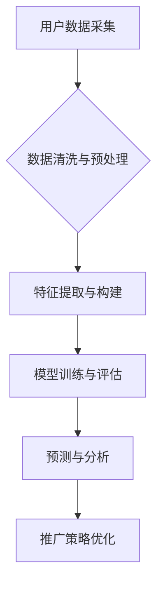

> 大数据, 电影推广, 策略研究, 人工智能, 推荐系统, 预测模型, 观众画像

## 1. 背景介绍

近年来，随着互联网技术的快速发展和移动互联网的普及，大数据技术在各个领域得到了广泛应用，电影行业也不例外。大数据为电影推广提供了全新的思路和方法，能够帮助电影公司更精准地了解观众需求，制定更有效的推广策略。

传统电影推广主要依靠线下宣传、媒体广告等方式，推广效果难以精准评估，且成本较高。而大数据时代，电影公司可以通过收集和分析海量用户数据，构建观众画像，预测电影票房，优化推广策略，实现精准营销。

## 2. 核心概念与联系

**2.1 大数据**

大数据是指规模庞大、结构复杂、更新速度快、类型多样化的数据。它具有以下四个特征：

* **海量 (Volume):** 数据量巨大，难以用传统方法处理。
* **高速 (Velocity):** 数据产生和更新速度快，需要实时处理。
* **多样性 (Variety):** 数据类型多样，包括结构化数据、非结构化数据和半结构化数据。
* **价值 (Value):** 数据蕴含着巨大的价值，需要通过挖掘和分析才能得到利用。

**2.2 电影推广**

电影推广是指在电影上映前，通过各种宣传手段，向目标观众宣传电影，提高电影的知名度和票房收入。

**2.3 核心概念联系**

大数据技术为电影推广提供了强大的工具和手段。通过收集和分析海量用户数据，电影公司可以了解观众的喜好、观看习惯、消费行为等信息，从而制定更精准、更有效的推广策略。

**2.4  Mermaid 流程图**



## 3. 核心算法原理 & 具体操作步骤

**3.1 算法原理概述**

在电影推广策略研究中，常用的算法包括：

* **协同过滤算法:** 根据用户的历史行为数据，预测用户对电影的喜好。
* **内容基元推荐算法:** 基于电影的属性信息，推荐与用户兴趣相符的电影。
* **深度学习算法:** 利用深度神经网络，学习用户和电影之间的复杂关系，进行更精准的推荐。

**3.2 算法步骤详解**

以协同过滤算法为例，其具体步骤如下：

1. **数据收集:** 收集用户对电影的评分、观看记录等数据。
2. **数据预处理:** 清洗数据，处理缺失值，转化数据格式。
3. **用户和电影相似度计算:** 计算用户之间的相似度，计算电影之间的相似度。
4. **推荐电影:** 根据用户的相似用户或相似电影，推荐用户可能感兴趣的电影。

**3.3 算法优缺点**

* **优点:** 能够根据用户的历史行为数据，推荐用户可能感兴趣的电影，推荐效果较好。
* **缺点:** 对于新用户或新电影，算法难以给出准确的推荐。

**3.4 算法应用领域**

协同过滤算法广泛应用于电影推荐系统、音乐推荐系统、商品推荐系统等领域。

## 4. 数学模型和公式 & 详细讲解 & 举例说明

**4.1 数学模型构建**

协同过滤算法的核心是计算用户和电影之间的相似度。常用的相似度度量方法包括余弦相似度、皮尔逊相关系数等。

**4.2 公式推导过程**

**余弦相似度:**

$$
\text{相似度} = \frac{\mathbf{u} \cdot \mathbf{v}}{\|\mathbf{u}\| \|\mathbf{v}\|}
$$

其中：

* $\mathbf{u}$ 和 $\mathbf{v}$ 分别表示两个用户的评分向量。
* $\cdot$ 表示向量点积。
* $\|\mathbf{u}\|$ 和 $\|\mathbf{v}\|$ 分别表示两个向量的模长。

**4.3 案例分析与讲解**

假设有两个用户 A 和 B，他们的评分向量分别为：

* $\mathbf{u}_A = [1, 2, 3, 4]$
* $\mathbf{u}_B = [2, 3, 4, 5]$

则它们的余弦相似度为：

$$
\text{相似度} = \frac{(1 \times 2) + (2 \times 3) + (3 \times 4) + (4 \times 5)}{\sqrt{1^2 + 2^2 + 3^2 + 4^2} \sqrt{2^2 + 3^2 + 4^2 + 5^2}} = \frac{30}{\sqrt{30} \sqrt{54}} = \frac{30}{\sqrt{1620}}
$$

## 5. 项目实践：代码实例和详细解释说明

**5.1 开发环境搭建**

* Python 3.x
* Pandas
* Scikit-learn
* Matplotlib

**5.2 源代码详细实现**

```python
import pandas as pd
from sklearn.metrics.pairwise import cosine_similarity

# 加载用户评分数据
ratings_data = pd.read_csv('ratings.csv')

# 计算用户之间的余弦相似度
user_similarity = cosine_similarity(ratings_data)

# 获取用户 A 的相似用户
user_A_id = 1
similar_users = user_similarity[user_A_id].argsort()[:-6:-1]

# 推荐电影
recommended_movies = ratings_data.loc[similar_users, :].mean().sort_values(ascending=False)
```

**5.3 代码解读与分析**

* 代码首先加载用户评分数据。
* 然后使用 Scikit-learn 库的 `cosine_similarity` 函数计算用户之间的余弦相似度。
* 获取用户 A 的相似用户，并根据相似用户的评分数据，计算推荐电影的平均评分。

**5.4 运行结果展示**

运行代码后，将输出用户 A 可能感兴趣的电影列表，以及每个电影的推荐评分。

## 6. 实际应用场景

大数据背景下的国产电影推广策略研究在实际应用中具有广泛的应用场景：

* **精准用户画像:** 通过分析用户数据，构建精准的用户画像，了解用户的喜好、观看习惯、消费行为等信息。
* **个性化推荐:** 根据用户的画像，推荐个性化的电影内容，提高用户体验。
* **精准投放广告:** 根据用户的画像，精准投放广告，提高广告效果。
* **预测票房:** 利用大数据分析模型，预测电影的票房收入，帮助电影公司制定发行策略。

**6.4 未来应用展望**

随着大数据技术的不断发展，未来电影推广策略研究将更加智能化、个性化。例如：

* 利用人工智能技术，自动生成电影宣传文案和海报。
* 利用虚拟现实技术，打造沉浸式的电影体验。
* 利用区块链技术，保障电影版权和票房收入。

## 7. 工具和资源推荐

**7.1 学习资源推荐**

* 《大数据分析》
* 《机器学习》
* 《深度学习》

**7.2 开发工具推荐**

* Python
* Pandas
* Scikit-learn
* TensorFlow

**7.3 相关论文推荐**

* “基于大数据的电影推荐系统研究”
* “大数据分析在电影推广中的应用”

## 8. 总结：未来发展趋势与挑战

**8.1 研究成果总结**

大数据背景下的国产电影推广策略研究取得了显著成果，为电影公司提供了更精准、更有效的推广手段。

**8.2 未来发展趋势**

未来电影推广策略研究将更加智能化、个性化，并与人工智能、虚拟现实等新技术深度融合。

**8.3 面临的挑战**

* 数据隐私保护
* 数据质量控制
* 模型解释性

**8.4 研究展望**

未来研究将重点关注数据隐私保护、模型解释性以及新技术应用等方面。

## 9. 附录：常见问题与解答

**9.1 如何构建用户画像？**

用户画像可以通过分析用户的评分数据、观看记录、评论内容等信息构建。

**9.2 如何预测电影票房？**

可以通过构建预测模型，利用历史票房数据、用户画像、电影属性等信息预测电影票房。

**9.3 如何评估推广策略效果？**

可以通过分析票房收入、用户反馈、广告点击率等指标评估推广策略效果。


作者：禅与计算机程序设计艺术 / Zen and the Art of Computer Programming 
<end_of_turn>