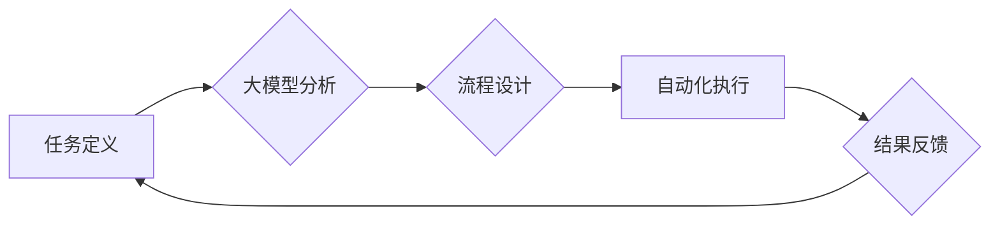

> 大模型、工作流、底层能力、自动化、效率提升、流程优化、人工智能

## 1. 背景介绍

随着人工智能技术的飞速发展，大模型（Large Language Model，LLM）已成为一个备受关注的热点领域。大模型凭借其强大的语义理解和文本生成能力，在自然语言处理、机器翻译、代码生成等领域取得了突破性的进展。然而，大模型的应用场景远不止于此，其底层能力也为工作流的自动化和优化提供了新的可能性。

传统的工作流通常依赖于人工干预和规则配置，效率低下，难以应对复杂、动态变化的任务。而大模型的引入，可以将大量重复性、规则性任务自动化，大幅提升工作流的效率和灵活性。

## 2. 核心概念与联系

### 2.1 大模型

大模型是指参数量巨大、训练数据海量的人工智能模型。其强大的学习能力使其能够理解复杂的语言结构和语义关系，并生成高质量的文本输出。常见的代表性大模型包括GPT-3、BERT、LaMDA等。

### 2.2 工作流

工作流是指一系列相互关联的任务或步骤，用于完成特定目标。它可以是简单的线性流程，也可以是复杂的嵌套结构。工作流的自动化可以显著提高效率，减少人为错误，并促进协作。

### 2.3 底层能力

大模型的底层能力主要包括：

* **语义理解:** 理解文本的含义和上下文关系。
* **文本生成:** 生成流畅、语法正确的文本。
* **知识推理:** 从文本中提取知识，进行逻辑推理。
* **代码生成:** 根据自然语言描述生成代码。

这些底层能力可以被应用于工作流的各个环节，例如任务分配、数据处理、流程控制等。

**Mermaid 流程图**



## 3. 核心算法原理 & 具体操作步骤

### 3.1 算法原理概述

大模型在工作流中的应用主要基于以下算法原理：

* **自然语言处理 (NLP):** 利用NLP技术，将自然语言描述转化为机器可理解的指令，从而实现对工作流的自动化控制。
* **机器学习 (ML):** 通过训练大模型，使其能够学习工作流的模式和规律，并根据输入的条件自动生成相应的执行步骤。
* **深度学习 (DL):** 利用深度神经网络的强大学习能力，进一步提升大模型的语义理解和文本生成能力，使其能够处理更复杂的工作流。

### 3.2 算法步骤详解

1. **工作流建模:** 将工作流的各个任务和步骤进行抽象和建模，形成可被机器理解的流程图或数据结构。
2. **大模型训练:** 利用大模型训练平台，训练大模型，使其能够理解工作流的结构和逻辑，并能够根据输入的条件生成相应的执行步骤。
3. **流程自动化:** 将训练好的大模型集成到工作流系统中，使其能够自动执行工作流中的任务和步骤。
4. **结果反馈:** 收集工作流执行的结果，并反馈给大模型，用于模型的持续学习和优化。

### 3.3 算法优缺点

**优点:**

* **自动化程度高:** 大模型可以自动化执行大量重复性、规则性任务，大幅提升工作流效率。
* **灵活性强:** 大模型能够根据输入的条件动态调整执行步骤，适应复杂、动态变化的工作环境。
* **可扩展性强:** 大模型可以轻松扩展到处理更复杂的工作流，并支持多模态输入和输出。

**缺点:**

* **训练成本高:** 训练大模型需要大量的计算资源和数据，成本较高。
* **模型解释性差:** 大模型的决策过程较为复杂，难以解释其背后的逻辑，这可能导致信任问题。
* **数据安全问题:** 大模型的训练和应用需要处理大量敏感数据，需要采取相应的安全措施。

### 3.4 算法应用领域

大模型在工作流中的应用领域非常广泛，例如：

* **软件开发:** 自动化代码生成、测试、部署等流程。
* **客户服务:** 自动化客服机器人、问题解答等流程。
* **金融服务:** 自动化交易、风险评估等流程。
* **医疗保健:** 自动化病历分析、诊断辅助等流程。

## 4. 数学模型和公式 & 详细讲解 & 举例说明

### 4.1 数学模型构建

大模型的训练过程可以抽象为一个优化问题，目标是找到一个参数向量，使得模型在训练数据上的预测结果与真实标签尽可能接近。

假设训练数据为{(x1, y1), (x2, y2), ..., (xn, yn)}，其中xi为输入样本，yi为真实标签。模型的预测结果为f(xi, θ)，其中θ为模型参数向量。

损失函数用于衡量模型预测结果与真实标签之间的差异。常用的损失函数包括均方误差 (MSE)、交叉熵 (Cross-Entropy) 等。

目标函数为：

$$
J(θ) = \frac{1}{n} \sum_{i=1}^{n} L(f(x_i, θ), y_i)
$$

其中L为损失函数。

### 4.2 公式推导过程

通过梯度下降算法，不断更新模型参数θ，使得目标函数J(θ)最小化。梯度下降算法的更新公式为：

$$
θ = θ - \eta \nabla J(θ)
$$

其中η为学习率，∇J(θ)为目标函数J(θ)的梯度。

### 4.3 案例分析与讲解

例如，在文本分类任务中，可以使用交叉熵损失函数来衡量模型预测结果与真实标签之间的差异。

假设模型预测文本属于类别A的概率为p，真实标签为类别A，则交叉熵损失函数为：

$$
L(p, y) = -log(p)
$$

通过梯度下降算法，不断更新模型参数，使得模型预测文本属于类别A的概率尽可能接近1。

## 5. 项目实践：代码实例和详细解释说明

### 5.1 开发环境搭建

* Python 3.7+
* TensorFlow 2.0+
* PyTorch 1.0+
* Jupyter Notebook

### 5.2 源代码详细实现

```python
# 导入必要的库
import tensorflow as tf

# 定义模型结构
model = tf.keras.Sequential([
    tf.keras.layers.Embedding(input_dim=10000, output_dim=128),
    tf.keras.layers.LSTM(units=64),
    tf.keras.layers.Dense(units=1, activation='sigmoid')
])

# 编译模型
model.compile(optimizer='adam', loss='binary_crossentropy', metrics=['accuracy'])

# 训练模型
model.fit(x_train, y_train, epochs=10)

# 评估模型
loss, accuracy = model.evaluate(x_test, y_test)
print('Loss:', loss)
print('Accuracy:', accuracy)
```

### 5.3 代码解读与分析

* 首先，导入必要的库，包括TensorFlow和PyTorch。
* 然后，定义模型结构，包括嵌入层、LSTM层和全连接层。
* 接着，编译模型，指定优化器、损失函数和评价指标。
* 接下来，训练模型，使用训练数据进行训练。
* 最后，评估模型，使用测试数据评估模型的性能。

### 5.4 运行结果展示

训练完成后，可以查看模型的损失值和准确率。

## 6. 实际应用场景

### 6.1 自动化客服机器人

大模型可以训练出一个能够理解用户问题并提供相应解答的客服机器人，从而自动处理客户咨询，提高客服效率。

### 6.2 代码生成工具

大模型可以根据用户提供的自然语言描述，自动生成相应的代码，例如生成网页代码、API接口代码等，提高开发效率。

### 6.3 文档自动化生成

大模型可以根据项目文档或代码，自动生成各种类型的文档，例如用户手册、API文档、技术文档等，减少文档编写工作量。

### 6.4 未来应用展望

随着大模型技术的不断发展，其在工作流中的应用场景将更加广泛，例如：

* **智能流程设计:** 大模型可以根据用户的需求和业务规则，自动设计和优化工作流程。
* **个性化工作流:** 大模型可以根据用户的习惯和偏好，定制个性化的工作流，提高工作效率和用户体验。
* **跨部门协作:** 大模型可以帮助不同部门之间进行协作，实现数据共享和流程整合。

## 7. 工具和资源推荐

### 7.1 学习资源推荐

* **书籍:**
    * 《深度学习》
    * 《自然语言处理》
    * 《大模型》
* **在线课程:**
    * Coursera
    * edX
    * Udacity

### 7.2 开发工具推荐

* **TensorFlow:** 开源深度学习框架
* **PyTorch:** 开源深度学习框架
* **HuggingFace:** 大模型库和工具平台

### 7.3 相关论文推荐

* **BERT: Pre-training of Deep Bidirectional Transformers for Language Understanding**
* **GPT-3: Language Models are Few-Shot Learners**
* **LaMDA: Language Models for Dialogue Applications**

## 8. 总结：未来发展趋势与挑战

### 8.1 研究成果总结

大模型在工作流中的应用取得了显著的成果，例如自动化客服机器人、代码生成工具等。大模型的强大能力可以大幅提升工作流的效率和灵活性，并为未来工作模式的变革提供新的可能性。

### 8.2 未来发展趋势

* **模型规模和能力的提升:** 未来大模型的规模和能力将继续提升，能够处理更复杂的任务和数据。
* **多模态大模型的开发:** 未来大模型将支持多模态输入和输出，例如文本、图像、音频等，能够处理更丰富的任务场景。
* **模型解释性和可信度的提升:** 未来研究将更加注重大模型的解释性和可信度，使其能够更好地被人类理解和信任。

### 8.3 面临的挑战

* **训练成本高:** 训练大模型需要大量的计算资源和数据，成本较高。
* **模型解释性差:** 大模型的决策过程较为复杂，难以解释其背后的逻辑，这可能导致信任问题。
* **数据安全问题:** 大模型的训练和应用需要处理大量敏感数据，需要采取相应的安全措施。

### 8.4 研究展望

未来研究将继续探索大模型在工作流中的更多应用场景，并致力于解决大模型面临的挑战，使其能够更好地服务于人类社会。

## 9. 附录：常见问题与解答

### 9.1 如何选择合适的模型？

选择合适的模型需要根据具体任务的需求和数据特点进行评估。例如，对于文本分类任务，BERT模型通常表现较好；对于代码生成任务，GPT模型通常更适合。

### 9.2 如何训练大模型？

训练大模型需要大量的计算资源和数据。可以使用云计算平台或高性能计算集群进行训练。

### 9.3 如何评估大模型的性能？

大模型的性能可以根据具体任务的需求进行评估。常用的评价指标包括准确率、召回率、F1-score等。

### 9.4 如何部署大模型？

大模型可以部署到云端、边缘设备或本地服务器上。部署方式的选择需要根据具体应用场景和资源限制进行考虑。


作者：禅与计算机程序设计艺术 / Zen and the Art of Computer Programming 
<end_of_turn>