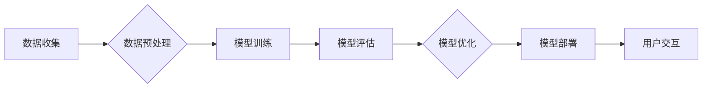

> 大模型，用户体验，应用场景，模型训练，模型部署，伦理问题

## 1. 背景介绍

近年来，深度学习技术取得了飞速发展，大模型（Large Language Model，LLM）作为深度学习领域的重要分支，展现出强大的学习和推理能力，在自然语言处理、计算机视觉、代码生成等领域取得了突破性进展。从 GPT-3 到 LaMDA，再到 ChatGPT，大模型的不断涌现，为我们打开了通往人工智能未来的大门。然而，大模型的强大能力也带来了新的挑战，如何更好地利用大模型，提升用户体验，并将其应用于实际场景，成为当前研究的热点问题。

## 2. 核心概念与联系

大模型的核心概念在于其规模庞大，参数数量远超传统模型，能够学习更复杂的模式和关系。大模型的训练通常需要海量数据和强大的计算资源，其架构通常基于 Transformer 网络，能够有效捕捉文本中的长距离依赖关系。

**大模型的训练与应用流程:**



## 3. 核心算法原理 & 具体操作步骤

### 3.1  算法原理概述

大模型的核心算法是 Transformer 网络，其主要特点是利用注意力机制（Attention Mechanism）有效捕捉文本中的长距离依赖关系。注意力机制可以理解为模型对输入序列中的不同部分赋予不同权重，从而更加关注重要的信息。

### 3.2  算法步骤详解

1. **输入嵌入:** 将输入文本序列中的每个单词转换为向量表示，称为词嵌入。
2. **多头注意力:** 对输入序列中的每个单词进行多头注意力计算，捕捉单词之间的关系。
3. **前馈神经网络:** 对每个单词的注意力输出进行前馈神经网络处理，进一步提取特征。
4. **位置编码:** 为每个单词添加位置信息，因为 Transformer 网络没有循环结构，无法直接捕捉单词的顺序信息。
5. **堆叠层:** 将多头注意力和前馈神经网络层堆叠在一起，形成多层网络结构，进一步提取语义信息。
6. **输出层:** 将最终的隐藏状态转换为输出序列，例如预测下一个单词。

### 3.3  算法优缺点

**优点:**

* 能够有效捕捉长距离依赖关系，提升文本理解能力。
* 并行计算能力强，训练速度快。
* 可迁移性强，可以应用于多种自然语言处理任务。

**缺点:**

* 参数量大，训练成本高。
* 对训练数据要求高，容易过拟合。
* 缺乏对真实世界知识的理解。

### 3.4  算法应用领域

* 自然语言理解：文本分类、情感分析、问答系统等。
* 自然语言生成：机器翻译、文本摘要、对话系统等。
* 代码生成：自动代码补全、代码翻译等。

## 4. 数学模型和公式 & 详细讲解 & 举例说明

### 4.1  数学模型构建

Transformer 网络的核心是注意力机制，其数学模型可以表示为：

$$
Attention(Q, K, V) = softmax(\frac{QK^T}{\sqrt{d_k}})V
$$

其中：

* $Q$：查询矩阵
* $K$：键矩阵
* $V$：值矩阵
* $d_k$：键向量的维度
* $softmax$：softmax 函数

### 4.2  公式推导过程

注意力机制的目的是计算每个单词与其他单词之间的相关性，并根据相关性分配权重。

1. 计算查询矩阵 $Q$ 与键矩阵 $K$ 的点积，得到一个得分矩阵。
2. 对得分矩阵进行归一化，得到一个概率分布。
3. 将概率分布与值矩阵 $V$ 相乘，得到每个单词的加权和，即注意力输出。

### 4.3  案例分析与讲解

例如，在机器翻译任务中，我们可以使用注意力机制来计算源语言句子中的每个单词与目标语言句子中的每个单词之间的相关性。通过注意力机制，模型可以更好地理解句子之间的语义关系，从而生成更准确的翻译结果。

## 5. 项目实践：代码实例和详细解释说明

### 5.1  开发环境搭建

* Python 3.7+
* PyTorch 1.7+
* CUDA 10.2+

### 5.2  源代码详细实现

```python
import torch
import torch.nn as nn

class Attention(nn.Module):
    def __init__(self, d_model, num_heads):
        super(Attention, self).__init__()
        self.d_model = d_model
        self.num_heads = num_heads
        self.head_dim = d_model // num_heads

        self.query = nn.Linear(d_model, d_model)
        self.key = nn.Linear(d_model, d_model)
        self.value = nn.Linear(d_model, d_model)
        self.fc_out = nn.Linear(d_model, d_model)

    def forward(self, query, key, value, mask=None):
        batch_size = query.size(0)

        # Linear projections
        Q = self.query(query).view(batch_size, -1, self.num_heads, self.head_dim).transpose(1, 2)
        K = self.key(key).view(batch_size, -1, self.num_heads, self.head_dim).transpose(1, 2)
        V = self.value(value).view(batch_size, -1, self.num_heads, self.head_dim).transpose(1, 2)

        # Scaled dot-product attention
        scores = torch.matmul(Q, K.transpose(-2, -1)) / torch.sqrt(torch.tensor(self.head_dim, dtype=torch.float))
        if mask is not None:
            scores = scores.masked_fill(mask == 0, -1e9)
        attention_weights = torch.softmax(scores, dim=-1)

        # Weighted sum of values
        context = torch.matmul(attention_weights, V)

        # Concatenate heads and project
        context = context.transpose(1, 2).contiguous().view(batch_size, -1, self.d_model)
        output = self.fc_out(context)

        return output, attention_weights
```

### 5.3  代码解读与分析

这段代码实现了 Transformer 网络中的注意力机制。

* `__init__` 方法初始化模型参数，包括模型维度、注意力头数等。
* `forward` 方法实现注意力机制的计算过程，包括线性投影、缩放点积注意力、加权求和等步骤。

### 5.4  运行结果展示

运行上述代码可以得到注意力机制的输出结果，包括注意力权重和上下文向量。

## 6. 实际应用场景

### 6.1  自然语言理解

大模型在自然语言理解领域展现出强大的能力，例如：

* **文本分类:** 可以根据文本内容自动分类，例如情感分析、主题分类等。
* **问答系统:** 可以理解用户的问题，并从文本库中找到答案。
* **文本摘要:** 可以自动生成文本的简短摘要。

### 6.2  自然语言生成

大模型在自然语言生成领域也取得了突破性进展，例如：

* **机器翻译:** 可以将文本从一种语言翻译成另一种语言。
* **对话系统:** 可以与用户进行自然流畅的对话。
* **文本创作:** 可以生成各种类型的文本，例如诗歌、小说、新闻报道等。

### 6.3  代码生成

大模型可以帮助程序员自动生成代码，提高开发效率，例如：

* **代码补全:** 可以根据代码上下文自动补全代码。
* **代码翻译:** 可以将代码从一种编程语言翻译成另一种编程语言。
* **代码生成:** 可以根据自然语言描述自动生成代码。

### 6.4  未来应用展望

大模型的应用场景还在不断扩展，未来可能应用于：

* **个性化教育:** 根据学生的学习情况提供个性化的学习内容和辅导。
* **医疗诊断:** 辅助医生进行疾病诊断和治疗方案制定。
* **科学研究:** 加速科学研究的进程，例如药物研发、材料科学等。

## 7. 工具和资源推荐

### 7.1  学习资源推荐

* **书籍:**
    * 《深度学习》
    * 《自然语言处理》
    * 《Transformer网络》
* **在线课程:**
    * Coursera: 深度学习
    * Udacity: 自然语言处理
    * fast.ai: 深度学习

### 7.2  开发工具推荐

* **PyTorch:** 深度学习框架
* **TensorFlow:** 深度学习框架
* **HuggingFace:** 大模型库和工具

### 7.3  相关论文推荐

* 《Attention Is All You Need》
* 《BERT: Pre-training of Deep Bidirectional Transformers for Language Understanding》
* 《GPT-3: Language Models are Few-Shot Learners》

## 8. 总结：未来发展趋势与挑战

### 8.1  研究成果总结

大模型在自然语言处理、计算机视觉、代码生成等领域取得了突破性进展，展现出强大的学习和推理能力。

### 8.2  未来发展趋势

* 模型规模进一步扩大，参数量达到万亿级甚至更高。
* 模型训练效率提升，利用分布式训练、模型压缩等技术。
* 模型泛化能力增强，能够更好地适应不同的应用场景。
* 模型解释性提升，能够更好地理解模型的决策过程。

### 8.3  面临的挑战

* 训练成本高昂，需要大量的计算资源和数据。
* 模型容易过拟合，需要更有效的训练方法。
* 模型缺乏对真实世界知识的理解，需要结合其他知识源进行训练。
* 伦理问题，例如模型的偏见、虚假信息生成等需要得到解决。

### 8.4  研究展望

未来研究将重点关注以下几个方面：

* 开发更有效的训练方法，降低训练成本。
* 提升模型的泛化能力和鲁棒性。
* 研究模型的解释性，提高模型的可信度。
* 解决大模型的伦理问题，确保其安全和可控使用。

## 9. 附录：常见问题与解答

### 9.1  常见问题

* 大模型的训练需要多少数据？
* 大模型的训练需要多少计算资源？
* 如何评估大模型的性能？
* 如何部署大模型？

### 9.2  解答

* 大模型的训练需要海量数据，通常需要数十亿甚至上百亿个样本。
* 大模型的训练需要大量的计算资源，通常需要数百甚至数千个GPU。
* 大模型的性能可以评估指标，例如准确率、召回率、F1-score等。
* 大模型的部署可以采用云端部署、边缘部署等方式。


作者：禅与计算机程序设计艺术 / Zen and the Art of Computer Programming 
<end_of_turn>