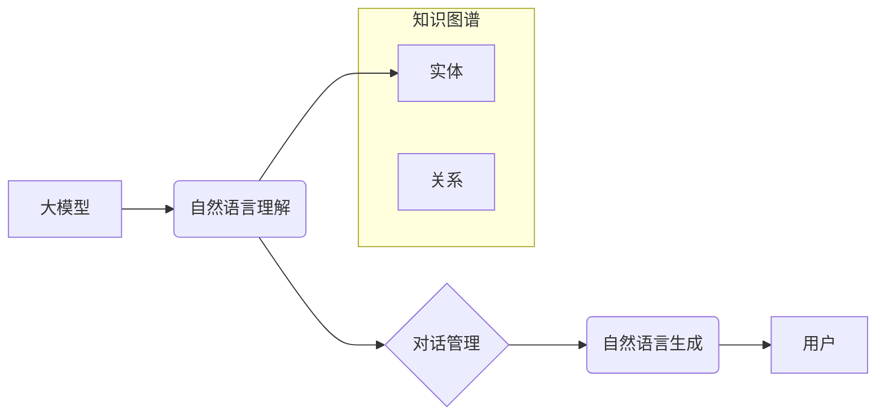

> 大模型、问答机器人、自然语言处理、对话系统、Transformer、BERT、GPT、LLM、知识图谱、语义理解、文本生成

## 1. 背景介绍

近年来，人工智能技术取得了飞速发展，特别是深度学习的兴起，为自然语言处理（NLP）领域带来了革命性的变革。大模型问答机器人作为一种新型的智能交互系统，凭借其强大的语言理解和生成能力，在客服、教育、娱乐等领域展现出巨大的应用潜力。

传统的问答系统主要依赖于规则引擎和手工构建的知识库，难以应对复杂、开放式的自然语言查询。而大模型问答机器人则通过训练海量文本数据，学习语言的语义和结构，能够理解用户意图，并生成自然流畅的回答。

## 2. 核心概念与联系

大模型问答机器人主要包含以下核心概念：

* **大模型 (Large Model):** 指训练参数数量庞大的深度学习模型，例如BERT、GPT、T5等。大模型拥有强大的语义理解和文本生成能力，是问答系统的核心引擎。

* **自然语言处理 (NLP):** 致力于使计算机能够理解、处理和生成人类语言的技术领域。NLP技术在问答系统中用于理解用户查询、提取关键信息、生成自然语言回答等。

* **对话系统 (Dialogue System):** 能够与用户进行自然交互的系统。对话系统通常包含对话管理模块、自然语言理解模块和自然语言生成模块。

* **知识图谱 (Knowledge Graph):**  一种结构化的知识表示形式，将实体和关系以图的形式表示。知识图谱可以帮助问答系统获取更丰富、更准确的知识信息。

**核心概念架构图:**



## 3. 核心算法原理 & 具体操作步骤

### 3.1  算法原理概述

大模型问答机器人主要基于Transformer模型，其核心思想是利用注意力机制捕捉文本序列中的长距离依赖关系，从而实现更准确的语义理解和文本生成。

Transformer模型由编码器和解码器两部分组成。编码器将输入的文本序列编码成语义向量，解码器则根据编码后的语义向量生成相应的输出文本序列。

### 3.2  算法步骤详解

1. **文本预处理:** 对输入的文本进行清洗、分词、词性标注等预处理操作，以便于模型理解。

2. **编码器输入:** 将预处理后的文本序列输入到编码器中，编码器会将每个词语映射到相应的词向量，并通过多层Transformer模块进行编码，最终生成文本的语义表示。

3. **解码器输入:** 将编码后的语义表示作为解码器的输入，解码器会根据输入的语义信息，逐个生成输出文本序列。

4. **注意力机制:** Transformer模型中广泛应用注意力机制，可以帮助模型关注文本序列中与当前词语相关的关键信息，从而提高语义理解和文本生成能力。

5. **输出生成:** 解码器最终生成一个概率分布，表示每个词语出现的可能性，根据概率分布选择最可能的词语作为输出。

### 3.3  算法优缺点

**优点:**

* 强大的语义理解能力：Transformer模型能够捕捉文本序列中的长距离依赖关系，实现更准确的语义理解。
* 自然流畅的文本生成：Transformer模型能够生成自然流畅的文本，与人类语言更加接近。
* 可迁移性强：预训练的Transformer模型可以迁移到不同的任务中，例如问答、机器翻译、文本摘要等。

**缺点:**

* 计算资源消耗大：训练Transformer模型需要大量的计算资源和时间。
* 数据依赖性强：Transformer模型的性能依赖于训练数据的质量和数量。
* 缺乏可解释性：Transformer模型的内部机制较为复杂，难以解释其决策过程。

### 3.4  算法应用领域

Transformer模型在自然语言处理领域有着广泛的应用，例如：

* **问答系统:** 构建能够理解用户自然语言查询并提供准确答案的问答系统。
* **机器翻译:** 将一种语言翻译成另一种语言。
* **文本摘要:** 自动生成文本的简短摘要。
* **对话系统:** 开发能够与用户进行自然交互的对话系统。

## 4. 数学模型和公式 & 详细讲解 & 举例说明

### 4.1  数学模型构建

Transformer模型的核心是注意力机制，其数学模型可以表示为：

$$
Attention(Q, K, V) = softmax(\frac{QK^T}{\sqrt{d_k}})V
$$

其中：

* $Q$：查询矩阵
* $K$：键矩阵
* $V$：值矩阵
* $d_k$：键向量的维度
* $softmax$：softmax函数

### 4.2  公式推导过程

注意力机制的目的是计算查询向量与键向量的相关性，并根据相关性权重加权求和值矩阵。

1. 计算查询向量与键向量的点积，得到一个得分矩阵。

2. 对得分矩阵进行归一化，得到一个概率分布。

3. 将概率分布与值矩阵相乘，得到加权求和后的输出向量。

### 4.3  案例分析与讲解

假设我们有一个句子“我爱吃苹果”，我们想要计算“我”这个词语与整个句子的相关性。

1. 将句子中的每个词语都转换为词向量，得到查询向量 $Q$、键向量 $K$ 和值向量 $V$。

2. 计算 $Q$ 与 $K$ 的点积，得到一个得分矩阵。

3. 对得分矩阵进行 softmax 归一化，得到一个概率分布，表示每个词语与“我”的关联程度。

4. 将概率分布与 $V$ 相乘，得到加权求和后的输出向量，表示“我”这个词语与整个句子的语义信息。

## 5. 项目实践：代码实例和详细解释说明

### 5.1  开发环境搭建

* Python 3.7+
* TensorFlow/PyTorch
* CUDA/cuDNN

### 5.2  源代码详细实现

```python
# 使用 HuggingFace Transformers 库加载预训练模型
from transformers import AutoModelForQuestionAnswering, AutoTokenizer

# 加载模型和分词器
model_name = "bert-base-uncased"
model = AutoModelForQuestionAnswering.from_pretrained(model_name)
tokenizer = AutoTokenizer.from_pretrained(model_name)

# 输入问题和上下文
question = "What is the capital of France?"
context = "France is a country in Europe. Its capital is Paris."

# 将问题和上下文转换为模型输入格式
inputs = tokenizer(question, context, return_tensors="pt")

# 获取模型输出
outputs = model(**inputs)

# 从输出中提取答案
start_logits = outputs.start_logits
end_logits = outputs.end_logits

# 找到答案起始和结束位置
start_index = torch.argmax(start_logits).item()
end_index = torch.argmax(end_logits).item()

# 从上下文文本中提取答案
answer = context[start_index:end_index + 1]

# 打印答案
print(f"Answer: {answer}")
```

### 5.3  代码解读与分析

* 使用 HuggingFace Transformers 库加载预训练的 BERT 模型和分词器。
* 将问题和上下文转换为模型输入格式。
* 使用模型进行推理，获取答案起始和结束位置。
* 从上下文文本中提取答案。

### 5.4  运行结果展示

```
Answer: Paris
```

## 6. 实际应用场景

大模型问答机器人已经在多个领域得到实际应用，例如：

* **客服机器人:** 能够自动回答用户常见问题，提高客服效率。
* **教育机器人:** 能够提供个性化的学习辅导，帮助学生学习知识。
* **娱乐机器人:** 能够与用户进行自然对话，提供娱乐服务。

### 6.4  未来应用展望

随着大模型技术的不断发展，大模型问答机器人将在更多领域得到应用，例如：

* **医疗问答:** 能够帮助医生诊断疾病、提供治疗方案。
* **法律问答:** 能够帮助律师查找法律法规、提供法律咨询。
* **金融问答:** 能够帮助用户查询金融产品、进行理财规划。

## 7. 工具和资源推荐

### 7.1  学习资源推荐

* **HuggingFace Transformers:** https://huggingface.co/docs/transformers/index
* **OpenAI GPT-3:** https://openai.com/api/
* **Stanford NLP Group:** https://nlp.stanford.edu/

### 7.2  开发工具推荐

* **TensorFlow:** https://www.tensorflow.org/
* **PyTorch:** https://pytorch.org/
* **Jupyter Notebook:** https://jupyter.org/

### 7.3  相关论文推荐

* **BERT: Pre-training of Deep Bidirectional Transformers for Language Understanding:** https://arxiv.org/abs/1810.04805
* **GPT-3: Language Models are Few-Shot Learners:** https://arxiv.org/abs/2005.14165
* **T5: Text-to-Text Transfer Transformer:** https://arxiv.org/abs/1910.10683

## 8. 总结：未来发展趋势与挑战

### 8.1  研究成果总结

大模型问答机器人技术取得了显著进展，能够实现更准确、更自然的人机交互。

### 8.2  未来发展趋势

* **模型规模和能力提升:** 随着计算资源的不断发展，大模型规模将进一步扩大，模型能力将得到进一步提升。
* **多模态交互:** 大模型问答机器人将融合文本、图像、音频等多模态信息，实现更丰富的交互体验。
* **个性化定制:** 大模型问答机器人将根据用户的个性化需求进行定制，提供更精准的服务。

### 8.3  面临的挑战

* **数据安全和隐私保护:** 大模型训练需要大量数据，如何保证数据安全和隐私保护是一个重要挑战。
* **模型可解释性和信任度:** 大模型的决策过程较为复杂，难以解释其决策结果，如何提高模型的可解释性和信任度是一个关键问题。
* **伦理和社会影响:** 大模型问答机器人可能带来一些伦理和社会问题，例如信息误导、偏见放大等，需要进行深入研究和探讨。

### 8.4  研究展望

未来，大模型问答机器人将继续朝着更智能、更安全、更可靠的方向发展，为人类社会带来更多便利和福祉。

## 9. 附录：常见问题与解答

* **Q: 如何选择合适的预训练模型？**

A: 选择预训练模型需要根据具体任务和数据特点进行选择。例如，对于问答任务，BERT、RoBERTa等模型效果较好。

* **Q: 如何训练自己的大模型问答机器人？**

A: 训练大模型需要大量的计算资源和数据。可以使用开源框架如 TensorFlow、PyTorch 进行训练。

* **Q: 如何评估大模型问答机器人的性能？**

A: 可以使用标准的评估指标，例如准确率、F1-score等来评估模型性能。

作者：禅与计算机程序设计艺术 / Zen and the Art of Computer Programming


<end_of_turn>