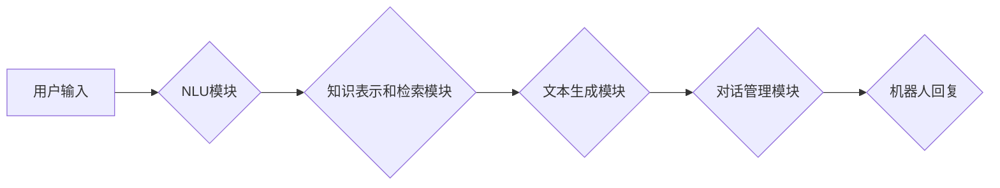

> 大模型、问答机器人、自然语言处理、对话系统、文本生成、机器学习、深度学习、Transformer模型

## 1. 背景介绍

近年来，深度学习技术取得了飞速发展，特别是Transformer模型的出现，为自然语言处理（NLP）领域带来了革命性的变革。大模型问答机器人作为一种基于深度学习的智能对话系统，能够理解用户自然语言输入，并生成流畅、自然的文本回复，在客服、教育、娱乐等领域展现出巨大的应用潜力。

然而，现有的问答机器人往往存在着以下问题：

* **回复缺乏自然度：** 许多问答机器人的回复过于机械、僵硬，缺乏人类对话的自然流畅性。
* **理解能力有限：** 大部分问答机器人只能理解简单的问答结构，难以理解复杂的语义和上下文信息。
* **知识更新困难：** 问答机器人的知识库通常是静态的，难以及时更新和适应新的信息。

为了解决这些问题，研究者们不断探索新的技术和方法，致力于提升大模型问答机器人的自然度。

## 2. 核心概念与联系

大模型问答机器人主要由以下几个核心模块组成：

* **自然语言理解（NLU）模块：** 负责对用户输入的自然语言进行理解，提取关键信息，例如实体、关系和意图。
* **知识表示和检索模块：** 负责将知识存储在结构化的知识图谱中，并根据用户查询进行高效的知识检索。
* **文本生成模块：** 负责根据理解到的信息和知识，生成流畅、自然的文本回复。
* **对话管理模块：** 负责管理对话流程，维护对话上下文，并根据对话状态生成合适的回复。

**Mermaid 流程图**



## 3. 核心算法原理 & 具体操作步骤

### 3.1  算法原理概述

大模型问答机器人的核心算法主要包括：

* **Transformer模型：** 用于自然语言理解和文本生成，能够捕捉长距离依赖关系，提升模型的理解和生成能力。
* **BERT模型：** 用于预训练语言模型，能够理解上下文信息，提升模型的语义理解能力。
* **知识图谱：** 用于存储和组织知识，方便知识检索和推理。

### 3.2  算法步骤详解

1. **用户输入预处理：** 将用户输入的自然语言进行分词、词性标注、命名实体识别等预处理操作，以便后续算法理解。
2. **NLU模块处理：** 使用Transformer模型或BERT模型对预处理后的文本进行分析，提取关键信息，例如实体、关系和意图。
3. **知识检索：** 根据NLU模块提取的信息，在知识图谱中进行知识检索，获取相关知识。
4. **文本生成：** 使用Transformer模型或其他文本生成模型，根据NLU模块提取的信息和知识图谱检索到的知识，生成流畅、自然的文本回复。
5. **对话管理：** 对话管理模块根据对话上下文和用户意图，选择合适的回复，并维护对话状态。

### 3.3  算法优缺点

**优点：**

* 能够理解复杂的语义和上下文信息。
* 能够生成流畅、自然的文本回复。
* 知识库可以不断更新和扩展。

**缺点：**

* 训练成本高，需要大量的训练数据和计算资源。
* 理解能力和生成能力仍然存在局限性。
* 容易受到恶意攻击和数据 poisoning 的影响。

### 3.4  算法应用领域

大模型问答机器人具有广泛的应用前景，例如：

* **客服机器人：** 自动回答用户常见问题，提高客服效率。
* **教育机器人：** 为学生提供个性化的学习辅导，解答学习疑问。
* **娱乐机器人：** 与用户进行自然对话，提供娱乐服务。
* **搜索引擎：** 理解用户搜索意图，提供更精准的搜索结果。

## 4. 数学模型和公式 & 详细讲解 & 举例说明

### 4.1  数学模型构建

大模型问答机器人的数学模型通常基于深度学习框架，例如TensorFlow或PyTorch。模型结构通常包括多层神经网络，例如Transformer模型或BERT模型。

### 4.2  公式推导过程

Transformer模型的核心是注意力机制，其公式如下：

$$
Attention(Q, K, V) = \frac{exp(Q \cdot K^T / \sqrt{d_k})}{exp(Q \cdot K^T / \sqrt{d_k})} \cdot V
$$

其中：

* $Q$：查询矩阵
* $K$：键矩阵
* $V$：值矩阵
* $d_k$：键向量的维度

注意力机制能够捕捉输入序列中不同元素之间的关系，提升模型的理解能力。

### 4.3  案例分析与讲解

例如，在问答任务中，用户输入“北京的首都是什么？”，模型会将“北京”作为查询向量，将“首都”作为键向量，将“北京”的首都信息作为值向量。通过注意力机制，模型能够将“北京”和“首都”这两个词语联系起来，并从知识库中检索到“北京的首都是北京”的信息，最终生成相应的回复。

## 5. 项目实践：代码实例和详细解释说明

### 5.1  开发环境搭建

* Python 3.7+
* TensorFlow 2.0+
* PyTorch 1.0+
* CUDA 10.0+

### 5.2  源代码详细实现

```python
# 导入必要的库
import tensorflow as tf

# 定义Transformer模型
class Transformer(tf.keras.Model):
    def __init__(self, vocab_size, embedding_dim, num_heads, num_layers):
        super(Transformer, self).__init__()
        self.embedding = tf.keras.layers.Embedding(vocab_size, embedding_dim)
        self.transformer_layers = tf.keras.layers.StackedRNNCells([
            tf.keras.layers.MultiHeadAttention(num_heads=num_heads, key_dim=embedding_dim)
            for _ in range(num_layers)
        ])

    def call(self, inputs):
        # 将输入转换为嵌入向量
        embedded_inputs = self.embedding(inputs)
        # 通过Transformer层进行处理
        outputs = self.transformer_layers(embedded_inputs)
        return outputs

# 实例化Transformer模型
model = Transformer(vocab_size=10000, embedding_dim=128, num_heads=8, num_layers=6)

# 训练模型
model.compile(optimizer='adam', loss='mse')
model.fit(train_data, train_labels, epochs=10)
```

### 5.3  代码解读与分析

* 代码首先定义了一个Transformer模型，包含嵌入层、多头注意力层和堆叠的RNN层。
* 嵌入层将输入词语转换为向量表示。
* 多头注意力层能够捕捉输入序列中不同元素之间的关系。
* 堆叠的RNN层能够处理长距离依赖关系。
* 训练模型时，使用Adam优化器和均方误差损失函数。

### 5.4  运行结果展示

训练完成后，模型能够对新的输入进行预测，并生成相应的文本回复。

## 6. 实际应用场景

### 6.1  客服机器人

大模型问答机器人可以用于构建客服机器人，自动回答用户常见问题，例如订单查询、退换货流程等，提高客服效率，降低人工成本。

### 6.2  教育机器人

大模型问答机器人可以用于构建教育机器人，为学生提供个性化的学习辅导，解答学习疑问，例如数学题解、历史事件解释等，提高学习效率，激发学习兴趣。

### 6.3  娱乐机器人

大模型问答机器人可以用于构建娱乐机器人，与用户进行自然对话，提供娱乐服务，例如聊天、故事讲述、游戏等，丰富用户生活，提升娱乐体验。

### 6.4  未来应用展望

随着大模型技术的发展，大模型问答机器人的应用场景将会更加广泛，例如：

* **医疗诊断辅助：** 帮助医生诊断疾病，提供治疗方案建议。
* **法律咨询：** 为用户提供法律咨询服务，解答法律问题。
* **金融理财：** 为用户提供理财建议，帮助用户管理资金。

## 7. 工具和资源推荐

### 7.1  学习资源推荐

* **深度学习课程：** Coursera、edX、Udacity 等平台提供丰富的深度学习课程。
* **Transformer模型论文：** “Attention Is All You Need”
* **BERT模型论文：** “BERT: Pre-training of Deep Bidirectional Transformers for Language Understanding”

### 7.2  开发工具推荐

* **TensorFlow：** Google开发的开源深度学习框架。
* **PyTorch：** Facebook开发的开源深度学习框架。
* **HuggingFace Transformers：** 提供预训练的Transformer模型和工具。

### 7.3  相关论文推荐

* “BERT: Pre-training of Deep Bidirectional Transformers for Language Understanding”
* “Attention Is All You Need”
* “XLNet: Generalized Autoregressive Pretraining for Language Understanding”

## 8. 总结：未来发展趋势与挑战

### 8.1  研究成果总结

近年来，大模型问答机器人取得了显著的进展，能够理解更复杂的语义和上下文信息，生成更流畅、自然的文本回复。

### 8.2  未来发展趋势

* **模型规模更大：** 随着计算资源的不断提升，大模型规模将会进一步扩大，提升模型的理解和生成能力。
* **多模态交互：** 大模型问答机器人将能够理解和生成多种模态信息，例如文本、图像、音频等，实现更丰富的交互体验。
* **个性化定制：** 大模型问答机器人将能够根据用户的个性化需求进行定制，提供更精准、更个性化的服务。

### 8.3  面临的挑战

* **数据安全和隐私保护：** 大模型训练需要大量的训练数据，如何保证数据安全和隐私保护是一个重要的挑战。
* **模型可解释性和信任度：** 大模型的决策过程往往是复杂的，如何提高模型的可解释性和信任度是一个重要的研究方向。
* **伦理问题：** 大模型问答机器人的应用可能会带来一些伦理问题，例如信息操控、偏见放大等，需要引起足够的重视。

### 8.4  研究展望

未来，大模型问答机器人将朝着更智能、更安全、更可靠的方向发展，为人类社会带来更多便利和福祉。

## 9. 附录：常见问题与解答

**Q1：大模型问答机器人与传统问答系统的区别是什么？**

**A1：** 传统问答系统通常基于规则或模板，只能回答预先定义的问题，而大模型问答机器人基于深度学习，能够理解更复杂的语义和上下文信息，并生成更自然、更流畅的文本回复。

**Q2：大模型问答机器人的训练成本很高吗？**

**A2：** 确实，大模型的训练成本较高，需要大量的训练数据和计算资源。

**Q3：大模型问答机器人的安全性如何保证？**

**A3：** 大模型问答机器人的安全性需要从多个方面考虑，例如数据安全、模型安全、攻击防御等。

**Q4：大模型问答机器人的未来发展趋势是什么？**

**A4：** 大模型问答机器人的未来发展趋势包括模型规模更大、多模态交互、个性化定制等。


作者：禅与计算机程序设计艺术 / Zen and the Art of Computer Programming 
<end_of_turn>