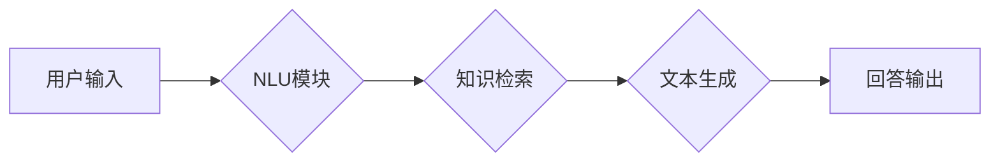

> 大模型、问答机器人、自然语言处理、Transformer、BERT、GPT、知识图谱、语义理解、对话系统

## 1. 背景介绍

近年来，人工智能技术取得了飞速发展，自然语言处理（NLP）领域也取得了突破性进展。大模型问答机器人作为一种新型的智能交互系统，在人们的生活和工作中扮演着越来越重要的角色。它能够理解人类的自然语言，并提供准确、相关和有用的信息，极大地提升了人们与机器的交互体验。

传统的问答系统主要依赖于规则和模板匹配，难以处理复杂、开放式的自然语言问题。而大模型问答机器人则利用深度学习技术，特别是Transformer模型的强大能力，能够学习和理解语言的复杂结构和语义关系，从而实现更准确、更自然的问答。

## 2. 核心概念与联系

大模型问答机器人主要由以下几个核心模块组成：

* **自然语言理解（NLU）模块：**负责将用户输入的自然语言转换为机器可理解的结构化表示，例如词向量、句向量等。
* **知识表示和检索模块：**负责存储和管理知识库，并根据用户查询进行知识检索和推理。
* **文本生成模块：**负责根据检索到的知识和语义理解结果，生成自然流畅的回答文本。
* **对话管理模块：**负责管理对话流程，例如上下文维护、用户意图识别等。

**Mermaid 流程图：**



## 3. 核心算法原理 & 具体操作步骤

### 3.1  算法原理概述

大模型问答机器人的核心算法主要基于Transformer模型，它是一种基于注意力机制的深度神经网络架构，能够有效地捕捉语言的长期依赖关系。

Transformer模型由编码器和解码器两部分组成。编码器负责将输入的自然语言序列转换为隐藏状态表示，解码器则根据编码器的输出生成目标语言序列。

### 3.2  算法步骤详解

1. **词嵌入：**将输入的自然语言词语转换为低维向量表示，例如Word2Vec、GloVe等词嵌入模型。
2. **编码器：**将词向量序列输入到编码器中，通过多层Transformer模块进行处理，最终得到每个词语的隐藏状态表示。
3. **注意力机制：**在编码器和解码器中，注意力机制能够帮助模型关注输入序列中与当前任务最相关的部分，提高模型的理解能力。
4. **解码器：**解码器根据编码器的输出和自身状态，生成目标语言序列，例如回答文本。
5. **损失函数：**使用交叉熵损失函数等，将模型的输出与真实答案进行比较，并反向传播梯度进行模型训练。

### 3.3  算法优缺点

**优点：**

* 能够有效地捕捉语言的长期依赖关系。
* 训练效率高，能够处理大规模的文本数据。
* 在各种自然语言理解任务中表现出色，例如问答、文本摘要、机器翻译等。

**缺点：**

* 模型参数量大，需要大量的计算资源进行训练。
* 训练数据对模型性能有很大影响，需要高质量的训练数据。
* 对长文本序列的处理能力有限。

### 3.4  算法应用领域

大模型问答机器人技术在以下领域具有广泛的应用前景：

* **客服机器人：**自动回答用户常见问题，提高客服效率。
* **教育机器人：**为学生提供个性化的学习辅导和知识解答。
* **搜索引擎：**提供更准确、更相关的搜索结果。
* **医疗诊断：**辅助医生进行疾病诊断和治疗方案建议。

## 4. 数学模型和公式 & 详细讲解 & 举例说明

### 4.1  数学模型构建

Transformer模型的核心是注意力机制，它通过计算词语之间的相关性，赋予每个词语不同的权重，从而更好地理解句子结构和语义关系。

**注意力机制公式：**

$$
Attention(Q, K, V) = softmax(\frac{QK^T}{\sqrt{d_k}})V
$$

其中：

* $Q$：查询矩阵
* $K$：键矩阵
* $V$：值矩阵
* $d_k$：键向量的维度
* $softmax$：softmax函数

### 4.2  公式推导过程

注意力机制的公式可以理解为计算每个词语与其他词语之间的相关性，并根据相关性赋予每个词语不同的权重。

首先，将查询矩阵 $Q$ 与键矩阵 $K$ 进行矩阵乘法，得到一个得分矩阵。然后，对得分矩阵进行softmax归一化，得到每个词语与其他词语的相关性权重。最后，将权重与值矩阵 $V$ 进行加权求和，得到每个词语的最终表示。

### 4.3  案例分析与讲解

例如，对于句子“我爱吃苹果”，我们可以使用注意力机制计算每个词语与其他词语之间的相关性。

* “我”与“爱”的相关性较高，因为它们是主语和谓语。
* “我”与“苹果”的相关性较低，因为它们不是直接相关的词语。

通过注意力机制，模型能够更好地理解句子结构和语义关系，从而提高问答的准确性。

## 5. 项目实践：代码实例和详细解释说明

### 5.1  开发环境搭建

* Python 3.7+
* TensorFlow/PyTorch
* CUDA/cuDNN

### 5.2  源代码详细实现

```python
# 导入必要的库
import tensorflow as tf

# 定义Transformer模型
class Transformer(tf.keras.Model):
    def __init__(self, vocab_size, embedding_dim, num_heads, num_layers):
        super(Transformer, self).__init__()
        self.embedding = tf.keras.layers.Embedding(vocab_size, embedding_dim)
        self.transformer_layers = [
            tf.keras.layers.MultiHeadAttention(num_heads=num_heads, key_dim=embedding_dim)
            for _ in range(num_layers)
        ]
        self.dense = tf.keras.layers.Dense(vocab_size)

    def call(self, inputs):
        # 词嵌入
        embeddings = self.embedding(inputs)
        # Transformer层处理
        for layer in self.transformer_layers:
            embeddings = layer(embeddings)
        # 全连接层输出
        outputs = self.dense(embeddings)
        return outputs

# 实例化模型
model = Transformer(vocab_size=10000, embedding_dim=128, num_heads=8, num_layers=6)

# 训练模型
model.compile(optimizer='adam', loss='sparse_categorical_crossentropy', metrics=['accuracy'])
model.fit(train_data, train_labels, epochs=10)
```

### 5.3  代码解读与分析

* **词嵌入层：**将词语转换为低维向量表示。
* **Transformer层：**利用多头注意力机制和前馈神经网络，捕捉语言的复杂结构和语义关系。
* **全连接层：**将Transformer层的输出转换为目标语言序列。

### 5.4  运行结果展示

训练完成后，模型能够对新的输入文本进行理解和回答。

## 6. 实际应用场景

### 6.1  客服机器人

大模型问答机器人可以用于构建智能客服机器人，自动回答用户常见问题，例如订单查询、退换货流程等，提高客服效率和用户体验。

### 6.2  教育机器人

大模型问答机器人可以用于构建教育机器人，为学生提供个性化的学习辅导和知识解答，例如帮助学生理解课本内容、解答作业问题等。

### 6.3  搜索引擎

大模型问答机器人可以用于改进搜索引擎，提供更准确、更相关的搜索结果，例如理解用户搜索意图，并返回更符合用户需求的答案。

### 6.4  未来应用展望

随着大模型技术的发展，大模型问答机器人将在更多领域得到应用，例如医疗诊断、法律咨询、金融分析等。

## 7. 工具和资源推荐

### 7.1  学习资源推荐

* **书籍：**
    * 《深度学习》
    * 《自然语言处理》
* **在线课程：**
    * Coursera：自然语言处理
    * edX：深度学习
* **博客和论坛：**
    * Hugging Face
    * TensorFlow Blog

### 7.2  开发工具推荐

* **TensorFlow：**开源深度学习框架
* **PyTorch：**开源深度学习框架
* **Hugging Face Transformers：**预训练大模型库

### 7.3  相关论文推荐

* **BERT：** Devlin et al. (2018)
* **GPT：** Radford et al. (2019)
* **T5：** Raffel et al. (2019)

## 8. 总结：未来发展趋势与挑战

### 8.1  研究成果总结

大模型问答机器人技术取得了显著进展，能够处理更复杂、更开放式的自然语言问题，并展现出强大的应用潜力。

### 8.2  未来发展趋势

* **模型规模和能力的提升：**未来将会有更大规模、更强大的大模型问答机器人出现，能够处理更复杂的任务。
* **多模态交互：**大模型问答机器人将与其他模态信息，例如图像、音频等进行融合，实现更丰富的交互体验。
* **个性化定制：**大模型问答机器人将能够根据用户的个性化需求进行定制，提供更精准、更有效的服务。

### 8.3  面临的挑战

* **数据获取和标注：**大模型训练需要大量的优质数据，数据获取和标注仍然是一个挑战。
* **模型解释性和可解释性：**大模型的决策过程往往难以理解，如何提高模型的解释性和可解释性是一个重要问题。
* **伦理和安全问题：**大模型问答机器人可能存在偏见、误导和攻击等问题，需要关注伦理和安全问题。

### 8.4  研究展望

未来，大模型问答机器人技术将继续发展，为人们的生活和工作带来更多便利和价值。

## 9. 附录：常见问题与解答

### 9.1  常见问题

* **大模型问答机器人与传统问答系统的区别是什么？**
* **大模型问答机器人的训练数据有哪些？**
* **大模型问答机器人的应用场景有哪些？**

### 9.2  解答

* **大模型问答机器人与传统问答系统的区别：**传统问答系统主要依赖于规则和模板匹配，难以处理复杂、开放式的自然语言问题。而大模型问答机器人则利用深度学习技术，特别是Transformer模型的强大能力，能够学习和理解语言的复杂结构和语义关系，从而实现更准确、更自然的问答。
* **大模型问答机器人的训练数据：**大模型问答机器人的训练数据通常包括大量的文本数据，例如书籍、文章、对话等。
* **大模型问答机器人的应用场景：**大模型问答机器人可以应用于客服机器人、教育机器人、搜索引擎、医疗诊断、法律咨询、金融分析等多个领域。


作者：禅与计算机程序设计艺术 / Zen and the Art of Computer Programming 
<end_of_turn>