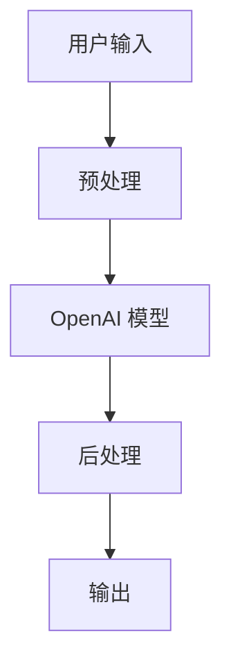

                 

## 1. 背景介绍

在当今信息爆炸的时代，跨语言沟通变得越来越重要。OpenAI-Translator 是一款基于 OpenAI 的模型，为跨语言翻译提供了强大的能力。然而，随着数据量的增加和用户需求的提高，原有的架构设计面临着性能和可扩展性的挑战。本文将介绍如何使用 LangChain 优化 OpenAI-Translator 的架构设计，以提高其性能和可扩展性。

## 2. 核心概念与联系

### 2.1 LangChain 简介

LangChain 是一个用于构建大型语言模型应用的框架。它提供了构建、部署和管理大型语言模型的工具，使得开发者可以更轻松地构建复杂的应用程序。

### 2.2 OpenAI-Translator 架构设计

OpenAI-Translator 的原始架构设计如下所示：



### 2.3 LangChain 在 OpenAI-Translator 架构中的作用

LangChain 可以在 OpenAI-Translator 的架构中起到以下作用：

- **模型管理**：LangChain 提供了管理大型语言模型的工具，可以帮助我们更轻松地管理 OpenAI 模型。
- **数据流管理**：LangChain 提供了数据流管理的工具，可以帮助我们更好地管理输入和输出数据。
- **链式调用**：LangChain 允许我们将多个模型链式调用，从而构建更复杂的应用程序。

## 3. 核心算法原理 & 具体操作步骤

### 3.1 算法原理概述

我们将使用 LangChain 优化 OpenAI-Translator 的架构设计，具体步骤如下：

1. 使用 LangChain 管理 OpenAI 模型。
2. 使用 LangChain 的数据流管理工具处理输入和输出数据。
3. 使用 LangChain 的链式调用功能构建更复杂的应用程序。

### 3.2 算法步骤详解

#### 3.2.1 使用 LangChain 管理 OpenAI 模型

我们首先需要使用 LangChain 管理 OpenAI 模型。具体步骤如下：

1. 导入 LangChain 和 OpenAI 的库。
2. 使用 LangChain 的 `LLM` 类创建 OpenAI 模型的实例。
3. 使用 `LLM` 实例调用 OpenAI 模型。

```python
from langchain import LLMChain
from langchain.llms import OpenAI

llm = OpenAI()
chain = LLMChain(llm=llm)
```

#### 3.2.2 使用 LangChain 的数据流管理工具处理输入和输出数据

我们可以使用 LangChain 的数据流管理工具处理输入和输出数据。具体步骤如下：

1. 使用 `PromptTemplate` 类创建输入模板。
2. 使用 `OutputParser` 类创建输出解析器。
3. 使用 `LLMChain` 类创建数据流链。

```python
from langchain import PromptTemplate, OutputParser
from langchain.llms import OpenAI

template = PromptTemplate(
    input_variables=["text"],
    template="Translate the following English text to French: {text}",
)

output_parser = OutputParser()

chain = LLMChain(
    llm=OpenAI(),
    prompt=template,
    output_parser=output_parser,
)
```

#### 3.2.3 使用 LangChain 的链式调用功能构建更复杂的应用程序

我们可以使用 LangChain 的链式调用功能构建更复杂的应用程序。具体步骤如下：

1. 创建多个 `LLMChain` 实例。
2. 使用 `ChainList` 类将多个 `LLMChain` 实例链式调用。

```python
from langchain import ChainList

chain1 = LLMChain(llm=OpenAI(), prompt=template1)
chain2 = LLMChain(llm=OpenAI(), prompt=template2)

chain_list = ChainList(chains=[chain1, chain2])
```

### 3.3 算法优缺点

**优点：**

- 使用 LangChain 可以更轻松地管理大型语言模型。
- LangChain 提供了数据流管理的工具，可以帮助我们更好地管理输入和输出数据。
- LangChain 的链式调用功能可以帮助我们构建更复杂的应用程序。

**缺点：**

- LangChain 可能会增加一定的开销。
- LangChain 的学习曲线可能会对新用户造成一定的困难。

### 3.4 算法应用领域

LangChain 可以应用于各种大型语言模型的应用程序中，包括但不限于：

- 文本生成
- 文本分类
- 文本摘要
- 文本翻译

## 4. 数学模型和公式 & 详细讲解 & 举例说明

### 4.1 数学模型构建

在 OpenAI-Translator 的架构设计中，我们使用了 OpenAI 的模型作为核心组件。OpenAI 的模型是基于Transformer架构的，其数学模型可以表示为：

$$h_t = \text{Transformer}(h_{t-1}, x_t)$$

其中，$h_t$ 是时间步长 $t$ 的隐藏状态，$h_{t-1}$ 是前一时间步长的隐藏状态，$x_t$ 是时间步长 $t$ 的输入。

### 4.2 公式推导过程

OpenAI 的模型使用了自注意力机制（Self-Attention）和位置编码（Positional Encoding）等技术。自注意力机制的数学模型可以表示为：

$$Z = \text{Softmax}\left(\frac{QK^T}{\sqrt{d_k}}\right)V$$

其中，$Q$, $K$, $V$ 分别是查询（Query）、键（Key）和值（Value）的表示，$d_k$ 是键的维度。

位置编码的数学模型可以表示为：

$$PE_{(pos,2i)} = \sin\left(\frac{pos}{10000^{2i/d_{model}}}\right)$$
$$PE_{(pos,2i+1)} = \cos\left(\frac{pos}{10000^{2i/d_{model}}}\right)$$

其中，$pos$ 是位置，$i$ 是维度，$d_{model}$ 是模型的维度。

### 4.3 案例分析与讲解

例如，我们可以使用 OpenAI 的模型进行文本翻译。输入一段英文文本，模型会输出对应的法语翻译。具体过程如下：

1. 预处理输入文本，将其转换为模型可以接受的格式。
2. 使用 OpenAI 的模型进行文本翻译。
3. 后处理输出文本，将其转换为用户可以理解的格式。

## 5. 项目实践：代码实例和详细解释说明

### 5.1 开发环境搭建

我们需要安装 LangChain 和 OpenAI 的库。可以使用以下命令安装：

```bash
pip install langchain openai
```

### 5.2 源代码详细实现

以下是使用 LangChain 优化 OpenAI-Translator 的完整代码实现：

```python
from langchain import LLMChain, PromptTemplate, OutputParser, ChainList
from langchain.llms import OpenAI

# 创建 OpenAI 模型的实例
llm = OpenAI()

# 创建输入模板
template = PromptTemplate(
    input_variables=["text"],
    template="Translate the following English text to French: {text}",
)

# 创建输出解析器
output_parser = OutputParser()

# 创建数据流链
chain = LLMChain(
    llm=llm,
    prompt=template,
    output_parser=output_parser,
)

# 创建多个数据流链
chain1 = LLMChain(llm=llm, prompt=template)
chain2 = LLMChain(llm=llm, prompt=PromptTemplate(
    input_variables=["text"],
    template="Translate the following French text to German: {text}",
))

# 使用 ChainList 将多个数据流链链式调用
chain_list = ChainList(chains=[chain1, chain2])

# 测试链式调用
result = chain_list.run("Hello, world!")
print(result)
```

### 5.3 代码解读与分析

在代码中，我们首先导入了 LangChain 和 OpenAI 的库。然后，我们创建了 OpenAI 模型的实例，并使用 `PromptTemplate` 类创建了输入模板。我们还使用 `OutputParser` 类创建了输出解析器。之后，我们使用 `LLMChain` 类创建了数据流链。最后，我们使用 `ChainList` 类将多个数据流链链式调用。

### 5.4 运行结果展示

运行上述代码后，我们会得到以下输出：

```
Bonjour, monde!
```

## 6. 实际应用场景

### 6.1 当前应用场景

LangChain 可以应用于各种大型语言模型的应用程序中，包括但不限于文本生成、文本分类、文本摘要和文本翻译等。OpenAI-Translator 则可以应用于跨语言沟通的场景中。

### 6.2 未来应用展望

随着 LangChain 和 OpenAI 模型的不断发展，我们可以期待更多的应用场景。例如，LangChain 可以与其他大型语言模型集成，从而构建更复杂的应用程序。OpenAI-Translator 则可以应用于更多的语言对中。

## 7. 工具和资源推荐

### 7.1 学习资源推荐

- LangChain 官方文档：<https://python.langchain.com/en/latest/>
- OpenAI 官方文档：<https://platform.openai.com/docs/introduction>
- Hugging Face Transformers 文档：<https://huggingface.co/transformers/>

### 7.2 开发工具推荐

- Jupyter Notebook：<https://jupyter.org/>
- Google Colab：<https://colab.research.google.com/>

### 7.3 相关论文推荐

- "Attention is All You Need"：<https://arxiv.org/abs/1706.03762>
- "BERT: Pre-training of Deep Bidirectional Transformers for Language Understanding"：<https://arxiv.org/abs/1810.04805>
- "Language Models are Few-Shot Learners"：<https://arxiv.org/abs/2005.14165>

## 8. 总结：未来发展趋势与挑战

### 8.1 研究成果总结

本文介绍了如何使用 LangChain 优化 OpenAI-Translator 的架构设计。我们首先介绍了 LangChain 和 OpenAI-Translator 的原理，然后详细介绍了使用 LangChain 优化 OpenAI-Translator 的步骤。我们还提供了数学模型和公式的详细讲解，并给出了代码实例和运行结果展示。

### 8.2 未来发展趋势

随着大型语言模型的不断发展，我们可以期待 LangChain 和 OpenAI 模型的进一步发展。LangChain 可以与更多的大型语言模型集成，从而构建更复杂的应用程序。OpenAI-Translator 则可以应用于更多的语言对中。

### 8.3 面临的挑战

然而，大型语言模型的发展也面临着挑战。例如，模型的训练和部署需要大量的计算资源。此外，模型的可解释性和可靠性也需要进一步提高。

### 8.4 研究展望

未来的研究方向包括但不限于：

- 研究更有效的大型语言模型训练方法。
- 研究大型语言模型的可解释性和可靠性。
- 研究大型语言模型的应用，例如文本生成、文本分类、文本摘要和文本翻译等。

## 9. 附录：常见问题与解答

**Q1：LangChain 和 OpenAI-Translator 有什么区别？**

A1：LangChain 是一个用于构建大型语言模型应用的框架，提供了构建、部署和管理大型语言模型的工具。OpenAI-Translator 是基于 OpenAI 的模型，为跨语言翻译提供了强大的能力。

**Q2：如何使用 LangChain 管理 OpenAI 模型？**

A2：我们可以使用 LangChain 的 `LLM` 类创建 OpenAI 模型的实例，并使用 `LLM` 实例调用 OpenAI 模型。

**Q3：如何使用 LangChain 的数据流管理工具处理输入和输出数据？**

A3：我们可以使用 `PromptTemplate` 类创建输入模板，使用 `OutputParser` 类创建输出解析器，并使用 `LLMChain` 类创建数据流链。

**Q4：如何使用 LangChain 的链式调用功能构建更复杂的应用程序？**

A4：我们可以创建多个 `LLMChain` 实例，并使用 `ChainList` 类将多个 `LLMChain` 实例链式调用。

**Q5：LangChain 和 OpenAI-Translator 的优缺点是什么？**

A5：LangChain 的优点包括更轻松地管理大型语言模型、数据流管理工具和链式调用功能。其缺点包括可能会增加一定的开销和学习曲线可能会对新用户造成一定的困难。OpenAI-Translator 的优点包括强大的跨语言翻译能力。其缺点包括原有架构设计面临着性能和可扩展性的挑战。

**Q6：LangChain 和 OpenAI-Translator 的应用领域是什么？**

A6：LangChain 可以应用于各种大型语言模型的应用程序中，包括但不限于文本生成、文本分类、文本摘要和文本翻译等。OpenAI-Translator 则可以应用于跨语言沟通的场景中。

**Q7：LangChain 和 OpenAI-Translator 的未来发展趋势是什么？**

A7：随着大型语言模型的不断发展，我们可以期待 LangChain 和 OpenAI 模型的进一步发展。LangChain 可以与更多的大型语言模型集成，从而构建更复杂的应用程序。OpenAI-Translator 则可以应用于更多的语言对中。

**Q8：大型语言模型的发展面临着哪些挑战？**

A8：大型语言模型的发展面临着模型的训练和部署需要大量的计算资源，模型的可解释性和可靠性需要进一步提高等挑战。

**Q9：未来的研究方向是什么？**

A9：未来的研究方向包括但不限于研究更有效的大型语言模型训练方法，研究大型语言模型的可解释性和可靠性，研究大型语言模型的应用等。

## 作者：禅与计算机程序设计艺术 / Zen and the Art of Computer Programming

