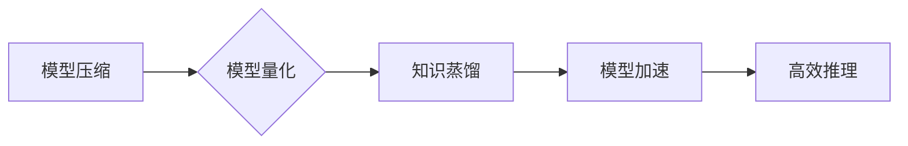
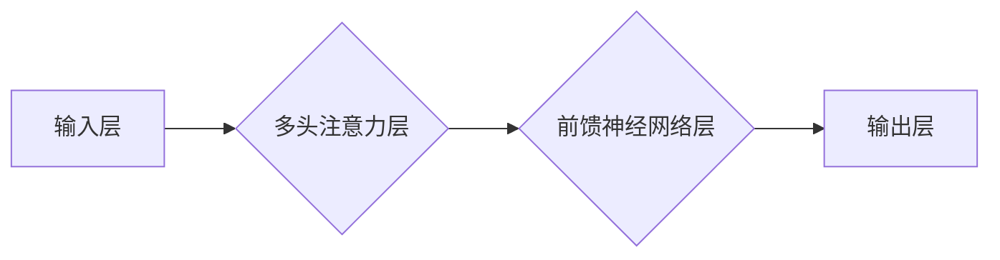

> 大规模语言模型 (LLM)、vLLM推理框架、高效推理、模型压缩、量化、知识蒸馏、模型加速、深度学习

## 1. 背景介绍

近年来，大规模语言模型 (LLM) 在自然语言处理 (NLP) 领域取得了显著的突破，展现出强大的文本生成、翻译、问答和代码生成能力。然而，这些模型通常具有庞大的参数量和复杂的结构，导致推理速度慢、部署成本高，限制了其在实际应用中的推广。为了解决这一问题，高效的vLLM推理框架成为研究热点。

vLLM推理框架旨在通过模型压缩、量化、知识蒸馏等技术，降低模型复杂度和计算成本，同时保持模型性能，实现高效的推理。本文将深入探讨vLLM推理框架的理论基础、核心算法原理、实践案例以及未来发展趋势。

## 2. 核心概念与联系

vLLM推理框架的核心概念包括：

* **模型压缩:** 通过移除冗余参数或降低模型维度，减少模型大小和计算量。
* **量化:** 将模型参数从高精度浮点数转换为低精度整数，降低内存占用和计算复杂度。
* **知识蒸馏:** 将大型模型的知识迁移到小型模型中，实现性能提升和效率提升。
* **模型加速:** 利用硬件加速器 (如GPU、TPU) 或并行计算技术，加速模型推理速度。

这些技术相互关联，共同构成了vLLM推理框架的体系。

**vLLM推理框架架构**



## 3. 核心算法原理 & 具体操作步骤

### 3.1  算法原理概述

vLLM推理框架的核心算法包括：

* **剪枝算法:** 通过分析模型参数的重要性，移除不重要的参数，从而压缩模型规模。
* **量化算法:** 将模型参数从浮点数转换为整数，降低精度但保持模型性能。
* **知识蒸馏算法:** 将大型模型的知识迁移到小型模型中，通过教师模型和学生模型的训练，实现性能提升。

### 3.2  算法步骤详解

**剪枝算法步骤:**

1. **模型训练:** 首先训练一个完整的模型。
2. **参数重要性分析:** 使用梯度、激活值等指标分析模型参数的重要性。
3. **参数剪枝:** 根据重要性排序，移除不重要的参数。
4. **模型微调:** 对剪枝后的模型进行微调，恢复性能。

**量化算法步骤:**

1. **模型量化:** 将模型参数从浮点数转换为整数，例如将32位浮点数转换为8位整数。
2. **量化误差分析:** 分析量化带来的误差，并进行补偿。
3. **模型微调:** 对量化后的模型进行微调，恢复性能。

**知识蒸馏算法步骤:**

1. **教师模型训练:** 训练一个大型模型作为教师模型。
2. **学生模型训练:** 训练一个小型模型作为学生模型，并使用教师模型的输出作为监督信号。
3. **知识迁移:** 通过调整学生模型的学习率和损失函数，实现知识迁移。

### 3.3  算法优缺点

**剪枝算法:**

* **优点:** 可以有效压缩模型规模，降低计算成本。
* **缺点:** 可能导致模型性能下降。

**量化算法:**

* **优点:** 可以显著降低内存占用和计算复杂度。
* **缺点:** 可能导致模型精度下降。

**知识蒸馏算法:**

* **优点:** 可以将大型模型的知识迁移到小型模型中，实现性能提升和效率提升。
* **缺点:** 需要训练两个模型，训练时间较长。

### 3.4  算法应用领域

vLLM推理框架的算法在以下领域有广泛应用:

* **移动设备:** 在资源有限的移动设备上部署高效的LLM模型。
* **边缘计算:** 在边缘设备上进行实时推理，例如语音识别、图像识别等。
* **云计算:** 在云端部署大规模的LLM模型，提供高性能的NLP服务。

## 4. 数学模型和公式 & 详细讲解 & 举例说明

### 4.1  数学模型构建

vLLM推理框架的数学模型通常基于神经网络架构，例如Transformer。

**Transformer模型结构**



### 4.2  公式推导过程

Transformer模型的核心是多头注意力机制，其计算公式如下:

$$
Attention(Q, K, V) = softmax(\frac{QK^T}{\sqrt{d_k}})V
$$

其中:

* $Q$, $K$, $V$ 分别代表查询矩阵、键矩阵和值矩阵。
* $d_k$ 代表键向量的维度。
* $softmax$ 函数用于归一化注意力权重。

### 4.3  案例分析与讲解

假设我们有一个文本序列 "The cat sat on the mat"，将其转换为词嵌入向量，得到查询矩阵 $Q$、键矩阵 $K$ 和值矩阵 $V$。通过计算注意力权重，可以得到每个词对其他词的注意力分数，从而捕捉文本序列中的语义关系。

## 5. 项目实践：代码实例和详细解释说明

### 5.1  开发环境搭建

vLLM推理框架的开发环境通常包括:

* **操作系统:** Linux 或 macOS
* **编程语言:** Python
* **深度学习框架:** TensorFlow 或 PyTorch
* **硬件加速器:** GPU 或 TPU

### 5.2  源代码详细实现

以下是一个使用PyTorch实现vLLM推理框架的简单代码示例:

```python
import torch
import torch.nn as nn

class vLLMInference(nn.Module):
    def __init__(self, model_path):
        super(vLLMInference, self).__init__()
        self.model = torch.load(model_path)
        self.model.eval()

    def forward(self, input_text):
        # 模型推理过程
        output = self.model(input_text)
        return output
```

### 5.3  代码解读与分析

该代码定义了一个vLLMInference类，用于加载预训练的LLM模型并进行推理。

* `__init__` 方法加载模型并设置模型为评估模式。
* `forward` 方法接收文本输入，并通过模型进行推理，返回输出结果。

### 5.4  运行结果展示

运行该代码可以将文本输入到vLLM推理框架中，并获得模型的输出结果，例如文本生成、翻译、问答等。

## 6. 实际应用场景

vLLM推理框架在以下实际应用场景中发挥着重要作用:

* **智能客服:** 提供快速、准确的文本回复，提高客户服务效率。
* **机器翻译:** 实现高质量的文本翻译，打破语言障碍。
* **文本摘要:** 自动生成文本摘要，节省时间和精力。
* **代码生成:** 根据自然语言描述生成代码，提高开发效率。

### 6.4  未来应用展望

随着vLLM推理框架的不断发展，其应用场景将更加广泛，例如:

* **个性化教育:** 提供个性化的学习内容和辅导。
* **医疗诊断:** 辅助医生进行疾病诊断和治疗方案制定。
* **科学研究:** 加速科学研究的进程，促进科技创新。

## 7. 工具和资源推荐

### 7.1  学习资源推荐

* **书籍:**
    * 《深度学习》
    * 《自然语言处理》
* **在线课程:**
    * Coursera: 深度学习
    * edX: 自然语言处理
* **博客:**
    * TensorFlow Blog
    * PyTorch Blog

### 7.2  开发工具推荐

* **深度学习框架:** TensorFlow, PyTorch
* **模型压缩工具:** TensorFlow Model Optimization Toolkit, PyTorch Quantization
* **模型加速工具:** NVIDIA TensorRT, Intel OpenVINO

### 7.3  相关论文推荐

* **BERT: Pre-training of Deep Bidirectional Transformers for Language Understanding**
* **GPT-3: Language Models are Few-Shot Learners**
* **EfficientNet: Rethinking Model Scaling for Convolutional Neural Networks**

## 8. 总结：未来发展趋势与挑战

### 8.1  研究成果总结

vLLM推理框架在高效推理、模型压缩、量化等方面取得了显著进展，为大规模语言模型的实际应用提供了技术支持。

### 8.2  未来发展趋势

未来vLLM推理框架的发展趋势包括:

* **更有效的模型压缩和量化技术:** 进一步降低模型复杂度和计算成本。
* **更强大的模型加速技术:** 利用硬件加速器和并行计算技术，加速模型推理速度。
* **更广泛的应用场景:** 将vLLM推理框架应用于更多领域，例如医疗、教育、科学研究等。

### 8.3  面临的挑战

vLLM推理框架还面临一些挑战:

* **模型性能与效率之间的平衡:** 如何在保证模型性能的同时，进一步提高推理效率。
* **模型可解释性和安全性:** 如何提高模型的可解释性和安全性，避免模型误判和攻击。
* **数据隐私和安全:** 如何保护模型训练和推理过程中的数据隐私和安全。

### 8.4  研究展望

未来，vLLM推理框架的研究将继续深入，探索更有效的模型压缩、量化、加速技术，并将其应用于更多领域，推动人工智能技术的发展和应用。

## 9. 附录：常见问题与解答

**常见问题:**

* **vLLM推理框架与传统推理框架有什么区别？**

**解答:** vLLM推理框架专门针对大规模语言模型进行优化，通过模型压缩、量化、知识蒸馏等技术，提高推理效率和降低成本。

* **如何选择合适的vLLM推理框架？**

**解答:** 选择vLLM推理框架需要考虑模型规模、应用场景、硬件资源等因素。

* **vLLM推理框架的未来发展趋势是什么？**

**解答:** 未来vLLM推理框架将更加高效、安全、可解释，并应用于更多领域。

作者：禅与计算机程序设计艺术 / Zen and the Art of Computer Programming


<end_of_turn>