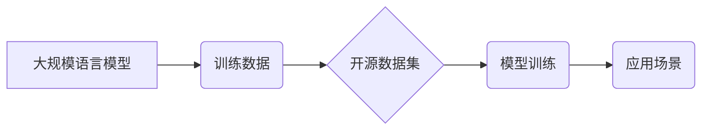

> 大规模语言模型，开源数据集，自然语言处理，深度学习，Transformer，预训练模型，迁移学习

## 1. 背景介绍

近年来，深度学习技术取得了飞速发展，特别是大规模语言模型（Large Language Models，LLMs）的出现，为自然语言处理（Natural Language Processing，NLP）领域带来了革命性的变革。LLMs 拥有强大的文本生成、理解和翻译能力，在聊天机器人、机器翻译、文本摘要等众多应用场景中展现出巨大的潜力。

开源数据集在推动LLMs发展中扮演着至关重要的角色。高质量的训练数据是LLMs训练和优化的基础，而开源数据集使得研究人员和开发者能够更便捷地获取和利用这些数据，加速LLMs的创新和应用。

## 2. 核心概念与联系

**2.1 大规模语言模型 (LLMs)**

LLMs是指参数量巨大、训练数据海量的人工智能模型，能够理解和生成人类语言。它们通常基于Transformer架构，并通过大量的文本数据进行预训练，学习到丰富的语言知识和模式。

**2.2 开源数据集**

开源数据集是指可以免费获取和使用的文本数据集合。这些数据集通常包含各种类型的文本，例如书籍、文章、对话、代码等，并经过清洗、标注等处理，方便用于机器学习模型的训练和评估。

**2.3 关系图**



**2.4 核心概念联系**

LLMs的训练和应用离不开高质量的训练数据，而开源数据集为LLMs提供了丰富的训练资源。通过利用开源数据集，研究人员和开发者能够更便捷地训练和评估LLMs，推动LLMs技术的发展和应用。

## 3. 核心算法原理 & 具体操作步骤

**3.1 算法原理概述**

LLMs的核心算法是Transformer架构，它是一种基于注意力机制的深度神经网络结构。Transformer能够有效地捕捉文本序列中的长距离依赖关系，从而实现更准确的语言理解和生成。

**3.2 算法步骤详解**

1. **词嵌入:** 将文本中的每个词转换为向量表示，以便模型能够理解词语的语义信息。
2. **编码器:** 使用多层Transformer编码器对输入文本序列进行编码，提取文本的语义特征。
3. **解码器:** 使用多层Transformer解码器对编码后的文本序列进行解码，生成目标文本序列。
4. **注意力机制:** Transformer模型中广泛应用注意力机制，能够帮助模型关注输入序列中与当前任务相关的关键信息，提高模型的理解和生成能力。

**3.3 算法优缺点**

**优点:**

* 能够有效地捕捉文本序列中的长距离依赖关系。
* 训练速度快，能够处理海量文本数据。
* 在各种NLP任务中表现出色，例如机器翻译、文本摘要、问答系统等。

**缺点:**

* 参数量巨大，需要大量的计算资源进行训练。
* 训练数据对模型性能影响很大，需要高质量的训练数据才能获得良好的效果。

**3.4 算法应用领域**

LLMs在以下领域具有广泛的应用前景:

* **自然语言理解:** 文本分类、情感分析、问答系统、文本摘要等。
* **自然语言生成:** 机器翻译、对话系统、文本创作、代码生成等。
* **其他领域:** 搜索引擎优化、知识图谱构建、数据分析等。

## 4. 数学模型和公式 & 详细讲解 & 举例说明

**4.1 数学模型构建**

LLMs通常使用基于Transformer的深度神经网络模型，其数学模型可以表示为一个多层的神经网络结构，其中每一层包含编码器和解码器模块。

**4.2 公式推导过程**

Transformer模型的核心是注意力机制，其计算公式如下：

$$
Attention(Q, K, V) = softmax(\frac{QK^T}{\sqrt{d_k}})V
$$

其中：

* $Q$：查询矩阵
* $K$：键矩阵
* $V$：值矩阵
* $d_k$：键向量的维度
* $softmax$：softmax函数

**4.3 案例分析与讲解**

假设我们有一个句子“我爱学习编程”，将其转换为词向量表示，然后使用注意力机制计算每个词与其他词之间的相关性。

通过注意力机制的计算，我们可以发现“学习”和“编程”这两个词之间的相关性较高，因为它们共同构成了一个语义单元。

## 5. 项目实践：代码实例和详细解释说明

**5.1 开发环境搭建**

* Python 3.7+
* PyTorch 1.7+
* CUDA 10.2+

**5.2 源代码详细实现**

```python
import torch
import torch.nn as nn

class Transformer(nn.Module):
    def __init__(self, vocab_size, embedding_dim, num_heads, num_layers):
        super(Transformer, self).__init__()
        self.embedding = nn.Embedding(vocab_size, embedding_dim)
        self.encoder_layers = nn.ModuleList([EncoderLayer(embedding_dim, num_heads) for _ in range(num_layers)])
        self.decoder_layers = nn.ModuleList([DecoderLayer(embedding_dim, num_heads) for _ in range(num_layers)])

    def forward(self, src, tgt):
        src = self.embedding(src)
        tgt = self.embedding(tgt)
        # ... (编码器和解码器逻辑)
```

**5.3 代码解读与分析**

* `Transformer`类定义了Transformer模型的结构，包括嵌入层、编码器层和解码器层。
* `EncoderLayer`和`DecoderLayer`分别定义了编码器和解码器中的每一层结构。
* `forward`方法定义了模型的输入和输出，并执行了编码和解码过程。

**5.4 运行结果展示**

通过训练和评估Transformer模型，我们可以观察模型在各种NLP任务上的性能，例如机器翻译、文本摘要等。

## 6. 实际应用场景

**6.1 聊天机器人**

LLMs可以用于构建更智能、更自然的聊天机器人，能够理解用户的意图并提供更准确的回复。

**6.2 机器翻译**

LLMs可以用于实现更高质量的机器翻译，能够更好地捕捉语言的语义和文化差异。

**6.3 文本摘要**

LLMs可以用于自动生成文本摘要，能够提取文本的关键信息并生成简洁的概括。

**6.4 未来应用展望**

LLMs在未来将有更广泛的应用场景，例如：

* **个性化教育:** 根据学生的学习进度和需求提供个性化的学习内容和辅导。
* **医疗诊断:** 辅助医生进行疾病诊断，提高诊断准确率。
* **法律服务:** 自动分析法律文件，提供法律建议。

## 7. 工具和资源推荐

**7.1 学习资源推荐**

* **论文:**
    * Attention Is All You Need (Vaswani et al., 2017)
    * BERT: Pre-training of Deep Bidirectional Transformers for Language Understanding (Devlin et al., 2018)
    * GPT-3: Language Models are Few-Shot Learners (Brown et al., 2020)
* **书籍:**
    * Deep Learning (Goodfellow et al., 2016)
    * Natural Language Processing with Python (Bird et al., 2009)

**7.2 开发工具推荐**

* **PyTorch:** 深度学习框架
* **TensorFlow:** 深度学习框架
* **Hugging Face Transformers:** 预训练模型库

**7.3 相关论文推荐**

* **BERT:** https://arxiv.org/abs/1810.04805
* **GPT-3:** https://arxiv.org/abs/2005.14165
* **T5:** https://arxiv.org/abs/1910.10683

## 8. 总结：未来发展趋势与挑战

**8.1 研究成果总结**

近年来，LLMs取得了显著的进展，在各种NLP任务中取得了优异的性能。开源数据集为LLMs的发展提供了重要的支持，促进了模型的创新和应用。

**8.2 未来发展趋势**

* **模型规模更大:** 随着计算资源的不断提升，LLMs的规模将继续扩大，模型能力将进一步增强。
* **多模态学习:** LLMs将与其他模态数据（例如图像、音频）进行融合，实现更全面的理解和生成能力。
* **可解释性增强:** 研究人员将致力于提高LLMs的可解释性，使模型的决策过程更加透明。

**8.3 面临的挑战**

* **数据偏见:** LLMs的训练数据可能存在偏见，导致模型输出结果存在偏差。
* **安全风险:** LLMs可能被用于生成虚假信息、进行恶意攻击等。
* **伦理问题:** LLMs的应用引发了伦理问题，例如数据隐私、算法公平性等。

**8.4 研究展望**

未来，LLMs的研究将继续深入，探索更强大的模型架构、更有效的训练方法和更广泛的应用场景。同时，也将更加重视LLMs的安全性、可解释性和伦理问题，确保其健康可持续发展。

## 9. 附录：常见问题与解答

**9.1 如何选择合适的开源数据集？**

选择开源数据集时，需要考虑以下因素：

* 数据规模
* 数据质量
* 数据类型
* 数据许可证

**9.2 如何训练LLMs？**

训练LLMs需要强大的计算资源和专业的技术知识。可以使用开源框架（例如PyTorch、TensorFlow）和预训练模型（例如BERT、GPT-3）进行训练。

**9.3 如何评估LLMs的性能？**

LLMs的性能可以通过各种指标进行评估，例如准确率、BLEU分数、ROUGE分数等。

作者：禅与计算机程序设计艺术 / Zen and the Art of Computer Programming


<end_of_turn>