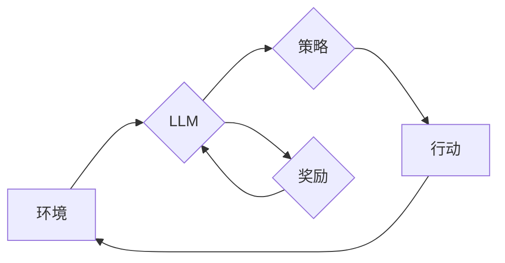

> 大规模语言模型，强化学习，深度学习，自然语言处理，文本生成，预训练模型，Fine-tuning

## 1. 背景介绍

近年来，深度学习在人工智能领域取得了突破性进展，特别是大规模语言模型（Large Language Models，LLMs）的出现，为自然语言处理（Natural Language Processing，NLP）任务带来了革命性的改变。LLMs，如GPT-3、BERT、LaMDA等，通过学习海量文本数据，能够执行各种复杂的任务，包括文本生成、翻译、问答、代码生成等。

强化学习（Reinforcement Learning，RL）作为一种机器学习范式，通过奖励机制引导智能体学习最优策略，在解决复杂决策问题方面展现出强大的能力。将强化学习与大规模语言模型相结合，可以进一步提升LLMs的性能和智能化水平。

## 2. 核心概念与联系

**2.1  大规模语言模型 (LLMs)**

LLMs 是基于Transformer架构的深度神经网络，拥有数十亿甚至数千亿个参数。它们通过学习大量的文本数据，掌握了语言的语法、语义和上下文关系。

**2.2 强化学习 (RL)**

RL 是一种基于交互学习的机器学习方法。智能体在环境中采取行动，根据环境反馈获得奖励或惩罚。通过不断学习和调整策略，智能体最终能够找到最优的行动策略，以最大化累积奖励。

**2.3 LLMs 与 RL 的结合**

将RL与LLMs相结合，可以利用LLMs强大的语言理解和生成能力，构建更智能、更灵活的RL代理。

**2.3.1  LLMs 作为策略函数**

LLMs 可以被视为策略函数，通过学习文本数据，预测在特定状态下采取的最佳行动。

**2.3.2  LLMs 作为奖励函数**

LLMs 可以被用来设计更复杂的奖励函数，例如根据文本内容评估行动的质量。

**2.4  架构图**



## 3. 核心算法原理 & 具体操作步骤

### 3.1  算法原理概述

RL算法的核心是通过**价值函数**和**策略函数**来学习最优策略。

* **价值函数**：评估某个状态下采取特定行动的长期回报。
* **策略函数**：根据当前状态，选择最优行动的概率分布。

常见的RL算法包括Q-learning、SARSA、Deep Q-Network (DQN)等。

### 3.2  算法步骤详解

以Q-learning为例，其算法步骤如下：

1. 初始化Q-table，其中每个状态-动作对的Q值都设置为0。
2. 在环境中进行交互，观察当前状态和采取的行动。
3. 根据环境反馈获得奖励。
4. 更新Q-table，根据Bellman方程计算新的Q值：

```
Q(s, a) = Q(s, a) + α [r + γ max Q(s', a') - Q(s, a)]
```

其中：

* α：学习率
* γ：折扣因子
* r：当前奖励
* s：当前状态
* a：当前动作
* s'：下一个状态
* a'：下一个状态下的最优动作

5. 重复步骤2-4，直到Q-table收敛。

### 3.3  算法优缺点

**优点：**

* 能够学习复杂决策问题
* 适用于离散状态和动作空间

**缺点：**

* 对于连续状态和动作空间，需要进行离散化处理
* 训练过程可能需要大量的时间和资源

### 3.4  算法应用领域

RL算法广泛应用于以下领域：

* 游戏
* 自动驾驶
* 机器人控制
* 医疗保健
* 金融

## 4. 数学模型和公式 & 详细讲解 & 举例说明

### 4.1  数学模型构建

RL算法的核心数学模型是**马尔可夫决策过程 (MDP)**。MDP由以下要素组成：

* **状态空间 S**：所有可能的系统状态的集合。
* **动作空间 A**：在每个状态下可以采取的所有动作的集合。
* **转移概率 P(s', r | s, a)**：从状态s采取动作a后，转移到状态s'的概率，以及获得奖励r的概率。
* **奖励函数 R(s, a)**：在状态s采取动作a后获得的奖励。

### 4.2  公式推导过程

**价值函数**的定义：

* **状态价值函数 V(s)**：从状态s开始，按照最优策略执行的期望累积奖励。
* **动作价值函数 Q(s, a)**：从状态s采取动作a后，按照最优策略执行的期望累积奖励。

**Bellman方程**：

* **状态价值函数的Bellman方程**:

$$V(s) = \max_a \sum_{s', r} P(s', r | s, a) [R(s, a) + \gamma V(s')]$$

* **动作价值函数的Bellman方程**:

$$Q(s, a) = \sum_{s', r} P(s', r | s, a) [R(s, a) + \gamma \max_{a'} Q(s', a')]$$

### 4.3  案例分析与讲解

**举例说明：**

假设有一个简单的环境，状态空间为{“红灯”，“绿灯”}, 动作空间为{“前进”，“停止”}, 奖励函数为：

* 在“绿灯”状态下前进获得奖励1，其他情况奖励0。

使用Q-learning算法，可以学习到最优策略，即在“绿灯”状态下前进，在“红灯”状态下停止。

## 5. 项目实践：代码实例和详细解释说明

### 5.1  开发环境搭建

* Python 3.x
* TensorFlow 或 PyTorch
* 其他必要的库，例如NumPy、Pandas等

### 5.2  源代码详细实现

```python
import numpy as np

# 定义环境
class Environment:
    def __init__(self):
        self.state = "red"

    def step(self, action):
        if self.state == "red" and action == "stop":
            reward = 1
            self.state = "red"
        elif self.state == "green" and action == "forward":
            reward = 1
            self.state = "red"
        else:
            reward = 0
            self.state = self.state

        return self.state, reward

# 定义Q-learning算法
class QLearning:
    def __init__(self, learning_rate=0.1, discount_factor=0.9, epsilon=0.1):
        self.learning_rate = learning_rate
        self.discount_factor = discount_factor
        self.epsilon = epsilon
        self.q_table = {}

    def choose_action(self, state):
        if np.random.uniform(0, 1) < self.epsilon:
            return np.random.choice(actions)
        else:
            return np.argmax(self.q_table.get(state, [0]))

    def update_q_table(self, state, action, reward, next_state):
        self.q_table[state][action] = self.q_table.get(state, [0])[action] + self.learning_rate * (
            reward + self.discount_factor * max(self.q_table.get(next_state, [0])) - self.q_table.get(state, [0])[action]
        )

# 实例化环境和Q-learning算法
env = Environment()
agent = QLearning()

# 训练过程
for episode in range(1000):
    state = env.reset()
    done = False
    while not done:
        action = agent.choose_action(state)
        next_state, reward = env.step(action)
        agent.update_q_table(state, action, reward, next_state)
        state = next_state
        done = True

# 打印Q-table
print(agent.q_table)
```

### 5.3  代码解读与分析

* **环境类 (Environment)**：定义了环境的状态、动作、奖励函数等。
* **Q-learning类 (QLearning)**：实现了Q-learning算法的核心逻辑，包括选择动作、更新Q-table等。
* **训练过程**：通过循环迭代，让智能体在环境中交互学习，更新Q-table。

### 5.4  运行结果展示

运行代码后，会输出Q-table，其中每个状态-动作对的Q值代表了采取该动作在该状态下的期望累积奖励。

## 6. 实际应用场景

### 6.1  游戏

RL算法在游戏领域应用广泛，例如AlphaGo、AlphaStar等，通过学习游戏规则和策略，能够战胜人类玩家。

### 6.2  自动驾驶

RL算法可以用于训练自动驾驶汽车，学习驾驶规则和应对各种复杂路况的能力。

### 6.3  机器人控制

RL算法可以用于控制机器人，使其能够执行复杂的任务，例如抓取物体、导航等。

### 6.4  未来应用展望

RL算法在未来将有更广泛的应用，例如：

* 个性化推荐系统
* 医疗诊断和治疗
* 金融投资策略

## 7. 工具和资源推荐

### 7.1  学习资源推荐

* **书籍:**
    * Reinforcement Learning: An Introduction by Richard S. Sutton and Andrew G. Barto
    * Deep Reinforcement Learning Hands-On by Maxim Lapan
* **在线课程:**
    * Coursera: Reinforcement Learning Specialization
    * Udacity: Deep Reinforcement Learning Nanodegree

### 7.2  开发工具推荐

* **TensorFlow:** 开源深度学习框架，支持RL算法的实现。
* **PyTorch:** 开源深度学习框架，也支持RL算法的实现。
* **OpenAI Gym:** RL算法测试和研究平台，提供各种环境和基准测试。

### 7.3  相关论文推荐

* Deep Reinforcement Learning with Double Q-learning
* Proximal Policy Optimization Algorithms
* Asynchronous Methods for Deep Reinforcement Learning

## 8. 总结：未来发展趋势与挑战

### 8.1  研究成果总结

近年来，RL算法取得了显著进展，在多个领域取得了突破性成果。

### 8.2  未来发展趋势

* **更强大的模型:** 探索更强大的RL模型，例如Transformer-based RL模型。
* **更有效的算法:** 研究更有效的RL算法，例如基于模型的RL算法。
* **更广泛的应用:** 将RL算法应用于更多领域，例如医疗保健、金融等。

### 8.3  面临的挑战

* **样本效率:** RL算法通常需要大量的样本数据进行训练。
* **可解释性:** RL算法的决策过程难以解释，这限制了其在一些安全关键应用中的应用。
* **安全性和鲁棒性:** RL算法在面对未知环境和对抗性攻击时，可能表现出不稳定性。

### 8.4  研究展望

未来，RL算法的研究将继续朝着更强大、更有效、更安全的方向发展，并将在更多领域发挥重要作用。

## 9. 附录：常见问题与解答

**Q1: RL算法与监督学习有什么区别？**

**A1:** 监督学习利用标记数据训练模型，而RL算法则通过与环境交互学习，不需要标记数据。

**Q2: RL算法的训练过程如何进行？**

**A2:** RL算法的训练过程通过不断地与环境交互，根据环境反馈更新模型参数，最终学习到最优策略。

**Q3: RL算法有哪些应用场景？**

**A3:** RL算法应用广泛，例如游戏、自动驾驶、机器人控制等。


作者：禅与