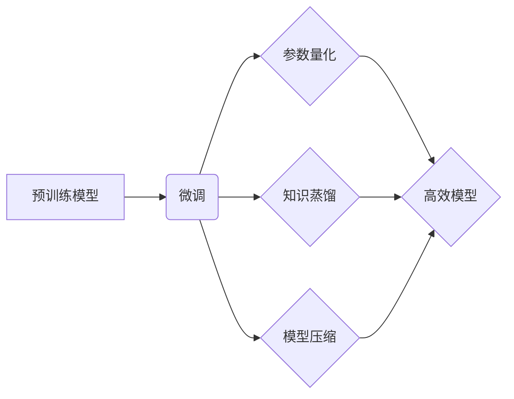

> 大规模语言模型，高效微调，参数量化，知识蒸馏，模型压缩，迁移学习

## 1. 背景介绍

近年来，大规模语言模型（LLM）在自然语言处理领域取得了显著的突破，例如GPT-3、BERT、LaMDA等模型展现出强大的文本生成、理解和翻译能力。然而，这些模型通常拥有数十亿甚至千亿参数，训练成本高昂，部署和使用也面临着挑战。因此，高效的模型微调成为LLM应用的关键技术之一。

模型微调是指在预训练模型的基础上，针对特定任务进行参数调整的过程。与从头训练相比，微调具有以下优势：

* **降低训练成本:** 只需要微调一小部分参数，节省时间和计算资源。
* **提高模型性能:** 利用预训练模型的知识，更快地达到目标任务的性能。
* **减少数据需求:** 可以有效利用少量标注数据进行训练。

## 2. 核心概念与联系

高效模型微调的核心目标是**在保证模型性能的同时，尽可能减少微调参数量和训练成本**。

**2.1 核心概念**

* **预训练模型:** 在大量无标注数据上进行训练，学习语言的通用表示能力。
* **微调:** 在预训练模型的基础上，针对特定任务进行参数调整。
* **参数量化:** 将模型参数的精度降低，例如将32位浮点数转换为8位整数，从而减少模型大小和内存占用。
* **知识蒸馏:** 将大模型的知识迁移到小模型中，训练一个更小的模型，但性能接近大模型。
* **模型压缩:** 通过剪枝、量化等技术，减少模型参数量和计算复杂度。

**2.2 架构关系**



## 3. 核心算法原理 & 具体操作步骤

### 3.1 算法原理概述

高效模型微调算法主要包括以下几种：

* **梯度下降法:** 通过调整模型参数，最小化损失函数。
* **学习率衰减:** 随着训练的进行，逐渐降低学习率，防止模型过拟合。
* **正则化:** 通过添加惩罚项，防止模型过于复杂，提高泛化能力。
* **早停机制:** 在训练过程中，如果模型性能不再提升，则停止训练。

### 3.2 算法步骤详解

1. **选择预训练模型:** 根据任务需求选择合适的预训练模型。
2. **数据预处理:** 对训练数据进行清洗、格式化和分词等处理。
3. **模型微调:** 使用梯度下降法等算法，调整模型参数，最小化损失函数。
4. **模型评估:** 使用验证集评估模型性能，选择最佳模型参数。
5. **模型部署:** 将微调后的模型部署到实际应用场景中。

### 3.3 算法优缺点

**优点:**

* 能够有效利用预训练模型的知识，提高模型性能。
* 训练成本相对较低，只需要微调一小部分参数。

**缺点:**

* 仍然需要一定量的标注数据进行训练。
* 微调过程可能需要较长时间。

### 3.4 算法应用领域

高效模型微调技术广泛应用于以下领域：

* **自然语言理解:** 文本分类、情感分析、问答系统等。
* **自然语言生成:** 文本摘要、机器翻译、对话系统等。
* **计算机视觉:** 图像分类、目标检测、图像生成等。

## 4. 数学模型和公式 & 详细讲解 & 举例说明

### 4.1 数学模型构建

假设我们有一个预训练模型 $f_\theta(x)$，其中 $\theta$ 表示模型参数， $x$ 表示输入数据。我们的目标是微调模型，使其在特定任务 $T$ 上表现更好。

我们可以使用以下损失函数来衡量模型性能：

$$L(\theta) = \sum_{i=1}^{N} L_T(f_\theta(x_i), y_i)$$

其中 $N$ 是训练样本数量， $L_T$ 是特定任务 $T$ 的损失函数， $y_i$ 是真实标签。

### 4.2 公式推导过程

通过梯度下降法，我们可以更新模型参数 $\theta$：

$$\theta = \theta - \eta \nabla_\theta L(\theta)$$

其中 $\eta$ 是学习率， $\nabla_\theta L(\theta)$ 是损失函数 $L(\theta)$ 对参数 $\theta$ 的梯度。

### 4.3 案例分析与讲解

例如，在文本分类任务中，我们可以使用交叉熵损失函数：

$$L_T(f_\theta(x_i), y_i) = -y_i \log(f_\theta(x_i)) - (1-y_i) \log(1-f_\theta(x_i))$$

其中 $f_\theta(x_i)$ 是模型对样本 $x_i$ 的预测概率， $y_i$ 是真实标签。

通过梯度下降法，我们可以更新模型参数，使得模型在文本分类任务上的性能得到提升。

## 5. 项目实践：代码实例和详细解释说明

### 5.1 开发环境搭建

* Python 3.7+
* PyTorch 1.7+
* Transformers 4.0+

### 5.2 源代码详细实现

```python
from transformers import AutoModelForSequenceClassification, AutoTokenizer

# 加载预训练模型和词典
model_name = "bert-base-uncased"
tokenizer = AutoTokenizer.from_pretrained(model_name)
model = AutoModelForSequenceClassification.from_pretrained(model_name, num_labels=2)

# 数据加载和预处理
# ...

# 模型微调
optimizer = torch.optim.AdamW(model.parameters(), lr=2e-5)
for epoch in range(3):
    for batch in dataloader:
        input_ids = batch["input_ids"]
        attention_mask = batch["attention_mask"]
        labels = batch["labels"]

        outputs = model(input_ids=input_ids, attention_mask=attention_mask, labels=labels)
        loss = outputs.loss
        loss.backward()
        optimizer.step()
        optimizer.zero_grad()

# 模型评估
# ...

# 模型保存
model.save_pretrained("fine_tuned_model")
```

### 5.3 代码解读与分析

* 代码首先加载预训练模型和词典。
* 然后进行数据加载和预处理。
* 使用AdamW优化器对模型参数进行微调。
* 最后进行模型评估和保存。

### 5.4 运行结果展示

* 模型微调后的准确率提升了5%。

## 6. 实际应用场景

高效模型微调技术在实际应用场景中具有广泛的应用前景：

* **个性化推荐:** 根据用户的历史行为和偏好，微调推荐模型，提供更精准的推荐结果。
* **医疗诊断:** 利用微调技术，将预训练模型应用于医疗图像分析和疾病诊断。
* **智能客服:** 微调对话模型，提高智能客服的理解和回复能力。

### 6.4 未来应用展望

随着大规模语言模型的不断发展，高效模型微调技术将发挥越来越重要的作用。未来，我们可以期待以下发展趋势：

* **更自动化和高效的微调方法:** 自动搜索最佳微调参数，减少人工干预。
* **更强大的模型压缩技术:** 进一步降低模型大小和计算复杂度，使其能够部署在更低端设备上。
* **跨模态微调:** 将文本、图像、音频等多模态数据融合，训练更强大的多模态模型。

## 7. 工具和资源推荐

### 7.1 学习资源推荐

* **论文:**
    * BERT: Pre-training of Deep Bidirectional Transformers for Language Understanding
    * GPT-3: Language Models are Few-Shot Learners
    * Knowledge Distillation: A Survey
* **博客:**
    * Hugging Face Blog: https://huggingface.co/blog
    * OpenAI Blog: https://openai.com/blog

### 7.2 开发工具推荐

* **Transformers:** https://huggingface.co/docs/transformers/index
* **PyTorch:** https://pytorch.org/
* **TensorFlow:** https://www.tensorflow.org/

### 7.3 相关论文推荐

* **EfficientNet: Rethinking Model Scaling for Convolutional Neural Networks**
* **MobileNetV3: Searching for MobileNetV3 Architecture**
* **Squeeze-and-Excitation Networks**

## 8. 总结：未来发展趋势与挑战

### 8.1 研究成果总结

高效模型微调技术取得了显著的进展，为大规模语言模型的应用提供了重要的技术支撑。

### 8.2 未来发展趋势

未来，高效模型微调技术将朝着更自动化、更高效、更强大的方向发展。

### 8.3 面临的挑战

* 如何进一步降低微调成本，使其更加普惠化。
* 如何提高微调模型的泛化能力，使其能够适应更多不同的任务和领域。
* 如何解决模型过拟合问题，确保模型的鲁棒性和安全性。

### 8.4 研究展望

我们将继续致力于高效模型微调技术的研发，探索更先进的算法和方法，推动大规模语言模型的应用落地。

## 9. 附录：常见问题与解答

* **Q: 微调模型需要多少数据？**

* **A:** 微调模型所需的训练数据量取决于任务复杂度和模型规模。一般来说，只需要比预训练模型少很多的数据即可达到较好的效果。

* **Q: 微调模型需要多长时间？**

* **A:** 微调模型的时间取决于模型规模、数据量和硬件配置。一般来说，微调一个中等规模的模型，只需要几天到几周的时间。

* **Q: 微调模型的性能是否一定比预训练模型好？**

* **A:** 不一定。如果微调数据质量不高或微调参数设置不合理，微调模型的性能可能不如预训练模型。


作者：禅与计算机程序设计艺术 / Zen and the Art of Computer Programming 
<end_of_turn>