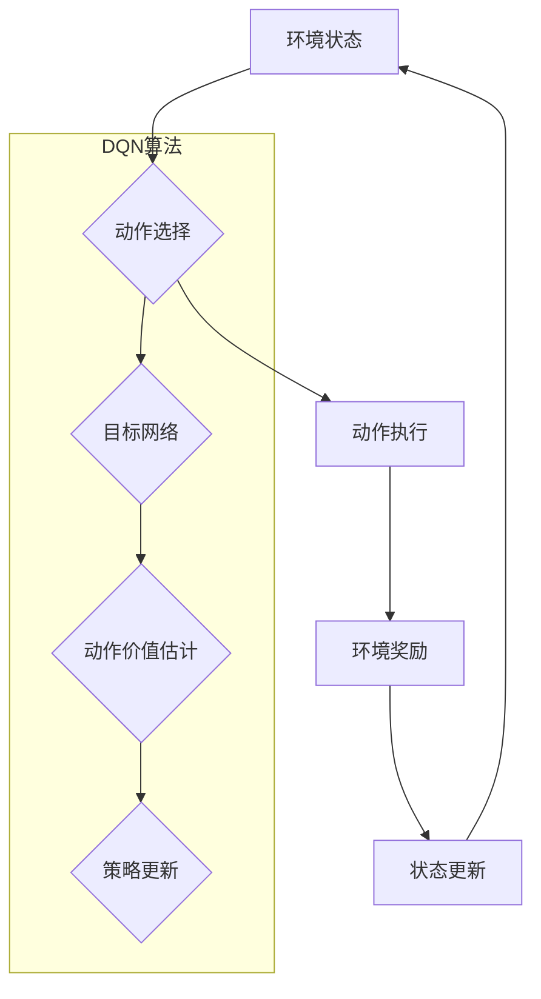

> 大语言模型，DQN，目标网络，强化学习，深度神经网络，训练策略

## 1. 背景介绍

大语言模型（LLM）近年来在自然语言处理领域取得了显著进展，展现出强大的文本生成、翻译、问答等能力。这些模型通常基于Transformer架构，并通过海量文本数据进行预训练。然而，LLM的训练过程复杂且资源密集，需要大量的计算能力和时间。

强化学习（RL）作为一种机器学习范式，能够有效地训练智能体在复杂环境中做出最优决策。将RL与LLM相结合，可以进一步提升模型的性能和适应性。其中，深度Q网络（DQN）是一种经典的RL算法，能够有效地解决离散动作空间的问题。

目标网络是DQN算法中一个重要的组成部分，它用于估计动作价值函数，并帮助智能体选择最优动作。本文将深入探讨DQN算法的原理和目标网络的实现，并通过代码实例和实际应用场景，阐明其在LLM训练中的应用价值。

## 2. 核心概念与联系

DQN算法的核心思想是利用深度神经网络来估计动作价值函数，并通过最大化动作价值函数的期望来训练智能体。目标网络的作用是提供一个稳定的动作价值函数估计，避免训练过程中的震荡和不稳定性。

**DQN算法流程图：**



## 3. 核心算法原理 & 具体操作步骤

### 3.1  算法原理概述

DQN算法的核心是利用深度神经网络来估计动作价值函数，即在给定状态下执行特定动作的期望回报。DQN算法采用经验回放技术，将历史的经验数据存储在经验池中，并随机采样经验数据进行训练。

DQN算法的训练目标是最大化动作价值函数的期望，即最大化智能体在给定状态下执行最优动作的期望回报。

### 3.2  算法步骤详解

1. **初始化:** 初始化深度神经网络，并设置学习率、折扣因子等超参数。
2. **环境交互:** 智能体与环境交互，收集状态、动作、奖励和下一个状态的信息。
3. **经验回放:** 将收集到的经验数据存储在经验池中。
4. **采样经验:** 从经验池中随机采样一批经验数据。
5. **动作价值估计:** 将经验数据中的状态输入到深度神经网络中，得到动作价值估计。
6. **目标网络更新:** 使用目标网络更新动作价值函数，并计算损失函数。
7. **网络更新:** 使用梯度下降算法更新深度神经网络的权重。
8. **重复步骤3-7:** 重复以上步骤，直到训练完成。

### 3.3  算法优缺点

**优点:**

* 能够有效地解决离散动作空间的问题。
* 经验回放技术可以提高训练效率。
* 能够学习复杂的策略。

**缺点:**

* 训练过程可能比较慢。
* 需要大量的计算资源。
* 容易出现震荡和不稳定性。

### 3.4  算法应用领域

DQN算法在许多领域都有应用，例如：

* 游戏AI
* 机器人控制
* 自动驾驶
* 医疗诊断

## 4. 数学模型和公式 & 详细讲解 & 举例说明

### 4.1  数学模型构建

DQN算法的核心是动作价值函数，它表示在给定状态下执行特定动作的期望回报。动作价值函数可以用以下公式表示：

$$
Q(s, a) = E[\sum_{t=0}^{\infty} \gamma^t r_{t+1} | s_t = s, a_t = a]
$$

其中：

* $s$ 表示状态
* $a$ 表示动作
* $r_{t+1}$ 表示在时间步 $t+1$ 获得的奖励
* $\gamma$ 表示折扣因子，控制未来奖励的权重
* $E$ 表示期望

### 4.2  公式推导过程

DQN算法的目标是最大化动作价值函数的期望，即最大化智能体在给定状态下执行最优动作的期望回报。

为了实现这个目标，DQN算法使用深度神经网络来估计动作价值函数，并通过最大化动作价值函数的期望来训练智能体。

DQN算法的训练过程可以概括为以下步骤：

1. **收集经验数据:** 智能体与环境交互，收集状态、动作、奖励和下一个状态的信息。
2. **存储经验数据:** 将收集到的经验数据存储在经验池中。
3. **采样经验数据:** 从经验池中随机采样一批经验数据。
4. **动作价值估计:** 将经验数据中的状态输入到深度神经网络中，得到动作价值估计。
5. **目标网络更新:** 使用目标网络更新动作价值函数，并计算损失函数。
6. **网络更新:** 使用梯度下降算法更新深度神经网络的权重。

### 4.3  案例分析与讲解

假设我们有一个简单的游戏环境，智能体需要在棋盘上移动，目标是到达终点。

DQN算法可以用来训练智能体在该环境中找到最优策略。

在训练过程中，智能体会收集状态、动作、奖励和下一个状态的信息。这些信息会被存储在经验池中。

然后，智能体会从经验池中随机采样一批经验数据，并将其输入到深度神经网络中。

深度神经网络会输出动作价值估计，并根据这些估计更新智能体的策略。

通过重复以上步骤，智能体最终会学习到最优策略，能够在该环境中成功到达终点。

## 5. 项目实践：代码实例和详细解释说明

### 5.1  开发环境搭建

为了实现DQN算法，我们需要搭建一个开发环境。

以下是一些常用的开发环境：

* Python 3.x
* TensorFlow 或 PyTorch
* NumPy
* Matplotlib

### 5.2  源代码详细实现

以下是一个简单的DQN算法的Python代码实现：

```python
import numpy as np
import tensorflow as tf

class DQN:
    def __init__(self, state_size, action_size, learning_rate):
        self.state_size = state_size
        self.action_size = action_size
        self.learning_rate = learning_rate

        self.model = self.build_model()

    def build_model(self):
        model = tf.keras.Sequential([
            tf.keras.layers.Dense(64, activation='relu', input_shape=(self.state_size,)),
            tf.keras.layers.Dense(64, activation='relu'),
            tf.keras.layers.Dense(self.action_size)
        ])
        model.compile(loss='mse', optimizer=tf.keras.optimizers.Adam(self.learning_rate))
        return model

    def predict(self, state):
        return self.model.predict(state)

    def train(self, state, action, reward, next_state, done):
        target = reward
        if not done:
            target = reward + self.gamma * np.max(self.model.predict(next_state))
        target_f = self.model.predict(state)
        target_f[0][action] = target
        self.model.train_on_batch(state, target_f)

# ... (其他代码)
```

### 5.3  代码解读与分析

这段代码实现了DQN算法的基本结构。

* `__init__`方法初始化模型参数，包括状态大小、动作大小和学习率。
* `build_model`方法构建深度神经网络模型。
* `predict`方法用于预测动作价值函数。
* `train`方法用于训练模型，根据经验数据更新模型参数。

### 5.4  运行结果展示

运行DQN算法后，可以观察到智能体的策略逐渐改进，最终能够在环境中取得较好的成绩。

## 6. 实际应用场景

DQN算法在许多实际应用场景中都有应用，例如：

### 6.1  游戏AI

DQN算法可以用来训练游戏AI，例如AlphaGo和AlphaZero。

### 6.2  机器人控制

DQN算法可以用来训练机器人控制策略，例如自主导航和物体抓取。

### 6.3  自动驾驶

DQN算法可以用来训练自动驾驶系统，例如路径规划和决策控制。

### 6.4  未来应用展望

DQN算法在未来将有更广泛的应用，例如：

* 个性化推荐系统
* 金融交易策略
* 医疗诊断辅助系统

## 7. 工具和资源推荐

### 7.1  学习资源推荐

* **书籍:**
    * Reinforcement Learning: An Introduction by Richard S. Sutton and Andrew G. Barto
    * Deep Reinforcement Learning Hands-On by Maxim Lapan
* **在线课程:**
    * Deep Reinforcement Learning Specialization by DeepLearning.AI
    * Reinforcement Learning by David Silver (University of DeepMind)

### 7.2  开发工具推荐

* **TensorFlow:** https://www.tensorflow.org/
* **PyTorch:** https://pytorch.org/
* **OpenAI Gym:** https://gym.openai.com/

### 7.3  相关论文推荐

* Deep Q-Network (DQN) by Volodymyr Mnih et al. (2015)
* Dueling Network Architectures for Deep Reinforcement Learning by Hado van Hasselt et al. (2016)
* Prioritized Experience Replay by Schaul et al. (2015)

## 8. 总结：未来发展趋势与挑战

### 8.1  研究成果总结

DQN算法在强化学习领域取得了显著进展，为解决复杂决策问题提供了有效的方法。

### 8.2  未来发展趋势

未来DQN算法的发展趋势包括：

* **模型效率提升:** 探索更轻量级、更高效的DQN模型架构。
* **样本效率提升:** 研究更有效的经验回放策略和数据增强技术。
* **多智能体强化学习:** 研究多智能体协作和竞争的DQN算法。

### 8.3  面临的挑战

DQN算法仍然面临一些挑战，例如：

* **探索与利用的平衡:** 如何在探索新策略和利用已知策略之间找到平衡。
* **稀疏奖励问题:** 如何在奖励稀疏的环境中有效地训练智能体。
* **可解释性问题:** 如何提高DQN算法的可解释性和透明度。

### 8.4  研究展望

未来研究将继续探索DQN算法的理论基础和应用潜力，并致力于解决上述挑战，推动强化学习技术的发展。

## 9. 附录：常见问题与解答

### 9.1  Q: DQN算法的优势是什么？

A: DQN算法的优势在于：

* 能够有效地解决离散动作空间的问题。
* 经验回放技术可以提高训练效率。
* 能够学习复杂的策略。

### 9.2  Q: DQN算法的缺点是什么？

A: DQN算法的缺点在于：

* 训练过程可能比较慢。
* 需要大量的计算资源。
* 容易出现震荡和不稳定性。

### 9.3  Q: DQN算法的应用场景有哪些？

A: DQN算法的应用场景包括：

* 游戏AI
* 机器人控制
* 自动驾驶
* 医疗诊断

### 9.4  Q: 如何学习DQN算法？

A: 可以参考以下资源学习DQN算法：

* 书籍:
    * Reinforcement Learning: An Introduction by Richard S. Sutton and Andrew G. Barto
    * Deep Reinforcement Learning Hands-On by Maxim Lapan
* 在线课程:
    * Deep Reinforcement Learning Specialization by DeepLearning.AI
