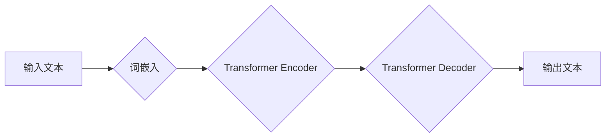

> 大语言模型、Transformer、BERT、GPT、训练优化、深度学习、自然语言处理

## 1. 背景介绍

近年来，深度学习技术取得了飞速发展，特别是基于Transformer架构的大语言模型（Large Language Model，LLM）的出现，彻底改变了自然语言处理（Natural Language Processing，NLP）领域的面貌。从文本生成、机器翻译到代码编写、问答系统，LLM展现出强大的能力，并逐渐渗透到各个领域，成为人工智能发展的重要驱动力。

然而，训练大型语言模型也面临着巨大的挑战。其规模庞大，训练数据海量，计算资源消耗巨大，训练时间长，优化算法复杂。因此，深入理解大语言模型的原理和训练优化方法，对于推动LLM技术发展至关重要。

本篇文章将深入探讨大语言模型的原理和工程实践，涵盖核心概念、算法原理、数学模型、代码实现、实际应用场景以及未来发展趋势等方面，为读者提供一个全面的学习指南。

## 2. 核心概念与联系

大语言模型的核心概念包括：

* **Transformer:**  Transformer是一种基于注意力机制的深度学习架构，其能够有效处理长距离依赖关系，成为大语言模型的基础。
* **自回归语言模型 (Autoregressive Language Model):**  自回归语言模型是一种预测下一个词的概率分布的模型，通过训练大量的文本数据，学习语言的语法和语义规律。
* **词嵌入 (Word Embedding):** 词嵌入将单词映射到低维向量空间，使得单词之间的语义关系能够被捕捉和表示。
* **注意力机制 (Attention Mechanism):** 注意力机制能够学习文本中不同部分之间的关系，并根据重要程度分配不同的权重，提高模型的理解能力。

**Mermaid 流程图:**



## 3. 核心算法原理 & 具体操作步骤

### 3.1  算法原理概述

大语言模型的核心算法是Transformer，其主要由Encoder和Decoder两个部分组成。Encoder负责对输入文本进行编码，将文本信息转换为隐藏状态向量；Decoder则根据Encoder的输出和当前预测词，生成下一个词的概率分布。

Transformer的注意力机制是其关键创新点，它能够学习文本中不同部分之间的关系，并根据重要程度分配不同的权重，提高模型的理解能力。

### 3.2  算法步骤详解

1. **词嵌入:** 将输入文本中的每个单词映射到低维向量空间。
2. **Encoder:** 将嵌入后的词向量输入到Transformer Encoder中，经过多层编码过程，最终得到隐藏状态向量。
3. **Decoder:** 将Encoder的输出和当前预测词作为输入，输入到Transformer Decoder中，经过多层解码过程，最终得到下一个词的概率分布。
4. **输出:** 根据概率分布选择最可能的下一个词，并将其添加到输出文本中。

### 3.3  算法优缺点

**优点:**

* **处理长距离依赖关系:** Transformer的注意力机制能够有效处理文本中长距离依赖关系，提升模型的理解能力。
* **并行化训练:** Transformer的结构允许并行化训练，提高训练效率。
* **可扩展性强:** Transformer的架构可以轻松扩展到更大的模型规模。

**缺点:**

* **训练成本高:** 训练大型Transformer模型需要大量的计算资源和时间。
* **参数量大:** Transformer模型的参数量很大，需要大量的存储空间。
* **可解释性差:** Transformer模型的内部机制比较复杂，难以解释其决策过程。

### 3.4  算法应用领域

Transformer算法在自然语言处理领域有着广泛的应用，例如：

* **机器翻译:** 将一种语言翻译成另一种语言。
* **文本摘要:**  将长文本压缩成短文本。
* **问答系统:**  根据给定的问题，从文本中找到答案。
* **文本生成:**  生成新的文本内容，例如诗歌、小说、代码等。

## 4. 数学模型和公式 & 详细讲解 & 举例说明

### 4.1  数学模型构建

大语言模型的数学模型主要基于概率论和统计学，其目标是学习一个概率分布，能够生成符合语言规律的文本。

**例子:**

假设我们有一个训练数据集，包含一系列的句子。我们的目标是学习一个概率分布，能够预测下一个词的概率。

我们可以使用以下公式来表示这个概率分布：

$$P(w_t | w_{1:t-1})$$

其中：

* $w_t$ 是第t个词。
* $w_{1:t-1}$ 是前t-1个词。

### 4.2  公式推导过程

为了学习这个概率分布，我们可以使用最大似然估计 (Maximum Likelihood Estimation，MLE) 方法。MLE的目标是找到一个参数值，使得训练数据出现的概率最大。

**例子:**

假设我们有一个训练数据集，包含以下句子：

"The cat sat on the mat."

我们可以使用MLE方法来学习下一个词的概率分布。

首先，我们需要计算每个词出现的概率。例如，"the" 这个词出现了两次，所以它的概率是 2/5。

然后，我们可以使用这些概率来计算下一个词的概率。例如，如果我们已经看到了 "The cat sat on the", 那么下一个词可能是 "mat"，它的概率是 1/5。

### 4.3  案例分析与讲解

我们可以使用不同的模型架构和训练方法来学习这个概率分布。例如，我们可以使用RNN、LSTM或Transformer模型。

**例子:**

我们可以使用Transformer模型来学习下一个词的概率分布。Transformer模型能够有效处理长距离依赖关系，因此它能够更好地学习语言的语法和语义规律。

## 5. 项目实践：代码实例和详细解释说明

### 5.1  开发环境搭建

为了实现大语言模型的训练和应用，我们需要搭建一个合适的开发环境。

**步骤:**

1. 安装Python和必要的库，例如TensorFlow、PyTorch、HuggingFace Transformers等。
2. 配置GPU加速环境，以便更快地训练模型。
3. 下载预训练模型权重，例如BERT、GPT等。

### 5.2  源代码详细实现

以下是一个使用HuggingFace Transformers库训练BERT模型的简单代码示例：

```python
from transformers import BertTokenizer, BertForMaskedLM, AdamW
from transformers import get_linear_schedule_with_warmup

# 加载预训练模型和词典
tokenizer = BertTokenizer.from_pretrained('bert-base-uncased')
model = BertForMaskedLM.from_pretrained('bert-base-uncased')

# 定义训练参数
train_batch_size = 16
epochs = 3
learning_rate = 2e-5
warmup_steps = 500

# 加载训练数据
train_dataset = ...

# 创建训练器
optimizer = AdamW(model.parameters(), lr=learning_rate)
scheduler = get_linear_schedule_with_warmup(optimizer, num_warmup_steps=warmup_steps, num_training_steps=len(train_dataset) * epochs)

# 训练模型
for epoch in range(epochs):
    for batch in train_dataset:
        inputs = tokenizer(batch['text'], padding=True, truncation=True)
        outputs = model(**inputs)
        loss = outputs.loss
        loss.backward()
        optimizer.step()
        scheduler.step()

# 保存训练好的模型
model.save_pretrained('my_bert_model')
```

### 5.3  代码解读与分析

这段代码首先加载预训练的BERT模型和词典。然后，定义了训练参数，例如批处理大小、训练轮数、学习率等。接着，加载训练数据，并创建优化器和学习率调度器。最后，进行模型训练，并保存训练好的模型。

### 5.4  运行结果展示

训练完成后，我们可以使用训练好的模型进行文本生成、问答、机器翻译等任务。

## 6. 实际应用场景

大语言模型在各个领域都有着广泛的应用场景，例如：

### 6.1  文本生成

* **小说、诗歌创作:**  利用大语言模型生成创意文本，辅助作家创作。
* **广告文案撰写:**  根据产品信息自动生成吸引人的广告文案。
* **新闻报道:**  自动生成新闻报道，节省人力成本。

### 6.2  机器翻译

* **实时翻译:**  将语音或文本实时翻译成目标语言。
* **文档翻译:**  将大量文档翻译成目标语言。

### 6.3  问答系统

* **智能客服:**  自动回答用户的问题，提高客户服务效率。
* **搜索引擎:**  根据用户查询，自动生成相关答案。

### 6.4  未来应用展望

随着大语言模型技术的不断发展，其应用场景将会更加广泛，例如：

* **个性化教育:**  根据学生的学习情况，提供个性化的学习内容和辅导。
* **医疗诊断:**  辅助医生进行疾病诊断，提高诊断准确率。
* **法律服务:**  自动分析法律文件，提供法律建议。

## 7. 工具和资源推荐

### 7.1  学习资源推荐

* **书籍:**
    * 《深度学习》 by Ian Goodfellow, Yoshua Bengio, Aaron Courville
    * 《自然语言处理》 by Dan Jurafsky, James H. Martin
* **在线课程:**
    * Coursera: Natural Language Processing Specialization
    * Stanford CS224N: Natural Language Processing with Deep Learning

### 7.2  开发工具推荐

* **TensorFlow:**  开源深度学习框架，支持GPU加速。
* **PyTorch:**  开源深度学习框架，灵活易用。
* **HuggingFace Transformers:**  提供预训练模型和训练工具，方便快速开发大语言模型应用。

### 7.3  相关论文推荐

* **Attention Is All You Need:** https://arxiv.org/abs/1706.03762
* **BERT: Pre-training of Deep Bidirectional Transformers for Language Understanding:** https://arxiv.org/abs/1810.04805
* **GPT-3: Language Models are Few-Shot Learners:** https://arxiv.org/abs/2005.14165

## 8. 总结：未来发展趋势与挑战

### 8.1  研究成果总结

近年来，大语言模型取得了显著的进展，其性能不断提升，应用场景不断拓展。Transformer架构的提出，注意力机制的应用，以及预训练模型的开发，都是推动大语言模型发展的重要因素。

### 8.2  未来发展趋势

未来，大语言模型的发展趋势包括：

* **模型规模更大:**  更大的模型规模能够学习更复杂的语言规律，提升模型性能。
* **多模态学习:**  将文本、图像、音频等多种模态信息融合在一起，构建更全面的理解模型。
* **可解释性增强:**  提高模型的透明度和可解释性，帮助人们更好地理解模型的决策过程。

### 8.3  面临的挑战

大语言模型也面临着一些挑战，例如：

* **训练成本高:**  训练大型模型需要大量的计算资源和时间。
* **数据偏见:**  训练数据可能存在偏见，导致模型输出结果存在偏差。
* **安全风险:**  大语言模型可能被用于生成虚假信息、进行恶意攻击等。

### 8.4  研究展望

未来，我们需要继续探索大语言模型的潜力，解决其面临的挑战，并将其应用于更多领域，为人类社会带来更多福祉。

## 9. 附录：常见问题与解答

### 9.1  Q1: 如何选择合适的预训练模型？

**A1:**  选择预训练模型需要根据具体的应用场景和任务需求。例如，对于文本生成任务，可以选择GPT系列模型；对于问答任务，可以选择BERT系列模型。

### 9.2  Q2: 如何处理训练数据中的噪声？

**A2:**  可以使用数据清洗、数据增强等方法来处理训练数据中的噪声。

### 9.3  Q3: 如何评估大语言