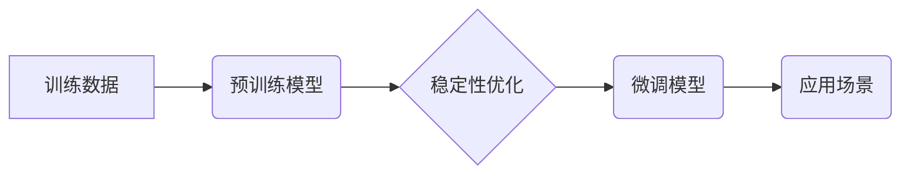

> 大语言模型、稳定性优化、梯度消失、梯度爆炸、正则化、权重衰减、剪枝、知识蒸馏、微调

## 1. 背景介绍

近年来，大语言模型（LLM）在自然语言处理领域取得了显著的进展，展现出强大的文本生成、翻译、摘要和问答能力。然而，训练和部署大型语言模型也面临着诸多挑战，其中稳定性优化尤为重要。

LLM 的训练过程通常依赖于反向传播算法，通过不断调整模型参数来最小化预测误差。然而，在训练过程中，梯度可能会出现消失或爆炸现象，导致模型难以收敛或训练不稳定。此外，过大的模型参数量也会增加训练成本和部署难度。

因此，稳定性优化成为 LLM 研究和工程实践中的关键问题。本文将深入探讨 LLM 稳定性优化方法，包括梯度消失和爆炸的解决方法、正则化技术、模型剪枝和知识蒸馏等，并结合实际案例进行讲解。

## 2. 核心概念与联系

**2.1 核心概念**

* **梯度消失/爆炸:** 梯度消失是指在反向传播过程中，梯度值逐渐减小，导致模型难以学习深层特征。梯度爆炸是指梯度值不断放大，导致模型训练不稳定甚至崩溃。
* **正则化:** 正则化技术通过在损失函数中添加惩罚项，来防止模型过拟合，提高模型泛化能力。常见的正则化方法包括 L1 正则化和 L2 正则化。
* **权重衰减:** 权重衰减是一种正则化技术，通过在模型训练过程中逐渐减小权重值，来防止模型过拟合。
* **模型剪枝:** 模型剪枝是指通过移除模型中不重要的参数，来减小模型规模和计算成本。
* **知识蒸馏:** 知识蒸馏是指将知识从大型模型迁移到小型模型，以提高小型模型的性能。

**2.2 架构关系**



## 3. 核心算法原理 & 具体操作步骤

### 3.1 算法原理概述

稳定性优化算法旨在解决 LLM 训练过程中遇到的梯度消失、梯度爆炸和过拟合等问题。这些算法通过调整模型结构、训练过程或参数初始化方式，来提高模型的稳定性和泛化能力。

### 3.2 算法步骤详解

1. **梯度消失/爆炸解决:**

   * **ReLU 激活函数:** 使用 ReLU 激活函数可以缓解梯度消失问题，因为它在正值时导数为 1，在负值时导数为 0，避免了梯度在反向传播过程中不断衰减。
   * **Batch Normalization:** Batch Normalization 可以规范每一层神经网络的输入数据分布，从而提高梯度稳定性。
   * **残差连接:** 残差连接可以跳过一些网络层，使得梯度能够直接传递到更深层，缓解梯度消失问题。

2. **正则化技术:**

   * **L1 正则化:** 在损失函数中添加权重绝对值的惩罚项，可以鼓励模型学习稀疏的权重，从而减少模型复杂度。
   * **L2 正则化:** 在损失函数中添加权重平方和的惩罚项，可以防止模型过拟合，提高模型泛化能力。

3. **模型剪枝:**

   * **结构剪枝:** 通过移除模型中不重要的连接或层，来减小模型规模和计算成本。
   * **权重剪枝:** 通过移除模型中权重值较小的参数，来减小模型规模和计算成本。

4. **知识蒸馏:**

   * 将大型模型的知识迁移到小型模型，以提高小型模型的性能。

### 3.3 算法优缺点

| 算法 | 优点 | 缺点 |
|---|---|---|
| ReLU 激活函数 | 缓解梯度消失问题 | 可能导致“dying ReLU”问题 |
| Batch Normalization | 提高梯度稳定性 | 增加计算成本 |
| 残差连接 | 缓解梯度消失问题 | 增加模型复杂度 |
| L1 正则化 | 鼓励模型学习稀疏权重 | 可能导致过拟合 |
| L2 正则化 | 防止模型过拟合 | 可能导致模型欠拟合 |
| 结构剪枝 | 减小模型规模和计算成本 | 可能导致模型性能下降 |
| 权重剪枝 | 减小模型规模和计算成本 | 可能导致模型性能下降 |
| 知识蒸馏 | 提高小型模型性能 | 需要大型模型作为教师模型 |

### 3.4 算法应用领域

* **自然语言处理:** 文本生成、机器翻译、文本摘要、问答系统等。
* **计算机视觉:** 图像分类、目标检测、图像分割等。
* **语音识别:** 语音转文本、语音合成等。
* **推荐系统:** 商品推荐、用户画像等。

## 4. 数学模型和公式 & 详细讲解 & 举例说明

### 4.1 数学模型构建

**4.1.1 损失函数:**

损失函数用于衡量模型预测结果与真实值的差异。常用的损失函数包括均方误差 (MSE)、交叉熵 (Cross-Entropy) 等。

**4.1.2 反向传播算法:**

反向传播算法用于计算模型参数的梯度，并根据梯度更新模型参数。

**4.1.3 梯度消失/爆炸问题:**

梯度消失/爆炸问题是指在反向传播过程中，梯度值逐渐减小或放大，导致模型难以收敛或训练不稳定。

### 4.2 公式推导过程

**4.2.1 MSE 损失函数:**

$$
L = \frac{1}{N} \sum_{i=1}^{N} (y_i - \hat{y}_i)^2
$$

其中：

* $L$ 为损失函数值
* $N$ 为样本数量
* $y_i$ 为真实值
* $\hat{y}_i$ 为模型预测值

**4.2.2 反向传播算法:**

反向传播算法通过链式法则计算每个参数的梯度，并根据梯度更新参数值。

### 4.3 案例分析与讲解

**4.3.1 梯度消失问题:**

在训练深层神经网络时，如果使用 sigmoid 激活函数，可能会出现梯度消失问题。因为 sigmoid 函数的导数在接近 0 或 1 时会非常小，导致梯度在反向传播过程中不断衰减。

**4.3.2 梯度爆炸问题:**

如果模型参数初始化不当，或者学习率过大，可能会出现梯度爆炸问题。因为梯度值会不断放大，导致模型训练不稳定甚至崩溃。

## 5. 项目实践：代码实例和详细解释说明

### 5.1 开发环境搭建

* Python 3.7+
* TensorFlow 2.0+
* PyTorch 1.0+

### 5.2 源代码详细实现

```python
import tensorflow as tf

# 定义模型
model = tf.keras.models.Sequential([
    tf.keras.layers.Dense(128, activation='relu', input_shape=(10,)),
    tf.keras.layers.Dense(64, activation='relu'),
    tf.keras.layers.Dense(10)
])

# 定义损失函数和优化器
loss_fn = tf.keras.losses.SparseCategoricalCrossentropy()
optimizer = tf.keras.optimizers.Adam(learning_rate=0.001)

# 训练模型
model.compile(loss=loss_fn, optimizer=optimizer)
model.fit(x_train, y_train, epochs=10)

# 评估模型
loss, accuracy = model.evaluate(x_test, y_test)
print('Loss:', loss)
print('Accuracy:', accuracy)
```

### 5.3 代码解读与分析

* 代码首先定义了一个简单的多层感知机模型。
* 然后定义了损失函数和优化器。
* 接着使用 `model.fit()` 方法训练模型。
* 最后使用 `model.evaluate()` 方法评估模型性能。

### 5.4 运行结果展示

训练完成后，可以查看模型的损失值和准确率。

## 6. 实际应用场景

### 6.1 文本生成

LLM 可以用于生成各种类型的文本，例如文章、故事、诗歌、代码等。

### 6.2 机器翻译

LLM 可以用于将文本从一种语言翻译成另一种语言。

### 6.3 文本摘要

LLM 可以用于生成文本的摘要，提取文本的关键信息。

### 6.4 问答系统

LLM 可以用于构建问答系统，回答用户提出的问题。

### 6.4 未来应用展望

LLM 的应用场景还在不断扩展，未来可能会应用于更多领域，例如：

* **个性化教育:** 根据学生的学习情况提供个性化的学习内容和辅导。
* **医疗诊断:** 辅助医生进行疾病诊断和治疗方案制定。
* **法律服务:** 帮助律师进行法律研究和案件分析。

## 7. 工具和资源推荐

### 7.1 学习资源推荐

* **书籍:**
    * 《深度学习》
    * 《自然语言处理》
* **在线课程:**
    * Coursera: 深度学习
    * edX: 自然语言处理
* **博客:**
    * The Gradient
    * Towards Data Science

### 7.2 开发工具推荐

* **TensorFlow:** 开源深度学习框架
* **PyTorch:** 开源深度学习框架
* **Hugging Face Transformers:** 预训练语言模型库

### 7.3 相关论文推荐

* **BERT: Pre-training of Deep Bidirectional Transformers for Language Understanding**
* **GPT-3: Language Models are Few-Shot Learners**
* **T5: Text-to-Text Transfer Transformer**

## 8. 总结：未来发展趋势与挑战

### 8.1 研究成果总结

近年来，LLM 研究取得了显著进展，模型规模不断扩大，性能不断提升。

### 8.2 未来发展趋势

* **模型规模进一步扩大:** 预计未来 LLMs 的规模会继续扩大，从而提升模型性能。
* **多模态学习:** LLMs 将会融合多模态数据，例如文本、图像、音频等，从而实现更全面的理解和生成。
* **可解释性增强:** 研究者将致力于提高 LLMs 的可解释性，以便更好地理解模型的决策过程。

### 8.3 面临的挑战

* **训练成本:** 训练大型 LLMs 需要大量的计算资源和时间，成本很高。
* **数据安全:** LLMs 的训练数据可能包含敏感信息，需要采取措施保护数据安全。
* **伦理问题:** LLMs 的应用可能会带来一些伦理问题，例如信息操纵、偏见等，需要谨慎对待。

### 8.4 研究展望

未来，LLM 研究将继续朝着更强大、更安全、更可解释的方向发展。


## 9. 附录：常见问题与解答

**9.1 如何选择合适的 LLM 模型？**

选择合适的 LLM 模型需要根据具体的应用场景和需求进行考虑。例如，如果需要生成高质量的文本，可以选择 GPT-3 等大型语言模型；如果需要进行文本分类或情感分析，可以选择 BERT 等预训练模型。

**9.2 如何解决 LLM 训练过程中的梯度消失/爆炸问题？**

可以使用 ReLU 激活函数、Batch Normalization、残差连接等技术来缓解梯度消失/爆炸问题。

**9.3 如何评估 LLM 的性能？**

常用的 LLM 性能评估指标包括准确率、困惑度、BLEU 等。

**9.4 如何部署 LLM 模型？**

LLM 模型可以部署在云端、边缘设备或本地服务器上。

**9.5 如何使用开源 LLM 库？**

可以使用 Hugging Face Transformers 等开源 LLM 库来使用预训练语言模型。


作者