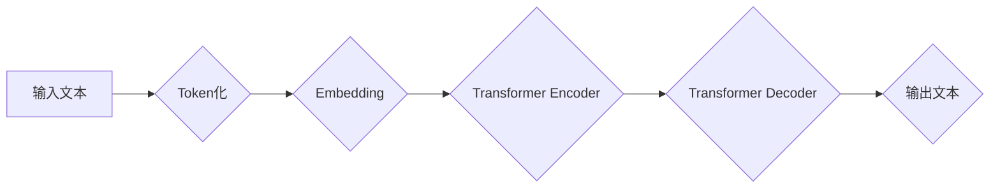

> 大语言模型、Transformer、BERT、GPT、LLM、自然语言处理、深度学习、文本生成、机器翻译

## 1. 背景介绍

近年来，深度学习技术取得了飞速发展，特别是Transformer模型的出现，为自然语言处理（NLP）领域带来了革命性的变革。大语言模型（LLM）作为Transformer模型的升级版，拥有强大的文本理解和生成能力，在文本分类、机器翻译、问答系统、代码生成等领域展现出巨大的应用潜力。

传统的NLP模型主要依赖于手工设计的特征工程，而LLM则通过学习海量文本数据，自动提取文本中的语义特征，从而实现更精准、更灵活的文本处理。

## 2. 核心概念与联系

大语言模型的核心概念包括：

* **Transformer模型:** Transformer模型是一种基于注意力机制的深度神经网络架构，能够有效捕捉文本序列中的长距离依赖关系。

* **自回归语言模型:** 自回归语言模型是一种预测下一个词的概率分布的模型，通过学习文本序列的统计规律，能够生成流畅、连贯的文本。

* **预训练与微调:** 预训练是指在大量文本数据上训练模型，学习通用语言表示；微调是指在特定任务数据上对预训练模型进行进一步训练，使其能够适应特定任务需求。

**Mermaid 流程图:**



## 3. 核心算法原理 & 具体操作步骤

### 3.1  算法原理概述

大语言模型的核心算法是Transformer模型，其主要特点是：

* **注意力机制:** 注意力机制能够帮助模型聚焦于文本序列中重要的信息，并捕捉长距离依赖关系。

* **多头注意力:** 多头注意力机制通过使用多个注意力头，能够从不同的角度捕捉文本信息，提高模型的表达能力。

* **位置编码:** 位置编码机制能够为每个词语赋予其位置信息，帮助模型理解文本序列的顺序关系。

### 3.2  算法步骤详解

1. **Token化:** 将输入文本分割成一个个独立的词语或子词，称为Token。

2. **Embedding:** 将每个Token映射到一个低维向量空间，称为词向量。

3. **Transformer Encoder:** 使用多层Transformer编码器对文本序列进行编码，提取文本的语义特征。

4. **Transformer Decoder:** 使用多层Transformer解码器对编码后的文本序列进行解码，生成目标文本序列。

5. **输出:** 将解码后的文本序列转换为可读的文本格式。

### 3.3  算法优缺点

**优点:**

* 能够有效捕捉长距离依赖关系。
* 表现能力强，在多种NLP任务中取得了优异的性能。
* 可迁移性强，预训练模型可以应用于多种下游任务。

**缺点:**

* 计算量大，训练成本高。
* 对训练数据质量要求高。
* 容易出现过拟合问题。

### 3.4  算法应用领域

* 文本分类
* 机器翻译
* 问答系统
* 代码生成
* 文本摘要
* 情感分析

## 4. 数学模型和公式 & 详细讲解 & 举例说明

### 4.1  数学模型构建

Transformer模型的核心是注意力机制，其数学模型可以表示为：

$$
Attention(Q, K, V) = softmax(\frac{QK^T}{\sqrt{d_k}})V
$$

其中：

* $Q$：查询矩阵
* $K$：键矩阵
* $V$：值矩阵
* $d_k$：键向量的维度
* $softmax$：softmax函数

### 4.2  公式推导过程

注意力机制的目的是计算每个词语与其他词语之间的相关性，并根据相关性权重来加权求和，从而得到每个词语的上下文表示。

公式推导过程如下：

1. 计算查询矩阵 $Q$ 与键矩阵 $K$ 的点积，并进行归一化处理，得到注意力权重矩阵。

2. 将注意力权重矩阵与值矩阵 $V$ 进行加权求和，得到每个词语的上下文表示。

### 4.3  案例分析与讲解

例如，在翻译句子“The cat sat on the mat”时，注意力机制可以帮助模型关注“cat”和“sat”之间的关系，从而更好地理解句子含义。

## 5. 项目实践：代码实例和详细解释说明

### 5.1  开发环境搭建

* Python 3.7+
* PyTorch 1.7+
* CUDA 10.2+

### 5.2  源代码详细实现

```python
import torch
import torch.nn as nn

class Transformer(nn.Module):
    def __init__(self, vocab_size, embedding_dim, num_heads, num_layers):
        super(Transformer, self).__init__()
        self.embedding = nn.Embedding(vocab_size, embedding_dim)
        self.encoder_layers = nn.ModuleList([EncoderLayer(embedding_dim, num_heads) for _ in range(num_layers)])
        self.decoder_layers = nn.ModuleList([DecoderLayer(embedding_dim, num_heads) for _ in range(num_layers)])

    def forward(self, src, tgt):
        src = self.embedding(src)
        tgt = self.embedding(tgt)
        # ... (Encoder and Decoder logic)
        return output

class EncoderLayer(nn.Module):
    # ... (EncoderLayer implementation)

class DecoderLayer(nn.Module):
    # ... (DecoderLayer implementation)
```

### 5.3  代码解读与分析

* `Transformer`类定义了Transformer模型的整体结构，包括嵌入层、编码器层和解码器层。
* `EncoderLayer`和`DecoderLayer`类分别定义了编码器和解码器中的每一层结构。
* `forward`方法定义了模型的输入和输出流程。

### 5.4  运行结果展示

运行模型后，可以得到预测的输出文本序列。

## 6. 实际应用场景

大语言模型在以下场景中具有广泛的应用前景：

* **聊天机器人:** 构建更智能、更自然的对话系统。
* **文本生成:** 自动生成新闻报道、小说、诗歌等文本内容。
* **机器翻译:** 实现更高效、更准确的语言翻译。
* **代码生成:** 自动生成代码片段，提高开发效率。

### 6.4  未来应用展望

随着大语言模型技术的不断发展，其应用场景将更加广泛，例如：

* **个性化教育:** 提供定制化的学习方案和教学内容。
* **医疗诊断:** 辅助医生进行疾病诊断和治疗方案制定。
* **法律服务:** 自动分析法律文件，提供法律建议。

## 7. 工具和资源推荐

### 7.1  学习资源推荐

* **论文:**
    * Attention Is All You Need (Vaswani et al., 2017)
    * BERT: Pre-training of Deep Bidirectional Transformers for Language Understanding (Devlin et al., 2018)
    * GPT-3: Language Models are Few-Shot Learners (Brown et al., 2020)
* **书籍:**
    * Deep Learning (Goodfellow et al., 2016)
    * Natural Language Processing with PyTorch (Young et al., 2019)

### 7.2  开发工具推荐

* **PyTorch:** 深度学习框架
* **TensorFlow:** 深度学习框架
* **Hugging Face Transformers:** 预训练模型库

### 7.3  相关论文推荐

* **BERT:** https://arxiv.org/abs/1810.04805
* **GPT-3:** https://arxiv.org/abs/2005.14165
* **T5:** https://arxiv.org/abs/1910.10683

## 8. 总结：未来发展趋势与挑战

### 8.1  研究成果总结

大语言模型在自然语言处理领域取得了显著的进展，展现出强大的文本理解和生成能力。

### 8.2  未来发展趋势

* **模型规模扩大:** 预计未来大语言模型的规模将进一步扩大，从而提升模型的性能和能力。
* **多模态学习:** 大语言模型将与其他模态数据（如图像、音频）进行融合，实现更全面的信息理解。
* **可解释性增强:** 研究者将致力于提高大语言模型的可解释性，使其决策过程更加透明。

### 8.3  面临的挑战

* **数据安全和隐私:** 大语言模型的训练需要大量数据，如何保证数据安全和隐私是一个重要挑战。
* **模型偏见:** 大语言模型可能存在偏见问题，需要采取措施进行缓解。
* **计算资源消耗:** 训练大语言模型需要大量的计算资源，如何降低计算成本是一个关键问题。

### 8.4  研究展望

未来，大语言模型的研究将继续深入，探索其更广泛的应用场景，并解决其面临的挑战，推动人工智能技术的发展。

## 9. 附录：常见问题与解答

* **Q: 如何训练一个大语言模型？**

* **A:** 训练大语言模型需要大量的计算资源和数据。通常需要使用分布式训练框架，并进行预训练和微调。

* **Q: 大语言模型有哪些应用场景？**

* **A:** 大语言模型在文本分类、机器翻译、问答系统、代码生成等领域具有广泛的应用前景。

* **Q: 如何评估大语言模型的性能？**

* **A:** 大语言模型的性能通常通过BLEU、ROUGE等指标进行评估。

作者：禅与计算机程序设计艺术 / Zen and the Art of Computer Programming


<end_of_turn>