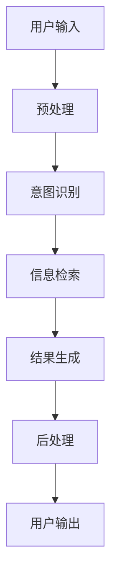

                 

## 大模型问答机器人的对话式交互

> 关键词：大模型、问答机器人、对话式交互、自然语言处理、深度学习、推荐系统

## 1. 背景介绍

随着人工智能的飞速发展，大模型问答机器人已经成为现代信息服务的重要组成部分。这些系统能够理解并回答用户的自然语言查询，提供高效、准确的信息获取渠道。本文将深入探讨大模型问答机器人背后的核心概念、算法原理，并提供实践指南和工具推荐。

## 2. 核心概念与联系

### 2.1 关键概念

- **大模型（Large Model）**：指具有数十亿参数的深度学习模型，能够表示复杂的数据分布和学习能力。
- **问答机器人（Question Answering System）**：一种信息检索系统，能够理解并回答用户的自然语言查询。
- **对话式交互（Conversational Interaction）**：指人机交互的一种形式，通过自然语言对话实现信息交流。

### 2.2 核心架构

大模型问答机器人通常由以下组件组成：



## 3. 核心算法原理 & 具体操作步骤

### 3.1 算法原理概述

大模型问答机器人通常基于深度学习和自然语言处理技术构建。其核心算法包括：

- **意图识别（Intent Recognition）**：理解用户输入的意图，如查询、命令等。
- **信息检索（Information Retrieval）**：检索与用户意图相关的信息。
- **结果生成（Result Generation）**：根据检索结果生成人类可读的答案。

### 3.2 算法步骤详解

1. **预处理（Preprocessing）**：清洗、分词、去除停用词等。
2. **意图识别（Intent Recognition）**：使用分类算法（如神经网络）识别用户意图。
3. **信息检索（Information Retrieval）**：使用向量空间模型、语义搜索等算法检索相关信息。
4. **结果生成（Result Generation）**：使用序列到序列模型（如Transformer）生成人类可读的答案。
5. **后处理（Postprocessing）**：格式化、过滤等。

### 3.3 算法优缺点

- **优点**：能够理解并回答复杂的自然语言查询，提供高效的信息获取渠道。
- **缺点**：对大规模数据集和计算资源的需求高，模型泛化能力有待提高。

### 3.4 算法应用领域

- **客户服务**：提供24/7在线客服支持。
- **信息检索**：帮助用户快速找到所需信息。
- **教育**：提供个性化学习资源推荐。

## 4. 数学模型和公式 & 详细讲解 & 举例说明

### 4.1 数学模型构建

大模型问答机器人通常基于神经网络构建。其数学模型可以表示为：

$$M(\theta) = f(x; \theta)$$

其中，$M(\theta)$表示模型，$f$表示模型的函数表达，$x$表示输入数据，$\theta$表示模型参数。

### 4.2 公式推导过程

模型参数$\theta$通常通过最大化对数似然函数来学习：

$$\theta^* = \arg\max_{\theta} \log P(y|x;\theta)$$

其中，$y$表示标签，$P(y|x;\theta)$表示模型的条件概率分布。

### 4.3 案例分析与讲解

例如，在意图识别任务中，输入$x$为用户查询，标签$y$为意图类别。模型$M(\theta)$学习表示用户查询的特征，并预测意图类别。

## 5. 项目实践：代码实例和详细解释说明

### 5.1 开发环境搭建

- **硬件**：GPU加速的计算机。
- **软件**：Python、PyTorch、Transformers库等。

### 5.2 源代码详细实现

```python
import torch
from transformers import AutoTokenizer, AutoModelForQuestionAnswering

# 加载预训练模型
model = AutoModelForQuestionAnswering.from_pretrained("distilbert-base-cased-distilled-squad")
tokenizer = AutoTokenizer.from_pretrained("distilbert-base-cased-distilled-squad")

# 编码输入数据
inputs = tokenizer(question="Who was Jim Henson?", context="Jim Henson was an American puppeteer who created The Muppets.")
input_ids = inputs["input_ids"]
attention_mask = inputs["attention_mask"]

# 前向传播
with torch.no_grad():
    outputs = model(input_ids, attention_mask=attention_mask)

# 提取答案
answer_start_index = torch.argmax(outputs.start_logits)
answer_end_index = torch.argmax(outputs.end_logits)
answer_tokens = input_ids[answer_start_index : answer_end_index + 1]
answer = tokenizer.decode(answer_tokens)
```

### 5.3 代码解读与分析

本例使用预训练的DistilBERT模型进行问答任务。模型首先对输入数据进行编码，然后进行前向传播，最后提取答案。

### 5.4 运行结果展示

运行结果为："Jim Henson"

## 6. 实际应用场景

### 6.1 当前应用

- **搜索引擎**：提供基于查询的信息检索。
- **虚拟助手**：提供个性化信息服务。

### 6.2 未来应用展望

- **教育**：提供个性化学习资源推荐。
- **医疗**：提供个性化健康咨询。

## 7. 工具和资源推荐

### 7.1 学习资源推荐

- **课程**：Stanford CS224n Natural Language Processing with Deep Learning。
- **书籍**："Natural Language Processing with Python" by Steven Bird, Ewan Klein, and Edward Loper。

### 7.2 开发工具推荐

- **框架**：PyTorch、TensorFlow。
- **库**：Transformers、Hugging Face。

### 7.3 相关论文推荐

- "BERT: Pre-training of Deep Bidirectional Transformers for Language Understanding" by Jacob Devlin and Ming-Wei Chang.

## 8. 总结：未来发展趋势与挑战

### 8.1 研究成果总结

大模型问答机器人已经取得了显著的进展，能够理解并回答复杂的自然语言查询。

### 8.2 未来发展趋势

- **多模式交互**：结合图像、语音等多模式信息。
- **跨语言问答**：支持多种语言的问答任务。

### 8.3 面临的挑战

- **模型泛化**：提高模型在未见数据上的表现。
- **计算资源**：降低大规模模型的计算需求。

### 8.4 研究展望

未来的研究将聚焦于提高模型泛化能力、降低计算需求，并扩展到新的应用领域。

## 9. 附录：常见问题与解答

**Q：大模型问答机器人与搜索引擎有何区别？**

**A：大模型问答机器人能够理解并回答复杂的自然语言查询，而搜索引擎通常基于关键词检索信息。**

---

作者：禅与计算机程序设计艺术 / Zen and the Art of Computer Programming

