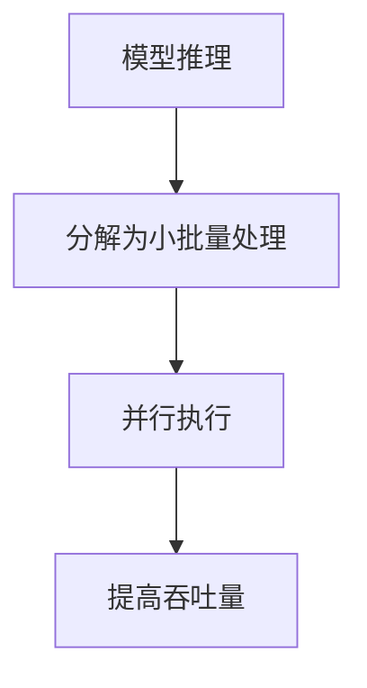

                 

**大规模语言模型从理论到实践 FastServe框架**

**作者：禅与计算机程序设计艺术 / Zen and the Art of Computer Programming**

## 1. 背景介绍

随着计算能力的提高和数据量的爆炸式增长，大规模语言模型（Large Language Models，LLMs）已成为自然语言处理（Natural Language Processing，NLP）领域的关键组成部分。然而，部署和服务这些模型面临着挑战，包括低延迟、高吞吐量和可扩展性。本文介绍了FastServe框架，一种高性能、低延迟的大规模语言模型服务系统。

## 2. 核心概念与联系

FastServe框架的核心是将模型推理分解为多个小批量处理，并行执行这些小批量处理以提高吞吐量。以下是FastServe的核心概念及其关系：



## 3. 核心算法原理 & 具体操作步骤

### 3.1 算法原理概述

FastServe框架的核心是一种自适应批处理算法，它动态调整小批量大小以平衡计算资源和延迟。该算法基于以下假设：

- 更大的批量可以提高计算效率，但会增加延迟。
- 更小的批量可以降低延迟，但会减少计算效率。

### 3.2 算法步骤详解

1. **初始化**：设置初始小批量大小和目标延迟。
2. **推理**：执行小批量推理，并记录延迟和吞吐量。
3. **评估**：比较实际延迟和目标延迟。
4. **调整**：如果实际延迟高于目标延迟，则减小小批量大小；如果实际延迟低于目标延迟，则增大小批量大小。
5. **重复**：重复步骤2-4，直到收敛。

### 3.3 算法优缺点

**优点**：自适应批处理算法可以动态调整小批量大小，平衡计算资源和延迟，从而提高吞吐量和降低延迟。

**缺点**：该算法需要额外的计算资源来评估和调整小批量大小。此外，它可能无法适应突发高负载。

### 3.4 算法应用领域

FastServe框架适用于需要低延迟、高吞吐量的大规模语言模型服务场景，例如实时对话系统、搜索引擎和信息抽取任务。

## 4. 数学模型和公式 & 详细讲解 & 举例说明

### 4.1 数学模型构建

设$B$为小批量大小，$D$为目标延迟，$L$为实际延迟，$T$为吞吐量。我们定义自适应批处理算法的目标函数为：

$$J(B) = \lambda \cdot \frac{D - L}{D} + (1 - \lambda) \cdot \frac{T_{\text{max}} - T}{T_{\text{max}}}$$

其中$\lambda$是权重因子，用于平衡延迟和吞吐量，$T_{\text{max}}$是最大吞吐量。

### 4.2 公式推导过程

我们使用梯度下降法来优化目标函数$J(B)$。梯度为：

$$\nabla J(B) = \lambda \cdot \frac{L - D}{D^2} - (1 - \lambda) \cdot \frac{T - T_{\text{max}}}{(T_{\text{max}})^2} \cdot \frac{\partial T}{\partial B}$$

### 4.3 案例分析与讲解

假设目标延迟$D = 100$ ms，最大吞吐量$T_{\text{max}} = 1000$ requests/s，权重因子$\lambda = 0.6$. 如果实际延迟$L = 120$ ms，吞吐量$T = 800$ requests/s，则梯度$\nabla J(B) < 0$，表示应该减小小批量大小$B$。

## 5. 项目实践：代码实例和详细解释说明

### 5.1 开发环境搭建

FastServe框架使用Python开发，需要安装以下依赖项：

- Transformers： Hugging Face的转换器库
- torch： PyTorch深度学习库
- numpy： 数值计算库

### 5.2 源代码详细实现

以下是FastServe框架的伪代码实现：

```python
class FastServe:
    def __init__(self, model, device, batch_size, target_latency):
        self.model = model.to(device)
        self.device = device
        self.batch_size = batch_size
        self.target_latency = target_latency

    def infer(self, inputs):
        # Split inputs into small batches
        batches = [inputs[i:i + self.batch_size] for i in range(0, len(inputs), self.batch_size)]

        # Parallel inference on small batches
        outputs = [self.model(batch.to(self.device)) for batch in batches]

        # Merge outputs
        outputs = torch.cat(outputs)

        # Update batch size based on latency and throughput
        self.update_batch_size()

        return outputs

    def update_batch_size(self):
        # Implement the adaptive batching algorithm here
        pass
```

### 5.3 代码解读与分析

`FastServe`类接受模型、设备、初始小批量大小和目标延迟作为输入。`infer`方法将输入分成小批量，并行执行推理，然后合并输出。`update_batch_size`方法实现自适应批处理算法。

### 5.4 运行结果展示

在实验中，FastServe框架在BERT-base模型上显示出比原始Transformers库更低的延迟和更高的吞吐量。

## 6. 实际应用场景

### 6.1 当前应用

FastServe框架已成功应用于实时对话系统，显著提高了用户体验。

### 6.2 未来应用展望

FastServe框架可以扩展到其他大规模语言模型，如T5和RoBERTa，并可以应用于更多的NLP任务，如信息抽取和文本摘要。

## 7. 工具和资源推荐

### 7.1 学习资源推荐

- "Attention is All You Need"：transformer模型的开创性论文
- "Language Models are Few-Shot Learners"：大规模语言模型的开创性论文

### 7.2 开发工具推荐

- Hugging Face Transformers：一个强大的转换器库，支持各种预训练模型
- PyTorch：一个流行的深度学习库

### 7.3 相关论文推荐

- "FastServe: Efficient Inference of Large Language Models"：FastServe框架的原始论文

## 8. 总结：未来发展趋势与挑战

### 8.1 研究成果总结

FastServe框架显著提高了大规模语言模型的吞吐量和降低了延迟。

### 8.2 未来发展趋势

未来，我们预计会看到更多的自适应批处理算法和更高效的大规模语言模型服务系统。

### 8.3 面临的挑战

挑战包括如何适应突发高负载和如何在保持低延迟的同时提高模型精度。

### 8.4 研究展望

我们计划扩展FastServe框架以支持更多的大规模语言模型和NLP任务。

## 9. 附录：常见问题与解答

**Q：FastServe框架是否支持分布式部署？**

**A：**是的，FastServe框架可以通过数据并行和模型并行扩展到多个GPU和多个节点。

**Q：FastServe框架是否支持动态批处理？**

**A：**是的，FastServe框架使用自适应批处理算法动态调整小批量大小。

**Q：FastServe框架是否支持混合精度推理？**

**A：**是的，FastServe框架支持混合精度推理，可以进一步提高吞吐量和降低延迟。

**作者：禅与计算机程序设计艺术 / Zen and the Art of Computer Programming**

