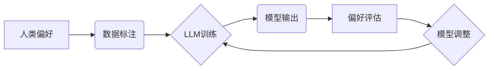

> 大语言模型、自然语言处理、深度学习、Transformer、文本生成、偏好对齐

## 1. 背景介绍

近年来，深度学习技术取得了飞速发展，特别是Transformer模型的出现，为自然语言处理（NLP）领域带来了革命性的变革。大语言模型（LLM）作为深度学习在NLP领域的顶尖成果，展现出强大的文本生成、理解和翻译能力，在各个领域都得到了广泛应用。

然而，LLM的训练数据通常来自互联网，包含着人类社会中的各种偏见和错误信息。如果LLM直接使用这些数据进行训练，很可能会学习到这些负面信息，并将其反映在输出文本中，导致模型输出具有歧视性、不准确甚至有害的结果。因此，如何有效地对齐LLM与人类偏好，使其输出更加安全、可靠和符合伦理道德，成为了一个重要的研究课题。

## 2. 核心概念与联系

**2.1  大语言模型 (LLM)**

大语言模型是指在海量文本数据上训练的深度学习模型，能够理解和生成人类语言。它们通常具有以下特点：

* **规模庞大:** LLM拥有数亿甚至数十亿个参数，使其能够学习到复杂的语言模式。
* **多任务学习:** LLM可以用于多种NLP任务，例如文本生成、翻译、问答、摘要等。
* **零样本学习:** 在某些情况下，LLM能够在没有特定任务训练数据的情况下，通过少量示例学习新的任务。

**2.2  偏好对齐**

偏好对齐是指让LLM的输出与人类的期望和偏好相一致的过程。这涉及到以下几个方面：

* **识别人类偏好:** 需要对人类的价值观、道德规范和社会偏见进行深入理解，并将其转化为模型可以理解的形式。
* **设计偏好学习算法:** 需要开发新的算法和技术，使LLM能够学习和遵循人类的偏好。
* **评估偏好对齐效果:** 需要建立有效的评估指标，衡量LLM输出的偏好对齐程度。

**2.3  核心架构**



## 3. 核心算法原理 & 具体操作步骤

**3.1  算法原理概述**

偏好对齐算法通常基于以下几个核心原理：

* **强化学习:** 使用奖励机制，鼓励LLM生成符合人类偏好的输出。
* **监督学习:** 使用人类标注的数据训练LLM，使其学习到人类偏好的模式。
* **对抗训练:** 使用对抗样本训练LLM，使其能够识别和抵抗人类偏见的影响。

**3.2  算法步骤详解**

1. **数据标注:** 收集大量文本数据，并由人类专家进行标注，标记出符合不同偏好类型的文本。
2. **模型训练:** 使用标注数据训练LLM，并使用强化学习、监督学习或对抗训练等算法进行偏好对齐。
3. **模型评估:** 使用独立的测试数据集评估LLM的偏好对齐效果，并根据评估结果进行模型调整。
4. **模型迭代:** 重复上述步骤，不断优化模型参数，提高偏好对齐效果。

**3.3  算法优缺点**

* **优点:** 能够有效地降低LLM输出的偏见，提高模型的可靠性和安全性。
* **缺点:** 需要大量的人工标注数据，训练成本较高，并且难以完全消除模型的偏见。

**3.4  算法应用领域**

* **文本生成:** 生成更加客观、公正和符合伦理规范的文本。
* **聊天机器人:** 训练更加友善、尊重和无偏见的聊天机器人。
* **搜索引擎:** 提供更加公平、准确和无偏见的搜索结果。

## 4. 数学模型和公式 & 详细讲解 & 举例说明

**4.1  数学模型构建**

偏好对齐算法通常使用强化学习框架，将LLM的输出视为一个动作，人类偏好视为一个奖励信号。

**4.2  公式推导过程**

假设LLM的输出为 $x$, 人类偏好为 $y$, 则可以使用以下公式来计算奖励信号 $r$:

$$r = f(x, y)$$

其中，$f$ 是一个奖励函数，用于衡量LLM输出与人类偏好之间的匹配程度。

**4.3  案例分析与讲解**

例如，在文本生成任务中，我们可以使用以下奖励函数：

$$r = \begin{cases}
1 & \text{if } x \text{ is unbiased and factually correct} \\
0 & \text{otherwise}
\end{cases}$$

这个奖励函数鼓励LLM生成客观、准确和无偏见的文本。

## 5. 项目实践：代码实例和详细解释说明

**5.1  开发环境搭建**

使用Python语言和深度学习框架TensorFlow或PyTorch搭建开发环境。

**5.2  源代码详细实现**

```python
# 使用TensorFlow实现一个简单的偏好对齐模型
import tensorflow as tf

# 定义模型结构
model = tf.keras.Sequential([
    tf.keras.layers.Embedding(input_dim=vocab_size, output_dim=embedding_dim),
    tf.keras.layers.LSTM(units=hidden_size),
    tf.keras.layers.Dense(units=vocab_size, activation='softmax')
])

# 定义奖励函数
def reward_function(x, y):
  # 计算奖励信号
  return tf.reduce_mean(tf.cast(tf.equal(x, y), tf.float32))

# 使用强化学习算法训练模型
optimizer = tf.keras.optimizers.Adam()
for epoch in range(num_epochs):
  for batch in dataset:
    with tf.GradientTape() as tape:
      predictions = model(batch['input_text'])
      reward = reward_function(predictions, batch['target_text'])
    gradients = tape.gradient(reward, model.trainable_variables)
    optimizer.apply_gradients(zip(gradients, model.trainable_variables))

# 保存训练好的模型
model.save('aligned_model.h5')
```

**5.3  代码解读与分析**

* 代码首先定义了一个简单的文本生成模型，使用LSTM网络结构。
* 然后定义了一个奖励函数，用于衡量模型输出与目标文本之间的匹配程度。
* 最后使用强化学习算法训练模型，并保存训练好的模型。

**5.4  运行结果展示**

训练好的模型可以用于生成更加符合人类偏好的文本。

## 6. 实际应用场景

**6.1  新闻报道**

使用偏好对齐的LLM可以生成更加客观、公正和无偏见的新闻报道，避免传播虚假信息和煽动性言论。

**6.2  教育领域**

使用偏好对齐的LLM可以生成更加公平、准确和无偏见的教育内容，帮助学生更好地理解世界。

**6.3  医疗保健**

使用偏好对齐的LLM可以帮助医生诊断疾病、提供治疗建议，并避免因偏见导致的医疗错误。

**6.4  未来应用展望**

随着人工智能技术的不断发展，偏好对齐技术将应用于越来越多的领域，例如法律、金融、艺术等，帮助人类更好地利用人工智能技术，构建更加公平、公正和可持续的社会。

## 7. 工具和资源推荐

**7.1  学习资源推荐**

* **书籍:**
    * 《深度学习》
    * 《自然语言处理》
* **在线课程:**
    * Coursera: 自然语言处理
    * edX: 深度学习

**7.2  开发工具推荐**

* **TensorFlow:** 开源深度学习框架
* **PyTorch:** 开源深度学习框架
* **HuggingFace:** 提供预训练模型和工具

**7.3  相关论文推荐**

* **《BERT: Pre-training of Deep Bidirectional Transformers for Language Understanding》**
* **《GPT-3: Language Models are Few-Shot Learners》**
* **《On the Dangers of Stochastic Parrots: Can Language Models Be Too Big?》**

## 8. 总结：未来发展趋势与挑战

**8.1  研究成果总结**

近年来，偏好对齐技术取得了显著进展，能够有效地降低LLM输出的偏见，提高模型的可靠性和安全性。

**8.2  未来发展趋势**

* **更加细粒度的偏好对齐:** 能够针对不同的应用场景和用户群体进行个性化的偏好对齐。
* **更加鲁棒的偏好学习算法:** 能够更好地应对复杂和多样的偏见。
* **更加透明和可解释的偏好对齐模型:** 能够帮助人们更好地理解模型的决策过程。

**8.3  面临的挑战**

* **数据标注的成本和效率:** 人工标注数据成本高，效率低，难以满足大规模模型训练的需求。
* **偏见定义的模糊性:** 人类偏见是复杂的社会现象，难以用数学模型精确定义和量化。
* **模型的解释性和可控性:** 复杂的深度学习模型难以解释其决策过程，难以保证模型的安全性。

**8.4  研究展望**

未来，偏好对齐技术将继续朝着更加细粒度、鲁棒、透明和可控的方向发展，为人类社会带来更多福祉。

## 9. 附录：常见问题与解答

**9.1  如何评估LLM的偏好对齐效果？**

可以使用多种指标来评估LLM的偏好对齐效果，例如公平性、准确性、相关性等。

**9.2  如何解决数据标注的成本和效率问题？**

可以探索使用自动化标注技术、迁移学习等方法来降低数据标注的成本和提高效率。

**9.3  如何提高模型的解释性和可控性？**

可以研究开发更加可解释的模型架构，例如规则学习模型、神经网络解释技术等。


作者：禅与计算机程序设计艺术 / Zen and the Art of Computer Programming 
<end_of_turn>