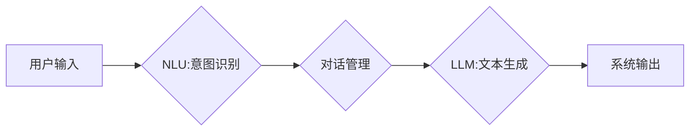

> 大语言模型，Assistants API，自然语言处理，文本生成，对话系统，机器学习，深度学习

## 1. 背景介绍

近年来，大语言模型（LLM）在自然语言处理（NLP）领域取得了显著进展，展现出强大的文本生成、理解和对话能力。这些模型通过学习海量文本数据，掌握了语言的语法、语义和上下文关系，能够完成各种复杂的任务，例如文本摘要、机器翻译、问答系统和对话机器人等。

Assistants API 是基于大语言模型开发的应用程序编程接口，为开发者提供了一种便捷的方式，可以将 LLM 的强大功能集成到自己的应用程序中。通过使用 Assistants API，开发者可以轻松构建出能够理解和响应用户自然语言的智能助手，提升用户体验和应用价值。

## 2. 核心概念与联系

**2.1  大语言模型 (LLM)**

大语言模型是一种基于深度学习的强大人工智能模型，能够理解和生成人类语言。它们通常由 Transformer 架构构成，并通过训练海量文本数据来学习语言的复杂模式和规律。

**2.2  Assistants API**

Assistants API 是一个应用程序编程接口，允许开发者将大语言模型的强大功能集成到自己的应用程序中。它提供了一系列预定义的接口和功能，例如文本生成、对话管理、知识查询等，简化了开发者使用 LLM 的流程。

**2.3  自然语言处理 (NLP)**

自然语言处理是人工智能的一个分支，致力于使计算机能够理解、处理和生成人类语言。它涉及到许多技术，例如词法分析、语法分析、语义分析和文本生成等。

**2.4  对话系统**

对话系统是一种能够与用户进行自然语言交互的应用程序。它通常由自然语言理解（NLU）和自然语言生成（NLG）两个模块组成，NLU 用于理解用户的意图和信息，NLG 用于生成相应的回复。

**2.5  流程图**



## 3. 核心算法原理 & 具体操作步骤

**3.1  算法原理概述**

Assistants API 的核心算法原理是基于 Transformer 架构的深度学习模型。Transformer 模型通过自注意力机制学习文本序列之间的关系，能够捕捉长距离依赖和上下文信息，从而实现更准确的文本理解和生成。

**3.2  算法步骤详解**

1. **预处理:** 用户输入的文本首先进行预处理，例如分词、词形还原和标记化等，将其转换为模型可以理解的格式。
2. **编码:** 预处理后的文本输入到 Transformer 模型的编码器中，编码器通过多层 Transformer 块进行处理，将文本表示为一个向量序列，每个向量代表一个词的语义信息。
3. **解码:** 编码后的向量序列输入到 Transformer 模型的解码器中，解码器通过自注意力机制和解码器层进行处理，生成一个概率分布，表示每个词的可能性。
4. **生成:** 根据概率分布，选择最可能的词作为输出，并将其添加到生成的文本序列中。重复步骤 3 和 4，直到生成一个完整的回复。

**3.3  算法优缺点**

**优点:**

* 能够捕捉长距离依赖和上下文信息，实现更准确的文本理解和生成。
* 训练效率高，能够在海量数据上进行高效训练。
* 可迁移性强，可以应用于多种 NLP 任务。

**缺点:**

* 模型参数量大，需要大量的计算资源进行训练和推理。
* 训练数据对模型性能有很大影响，需要高质量的训练数据。
* 容易受到恶意输入的影响，需要进行安全性和鲁棒性方面的研究。

**3.4  算法应用领域**

* **对话系统:** 构建能够进行自然语言交互的智能助手。
* **文本生成:** 生成各种类型的文本，例如文章、故事、诗歌等。
* **机器翻译:** 将文本从一种语言翻译成另一种语言。
* **问答系统:** 回答用户提出的问题。
* **文本摘要:** 生成文本的简短摘要。

## 4. 数学模型和公式 & 详细讲解 & 举例说明

**4.1  数学模型构建**

Transformer 模型的核心是自注意力机制和多头注意力机制。

**自注意力机制:**

自注意力机制允许模型关注输入序列中的不同位置，并计算每个词与其他词之间的相关性。

公式:

$$
Attention(Q, K, V) = softmax(\frac{QK^T}{\sqrt{d_k}})V
$$

其中:

* Q: 查询矩阵
* K: 键矩阵
* V: 值矩阵
* $d_k$: 键向量的维度

**多头注意力机制:**

多头注意力机制将自注意力机制应用于多个不同的子空间，并通过拼接和线性变换将结果融合在一起。

公式:

$$
MultiHead(Q, K, V) = Concat(head_1, head_2, ..., head_h)W^O
$$

其中:

* $head_i$: 第 i 个子空间的注意力输出
* h: 多头数量
* $W^O$: 线性变换矩阵

**4.2  公式推导过程**

自注意力机制的 softmax 函数用于计算每个词与其他词之间的相关性，并将相关性转化为概率分布。

多头注意力机制通过将自注意力机制应用于多个子空间，可以捕捉到不同层次的语义信息，从而提高模型的表达能力。

**4.3  案例分析与讲解**

例如，在翻译句子 "The cat sat on the mat" 时，自注意力机制可以帮助模型理解 "cat" 和 "sat" 之间的动宾关系，而多头注意力机制可以捕捉到 "mat" 和 "on" 之间的空间关系。

## 5. 项目实践：代码实例和详细解释说明

**5.1  开发环境搭建**

* Python 3.7+
* TensorFlow 或 PyTorch
* CUDA 和 cuDNN (可选)

**5.2  源代码详细实现**

```python
import tensorflow as tf

# 定义 Transformer 模型
class Transformer(tf.keras.Model):
    def __init__(self, vocab_size, embedding_dim, num_heads, num_layers):
        super(Transformer, self).__init__()
        self.embedding = tf.keras.layers.Embedding(vocab_size, embedding_dim)
        self.transformer_layers = [
            tf.keras.layers.MultiHeadAttention(num_heads=num_heads, key_dim=embedding_dim)
            for _ in range(num_layers)
        ]
        self.dense = tf.keras.layers.Dense(vocab_size)

    def call(self, inputs):
        # Embedding
        x = self.embedding(inputs)
        # Transformer layers
        for layer in self.transformer_layers:
            x = layer(x)
        # Output
        x = self.dense(x)
        return x

# 实例化模型
model = Transformer(vocab_size=10000, embedding_dim=512, num_heads=8, num_layers=6)

# 训练模型
# ...

# 推理模型
# ...
```

**5.3  代码解读与分析**

* `Transformer` 类定义了 Transformer 模型的结构。
* `embedding` 层将输入词转换为向量表示。
* `transformer_layers` 列表包含多个 `MultiHeadAttention` 层，用于进行多头注意力机制。
* `dense` 层将 Transformer 输出转换为概率分布。

**5.4  运行结果展示**

训练完成后，模型可以用于生成文本、翻译文本、回答问题等各种 NLP 任务。

## 6. 实际应用场景

**6.1  智能客服**

Assistants API 可以用于构建智能客服系统，能够自动回答用户常见问题，提供24/7 的服务，提高客户满意度。

**6.2  个性化推荐**

Assistants API 可以分析用户的行为数据和偏好，提供个性化的产品或内容推荐，提升用户体验和转化率。

**6.3  教育辅助**

Assistants API 可以用于开发教育辅助工具，例如智能辅导系统、在线问答平台等，帮助学生学习和理解知识。

**6.4  未来应用展望**

随着大语言模型的不断发展，Assistants API 将在更多领域得到应用，例如医疗诊断、法律咨询、金融分析等，为人类社会带来更多便利和价值。

## 7. 工具和资源推荐

**7.1  学习资源推荐**

* **论文:** "Attention Is All You Need"
* **博客:** OpenAI Blog, Hugging Face Blog
* **课程:** Stanford CS224N, DeepLearning.AI

**7.2  开发工具推荐**

* **TensorFlow:** https://www.tensorflow.org/
* **PyTorch:** https://pytorch.org/
* **Hugging Face Transformers:** https://huggingface.co/transformers/

**7.3  相关论文推荐**

* "BERT: Pre-training of Deep Bidirectional Transformers for Language Understanding"
* "GPT-3: Language Models are Few-Shot Learners"
* "T5: Text-to-Text Transfer Transformer"

## 8. 总结：未来发展趋势与挑战

**8.1  研究成果总结**

近年来，大语言模型在自然语言处理领域取得了显著进展，Assistants API 为开发者提供了便捷的方式，将 LLM 的强大功能集成到自己的应用程序中。

**8.2  未来发展趋势**

* 模型规模和能力的进一步提升
* 更高效的训练和推理算法
* 更广泛的应用场景和领域
* 更加安全、可靠和可解释的模型

**8.3  面临的挑战**

* 数据获取和质量问题
* 模型训练成本和效率问题
* 安全性和鲁棒性问题
* 伦理和社会影响问题

**8.4  研究展望**

未来，大语言模型和 Assistants API 将继续朝着更强大、更智能、更安全的方向发展，为人类社会带来更多创新和价值。

## 9. 附录：常见问题与解答

**9.1  Q: 如何选择合适的 Assistants API？**

**A:** 选择合适的 Assistants API 需要考虑以下因素:

* 模型能力和性能
* 支持的语言和功能
* 价格和使用限制
* 开发者文档和社区支持

**9.2  Q: 如何训练自己的 Assistants API？**

**A:** 训练自己的 Assistants API 需要大量的文本数据、计算资源和专业知识。

**9.3  Q: Assistants API 是否会取代人类工作？**

**A:** Assistants API 可以自动化许多重复性任务，但它并不会完全取代人类工作。人类仍然需要发挥创造力、批判性思维和情感智能等方面的优势。


作者：禅与计算机程序设计艺术 / Zen and the Art of Computer Programming 
<end_of_turn>