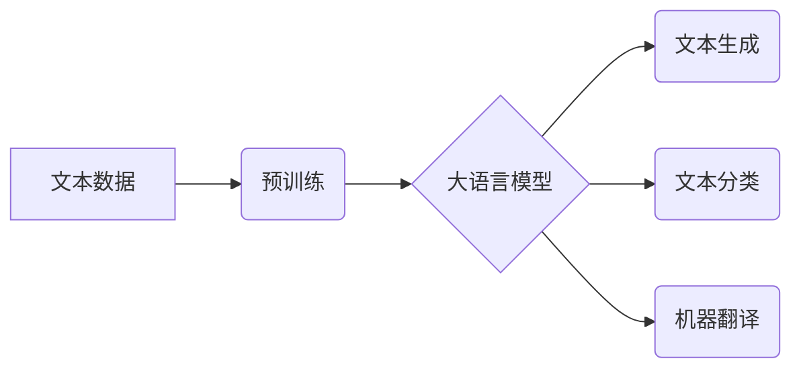

> 大语言模型、应用指南、自然语言处理、文本生成、机器学习、深度学习、Transformer

## 1. 背景介绍

近年来，大语言模型（LLM）在自然语言处理（NLP）领域取得了突破性的进展，展现出强大的文本生成、翻译、摘要、问答等能力。这些模型基于深度学习架构，能够学习和理解复杂的语言结构和语义关系。随着模型规模和训练数据的不断增长，LLM的性能不断提升，并逐渐应用于各个领域，例如聊天机器人、内容创作、代码生成等。

然而，LLM的应用并非一蹴而就，需要根据具体场景选择合适的模型和应用策略。本指南旨在为开发者和研究者提供一个从入门到精通的LLM应用指南，涵盖从核心概念到实际应用的各个方面。

## 2. 核心概念与联系

### 2.1  大语言模型（LLM）

大语言模型是指能够处理和生成大量文本数据的深度学习模型。它们通常基于Transformer架构，并通过大量的文本数据进行预训练。预训练过程使得LLM具备了广泛的语言理解和生成能力。

### 2.2  自然语言处理（NLP）

自然语言处理是指计算机理解、处理和生成人类语言的技术。NLP的任务包括文本分类、情感分析、机器翻译、文本摘要等。LLM在NLP领域发挥着越来越重要的作用，为许多NLP任务提供了强大的工具。

### 2.3  深度学习

深度学习是一种机器学习的子领域，它利用多层神经网络来模拟人类大脑的学习过程。深度学习模型能够从海量数据中学习复杂的特征和模式，从而实现更精准的预测和生成。

**Mermaid 流程图**



## 3. 核心算法原理 & 具体操作步骤

### 3.1  算法原理概述

LLM的核心算法是Transformer架构，它是一种基于注意力机制的神经网络结构。注意力机制能够帮助模型关注输入序列中重要的信息，从而提高模型的理解和生成能力。

Transformer架构由编码器和解码器两部分组成。编码器负责将输入文本序列编码成一个固定长度的向量表示，解码器则根据编码后的向量表示生成输出文本序列。

### 3.2  算法步骤详解

1. **词嵌入:** 将输入文本中的每个词转换为一个低维向量表示。
2. **编码器:** 将词向量序列输入到编码器中，编码器通过多层Transformer模块进行处理，最终将输入序列编码成一个固定长度的向量表示。
3. **解码器:** 将编码后的向量表示输入到解码器中，解码器通过多层Transformer模块进行处理，并根据每个时间步的输出生成一个词的预测概率分布。
4. **生成:** 根据预测概率分布选择最可能的词作为输出，并重复步骤3，直到生成完整的输出文本序列。

### 3.3  算法优缺点

**优点:**

* **强大的文本理解和生成能力:** Transformer架构能够学习复杂的语言结构和语义关系，从而实现更精准的文本理解和生成。
* **并行化训练:** Transformer架构能够并行化训练，从而提高训练效率。
* **可扩展性:** Transformer架构可以轻松扩展到更大的模型规模和训练数据。

**缺点:**

* **训练成本高:** 训练大型LLM需要大量的计算资源和时间。
* **参数量大:** LLMs通常拥有大量的参数，这使得模型部署和推理成本较高。
* **可解释性差:** Transformer架构的内部机制较为复杂，难以解释模型的决策过程。

### 3.4  算法应用领域

LLM在以下领域具有广泛的应用前景:

* **聊天机器人:** 开发更智能、更自然的对话系统。
* **内容创作:** 自动生成文章、故事、诗歌等文本内容。
* **代码生成:** 自动生成代码，提高开发效率。
* **机器翻译:** 实现更准确、更流畅的机器翻译。
* **文本摘要:** 自动生成文本摘要，节省时间和精力。

## 4. 数学模型和公式 & 详细讲解 & 举例说明

### 4.1  数学模型构建

LLM的数学模型主要基于概率论和统计学。模型的目标是学习一个概率分布，该分布能够描述输入文本序列和输出文本序列之间的关系。

### 4.2  公式推导过程

Transformer架构的核心是注意力机制。注意力机制通过计算输入序列中每个词与输出序列中每个词之间的相关性，来确定哪些词对输出序列的影响更大。

注意力机制的计算公式如下:

$$
Attention(Q, K, V) = softmax(\frac{QK^T}{\sqrt{d_k}})V
$$

其中:

* $Q$ 是查询矩阵，表示输出序列中每个词的向量表示。
* $K$ 是键矩阵，表示输入序列中每个词的向量表示。
* $V$ 是值矩阵，表示输入序列中每个词的向量表示。
* $d_k$ 是键向量的维度。

### 4.3  案例分析与讲解

假设我们有一个输入序列 "The cat sat on the mat"，输出序列为 "猫坐在垫子上"。

在注意力机制计算过程中，模型会计算每个词在输出序列中对其他词的影响。例如，"cat" 会对 "猫" 的生成产生较大的影响，而 "mat" 会对 "垫子" 的生成产生较大的影响。

通过注意力机制，模型能够更好地理解句子结构和语义关系，从而生成更准确、更流畅的文本。

## 5. 项目实践：代码实例和详细解释说明

### 5.1  开发环境搭建

为了使用LLM，需要搭建相应的开发环境。常用的开发环境包括:

* **Python:** Python 是机器学习和深度学习的常用编程语言。
* **PyTorch/TensorFlow:** PyTorch 和 TensorFlow 是流行的深度学习框架。
* **Hugging Face Transformers:** Hugging Face Transformers 是一个开源库，提供预训练的LLM模型和相关的工具。

### 5.2  源代码详细实现

以下是一个使用Hugging Face Transformers库生成文本的简单代码示例:

```python
from transformers import pipeline

generator = pipeline("text-generation", model="gpt2")

text = "The quick brown fox jumps over the"
output = generator(text, max_length=50, num_return_sequences=3)

for sequence in output:
    print(sequence["generated_text"])
```

### 5.3  代码解读与分析

* `pipeline("text-generation", model="gpt2")`: 创建一个文本生成管道，使用预训练的GPT-2模型。
* `text`: 输入文本。
* `max_length`: 生成的文本最大长度。
* `num_return_sequences`: 生成的文本序列数量。

代码会根据输入文本生成3个不同的文本序列，每个序列长度不超过50个词。

### 5.4  运行结果展示

运行代码后，会输出3个不同的文本序列，例如:

```
The quick brown fox jumps over the lazy dog.
The quick brown fox jumps over the fence.
The quick brown fox jumps over the moon.
```

## 6. 实际应用场景

### 6.1  聊天机器人

LLM可以用于开发更智能、更自然的聊天机器人。例如，可以训练一个LLM模型来进行对话，并根据用户的输入提供相关信息或完成用户的指令。

### 6.2  内容创作

LLM可以用于自动生成各种文本内容，例如文章、故事、诗歌等。这可以帮助作家和内容创作者提高效率，并探索新的创作思路。

### 6.3  代码生成

LLM可以学习代码的语法和结构，并根据用户的需求自动生成代码。这可以帮助程序员提高开发效率，并减少代码错误。

### 6.4  未来应用展望

LLM的应用前景广阔，未来可能会在更多领域发挥重要作用，例如:

* **个性化教育:** 根据学生的学习进度和需求提供个性化的学习内容。
* **医疗诊断:** 辅助医生进行疾病诊断，提高诊断准确率。
* **法律服务:** 自动分析法律文件，提供法律建议。

## 7. 工具和资源推荐

### 7.1  学习资源推荐

* **Hugging Face Transformers:** https://huggingface.co/docs/transformers/index
* **OpenAI API:** https://beta.openai.com/docs/api-reference/introduction
* **DeepLearning.AI:** https://www.deeplearning.ai/

### 7.2  开发工具推荐

* **PyTorch:** https://pytorch.org/
* **TensorFlow:** https://www.tensorflow.org/
* **Jupyter Notebook:** https://jupyter.org/

### 7.3  相关论文推荐

* **Attention Is All You Need:** https://arxiv.org/abs/1706.03762
* **BERT: Pre-training of Deep Bidirectional Transformers for Language Understanding:** https://arxiv.org/abs/1810.04805
* **GPT-3: Language Models are Few-Shot Learners:** https://arxiv.org/abs/2005.14165

## 8. 总结：未来发展趋势与挑战

### 8.1  研究成果总结

近年来，LLM取得了显著的进展，在文本生成、翻译、摘要等任务上表现出色。Transformer架构和注意力机制是LLM发展的重要推动因素。

### 8.2  未来发展趋势

* **模型规模和能力的进一步提升:** 未来LLM模型规模将继续扩大，并具备更强大的语言理解和生成能力。
* **多模态LLM的开发:** 将文本与其他模态数据（例如图像、音频）相结合，开发更全面的LLM模型。
* **可解释性和安全性:** 研究LLM的内部机制，提高模型的可解释性和安全性。

### 8.3  面临的挑战

* **训练成本高:** 训练大型LLM需要大量的计算资源和时间，这对于个人开发者和小型研究机构来说是一个挑战。
* **数据偏见:** LLM模型的训练数据可能存在偏见，这会导致模型生成带有偏见的文本。
* **伦理问题:** LLM的应用可能引发一些伦理问题，例如信息操纵、隐私泄露等。

### 8.4  研究展望

未来LLM研究将继续探索模型规模、能力、可解释性和安全性等方面，并致力于将LLM应用于更多领域，为人类社会带来更多价值。

## 9. 附录：常见问题与解答

### 9.1  Q: 如何选择合适的LLM模型？

A: 选择合适的LLM模型需要根据具体的应用场景和需求。例如，如果需要生成高质量的创意文本，可以选择GPT-3等文本生成模型；如果需要进行文本分类或情感分析，可以选择BERT等预训练语言模型。

### 9.2  Q: 如何训练自己的LLM模型？

A: 训练自己的LLM模型需要大量的计算资源、数据和专业知识。可以使用开源框架如PyTorch或TensorFlow进行训练。

### 9.3  Q: 如何解决LLM模型的偏见问题？

A: 可以通过使用更全面、更均衡的训练数据来减少模型的偏见。还可以使用一些技术手段来识别和修正模型的偏见。

### 9.4  Q: 如何确保LLM模型的安全性？

A: 可以通过对模型进行安全评估、添加安全机制、制定使用规范等方式来确保模型的安全性。

作者：禅与计算机程序设计艺术 / Zen and the Art of Computer Programming


<end_of_turn>