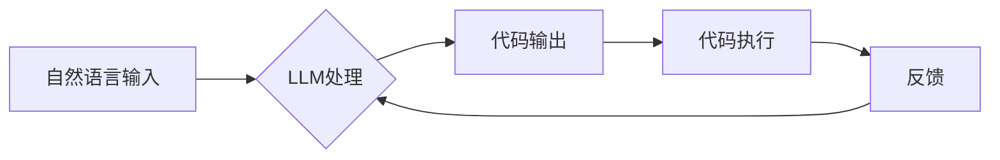

> 大语言模型，人工编程，自动编程，代码生成，软件开发，人工智能，自然语言处理，代码理解

## 1. 背景介绍

软件开发是现代社会不可或缺的一部分，它驱动着科技进步和经济发展。然而，传统的软件开发流程往往耗时费力，需要大量的代码编写和测试。随着人工智能技术的快速发展，大语言模型（LLM）应运而生，为软件开发带来了新的可能性。LLM 能够理解和生成人类语言，并具备强大的代码生成能力，为人工编程和自动编程提供了新的思路和工具。

## 2. 核心概念与联系

**2.1 人工编程与自动编程**

* **人工编程:** 传统软件开发模式，程序员使用编程语言编写代码实现软件功能。
* **自动编程:** 利用人工智能技术，自动生成代码，减少人工干预。

**2.2 大语言模型 (LLM)**

LLM 是基于深度学习的强大人工智能模型，能够理解和生成人类语言。它通过训练海量文本数据，学习语言的语法、语义和上下文关系，从而具备强大的文本处理能力。

**2.3 LLM 在软件开发中的应用**

LLM 可以应用于软件开发的各个环节，例如：

* **代码生成:** 根据自然语言描述自动生成代码。
* **代码理解:** 分析代码结构和功能，提供代码文档和解释。
* **代码修复:** 自动修复代码中的错误和漏洞。
* **代码翻译:** 将代码从一种编程语言翻译成另一种编程语言。

**2.4 核心架构**



## 3. 核心算法原理 & 具体操作步骤

**3.1 算法原理概述**

LLM 的核心算法是基于 Transformer 架构的深度神经网络。Transformer 模型通过自注意力机制学习文本中的长距离依赖关系，从而能够更好地理解和生成文本。

**3.2 算法步骤详解**

1. **文本预处理:** 将自然语言输入转换为模型可理解的格式，例如词嵌入。
2. **编码:** 使用 Transformer 模型编码输入文本，生成文本的语义表示。
3. **解码:** 使用 Transformer 模型解码语义表示，生成代码输出。
4. **后处理:** 对生成的代码进行语法检查和格式化。

**3.3 算法优缺点**

* **优点:**
    * 能够生成高质量的代码。
    * 能够理解复杂的自然语言描述。
    * 能够自动完成代码修复和翻译等任务。
* **缺点:**
    * 训练成本高，需要大量的计算资源和数据。
    * 生成的代码可能存在逻辑错误或安全漏洞。
    * 难以解释模型的决策过程。

**3.4 算法应用领域**

* **代码生成工具:** GitHub Copilot、Tabnine 等工具利用 LLM 自动生成代码。
* **代码理解工具:** DeepCode、Codota 等工具利用 LLM 分析代码结构和功能。
* **代码修复工具:** DeepCode、Infer 等工具利用 LLM 自动修复代码中的错误。

## 4. 数学模型和公式 & 详细讲解 & 举例说明

**4.1 数学模型构建**

LLM 的数学模型通常基于 Transformer 架构，其核心是自注意力机制。自注意力机制允许模型在处理文本时关注不同位置的词语之间的关系，从而更好地理解文本的语义。

**4.2 公式推导过程**

自注意力机制的计算公式如下：

$$
Attention(Q, K, V) = softmax(\frac{QK^T}{\sqrt{d_k}})V
$$

其中：

* $Q$：查询矩阵
* $K$：键矩阵
* $V$：值矩阵
* $d_k$：键向量的维度
* $softmax$：softmax 函数

**4.3 案例分析与讲解**

假设我们有一个句子 "The cat sat on the mat"，其词语表示为 $Q$、$K$ 和 $V$。通过自注意力机制，模型可以计算每个词语与其他词语之间的注意力权重，从而更好地理解句子的语义。例如，"cat" 和 "sat" 之间的注意力权重较高，因为它们在句子的语义上密切相关。

## 5. 项目实践：代码实例和详细解释说明

**5.1 开发环境搭建**

* Python 3.7+
* TensorFlow 或 PyTorch
* 其他必要的库，例如 NumPy、pandas 等

**5.2 源代码详细实现**

```python
# 代码生成示例
import transformers

# 加载预训练模型
model = transformers.AutoModelForSeq2SeqLM.from_pretrained("t5-base")

# 定义输入文本
input_text = "Write a Python function to calculate the factorial of a number."

# 生成代码
output_text = model.generate(
    input_ids=tokenizer.encode(input_text, return_tensors="pt"),
    max_length=100,
    num_beams=5,
    no_repeat_ngram_size=2,
)

# 解码输出文本
print(tokenizer.decode(output_text[0], skip_special_tokens=True))
```

**5.3 代码解读与分析**

* 使用 transformers 库加载预训练的 T5 模型。
* 使用 tokenizer 将输入文本转换为模型可理解的格式。
* 使用 model.generate 函数生成代码。
* 使用 tokenizer 将生成的代码解码回文本格式。

**5.4 运行结果展示**

```python
def factorial(n):
  if n == 0:
    return 1
  else:
    return n * factorial(n-1)
```

## 6. 实际应用场景

**6.1 代码生成**

* 自动生成简单的代码片段，例如函数定义、循环语句等。
* 根据自然语言描述自动生成更复杂的代码，例如 API 调用、数据库操作等。

**6.2 代码理解**

* 自动生成代码文档，帮助程序员理解代码功能。
* 自动识别代码中的错误和漏洞，提高代码质量。

**6.3 代码修复**

* 自动修复代码中的语法错误和逻辑错误。
* 自动修复代码中的安全漏洞。

**6.4 未来应用展望**

* 更智能的代码生成，能够生成更复杂的代码，并满足更具体的业务需求。
* 更强大的代码理解能力，能够理解更复杂的代码结构和功能。
* 更有效的代码修复能力，能够自动修复更复杂的代码错误。

## 7. 工具和资源推荐

**7.1 学习资源推荐**

* **书籍:**
    * 《深度学习》
    * 《自然语言处理》
* **在线课程:**
    * Coursera: 自然语言处理
    * edX: 深度学习
* **博客和网站:**
    * Hugging Face
    * OpenAI

**7.2 开发工具推荐**

* **代码生成工具:** GitHub Copilot, Tabnine
* **代码理解工具:** DeepCode, Codota
* **代码修复工具:** DeepCode, Infer

**7.3 相关论文推荐**

* Attention Is All You Need
* BERT: Pre-training of Deep Bidirectional Transformers for Language Understanding
* T5: Text-to-Text Transfer Transformer

## 8. 总结：未来发展趋势与挑战

**8.1 研究成果总结**

LLM 在软件开发领域取得了显著的进展，能够自动生成代码、理解代码和修复代码。

**8.2 未来发展趋势**

* 更强大的 LLMs，能够处理更复杂的任务，生成更高质量的代码。
* 更智能的代码生成，能够根据更具体的业务需求生成代码。
* 更有效的代码理解和修复，能够自动修复更复杂的代码错误。

**8.3 面临的挑战**

* 训练成本高，需要大量的计算资源和数据。
* 生成的代码可能存在逻辑错误或安全漏洞。
* 难以解释模型的决策过程。

**8.4 研究展望**

* 研究更有效的训练方法，降低训练成本。
* 研究更安全的代码生成方法，减少代码漏洞。
* 研究更可解释的模型，提高模型透明度。

## 9. 附录：常见问题与解答

**9.1 如何选择合适的 LLM 模型？**

选择合适的 LLM 模型取决于具体的应用场景。例如，如果需要生成 Python 代码，可以选择 T5 或 CodeBERT 模型。

**9.2 如何评估 LLM 的性能？**

可以使用 BLEU、ROUGE 等指标评估 LLM 的性能。

**9.3 如何解决 LLM 生成的代码存在错误的问题？**

可以结合人工 review 和测试来解决 LLM 生成的代码存在错误的问题。


作者：禅与计算机程序设计艺术 / Zen and the Art of Computer Programming 
<end_of_turn>