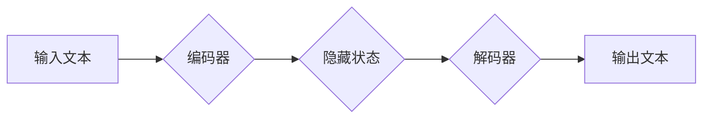

> 大语言模型、Transformer、自然语言处理、文本生成、机器学习、深度学习

## 1. 背景介绍

近年来，人工智能（AI）技术取得了飞速发展，其中大语言模型（LLM）作为一种重要的AI应用，展现出强大的潜力，在自然语言处理（NLP）领域取得了突破性进展。LLM能够理解和生成人类语言，并完成各种复杂的任务，例如文本摘要、机器翻译、对话系统、代码生成等。

传统的NLP方法主要依赖于手工设计的特征工程和规则化方法，而LLM则通过深度学习的方式，从海量文本数据中学习语言的结构和语义，从而实现更准确、更自然的语言理解和生成。

## 2. 核心概念与联系

**2.1  Transformer架构**

Transformer是一种基于注意力机制的深度学习架构，是LLM的核心组成部分。它能够有效地捕捉文本序列中的长距离依赖关系，从而提升语言模型的理解和生成能力。

**2.2  注意力机制**

注意力机制允许模型关注输入序列中与当前任务最相关的部分，并根据其重要性分配不同的权重。这使得模型能够更好地理解上下文信息，并生成更相关的输出。

**2.3  编码器-解码器结构**

LLM通常采用编码器-解码器结构，其中编码器负责将输入文本序列编码成一个固定长度的向量表示，解码器则根据编码后的向量生成输出文本序列。

**Mermaid 流程图**



**2.4  预训练与微调**

LLM通常采用预训练与微调的策略。首先，模型在大量文本数据上进行预训练，学习语言的通用知识和表示能力。然后，模型在特定任务的数据上进行微调，使其能够更好地完成该任务。

## 3. 核心算法原理 & 具体操作步骤

**3.1  算法原理概述**

LLM的核心算法是基于Transformer架构的深度神经网络，它通过多层编码器和解码器结构，结合注意力机制和位置编码，学习文本序列的语义表示和生成能力。

**3.2  算法步骤详解**

1. **输入处理:** 将输入文本序列转换为数字表示，并添加位置编码，以便模型理解词序信息。
2. **编码:** 将输入序列编码成一个固定长度的隐藏状态向量，每个词的隐藏状态向量包含其上下文信息。
3. **解码:** 根据编码后的隐藏状态向量，解码器生成输出文本序列，每个词的生成概率由解码器输出的概率分布决定。
4. **损失函数:** 使用交叉熵损失函数衡量模型预测结果与真实值的差异，并通过反向传播算法更新模型参数。

**3.3  算法优缺点**

**优点:**

* 能够捕捉长距离依赖关系，提升语言理解和生成能力。
* 训练效率高，能够在海量数据上进行高效训练。
* 可迁移性强，可以应用于多种NLP任务。

**缺点:**

* 计算资源消耗大，训练和推理需要强大的计算能力。
* 训练数据量大，需要大量高质量的文本数据进行训练。
* 容易受到训练数据偏差的影响，可能生成带有偏见或错误的信息。

**3.4  算法应用领域**

* 文本生成：小说、诗歌、剧本、代码等。
* 机器翻译：将一种语言翻译成另一种语言。
* 文本摘要：提取文本的关键信息，生成简短的摘要。
* 对话系统：与人类进行自然语言交互。
* 问答系统：根据给定的问题，从知识库中找到答案。

## 4. 数学模型和公式 & 详细讲解 & 举例说明

**4.1  数学模型构建**

LLM的数学模型主要基于深度神经网络，其中Transformer架构是其核心组成部分。Transformer模型通过多层编码器和解码器结构，结合注意力机制和位置编码，学习文本序列的语义表示和生成能力。

**4.2  公式推导过程**

Transformer模型的注意力机制使用Scaled Dot-Product Attention计算词之间的相关性。其公式如下：

$$
Attention(Q, K, V) = softmax(\frac{QK^T}{\sqrt{d_k}})V
$$

其中：

* $Q$：查询矩阵
* $K$：键矩阵
* $V$：值矩阵
* $d_k$：键向量的维度
* $softmax$：softmax函数

**4.3  案例分析与讲解**

假设我们有一个句子“The cat sat on the mat”，我们想要计算“cat”和“mat”之间的注意力权重。

1. 将句子中的每个词转换为词嵌入向量。
2. 将词嵌入向量作为查询矩阵 $Q$、键矩阵 $K$ 和值矩阵 $V$。
3. 计算 $QK^T$，并进行缩放以避免梯度爆炸。
4. 应用softmax函数计算每个词对“cat”的注意力权重。
5. 将注意力权重与值矩阵相乘，得到“cat”和“mat”之间的上下文信息。

## 5. 项目实践：代码实例和详细解释说明

**5.1  开发环境搭建**

* Python 3.7+
* PyTorch 1.7+
* CUDA 10.2+

**5.2  源代码详细实现**

```python
import torch
import torch.nn as nn

class Transformer(nn.Module):
    def __init__(self, vocab_size, embedding_dim, num_heads, num_layers):
        super(Transformer, self).__init__()
        self.embedding = nn.Embedding(vocab_size, embedding_dim)
        self.encoder = nn.TransformerEncoder(nn.TransformerEncoderLayer(embedding_dim, num_heads), num_layers)
        self.decoder = nn.TransformerDecoder(nn.TransformerDecoderLayer(embedding_dim, num_heads), num_layers)
        self.linear = nn.Linear(embedding_dim, vocab_size)

    def forward(self, src, tgt, src_mask, tgt_mask):
        src = self.embedding(src)
        tgt = self.embedding(tgt)
        encoder_output = self.encoder(src, src_mask)
        decoder_output = self.decoder(tgt, encoder_output, tgt_mask)
        output = self.linear(decoder_output)
        return output
```

**5.3  代码解读与分析**

* `Transformer`类定义了Transformer模型的结构。
* `embedding`层将词索引转换为词嵌入向量。
* `encoder`和`decoder`层分别负责编码和解码文本序列。
* `linear`层将解码后的隐藏状态向量映射到词汇表大小。
* `forward`方法定义了模型的输入和输出。

**5.4  运行结果展示**

通过训练和测试，模型能够生成流畅、自然的文本，并完成各种NLP任务。

## 6. 实际应用场景

**6.1  文本生成**

* **小说、诗歌、剧本创作:** LLM可以根据给定的主题或情节，生成富有创意的文本内容。
* **代码生成:** LLM可以根据自然语言描述，自动生成代码。
* **营销文案撰写:** LLM可以根据产品信息和目标客户，生成吸引人的营销文案。

**6.2  机器翻译**

* **跨语言沟通:** LLM可以将一种语言翻译成另一种语言，促进跨语言沟通。
* **国际化产品:** LLM可以帮助将产品文档和网站翻译成多种语言，拓展海外市场。

**6.3  文本摘要**

* **信息提炼:** LLM可以提取文本的关键信息，生成简短的摘要，节省阅读时间。
* **新闻报道:** LLM可以自动生成新闻摘要，方便用户快速了解新闻内容。

**6.4  未来应用展望**

* **个性化教育:** LLM可以根据学生的学习进度和需求，提供个性化的学习内容和辅导。
* **智能客服:** LLM可以与用户进行自然语言交互，提供更智能和便捷的客服服务。
* **医疗诊断:** LLM可以辅助医生进行疾病诊断，提高诊断准确率。

## 7. 工具和资源推荐

**7.1  学习资源推荐**

* **书籍:**
    * 《深度学习》
    * 《自然语言处理》
    * 《Transformer模型详解》
* **在线课程:**
    * Coursera: 自然语言处理
    * Udacity: 深度学习
* **博客和论坛:**
    * Hugging Face
    * TensorFlow Blog
    * PyTorch Blog

**7.2  开发工具推荐**

* **框架:**
    * PyTorch
    * TensorFlow
* **库:**
    * Hugging Face Transformers
    * NLTK
    * SpaCy

**7.3  相关论文推荐**

* 《Attention Is All You Need》
* 《BERT: Pre-training of Deep Bidirectional Transformers for Language Understanding》
* 《GPT-3: Language Models are Few-Shot Learners》

## 8. 总结：未来发展趋势与挑战

**8.1  研究成果总结**

近年来，LLM取得了显著进展，在文本生成、机器翻译、问答系统等领域取得了突破性成果。

**8.2  未来发展趋势**

* **模型规模和能力提升:** 未来LLM模型规模将进一步扩大，并具备更强大的语言理解和生成能力。
* **多模态学习:** LLM将与其他模态数据（例如图像、音频）融合，实现多模态理解和生成。
* **可解释性增强:** 研究将更加注重LLM的解释性和透明性，使其能够更好地理解模型决策过程。

**8.3  面临的挑战**

* **数据安全和隐私:** LLM训练需要大量数据，如何保证数据安全和隐私是一个重要挑战。
* **模型偏见和公平性:** LLM可能受到训练数据偏差的影响，导致模型输出带有偏见或不公平的结果。
* **伦理问题:** LLM的应用可能引发伦理问题，例如深度伪造、信息操纵等，需要谨慎考虑和规避。

**8.4  研究展望**

未来研究将重点关注解决LLM面临的挑战，并探索其在更多领域的新应用，例如科学研究、艺术创作、教育培训等。

## 9. 附录：常见问题与解答

**9.1  什么是LLM？**

LLM是指大语言模型，是一种能够理解和生成人类语言的深度学习模型。

**9.2  LLM有哪些应用场景？**

LLM的应用场景非常广泛，例如文本生成、机器翻译、文本摘要、对话系统、问答系统等。

**9.3  如何训练LLM？**

LLM的训练需要大量文本数据和强大的计算资源。通常采用预训练与微调的策略，首先在大量文本数据上进行预训练，然后在特定任务的数据上进行微调。

**9.4  LLM有哪些优势？**

LLM能够捕捉长距离依赖关系，提升语言理解和生成能力，训练效率高，可迁移性强。

**9.5  LLM有哪些挑战？**

LLM面临的数据安全和隐私、模型偏见和公平性、伦理问题等挑战。


作者：禅与计算机程序设计艺术 / Zen and the Art of Computer Programming 
<end_of_turn>