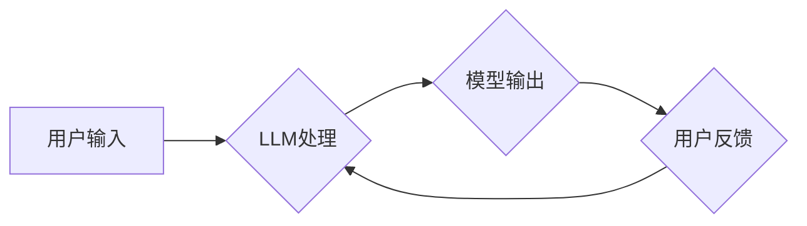

> 大语言模型、提示模板、多轮对话、自然语言处理、人工智能、应用指南、对话系统

## 1. 背景介绍

近年来，大语言模型（LLM）在自然语言处理（NLP）领域取得了突破性的进展，展现出强大的文本生成、理解和翻译能力。这些模型通过学习海量文本数据，掌握了语言的复杂规律，能够生成流畅、连贯的文本，并进行复杂的逻辑推理和知识问答。

然而，LLM 的应用并非一蹴而就。如何有效地与 LLM 交互，引导其生成所需的结果，是实现 LLM 应用的关键。提示模板和多轮对话正是解决这一问题的有效策略。

提示模板是一种结构化的文本格式，它为 LLM 提供了明确的指令和上下文信息，引导其生成特定类型的输出。多轮对话则允许用户与 LLM 进行交互式对话，逐步提供信息和反馈，引导模型生成更精准、更符合用户意图的结果。

## 2. 核心概念与联系

### 2.1  大语言模型

大语言模型（LLM）是一种基于深度学习的强大人工智能模型，能够理解和生成人类语言。它们通过训练大量的文本数据，学习语言的语法、语义和上下文关系。

### 2.2  提示模板

提示模板是一种结构化的文本格式，它为 LLM 提供了明确的指令和上下文信息，引导其生成特定类型的输出。

**提示模板的结构通常包括以下部分：**

* **任务说明:** 明确地描述用户希望 LLM 完成的任务。
* **上下文信息:** 提供 LLM 理解任务所需背景知识和信息。
* **输入示例:** 给出 LLM 理解任务格式和期望输出的示例。

### 2.3  多轮对话

多轮对话是指用户与 LLM 进行交互式对话，逐步提供信息和反馈，引导模型生成更精准、更符合用户意图的结果。

**多轮对话的优势:**

* **更精准的结果:** 通过逐步交互，用户可以更精确地表达需求，引导模型生成更符合意图的结果。
* **更自然的交互体验:** 多轮对话更接近人类之间的自然交流方式，提升用户体验。
* **更复杂的场景处理:** 多轮对话能够处理更复杂的场景，例如需要用户提供多个信息点才能完成的任务。

**Mermaid 流程图:**



## 3. 核心算法原理 & 具体操作步骤

### 3.1  算法原理概述

LLM 的核心算法是基于 Transformer 架构的深度神经网络。Transformer 模型通过自注意力机制学习文本序列之间的关系，能够捕捉长距离依赖关系，从而实现更准确的文本理解和生成。

### 3.2  算法步骤详解

1. **文本预处理:** 将输入文本进行分词、词嵌入等预处理操作，将文本转换为模型可理解的格式。
2. **编码:** 使用 Transformer 的编码器部分对输入文本进行编码，生成文本的语义表示。
3. **解码:** 使用 Transformer 的解码器部分根据编码后的文本表示，生成目标文本。
4. **输出:** 将生成的文本输出，并进行后处理，例如去除非法字符、格式化文本等。

### 3.3  算法优缺点

**优点:**

* **强大的文本理解和生成能力:** Transformer 模型能够捕捉长距离依赖关系，实现更准确的文本理解和生成。
* **可并行训练:** Transformer 模型的结构允许并行训练，能够加速模型训练速度。
* **可迁移学习:** 预训练的 Transformer 模型可以迁移到不同的下游任务，例如文本分类、问答系统等。

**缺点:**

* **训练成本高:** Transformer 模型参数量大，训练成本高。
* **推理速度慢:** Transformer 模型的推理速度相对较慢。
* **数据依赖性强:** Transformer 模型的性能依赖于训练数据的质量和数量。

### 3.4  算法应用领域

LLM 广泛应用于以下领域:

* **自然语言理解:** 文本分类、情感分析、问答系统、文本摘要等。
* **自然语言生成:** 机器翻译、文本生成、对话系统等。
* **代码生成:** 代码补全、代码生成、代码翻译等。
* **多模态理解:** 图像字幕、视频理解等。

## 4. 数学模型和公式 & 详细讲解 & 举例说明

### 4.1  数学模型构建

LLM 的数学模型主要基于 Transformer 架构，其核心是自注意力机制。

**自注意力机制:**

自注意力机制允许模型关注输入序列中的不同位置，并计算每个位置之间的相关性。

**公式:**

$$
Attention(Q, K, V) = softmax(\frac{QK^T}{\sqrt{d_k}})V
$$

其中:

* $Q$：查询矩阵
* $K$：键矩阵
* $V$：值矩阵
* $d_k$：键向量的维度
* $softmax$：softmax 函数

**解释:**

* $QK^T$ 计算查询向量和键向量的点积，表示每个位置之间的相关性。
* $\frac{QK^T}{\sqrt{d_k}}$ 对点积进行归一化，使得每个位置的注意力权重在 0 到 1 之间。
* $softmax$ 函数将归一化后的值转换为概率分布，表示每个位置的注意力权重。
* 最后，将注意力权重与值矩阵相乘，得到每个位置的加权和，作为最终的输出。

### 4.2  公式推导过程

自注意力机制的公式推导过程较为复杂，涉及到线性变换、矩阵乘法、softmax 函数等操作。

### 4.3  案例分析与讲解

**举例说明:**

假设我们有一个句子 "The cat sat on the mat"，其词嵌入表示为：

* The: [0.1, 0.2, 0.3]
* cat: [0.4, 0.5, 0.6]
* sat: [0.7, 0.8, 0.9]
* on: [0.2, 0.3, 0.4]
* the: [0.1, 0.2, 0.3]
* mat: [0.5, 0.6, 0.7]

使用自注意力机制计算每个词与其他词之间的注意力权重，可以发现 "cat" 和 "sat" 之间存在较高的注意力权重，因为它们在语义上紧密相关。

## 5. 项目实践：代码实例和详细解释说明

### 5.1  开发环境搭建

* Python 3.7+
* PyTorch 或 TensorFlow
* CUDA 和 cuDNN (可选，用于 GPU 训练)

### 5.2  源代码详细实现

```python
import torch
import torch.nn as nn

class Transformer(nn.Module):
    def __init__(self, vocab_size, embedding_dim, num_heads, num_layers):
        super(Transformer, self).__init__()
        self.embedding = nn.Embedding(vocab_size, embedding_dim)
        self.transformer_layers = nn.ModuleList([
            nn.TransformerEncoderLayer(embedding_dim, num_heads)
            for _ in range(num_layers)
        ])
        self.linear = nn.Linear(embedding_dim, vocab_size)

    def forward(self, x):
        x = self.embedding(x)
        for layer in self.transformer_layers:
            x = layer(x)
        x = self.linear(x)
        return x
```

### 5.3  代码解读与分析

* `__init__` 方法初始化模型参数，包括词嵌入层、Transformer 层和输出层。
* `forward` 方法定义模型的正向传播过程，将输入序列转换为输出序列。

### 5.4  运行结果展示

训练好的 Transformer 模型可以用于文本生成、机器翻译等任务。

## 6. 实际应用场景

### 6.1  聊天机器人

LLM 可以用于构建更智能、更自然的聊天机器人，能够理解用户的意图，并提供更精准、更符合用户需求的回复。

### 6.2  文本摘要

LLM 可以自动生成文本摘要，提取文本的关键信息，节省用户阅读时间。

### 6.3  机器翻译

LLM 可以实现高质量的机器翻译，将文本从一种语言翻译成另一种语言。

### 6.4  未来应用展望

LLM 的应用前景广阔，未来将应用于更多领域，例如：

* **个性化教育:** 根据学生的学习进度和需求，提供个性化的学习内容和辅导。
* **医疗诊断:** 辅助医生进行疾病诊断，提高诊断准确率。
* **法律服务:** 自动分析法律文件，提供法律建议。

## 7. 工具和资源推荐

### 7.1  学习资源推荐

* **书籍:**
    * 《深度学习》
    * 《自然语言处理》
* **在线课程:**
    * Coursera: 自然语言处理
    * edX: 深度学习
* **博客:**
    * The Gradient
    * Towards Data Science

### 7.2  开发工具推荐

* **PyTorch:** 深度学习框架
* **TensorFlow:** 深度学习框架
* **Hugging Face Transformers:** 预训练 Transformer 模型库

### 7.3  相关论文推荐

* **Attention Is All You Need:** https://arxiv.org/abs/1706.03762
* **BERT: Pre-training of Deep Bidirectional Transformers for Language Understanding:** https://arxiv.org/abs/1810.04805

## 8. 总结：未来发展趋势与挑战

### 8.1  研究成果总结

近年来，LLM 在文本理解和生成方面取得了显著进展，展现出强大的应用潜力。

### 8.2  未来发展趋势

* **模型规模和能力提升:** 未来 LLMs 将继续朝着更大规模、更强大的方向发展，能够处理更复杂的任务。
* **多模态理解:** LLMs 将与其他模态数据（例如图像、音频）融合，实现更全面的理解和生成。
* **可解释性增强:** 研究者将致力于提高 LLMs 的可解释性，使模型的决策过程更加透明。

### 8.3  面临的挑战

* **数据获取和标注:** LLMs 的训练需要海量高质量的数据，数据获取和标注成本高昂。
* **计算资源需求:** LLMs 的训练和推理需要大量的计算资源，成本高昂。
* **伦理和安全问题:** LLMs 可能被用于生成虚假信息、进行恶意攻击等，需要关注伦理和安全问题。

### 8.4  研究展望

未来研究将集中在以下方面:

* **高效训练方法:** 研究更有效的训练方法，降低 LLMs 的训练成本。
* **可解释性研究:** 研究 LLMs 的决策机制，提高模型的可解释性。
* **安全性和伦理问题:** 研究 LLMs 的安全性和伦理问题，确保其安全、负责任地应用。

## 9. 附录：常见问题与解答

**常见问题:**

* **LLM 的训练需要多少数据？**

**解答:** LLMs 的训练需要海量数据，通常需要数十亿甚至数千亿个词语。

* **LLM 的训练需要多少计算资源？**

**解答:** LLMs 的训练需要大量的计算资源，通常需要数百甚至数千个 GPU。

* **LLM 是否可以理解人类的情感？**

**解答:** LLMs 可以识别文本中的情感倾向，但它们并不能真正理解人类的情感。

* **LLM 是否会产生虚假信息？**

**解答:** LLMs 可能被用于生成虚假信息，因此需要关注 LLMs 的安全性和伦理问题。


作者：禅与计算机程序设计艺术 / Zen and the Art of Computer Programming 
<end_of_turn>