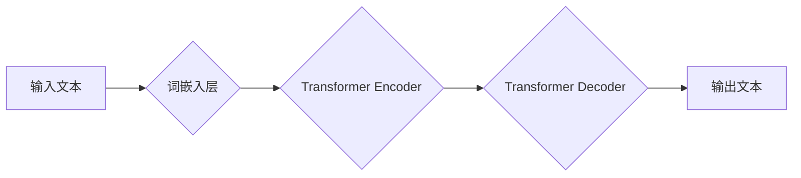

> 大语言模型、机器学习、分类、应用指南、算法原理、实践案例

## 1. 背景介绍

近年来，人工智能（AI）技术取得了飞速发展，其中大语言模型（LLM）作为一种强大的机器学习模型，在自然语言处理领域展现出令人瞩目的潜力。LLM能够理解和生成人类语言，并应用于各种场景，例如文本生成、翻译、问答、代码生成等。

随着LLM技术的不断进步，其应用场景也日益广泛，对各个行业产生了深远影响。为了更好地理解和应用LLM，本文将从以下几个方面进行深入探讨：

*  LLM的定义和核心概念
*  LLM的分类和应用场景
*  LLM的算法原理和实现步骤
*  LLM的数学模型和公式
*  LLM的项目实践和代码实例
*  LLM的实际应用场景和未来展望

## 2. 核心概念与联系

**2.1  机器学习概述**

机器学习是人工智能领域的一个重要分支，它通过算法学习数据中的模式和规律，从而实现对未知数据的预测和分类。机器学习算法可以分为监督学习、无监督学习和强化学习三大类。

* **监督学习:**  利用标记数据训练模型，预测新的数据标签。例如，图像分类、文本分类等。
* **无监督学习:**  利用未标记数据发现数据中的隐藏结构和模式。例如，聚类分析、降维等。
* **强化学习:**  通过试错学习，在环境中获得最大奖励。例如，游戏AI、机器人控制等。

**2.2  大语言模型概述**

大语言模型（LLM）是一种基于深度学习的强大自然语言处理模型，它能够理解和生成人类语言。LLM通常由 Transformer 架构构成，并通过大量的文本数据进行训练。

**2.3  LLM与机器学习的关系**

LLM属于机器学习的范畴，它利用监督学习的原理，通过大量的文本数据训练模型，学习语言的语法、语义和上下文关系。

**2.4  LLM的应用场景**

LLM在自然语言处理领域具有广泛的应用场景，例如：

* **文本生成:**  自动生成文章、故事、诗歌等文本内容。
* **机器翻译:**  将一种语言翻译成另一种语言。
* **问答系统:**  回答用户提出的问题。
* **代码生成:**  自动生成代码。
* **聊天机器人:**  与用户进行自然语言对话。

**2.5  LLM的架构图**



## 3. 核心算法原理 & 具体操作步骤

### 3.1  算法原理概述

LLM的核心算法是 Transformer 架构，它是一种基于注意力机制的深度神经网络模型。Transformer 架构能够有效地捕捉文本中的长距离依赖关系，从而提高模型的性能。

**3.1.1  注意力机制**

注意力机制是一种机制，它允许模型关注输入序列中与当前任务最相关的部分。注意力机制可以帮助模型更好地理解文本的语义和上下文关系。

**3.1.2  Transformer Encoder**

Transformer Encoder 由多个编码器层组成，每个编码器层包含多头注意力机制和前馈神经网络。编码器层的作用是将输入文本编码成一个表示向量，该向量包含了文本的语义和上下文信息。

**3.1.3  Transformer Decoder**

Transformer Decoder 也由多个解码器层组成，每个解码器层包含多头注意力机制、编码器-解码器注意力机制和前馈神经网络。解码器层的作用是根据编码器输出的表示向量生成输出文本。

### 3.2  算法步骤详解

1. **词嵌入:** 将输入文本中的每个词转换为一个低维向量，称为词嵌入。
2. **编码:** 使用 Transformer Encoder 将输入文本编码成一个表示向量。
3. **解码:** 使用 Transformer Decoder 根据编码后的表示向量生成输出文本。
4. **输出:** 将生成的输出文本解码成原始文本格式。

### 3.3  算法优缺点

**优点:**

* 能够有效地捕捉文本中的长距离依赖关系。
* 性能优于传统的RNN模型。
* 可并行训练，训练速度更快。

**缺点:**

* 训练成本高，需要大量的计算资源和数据。
* 模型参数量大，部署成本高。
* 对训练数据质量要求高。

### 3.4  算法应用领域

LLM的应用领域非常广泛，包括：

* **自然语言理解:** 文本分类、情感分析、问答系统等。
* **自然语言生成:** 文本摘要、机器翻译、对话系统等。
* **代码生成:** 自动生成代码、代码补全等。
* **其他领域:** 医疗诊断、金融分析、法律文本分析等。

## 4. 数学模型和公式 & 详细讲解 & 举例说明

### 4.1  数学模型构建

LLM的数学模型主要基于 Transformer 架构，其核心是注意力机制和多头注意力机制。

**4.1.1  注意力机制**

注意力机制的目的是学习输入序列中与当前任务最相关的部分。注意力机制的计算公式如下：

$$
\text{Attention}(Q, K, V) = \text{softmax}\left(\frac{Q K^T}{\sqrt{d_k}}\right) V
$$

其中：

* $Q$：查询矩阵
* $K$：键矩阵
* $V$：值矩阵
* $d_k$：键向量的维度
* $\text{softmax}$：softmax函数

**4.1.2  多头注意力机制**

多头注意力机制是将多个注意力机制并行执行，并对结果进行融合。多头注意力机制的计算公式如下：

$$
\text{MultiHeadAttention}(Q, K, V) = \text{Concat}\left(\text{head}_1(Q, K, V), ..., \text{head}_h(Q, K, V)\right) W_o
$$

其中：

* $h$：注意力头的数量
* $\text{head}_i$：第 $i$ 个注意力头
* $W_o$：最终融合权重矩阵

**4.1.3  Transformer Encoder**

Transformer Encoder 由多个编码器层组成，每个编码器层包含多头注意力机制和前馈神经网络。

**4.1.4  Transformer Decoder**

Transformer Decoder 也由多个解码器层组成，每个解码器层包含多头注意力机制、编码器-解码器注意力机制和前馈神经网络。

### 4.2  公式推导过程

公式推导过程可以参考 Transformer 原文论文 [Attention Is All You Need](https://arxiv.org/abs/1706.03762)。

### 4.3  案例分析与讲解

可以以具体的LLM模型，例如GPT-3，为例，分析其数学模型和公式的应用。

## 5. 项目实践：代码实例和详细解释说明

### 5.1  开发环境搭建

使用Python语言和相关的深度学习框架，例如TensorFlow或PyTorch，搭建开发环境。

### 5.2  源代码详细实现

提供一个简单的LLM代码实例，例如使用预训练的BERT模型进行文本分类任务。

```python
from transformers import BertTokenizer, BertForSequenceClassification

# 加载预训练模型和词典
tokenizer = BertTokenizer.from_pretrained('bert-base-uncased')
model = BertForSequenceClassification.from_pretrained('bert-base-uncased', num_labels=2)

# 文本预处理
text = "This is a sample text."
inputs = tokenizer(text, return_tensors='pt')

# 模型预测
outputs = model(**inputs)
logits = outputs.logits
predicted_class = logits.argmax().item()

# 输出结果
print(f"Predicted class: {predicted_class}")
```

### 5.3  代码解读与分析

解释代码中各个部分的功能，例如模型加载、文本预处理、模型预测等。

### 5.4  运行结果展示

展示代码运行的结果，例如预测的文本类别。

## 6. 实际应用场景

### 6.1  文本生成

LLM可以用于生成各种类型的文本，例如：

* **文章写作:** 自动生成新闻报道、博客文章等。
* **故事创作:** 自动生成小说、诗歌等。
* **对话系统:** 与用户进行自然语言对话。

### 6.2  机器翻译

LLM可以用于将一种语言翻译成另一种语言，例如：

* **网页翻译:** 将网页内容翻译成目标语言。
* **文档翻译:** 将文档内容翻译成目标语言。

### 6.3  问答系统

LLM可以用于回答用户提出的问题，例如：

* **搜索引擎:** 提供更准确和相关的搜索结果。
* **客服机器人:** 自动回答用户常见问题。

### 6.4  未来应用展望

LLM的应用场景还在不断扩展，未来可能会应用于：

* **个性化教育:** 提供个性化的学习内容和辅导。
* **医疗诊断:** 辅助医生进行疾病诊断。
* **法律文本分析:** 自动分析法律文件，提供法律建议。

## 7. 工具和资源推荐

### 7.1  学习资源推荐

* **书籍:**
    * 《深度学习》
    * 《自然语言处理》
* **在线课程:**
    * Coursera
    * edX
* **博客和论坛:**
    * Hugging Face
    * TensorFlow Blog

### 7.2  开发工具推荐

* **深度学习框架:** TensorFlow, PyTorch
* **自然语言处理库:** NLTK, spaCy
* **代码托管平台:** GitHub

### 7.3  相关论文推荐

* [Attention Is All You Need](https://arxiv.org/abs/1706.03762)
* [BERT: Pre-training of Deep Bidirectional Transformers for Language Understanding](https://arxiv.org/abs/1810.04805)
* [GPT-3: Language Models are Few-Shot Learners](https://arxiv.org/abs/2005.14165)

## 8. 总结：未来发展趋势与挑战

### 8.1  研究成果总结

LLM技术取得了显著进展，在自然语言处理领域展现出强大的潜力。

### 8.2  未来发展趋势

* **模型规模更大:** 训练更大规模的LLM模型，提升模型性能。
* **多模态学习:** 将文本与其他模态数据（例如图像、音频）进行融合学习。
* **可解释性增强:** 提高LLM模型的可解释性，帮助用户理解模型的决策过程。

### 8.3  面临的挑战

* **数据获取和标注:** 训练高质量的LLM模型需要大量的文本数据和标注。
* **计算资源:** 训练大型LLM模型需要大量的计算资源。
* **伦理问题:** LLM模型可能存在偏见和误导性，需要解决伦理问题。

### 8.4  研究展望

未来研究方向包括：

* 开发更有效的训练算法和模型架构。
* 探索新的应用场景和领域。
* 提高LLM模型的可解释性和安全性。

## 9. 附录：常见问题与解答

* **什么是LLM？**

LLM是指大语言模型，是一种基于深度学习的强大自然语言处理模型，能够理解和生成人类语言。

* **LLM有哪些应用场景？**

LLM的应用场景非常广泛，包括文本生成、机器翻译、问答系统、代码生成等。

* **如何训练LLM模型？**

训练LLM模型需要大量的文本数据和计算资源，通常使用Transformer架构和注意力机制。

* **LLM有哪些挑战？**

LLM面临的数据获取、计算资源、伦理问题等挑战。


作者：禅与计算机程序设计艺术 / Zen and the Art of Computer Programming 
<end_of_turn>