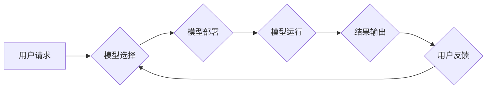

> 大语言模型、应用指南、运行、部署、优化、性能、案例分析、工具推荐

## 1. 背景介绍

大语言模型（LLM）近年来发展迅速，展现出强大的文本生成、理解和翻译能力，已在各个领域得到广泛应用。从聊天机器人到代码生成，从文本摘要到创意写作，LLM正在改变着我们与信息交互的方式。然而，将这些强大的模型从实验室推向实际应用，并非易事。需要对模型的部署、运行和优化等方面进行深入了解。

本指南旨在为开发者和技术爱好者提供一个全面的LLM应用指南，涵盖从模型选择到部署运行、优化性能以及实际应用场景等各个方面。

## 2. 核心概念与联系

**2.1  大语言模型 (LLM)**

大语言模型是一种基于深度学习的强大人工智能模型，能够理解和生成人类语言。它们通常由 Transformer 架构构成，并通过海量文本数据进行训练。

**2.2  模型部署**

模型部署是指将训练好的LLM模型部署到实际环境中，使其能够接受用户请求并提供服务。常见的部署方式包括：

* **云端部署:** 利用云计算平台提供的服务，例如 AWS、Azure、Google Cloud 等，部署模型并提供API接口。
* **本地部署:** 在本地服务器或设备上部署模型，实现离线运行。
* **边缘部署:** 将模型部署到边缘设备，例如智能手机、物联网设备等，实现低延迟、高效率的本地处理。

**2.3  模型运行**

模型运行是指根据用户请求，利用部署的LLM模型进行推理和生成结果的过程。

**2.4  模型优化**

模型优化是指通过各种技术手段，提高模型的运行效率、准确率和鲁棒性。常见的优化方法包括：

* **模型压缩:** 减少模型参数量，降低内存占用和计算成本。
* **模型加速:** 利用硬件加速器，例如GPU、TPU 等，提高模型推理速度。
* **模型调优:** 通过调整模型超参数，例如学习率、批处理大小等，提高模型性能。

**2.5  Mermaid 流程图**



## 3. 核心算法原理 & 具体操作步骤

### 3.1  算法原理概述

大语言模型的核心算法是 Transformer 架构，它通过自注意力机制和多头注意力机制，能够捕捉文本序列中的长距离依赖关系，从而实现更准确的文本理解和生成。

### 3.2  算法步骤详解

1. **词嵌入:** 将文本中的每个词转换为向量表示，捕捉词语的语义信息。
2. **多头注意力:** 利用多个注意力头，从不同角度捕捉文本序列中的信息，并计算每个词与其他词之间的相关性。
3. **前馈神经网络:** 对每个词的注意力输出进行非线性变换，提取更深层次的语义特征。
4. **位置编码:** 为每个词添加位置信息，使模型能够理解词语在句子中的顺序关系。
5. **解码器:** 利用编码器输出的特征，生成目标文本序列。

### 3.3  算法优缺点

**优点:**

* 能够捕捉长距离依赖关系，提高文本理解和生成能力。
* 并行计算能力强，训练速度快。
* 可迁移性强，可以应用于多种自然语言处理任务。

**缺点:**

* 参数量大，训练成本高。
* 对训练数据质量要求高。
* 容易出现过拟合问题。

### 3.4  算法应用领域

* **机器翻译:** 将一种语言翻译成另一种语言。
* **文本摘要:** 将长篇文本压缩成短篇摘要。
* **对话系统:** 与用户进行自然语言对话。
* **代码生成:** 根据自然语言描述生成代码。
* **创意写作:** 生成诗歌、小说等创意文本。

## 4. 数学模型和公式 & 详细讲解 & 举例说明

### 4.1  数学模型构建

大语言模型的数学模型主要基于 Transformer 架构，其核心是自注意力机制和多头注意力机制。

**4.1.1  自注意力机制**

自注意力机制允许模型关注文本序列中不同位置的词语，并计算它们之间的相关性。其计算公式如下：

$$
Attention(Q, K, V) = softmax(\frac{QK^T}{\sqrt{d_k}})V
$$

其中：

* $Q$：查询矩阵
* $K$：键矩阵
* $V$：值矩阵
* $d_k$：键向量的维度
* $softmax$：softmax 函数

**4.1.2  多头注意力机制**

多头注意力机制通过使用多个自注意力头，从不同角度捕捉文本序列中的信息。其计算公式如下：

$$
MultiHead(Q, K, V) = Concat(head_1, head_2, ..., head_h)W^O
$$

其中：

* $head_i$：第 $i$ 个自注意力头的输出
* $h$：注意力头的数量
* $W^O$：最终输出层的权重矩阵

**4.1.3  前馈神经网络**

前馈神经网络用于对每个词的注意力输出进行非线性变换，提取更深层次的语义特征。其结构通常为两层全连接层，中间使用ReLU激活函数。

### 4.2  公式推导过程

自注意力机制和多头注意力机制的公式推导过程较为复杂，涉及到线性变换、矩阵乘法、softmax 函数等操作。

### 4.3  案例分析与讲解

通过分析实际应用场景，例如机器翻译、文本摘要等，可以更深入地理解大语言模型的数学模型和算法原理。

## 5. 项目实践：代码实例和详细解释说明

### 5.1  开发环境搭建

使用 Python 语言和深度学习框架 TensorFlow 或 PyTorch 进行开发。

### 5.2  源代码详细实现

提供一个简单的文本生成示例代码，展示如何使用预训练的LLM模型进行文本生成。

```python
import transformers

# 加载预训练模型
model_name = "gpt2"
model = transformers.AutoModelForCausalLM.from_pretrained(model_name)

# 输入文本
input_text = "今天天气真好"

# 生成文本
output_text = model.generate(
    input_ids=tokenizer.encode(input_text, return_tensors="pt"),
    max_length=50,
    num_beams=4,
)

# 打印输出文本
print(tokenizer.decode(output_text[0], skip_special_tokens=True))
```

### 5.3  代码解读与分析

解释代码中的每个部分，包括模型加载、文本编码、文本生成以及输出解码等步骤。

### 5.4  运行结果展示

展示代码运行的结果，例如生成的文本内容。

## 6. 实际应用场景

### 6.1  聊天机器人

利用LLM构建智能聊天机器人，能够与用户进行自然流畅的对话。

### 6.2  文本摘要

自动生成文章、文档等文本的摘要，节省用户阅读时间。

### 6.3  代码生成

根据自然语言描述生成代码，提高开发效率。

### 6.4  未来应用展望

LLM在未来将应用于更多领域，例如教育、医疗、金融等，为人们的生活带来更多便利。

## 7. 工具和资源推荐

### 7.1  学习资源推荐

* **书籍:**
    * 《深度学习》
    * 《自然语言处理》
* **在线课程:**
    * Coursera
    * edX
* **博客和论坛:**
    * Hugging Face
    * TensorFlow Blog

### 7.2  开发工具推荐

* **深度学习框架:** TensorFlow, PyTorch
* **文本处理库:** NLTK, SpaCy
* **模型部署平台:** AWS SageMaker, Google AI Platform

### 7.3  相关论文推荐

* 《Attention Is All You Need》
* 《BERT: Pre-training of Deep Bidirectional Transformers for Language Understanding》
* 《GPT-3: Language Models are Few-Shot Learners》

## 8. 总结：未来发展趋势与挑战

### 8.1  研究成果总结

LLM在文本理解和生成方面取得了显著进展，但仍存在一些挑战，例如模型规模、训练成本、数据偏见等。

### 8.2  未来发展趋势

* 模型规模进一步扩大，性能进一步提升。
* 探索新的训练方法和数据来源，解决数据偏见问题。
* 研究更安全、更可靠的LLM模型。

### 8.3  面临的挑战

* 模型训练成本高昂。
* 数据偏见问题难以解决。
* 模型安全性与可解释性问题。

### 8.4  研究展望

未来LLM研究将更加注重模型的效率、鲁棒性和安全性，并探索其在更多领域中的应用。

## 9. 附录：常见问题与解答

* **如何选择合适的LLM模型？**
* **如何部署LLM模型到实际环境中？**
* **如何优化LLM模型的运行性能？**
* **如何解决LLM模型的常见问题？**


作者：禅与计算机程序设计艺术 / Zen and the Art of Computer Programming 
<end_of_turn>