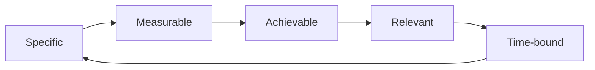
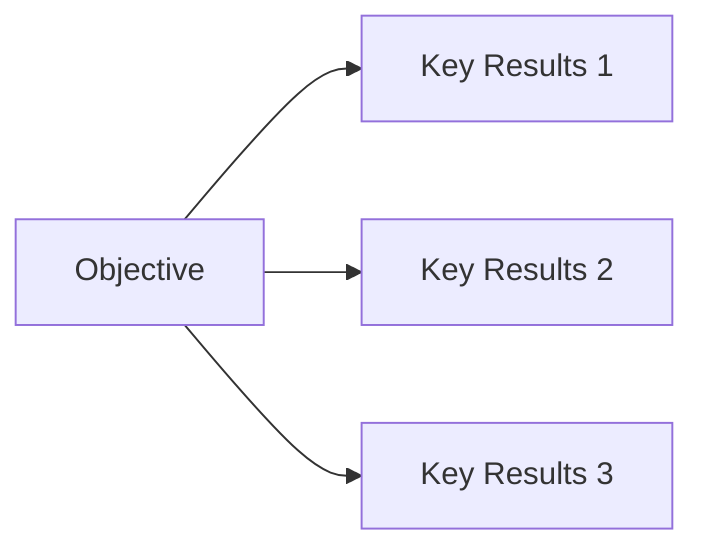

                 

## 1. 背景介绍

在当今快速变化的世界中，设定清晰的目标并制定行动计划是成功的关键。无论是个人还是组织，都需要明确的方向和路径来实现其愿景。然而，许多人在设定目标时缺乏清晰的思路，导致行动计划模糊不清，难以实现预期的结果。本文将深入探讨如何设定目标，并提供一套清晰的方法来制定行动计划。

## 2. 核心概念与联系

### 2.1 SMART 目标

SMART 是一个广为人知的目标设定框架，它帮助我们设定具体、可衡量、可实现、相关、有时间限制的目标。这个框架为我们提供了一个清晰的结构，有助于我们设定合理的目标。



### 2.2 OKR 目标设定

OKR（Objectives and Key Results）是一种目标设定方法，它将目标分为两个部分：目标（Objective）和关键结果（Key Results）。这种方法帮助我们设定清晰的、可衡量的目标，并跟踪进度。



## 3. 核心算法原理 & 具体操作步骤

### 3.1 算法原理概述

设定目标和制定行动计划的过程可以看作一个算法，它接受输入（当前状态、资源、愿景等），并产生输出（清晰的目标和行动计划）。这个算法的核心原理是将愿景转化为具体、可实现的步骤。

### 3.2 算法步骤详解

#### 3.2.1 定义愿景

首先，我们需要清晰地定义我们的愿景。愿景是我们想要实现的最终状态或结果。它应该是鼓舞人心的、长远的，并能够指导我们的决策。

#### 3.2.2 设定SMART目标

使用SMART框架，将愿景转化为具体、可衡量的目标。每个目标都应该是具体的、可衡量的、可实现的、相关的，并有时间限制。

#### 3.2.3 设定OKR目标

将每个SMART目标分解为一个目标（Objective）和若干关键结果（Key Results）。关键结果应该是可衡量的、可跟踪的，能够帮助我们评估我们是否达到了目标。

#### 3.2.4 制定行动计划

为每个关键结果制定具体的行动计划。行动计划应该是清晰的、可执行的，并包含具体的任务、责任人、时间线和资源需求。

#### 3.2.5 评估和调整

定期评估我们的进度，并根据需要调整我们的目标和行动计划。这个过程是动态的，需要不断地监控、评估和调整。

### 3.3 算法优缺点

**优点：**

* 这种方法帮助我们设定清晰的、可衡量的目标。
* 它提供了一个结构化的框架，有助于我们制定行动计划。
* 它鼓励我们定期评估和调整我们的目标和计划。

**缺点：**

* 它需要大量的时间和精力来设定目标和制定计划。
* 它可能会导致过度关注短期目标，而不是长期愿景。
* 它可能会导致目标设定过于僵化，缺乏灵活性。

### 3.4 算法应用领域

这个算法可以应用于个人目标设定，也可以应用于组织的战略规划。它可以帮助个人实现个人目标，也可以帮助组织实现其愿景和使命。

## 4. 数学模型和公式 & 详细讲解 & 举例说明

### 4.1 数学模型构建

设定目标和制定行动计划的过程可以看作一个数学模型，它接受输入（当前状态、资源、愿景等），并产生输出（清晰的目标和行动计划）。这个模型的核心是将愿景转化为具体、可实现的步骤。

### 4.2 公式推导过程

设定目标和制定行动计划的过程可以表示为以下公式：

$$ \text{目标} = \text{愿景} \times \text{SMART} \times \text{OKR} \times \text{行动计划} $$

其中：

* $\text{愿景}$ 是我们想要实现的最终状态或结果。
* $\text{SMART}$ 是将愿景转化为具体、可衡量的目标的过程。
* $\text{OKR}$ 是将每个SMART目标分解为一个目标（Objective）和若干关键结果（Key Results）的过程。
* $\text{行动计划}$ 是为每个关键结果制定具体的行动计划的过程。

### 4.3 案例分析与讲解

例如，假设我们的愿景是“成为一名成功的程序员”。我们可以将这个愿景转化为以下SMART目标：

* 在未来一年内，学习两种新的编程语言。
* 在未来六个月内，完成一个个人项目，并将其部署到生产环境。
* 在未来一年内，参加两次技术会议，并做一次演讲。

然后，我们可以将每个SMART目标分解为一个目标（Objective）和若干关键结果（Key Results），并为每个关键结果制定具体的行动计划。例如，对于第一个目标，“学习两种新的编程语言”，我们可以设定以下关键结果和行动计划：

* 关键结果 1：在未来三个月内，完成一门在线课程，学习一种新的编程语言。
* 关键结果 2：在未来六个月内，完成一门在线课程，学习另一种新的编程语言。
* 行动计划：每周花两个小时学习在线课程，并完成所有练习题。

## 5. 项目实践：代码实例和详细解释说明

### 5.1 开发环境搭建

为了帮助读者更好地理解如何设定目标和制定行动计划，我们将提供一个简单的Python项目，它可以帮助我们跟踪我们的目标和进度。我们需要的开发环境包括Python 3.x和Jupyter Notebook。

### 5.2 源代码详细实现

以下是一个简单的Python项目，它帮助我们跟踪我们的目标和进度：

```python
import datetime

class Goal:
    def __init__(self, objective, key_results):
        self.objective = objective
        self.key_results = key_results
        self.start_date = datetime.date.today()
        self.progress = {key_result: 0 for key_result in key_results}

    def update_progress(self, key_result, value):
        self.progress[key_result] += value

    def get_progress(self):
        return self.progress

    def get_start_date(self):
        return self.start_date

    def get_objective(self):
        return self.objective

    def get_key_results(self):
        return self.key_results

# 创建一个目标
goal = Goal("学习两种新的编程语言", ["关键结果 1", "关键结果 2"])

# 更新进度
goal.update_progress("关键结果 1", 1)

# 获取进度
progress = goal.get_progress()
print(progress)  # 输出：{'关键结果 1': 1, '关键结果 2': 0}
```

### 5.3 代码解读与分析

这个项目定义了一个`Goal`类，它接受一个目标（Objective）和若干关键结果（Key Results）作为输入。它还跟踪目标的开始日期和每个关键结果的进度。我们可以使用`update_progress`方法更新关键结果的进度，并使用`get_progress`方法获取当前的进度。

### 5.4 运行结果展示

当我们创建一个目标并更新其进度时，我们可以使用`get_progress`方法获取当前的进度。例如，在上面的例子中，我们创建了一个目标“学习两种新的编程语言”，并更新了“关键结果 1”的进度为1。当我们获取进度时，我们会看到“关键结果 1”的进度为1，“关键结果 2”的进度为0。

## 6. 实际应用场景

### 6.1 个人目标设定

个人可以使用这种方法设定清晰的目标，并制定行动计划来实现这些目标。例如，个人可以设定目标“学习两种新的编程语言”，并制定行动计划来实现这个目标。

### 6.2 组织战略规划

组织可以使用这种方法进行战略规划，设定清晰的目标，并制定行动计划来实现这些目标。例如，组织可以设定目标“提高客户满意度”，并制定行动计划来实现这个目标。

### 6.3 未来应用展望

随着技术的发展，我们可以期待出现更多的工具和技术来帮助我们设定目标和制定行动计划。例如，我们可以期待出现更智能的目标设定助手，它们可以根据我们的历史数据和外部环境提供个性化的建议。

## 7. 工具和资源推荐

### 7.1 学习资源推荐

* “如何设定目标：如何制定清晰的行动计划？”（本文）
* “SMART 目标设定指南”（<https://www.mindtools.com/pages/article/smart-goals.htm>）
* “OKR 目标设定指南”（<https://www.gtmhub.com/okr/what-are-okrs/>）

### 7.2 开发工具推荐

* Jupyter Notebook（<https://jupyter.org/>）
* Python（<https://www.python.org/>）
* Trello（<https://trello.com/>）
* Asana（<https://asana.com/>）

### 7.3 相关论文推荐

* “Goal Setting: A Motivational Technique That Works”（Locke & Latham, 1990）
* “The OKR Method: A Practical Guide to Using Objectives and Key Results to Drive Focus, Alignment, and Engagement”（Gokulsingh, 2019）

## 8. 总结：未来发展趋势与挑战

### 8.1 研究成果总结

本文提供了一个清晰的方法来设定目标和制定行动计划。我们介绍了SMART目标设定框架和OKR目标设定方法，并提供了一个Python项目来帮助读者跟踪其目标和进度。

### 8.2 未来发展趋势

我们可以期待出现更智能的目标设定助手，它们可以根据我们的历史数据和外部环境提供个性化的建议。我们也可以期待出现更多的工具和技术来帮助我们跟踪我们的进度和评估我们的目标。

### 8.3 面临的挑战

设定目标和制定行动计划是一个复杂的过程，它需要大量的时间和精力。它也需要我们不断地监控、评估和调整我们的目标和计划。此外，它可能会导致过度关注短期目标，而不是长期愿景。

### 8.4 研究展望

未来的研究可以探索如何使用人工智能和大数据来帮助我们设定目标和制定行动计划。未来的研究也可以探索如何将目标设定和行动计划与其他领域（如心理学、组织行为学）结合起来，以提供更全面的解决方案。

## 9. 附录：常见问题与解答

**Q1：什么是SMART目标设定框架？**

A1：SMART是一个目标设定框架，它帮助我们设定具体、可衡量、可实现、相关、有时间限制的目标。

**Q2：什么是OKR目标设定方法？**

A2：OKR是一种目标设定方法，它将目标分为两个部分：目标（Objective）和关键结果（Key Results）。这种方法帮助我们设定清晰的、可衡量的目标，并跟踪进度。

**Q3：如何使用Python跟踪我的目标和进度？**

A3：我们提供了一个简单的Python项目，它帮助我们跟踪我们的目标和进度。读者可以参考这个项目来跟踪自己的目标和进度。

**Q4：设定目标和制定行动计划需要多长时间？**

A4：设定目标和制定行动计划需要大量的时间和精力。它是一个动态的过程，需要不断地监控、评估和调整我们的目标和计划。

**Q5：如何克服设定目标和制定行动计划的挑战？**

A5：克服设定目标和制定行动计划的挑战需要我们不断地监控、评估和调整我们的目标和计划。我们也需要平衡短期目标和长期愿景。

## 作者：禅与计算机程序设计艺术 / Zen and the Art of Computer Programming

