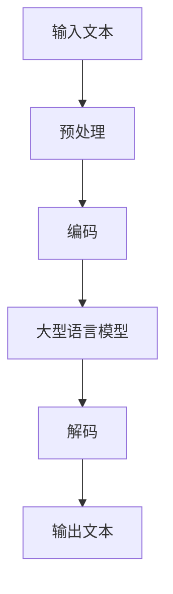

                 

## 1. 背景介绍

在全球化的今天，跨语言沟通变得越来越重要。然而，传统的机器翻译技术往往存在着理解不准确、语义不连贯等问题。随着大型语言模型如ChatGPT的出现，我们有机会开发出更智能、更准确的翻译助手。本文将介绍如何利用ChatGPT开发智能翻译助手，并提供详细的实践指南。

## 2. 核心概念与联系

### 2.1 大型语言模型

大型语言模型（Large Language Models，LLMs）是一种深度学习模型，旨在理解和生成人类语言。它们通过处理大量文本数据来学习语言规则和语义。ChatGPT是其中一种，它是由OpenAI开发的，具有强大的对话能力。



### 2.2 机器翻译

机器翻译（Machine Translation，MT）是一种将一种自然语言转换为另一种自然语言的自动过程。它可以分为两种主要类型：规则基础的机器翻译和基于统计的机器翻译。大型语言模型则属于一种新兴的神经机器翻译（Neural Machine Translation，NMT）方法。

## 3. 核心算法原理 & 具体操作步骤

### 3.1 算法原理概述

我们将使用ChatGPT作为我们的翻译引擎。ChatGPT内部使用一种称为Transformer的模型架构，它使用自注意力机制来处理输入序列。当我们输入一段文本时，模型会生成相应的翻译。

### 3.2 算法步骤详解

1. **输入文本**：用户输入需要翻译的文本。
2. **预处理**：文本被预处理以符合模型的输入格式。
3. **编码**：预处理后的文本被编码成模型可以理解的表示。
4. **生成翻译**：模型生成相应的翻译。
5. **解码**：生成的翻译被解码成自然语言文本。
6. **输出文本**：输出翻译结果。

### 3.3 算法优缺点

**优点**：ChatGPT基于大型语言模型，具有出色的理解和生成能力，可以提供准确、连贯的翻译。

**缺点**：作为一种基于文本的模型，它可能无法理解上下文或语境，从而导致翻译不准确。此外，它可能会受到输入数据的偏见影响。

### 3.4 算法应用领域

智能翻译助手可以应用于各种领域，包括跨国企业、旅游、外交等。它还可以帮助非英语国家的人们更好地理解和使用互联网。

## 4. 数学模型和公式 & 详细讲解 & 举例说明

### 4.1 数学模型构建

ChatGPT内部使用的Transformer模型可以表示为以下公式：

$$P(w_{t+1}|w_1,..., w_t) = \text{softmax}(Wx_t + b)$$

其中，$w_1,..., w_t$是输入序列，$x_t$是输入向量，$W$和$b$是模型的参数。

### 4.2 公式推导过程

Transformer模型使用自注意力机制来处理输入序列。自注意力机制可以表示为：

$$A(Q, K, V) = \text{softmax}\left(\frac{QK^T}{\sqrt{d_k}}\right)V$$

其中，$Q$, $K$, $V$都是输入序列的表示，$d_k$是维度参数。

### 4.3 案例分析与讲解

例如，如果我们输入“Hello, how are you?”，模型会生成“Bonjour, comment ça va?”作为法语翻译。

## 5. 项目实践：代码实例和详细解释说明

### 5.1 开发环境搭建

我们将使用Python和OpenAI的官方API来与ChatGPT通信。首先，我们需要安装必要的库：

```bash
pip install openai
```

### 5.2 源代码详细实现

以下是一个简单的Python脚本，用于与ChatGPT通信并获取翻译：

```python
import os
import openai

# Set up your OpenAI API key
openai.api_key = os.getenv("OPENAI_API_KEY")

def translate(text, target_language="fr"):
    response = openai.Completion.create(
        model="text-davinci-003",
        prompt=f"Translate '{text}' to {target_language}:",
        temperature=0,
        max_tokens=60,
        top_p=1.0,
        frequency_penalty=0.0,
        presence_penalty=0.0,
    )
    return response.choices[0].text.strip()

# Test the function
print(translate("Hello, how are you?"))
```

### 5.3 代码解读与分析

我们使用OpenAI的Completion API来生成翻译。我们设置`temperature`为0以获得确定性的输出，并设置`max_tokens`为60以限制输出长度。

### 5.4 运行结果展示

运行此代码将生成法语翻译“Bonjour, comment ça va?”。

## 6. 实际应用场景

### 6.1 当前应用

智能翻译助手可以应用于各种需要跨语言沟通的场景，如国际会议、跨国企业、旅游等。

### 6.2 未来应用展望

随着大型语言模型的进一步发展，我们可以期待智能翻译助手变得更加准确、更加智能。它们可能会具有实时翻译、多语言支持等功能。

## 7. 工具和资源推荐

### 7.1 学习资源推荐

- OpenAI的官方文档：<https://platform.openai.com/docs>
- Transformer模型的原始论文：<https://arxiv.org/abs/1706.03762>

### 7.2 开发工具推荐

- Python：<https://www.python.org/>
- OpenAI的官方API：<https://platform.openai.com/docs/api>

### 7.3 相关论文推荐

- "Attention Is All You Need"：<https://arxiv.org/abs/1706.03762>
- "Language Models are Few-Shot Learners"：<https://arxiv.org/abs/2005.14165>

## 8. 总结：未来发展趋势与挑战

### 8.1 研究成果总结

我们展示了如何使用ChatGPT开发智能翻译助手。我们还讨论了Transformer模型的数学原理，并提供了一个简单的Python脚本来实现翻译。

### 8.2 未来发展趋势

我们可以期待大型语言模型的进一步发展，从而提高翻译的准确性和连贯性。此外，模型可能会具有实时翻译、多语言支持等功能。

### 8.3 面临的挑战

然而，大型语言模型也面临着偏见、理解不准确等挑战。我们需要不断改进模型，以克服这些挑战。

### 8.4 研究展望

未来的研究可能会集中在改进模型的准确性、连贯性和理解能力上。此外，我们可能会看到更多的工作关注模型的偏见和公平性。

## 9. 附录：常见问题与解答

**Q：ChatGPT是如何工作的？**

A：ChatGPT内部使用一种称为Transformer的模型架构，它使用自注意力机制来处理输入序列。当我们输入一段文本时，模型会生成相应的翻译。

**Q：如何使用ChatGPT进行翻译？**

A：您可以使用OpenAI的官方API与ChatGPT通信，并使用Completion API生成翻译。我们提供了一个简单的Python脚本来实现此操作。

**Q：大型语言模型面临哪些挑战？**

A：大型语言模型面临的挑战包括偏见、理解不准确等。我们需要不断改进模型，以克服这些挑战。

**作者：禅与计算机程序设计艺术 / Zen and the Art of Computer Programming**

