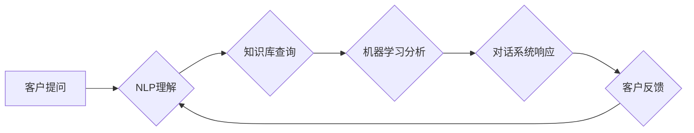

> 知识库、销售顾问、自然语言处理、机器学习、推荐系统、对话系统、客户关系管理

## 1. 背景介绍

在当今数据爆炸的时代，企业积累了海量的客户数据，但如何有效地利用这些数据来提升销售效率，提升客户体验，一直是企业面临的挑战。传统的销售模式往往依赖于人工客服，效率低下，且难以满足客户个性化的需求。基于知识库的销售顾问（Sales-Consultant）应运而生，它利用人工智能技术，将知识库中的产品信息、客户数据、市场趋势等整合在一起，为客户提供个性化、智能化的销售服务。

## 2. 核心概念与联系

### 2.1 知识库

知识库是基于知识表示和推理的数据库，它存储着关于特定领域的知识，并通过规则和逻辑关系连接这些知识点。在销售顾问系统中，知识库可以包含产品信息、客户信息、市场趋势、竞争对手分析等数据，为系统提供决策依据。

### 2.2 自然语言处理（NLP）

自然语言处理是人工智能领域的重要分支，它致力于使计算机能够理解和处理人类语言。在销售顾问系统中，NLP技术用于理解客户的自然语言输入，例如客户提出的问题、需求、反馈等，并将其转换为系统能够理解的格式。

### 2.3 机器学习（ML）

机器学习是人工智能领域的核心技术之一，它通过算法训练模型，使模型能够从数据中学习规律，并进行预测或决策。在销售顾问系统中，机器学习技术可以用于客户画像分析、产品推荐、销售预测等方面。

### 2.4 对话系统

对话系统是能够与人类进行自然语言交互的系统。在销售顾问系统中，对话系统可以与客户进行实时对话，回答客户的问题，提供产品信息，引导客户完成购买流程。

**核心架构流程图**



## 3. 核心算法原理 & 具体操作步骤

### 3.1 算法原理概述

基于知识库的销售顾问系统主要基于以下核心算法：

* **自然语言理解（NLU）算法：** 用于分析客户的自然语言输入，识别关键信息，例如客户的需求、问题、意图等。常见的NLU算法包括词性标注、依存句法分析、命名实体识别等。
* **知识图谱构建算法：** 用于构建产品、客户、市场等领域的知识图谱，将知识点连接起来，形成知识网络。常见的知识图谱构建算法包括规则抽取、机器学习、深度学习等。
* **推荐算法：** 用于根据客户的兴趣、需求、购买历史等信息，推荐合适的商品或服务。常见的推荐算法包括协同过滤、内容过滤、基于知识的推荐等。
* **对话管理算法：** 用于控制对话流程，引导客户完成购买流程，并提供个性化的服务。常见的对话管理算法包括状态机、树形结构、强化学习等。

### 3.2 算法步骤详解

1. **客户提问：** 客户通过文本或语音方式向销售顾问提出问题或需求。
2. **NLP理解：** 系统使用NLU算法分析客户的输入，识别关键信息，例如客户的需求、问题、意图等。
3. **知识库查询：** 系统根据识别出的关键信息，从知识库中查询相关产品信息、客户信息、市场趋势等数据。
4. **机器学习分析：** 系统使用机器学习算法分析查询到的数据，例如客户画像分析、产品推荐、销售预测等。
5. **对话系统响应：** 系统使用对话管理算法生成自然语言响应，回答客户的问题，提供产品信息，引导客户完成购买流程。
6. **客户反馈：** 客户对系统响应进行反馈，例如满意度、建议等。
7. **系统学习：** 系统将客户反馈信息反馈到机器学习模型中，不断优化算法，提升服务质量。

### 3.3 算法优缺点

**优点：**

* **个性化服务：** 基于客户数据和知识库，提供个性化的产品推荐和服务。
* **24/7可用性：** 系统可以全天候在线，随时为客户提供服务。
* **提高效率：** 自动化销售流程，提高销售效率。
* **数据驱动决策：** 通过数据分析，为销售决策提供支持。

**缺点：**

* **知识库建设成本高：** 建立完善的知识库需要投入大量时间和资源。
* **算法复杂度高：** 需要复杂的算法和模型来实现智能化服务。
* **数据安全问题：** 需要妥善处理客户数据，保障数据安全。

### 3.4 算法应用领域

基于知识库的销售顾问系统可以应用于各个行业，例如：

* **电商：** 为客户提供个性化商品推荐、在线咨询服务。
* **金融：** 为客户提供理财建议、贷款申请服务。
* **医疗：** 为患者提供疾病诊断、治疗方案建议。
* **教育：** 为学生提供个性化学习辅导、课程推荐。

## 4. 数学模型和公式 & 详细讲解 & 举例说明

### 4.1 数学模型构建

在基于知识库的销售顾问系统中，可以使用数学模型来表示客户需求、产品特征、市场趋势等信息。例如，可以使用向量空间模型来表示客户需求和产品特征，通过余弦相似度计算客户需求与产品特征的匹配度。

### 4.2 公式推导过程

**余弦相似度公式：**

$$
\text{相似度} = \frac{\mathbf{a} \cdot \mathbf{b}}{||\mathbf{a}|| ||\mathbf{b}||}
$$

其中：

* $\mathbf{a}$ 和 $\mathbf{b}$ 分别表示客户需求向量和产品特征向量。
* $\mathbf{a} \cdot \mathbf{b}$ 表示两个向量的点积。
* $||\mathbf{a}||$ 和 $||\mathbf{b}||$ 分别表示两个向量的模长。

### 4.3 案例分析与讲解

假设我们有一个客户需求向量 $\mathbf{a} = [0.5, 0.3, 0.2]$，表示客户对价格、性能和外观的偏好。

假设我们有一个产品特征向量 $\mathbf{b} = [0.4, 0.6, 0.1]$，表示该产品的价格、性能和外观的特征。

则，这两个向量的余弦相似度为：

$$
\text{相似度} = \frac{0.5 \cdot 0.4 + 0.3 \cdot 0.6 + 0.2 \cdot 0.1}{\sqrt{0.5^2 + 0.3^2 + 0.2^2} \sqrt{0.4^2 + 0.6^2 + 0.1^2}} \approx 0.7
$$

该结果表明，该产品与客户需求的匹配度较高。

## 5. 项目实践：代码实例和详细解释说明

### 5.1 开发环境搭建

* 操作系统：Windows/macOS/Linux
* Python 版本：3.6+
* 依赖库：
    * NLTK
    * SpaCy
    * TensorFlow/PyTorch
    * Flask/Django

### 5.2 源代码详细实现

```python
# 导入必要的库
import nltk
import spacy
from tensorflow.keras.models import Sequential
from tensorflow.keras.layers import Dense

# 下载并加载语言模型
nltk.download('punkt')
nlp = spacy.load('en_core_web_sm')

# 定义一个简单的对话系统
class SalesConsultant:
    def __init__(self):
        self.model = Sequential()
        self.model.add(Dense(128, activation='relu', input_shape=(100,)))
        self.model.add(Dense(64, activation='relu'))
        self.model.add(Dense(1, activation='sigmoid'))
        self.model.compile(loss='binary_crossentropy', optimizer='adam', metrics=['accuracy'])

    def process_input(self, text):
        doc = nlp(text)
        tokens = [token.text for token in doc]
        return tokens

    def predict_intent(self, tokens):
        # 将文本转换为数字向量，并输入模型进行预测
        # ...
        return prediction

    def generate_response(self, intent):
        # 根据预测的意图，生成相应的回复
        # ...
        return response

# 创建销售顾问实例
sales_consultant = SalesConsultant()

# 用户输入
user_input = "我想买一部手机"

# 处理用户输入
tokens = sales_consultant.process_input(user_input)

# 预测用户意图
intent = sales_consultant.predict_intent(tokens)

# 生成回复
response = sales_consultant.generate_response(intent)

# 输出回复
print(response)
```

### 5.3 代码解读与分析

* **代码结构：** 代码定义了一个简单的销售顾问类 `SalesConsultant`，包含了处理用户输入、预测意图、生成回复等功能。
* **自然语言处理：** 使用了 `NLTK` 和 `SpaCy` 库进行自然语言处理，将用户输入的文本转换为数字向量。
* **机器学习：** 使用了 `TensorFlow` 或 `PyTorch` 库构建了一个简单的机器学习模型，用于预测用户的意图。
* **对话管理：** 根据预测的意图，生成相应的回复，实现简单的对话交互。

### 5.4 运行结果展示

当用户输入 "我想买一部手机" 时，系统会输出类似于 "好的，请问您想买哪种类型的手机？" 的回复。

## 6. 实际应用场景

### 6.1 电商平台

基于知识库的销售顾问可以帮助电商平台提供个性化商品推荐、在线咨询服务、售后服务等，提升客户体验，提高转化率。

### 6.2 金融服务

在金融领域，销售顾问可以帮助客户进行理财规划、贷款申请、投资咨询等，提供个性化的金融服务。

### 6.3 教育行业

在教育行业，销售顾问可以帮助学生进行课程推荐、学习辅导、考试指导等，提供个性化的学习服务。

### 6.4 未来应用展望

随着人工智能技术的不断发展，基于知识库的销售顾问系统将更加智能化、个性化，能够更好地满足客户需求，提升企业竞争力。

## 7. 工具和资源推荐

### 7.1 学习资源推荐

* **书籍：**
    * 《深度学习》
    * 《自然语言处理》
    * 《机器学习》
* **在线课程：**
    * Coursera
    * edX
    * Udacity

### 7.2 开发工具推荐

* **Python:** 
* **TensorFlow/PyTorch:** 深度学习框架
* **NLTK/SpaCy:** 自然语言处理库
* **Flask/Django:** Web 开发框架

### 7.3 相关论文推荐

* **BERT: Pre-training of Deep Bidirectional Transformers for Language Understanding**
* **Attention Is All You Need**
* **Knowledge Graph Embedding: A Survey**

## 8. 总结：未来发展趋势与挑战

### 8.1 研究成果总结

基于知识库的销售顾问系统是一个新兴的领域，近年来取得了显著的进展。

### 8.2 未来发展趋势

* **更智能化的对话系统：** 利用深度学习技术，构建更智能化的对话系统，能够更好地理解客户需求，提供更个性化的服务。
* **更丰富的知识库：** 构建更丰富的知识库，涵盖更广泛的领域，提供更全面的服务。
* **更强大的推荐算法：** 开发更强大的推荐算法，能够更精准地推荐客户感兴趣的产品或服务。

### 8.3 面临的挑战

* **知识库建设成本高：** 建