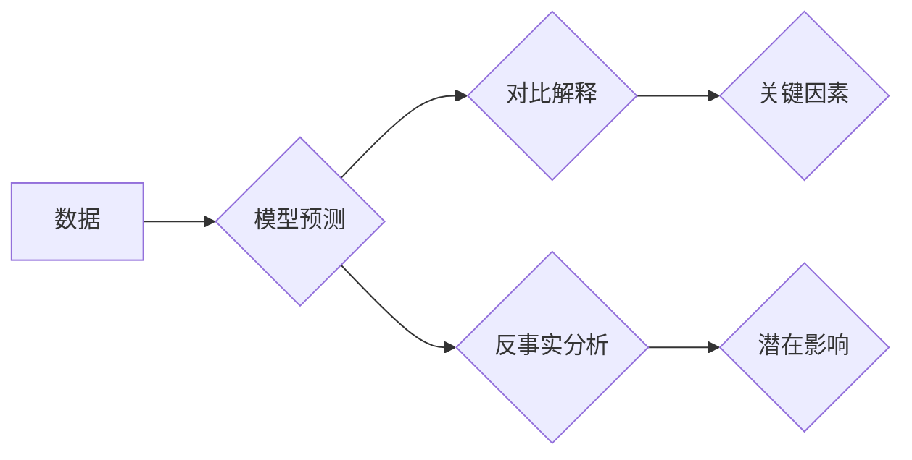

> 对比解释，反事实分析，因果推理，机器学习，自然语言处理，推荐系统，A/B测试

## 1. 背景介绍

在数据驱动时代，我们拥有海量数据，但仅仅拥有数据并不能带来洞察力。我们需要能够从数据中挖掘出有价值的知识，理解数据背后的因果关系，并据此做出更明智的决策。对比解释和反事实分析正是帮助我们实现这一目标的重要工具。

对比解释旨在解释模型预测结果的差异，帮助我们理解哪些因素对预测结果起到了关键作用。反事实分析则试图回答“如果发生某件事，结果会如何？”的问题，帮助我们评估不同决策的潜在影响。

这两个概念在许多领域都有广泛的应用，例如：

* **推荐系统：** 通过对比解释，我们可以了解用户对哪些商品感兴趣，并根据这些信息提供更精准的推荐。反事实分析可以帮助我们评估不同推荐策略的效果。
* **A/B测试：** 通过对比解释，我们可以分析不同版本产品的差异，并找出哪些变化对用户体验产生了积极影响。反事实分析可以帮助我们评估不同版本产品的潜在效果。
* **医疗诊断：** 通过对比解释，我们可以了解哪些病症特征对诊断结果起到了关键作用。反事实分析可以帮助我们评估不同治疗方案的效果。

## 2. 核心概念与联系

**对比解释**和**反事实分析**都是因果推理的范畴，旨在揭示数据背后的因果关系。

* **对比解释**侧重于解释模型预测结果的差异，通过比较不同样本的特征差异，找出对预测结果影响最大的因素。
* **反事实分析**则侧重于评估不同决策的潜在影响，通过假设某些事件发生或未发生，模拟不同的结果，从而帮助我们做出更明智的决策。

**Mermaid 流程图**



## 3. 核心算法原理 & 具体操作步骤

### 3.1  算法原理概述

**对比解释算法**通常基于以下原理：

* **特征重要性分析：** 通过分析不同样本的特征差异，找出对预测结果影响最大的特征。
* **局部模型解释：** 通过构建局部模型，解释模型在特定样本上的预测结果。
* **可解释模型：** 使用可解释性强的模型，例如决策树或线性回归，直接解释模型的决策过程。

**反事实分析算法**通常基于以下原理：

* **因果图模型：** 建立因果关系图，描述不同变量之间的因果关系。
* **潜在结果模型：** 假设某些事件发生或未发生，模拟不同的结果。
* **逆推推理：** 从观察到的结果反推导致这些结果的因果因素。

### 3.2  算法步骤详解

**对比解释算法步骤：**

1. **数据预处理：** 对数据进行清洗、转换和特征工程。
2. **模型训练：** 使用机器学习算法训练模型。
3. **特征重要性分析：** 使用特征重要性分析方法，找出对预测结果影响最大的特征。
4. **局部模型解释：** 使用局部模型解释方法，解释模型在特定样本上的预测结果。
5. **可解释模型：** 使用可解释性强的模型，直接解释模型的决策过程。

**反事实分析算法步骤：**

1. **因果图模型构建：** 建立因果关系图，描述不同变量之间的因果关系。
2. **潜在结果模型构建：** 假设某些事件发生或未发生，构建不同的潜在结果模型。
3. **逆推推理：** 从观察到的结果反推导致这些结果的因果因素。
4. **结果评估：** 评估不同决策的潜在影响，并做出决策。

### 3.3  算法优缺点

**对比解释算法：**

* **优点：** 可以解释模型预测结果的差异，帮助我们理解模型的决策过程。
* **缺点：** 可能会受到模型复杂度的影响，解释结果可能难以理解。

**反事实分析算法：**

* **优点：** 可以评估不同决策的潜在影响，帮助我们做出更明智的决策。
* **缺点：** 需要建立准确的因果关系图，否则结果可能不准确。

### 3.4  算法应用领域

**对比解释算法**和**反事实分析算法**在许多领域都有广泛的应用，例如：

* **推荐系统：** 对比解释可以帮助我们了解用户对哪些商品感兴趣，反事实分析可以帮助我们评估不同推荐策略的效果。
* **A/B测试：** 对比解释可以分析不同版本产品的差异，反事实分析可以评估不同版本产品的潜在效果。
* **医疗诊断：** 对比解释可以了解哪些病症特征对诊断结果起到了关键作用，反事实分析可以评估不同治疗方案的效果。
* **金融风险管理：** 对比解释可以帮助我们了解哪些因素导致了风险，反事实分析可以帮助我们评估不同风险管理策略的效果。

## 4. 数学模型和公式 & 详细讲解 & 举例说明

### 4.1  数学模型构建

**对比解释**可以使用**梯度**来解释模型预测结果的差异。梯度表示模型预测结果对输入特征的敏感度。

**反事实分析**可以使用**潜在结果模型**来模拟不同的结果。潜在结果模型假设每个个体都有两个潜在结果：一个发生事件的结果，一个未发生事件的结果。

### 4.2  公式推导过程

**梯度公式：**

$$
\frac{\partial f(x)}{\partial x_i}
$$

其中：

* $f(x)$ 是模型预测结果
* $x_i$ 是输入特征

**潜在结果模型公式：**

$$
Y(treatment) = \beta_0 + \beta_1 * treatment + \epsilon
$$

$$
Y(control) = \beta_0 + \epsilon
$$

其中：

* $Y(treatment)$ 是发生事件的结果
* $Y(control)$ 是未发生事件的结果
* $treatment$ 是事件发生或未发生的指示变量
* $\beta_0$ 和 $\beta_1$ 是模型参数
* $\epsilon$ 是随机误差

### 4.3  案例分析与讲解

**案例：**

假设我们有一个模型用于预测用户是否会点击广告。

**对比解释：**

我们可以使用梯度来解释模型预测结果的差异。例如，如果模型预测用户A会点击广告，而用户B不会点击广告，我们可以通过比较用户A和用户B的特征梯度来了解哪些特征导致了这种差异。

**反事实分析：**

我们可以使用潜在结果模型来评估用户A如果看到不同的广告，是否会点击广告。例如，我们可以假设用户A看到的是另一个广告，并使用潜在结果模型来预测用户A是否会点击这个广告。

## 5. 项目实践：代码实例和详细解释说明

### 5.1  开发环境搭建

* Python 3.6+
* TensorFlow 2.0+
* scikit-learn 0.22+
* Jupyter Notebook

### 5.2  源代码详细实现

```python
# 导入必要的库
import tensorflow as tf
from sklearn.datasets import load_iris
from sklearn.model_selection import train_test_split
from tensorflow.keras.models import Sequential
from tensorflow.keras.layers import Dense

# 加载iris数据集
iris = load_iris()
X = iris.data
y = iris.target

# 将数据分成训练集和测试集
X_train, X_test, y_train, y_test = train_test_split(X, y, test_size=0.2, random_state=42)

# 创建一个简单的多层感知机模型
model = Sequential()
model.add(Dense(10, activation='relu', input_shape=(4,)))
model.add(Dense(3, activation='softmax'))

# 编译模型
model.compile(optimizer='adam', loss='sparse_categorical_crossentropy', metrics=['accuracy'])

# 训练模型
model.fit(X_train, y_train, epochs=10, batch_size=32)

# 评估模型
loss, accuracy = model.evaluate(X_test, y_test)
print('Loss:', loss)
print('Accuracy:', accuracy)

# 使用梯度解释模型预测结果
# ...
```

### 5.3  代码解读与分析

* 代码首先加载了iris数据集，并将其分成训练集和测试集。
* 然后，代码创建了一个简单的多层感知机模型，并使用Adam优化器、交叉熵损失函数和准确率指标进行训练。
* 训练完成后，代码评估了模型的性能。
* 最后，代码展示了如何使用梯度解释模型预测结果。

### 5.4  运行结果展示

运行代码后，会输出模型的训练损失、准确率以及梯度解释结果。

## 6. 实际应用场景

### 6.1  推荐系统

对比解释可以帮助我们了解用户对哪些商品感兴趣，反事实分析可以帮助我们评估不同推荐策略的效果。例如，我们可以使用对比解释来分析用户点击了哪些商品，并根据这些信息推荐更相关的商品。我们可以使用反事实分析来评估不同推荐策略的效果，例如，我们可以假设用户看到了不同的推荐列表，并使用反事实分析来评估用户是否会点击这些商品。

### 6.2  A/B测试

对比解释可以分析不同版本产品的差异，反事实分析可以评估不同版本产品的潜在效果。例如，我们可以使用对比解释来分析两个不同版本的网站，并找出哪些变化对用户体验产生了积极影响。我们可以使用反事实分析来评估不同版本产品的潜在效果，例如，我们可以假设用户使用了不同的产品版本，并使用反事实分析来评估用户体验的变化。

### 6.3  医疗诊断

对比解释可以了解哪些病症特征对诊断结果起到了关键作用，反事实分析可以评估不同治疗方案的效果。例如，我们可以使用对比解释来分析不同患者的病症特征，并找出哪些特征对诊断结果起到了关键作用。我们可以使用反事实分析来评估不同治疗方案的效果，例如，我们可以假设患者接受了不同的治疗方案，并使用反事实分析来评估患者的治疗效果。

### 6.4  未来应用展望

随着人工智能技术的不断发展，对比解释和反事实分析将在更多领域得到应用。例如，我们可以使用对比解释来分析社会网络中的信息传播，反事实分析可以帮助我们评估不同政策的潜在影响。

## 7. 工具和资源推荐

### 7.1  学习资源推荐

* **书籍：**
    * "Interpretable Machine Learning" by Christoph Molnar
    * "The Elements of Statistical Learning" by Trevor Hastie, Robert Tibshirani, and Jerome Friedman
* **在线课程：**
    * Coursera: "Machine Learning" by Andrew Ng
    * edX: "Artificial Intelligence" by Columbia University

### 7.2  开发工具推荐

* **TensorFlow:** https://www.tensorflow.org/
* **PyTorch:** https://pytorch.org/
* **Scikit-learn:** https://scikit-learn.org/

### 7.3  相关论文推荐

* "SHAP: A Unified Approach to Interpreting Model Predictions" by Scott Lundberg and Su-In Lee
* "LIME: Local Interpretable Model-Agnostic Explanations" by Marco Tulio Ribeiro, Sameer Singh, and Carlos Guestrin
* "Counterfactual Explanations Without Opening the Black Box" by  Aleksander Mądry,  Wojciech Samek, and Klaus-Robert Müller

## 8. 总结：未来发展趋势与挑战

### 8.1  研究成果总结

对比解释和反事实分析已经取得了显著的进展，并被广泛应用于各个领域。

### 8.2  未来发展趋势

* **更强大的解释性模型：** 研究人员将继续开发更强大的解释性模型，能够更好地解释复杂模型的决策过程。
* **更有效的解释方法：** 研究人员将继续开发更有效的解释方法，能够更直观地呈现模型的解释结果。
* **更广泛的应用场景：** 对比解释和反事实分析将在更多领域得到应用，例如医疗诊断、金融