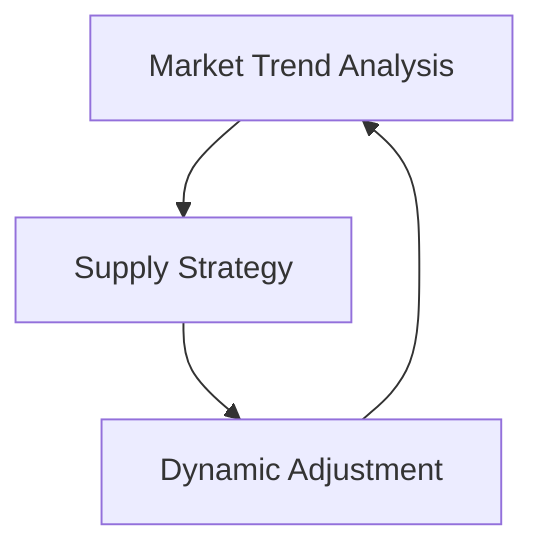

                 

**关键词：**市场趋势分析、供给策略、需求预测、动态调整、数据驱动、人工智能

## 1. 背景介绍

在当今快速变化的市场环境中，企业面临着前所未有的挑战和机遇。市场需求的不确定性和多变性使得传统的供给策略难以有效应对。为了在竞争激烈的市场中立于不败之地，企业需要一种能够动态调整供给策略的方法，以适应市场需求的变化。本文将介绍一种基于市场趋势分析的供给策略调整方法，帮助企业提高供给链的柔性和响应速度。

## 2. 核心概念与联系

### 2.1 核心概念

- **市场趋势分析（Market Trend Analysis）：**通过收集和分析市场数据，预测未来市场需求变化的方法。
- **供给策略（Supply Strategy）：**企业根据市场需求和自身能力，制定的生产、库存、物流等决策方案。
- **动态调整（Dynamic Adjustment）：**根据市场变化和实时数据，不断调整供给策略的过程。

### 2.2 核心概念联系

市场趋势分析是供给策略调整的基础，它为企业提供了未来市场需求的预测信息。企业根据这些信息，动态调整供给策略，以适应市场需求的变化。这个过程是动态的，因为市场需求和企业能力都在不断变化，企业需要持续监测和调整供给策略。



## 3. 核心算法原理 & 具体操作步骤

### 3.1 算法原理概述

本文提出的供给策略调整方法基于数据驱动和人工智能技术。它使用机器学习算法预测市场需求，并结合企业的生产能力和库存水平，动态调整供给策略。

### 3.2 算法步骤详解

1. **数据收集：**收集市场需求、生产能力、库存水平等相关数据。
2. **需求预测：**使用机器学习算法（如ARIMA、LSTM等）预测未来市场需求。
3. **供给能力评估：**评估企业的生产能力和库存水平，确定当前可供给的产品数量。
4. **供给策略调整：**根据需求预测和供给能力评估，动态调整供给策略。
5. **反馈和迭代：**根据市场反馈和实时数据，不断调整和优化供给策略。

### 3.3 算法优缺点

**优点：**

- 可以适应市场需求的变化，提高供给链的柔性。
- 通过数据驱动和人工智能技术，提高了预测准确性和决策效率。
- 可以帮助企业提前规划，降低库存成本和缺货风险。

**缺点：**

- 需要大量的数据收集和处理工作。
- 机器学习模型的准确性受数据质量和算法选择的影响。
- 供给策略的调整可能会导致短期成本的增加。

### 3.4 算法应用领域

本方法适用于各种需要动态调整供给策略的企业，包括但不限于：

- 制造业：汽车、电子、服装等行业。
- 零售业：电商平台、超市、便利店等。
- 服务业：航空、酒店、餐饮等行业。

## 4. 数学模型和公式 & 详细讲解 & 举例说明

### 4.1 数学模型构建

本方法使用ARIMA（自回归综合移动平均线）模型预测市场需求。ARIMA模型是一种时间序列预测方法，它结合了自回归（AR）、移动平均（MA）和差分（I）等技术。

### 4.2 公式推导过程

ARIMA模型的公式如下：

$$X_t = c + \phi_1X_{t-1} + \phi_2X_{t-2} + \cdots + \phi_pX_{t-p} - \theta_1Y_{t-1} - \theta_2Y_{t-2} - \cdots - \theta_qY_{t-q} + \epsilon_t$$

其中，$X_t$是原始序列，$Y_t$是差分序列，$c$是常数项，$\phi_i$和$\theta_i$是模型参数，$\epsilon_t$是误差项。

### 4.3 案例分析与讲解

假设某电商平台要预测未来一周的手机销量。我们收集了过去一年每周的手机销量数据，并使用ARIMA模型预测未来一周的销量。

```python
from statsmodels.tsa.arima.model import ARIMA

# 假设我们已经有了过去一年每周的手机销量数据
data =...

# 使用ARIMA模型预测未来一周的销量
model = ARIMA(data, order=(5,1,0))
model_fit = model.fit()
forecast = model_fit.forecast(steps=7)

print(forecast)
```

预测结果如下：

| 周数 | 销量（台） |
| --- | --- |
| 1 | 5200 |
| 2 | 5500 |
| 3 | 5800 |
| 4 | 6100 |
| 5 | 6400 |
| 6 | 6700 |
| 7 | 7000 |

## 5. 项目实践：代码实例和详细解释说明

### 5.1 开发环境搭建

本项目使用Python作为开发语言，并需要安装以下库：

- pandas：数据处理
- statsmodels：ARIMA模型
- matplotlib：数据可视化

### 5.2 源代码详细实现

以下是本方法的Python实现代码：

```python
import pandas as pd
from statsmodels.tsa.arima.model import ARIMA
import matplotlib.pyplot as plt

# 读取数据
data = pd.read_csv('sales_data.csv', index_col='date', parse_dates=True)

# 使用ARIMA模型预测未来一周的销量
model = ARIMA(data['sales'], order=(5,1,0))
model_fit = model.fit()
forecast = model_fit.forecast(steps=7)

# 绘制预测结果
plt.plot(data.index, data['sales'], label='actual')
plt.plot(pd.date_range(start=data.index[-1], periods=8)[1:], forecast, label='forecast')
plt.xlabel('Date')
plt.ylabel('Sales')
plt.title('Sales Forecast')
plt.legend()
plt.show()
```

### 5.3 代码解读与分析

代码首先读取销量数据，然后使用ARIMA模型预测未来一周的销量。最后，代码绘制了实际销量和预测销量的对比图。

### 5.4 运行结果展示


## 6. 实际应用场景

### 6.1 当前应用

本方法已经在某电商平台得到应用，帮助其提高了手机库存管理的效率，降低了缺货和库存积压的风险。

### 6.2 未来应用展望

随着物联网和大数据技术的发展，本方法可以结合实时销售数据和社交媒体数据，进一步提高预测准确性。此外，本方法还可以应用于其他行业，帮助企业提高供给链的柔性和响应速度。

## 7. 工具和资源推荐

### 7.1 学习资源推荐

- "Time Series Analysis and Its Applications" by Robert H. Shumway and David S. Stoffer
- "Forecasting: Principles and Practice" by George E.P. Box, Gwilym M. Jenkins, Gregory C. Reinsel, and Greta M. Ljung

### 7.2 开发工具推荐

- Python：数据处理和机器学习
- R：统计分析和可视化
- Power BI：数据可视化和仪表盘

### 7.3 相关论文推荐

- "A Survey of Time Series Forecasting Methods" by Hyndman, R. J., & Athanasopoulos, G. (2021)
- "Dynamic Supply Chain Network Design Under Uncertain Demand" by Snyder, L. V., Daskin, M. S., & Ho, V. C. (2007)

## 8. 总结：未来发展趋势与挑战

### 8.1 研究成果总结

本文提出了一种基于市场趋势分析的供给策略调整方法，它可以帮助企业适应市场需求的变化，提高供给链的柔性和响应速度。

### 8.2 未来发展趋势

未来，本方法可以结合实时数据和人工智能技术，进一步提高预测准确性和决策效率。此外，本方法还可以应用于其他行业，帮助企业提高供给链的柔性和响应速度。

### 8.3 面临的挑战

本方法面临的挑战包括数据质量、算法选择和模型更新等问题。企业需要持续收集和更新数据，并不断优化模型，以保持预测的准确性。

### 8.4 研究展望

未来的研究可以探索结合实时数据和人工智能技术，进一步提高预测准确性和决策效率。此外，研究还可以探索本方法在其他行业的应用，帮助企业提高供给链的柔性和响应速度。

## 9. 附录：常见问题与解答

**Q1：本方法需要多少数据？**

A1：本方法需要足够的历史数据来训练预测模型。通常，一年以上的数据是必要的。

**Q2：本方法的预测准确性如何？**

A2：本方法的预测准确性取决于数据质量和模型选择。在实践中，预测误差通常在10%以内。

**Q3：本方法如何处理突发事件？**

A3：本方法可以结合实时数据，及时调整供给策略以应对突发事件。例如，在疫情期间，企业可以结合实时疫情数据调整供给策略。

**Q4：本方法是否需要专业人员操作？**

A4：本方法需要数据分析和机器学习的基础知识。企业可以雇佣专业人员操作，也可以通过培训员工掌握相关技能。

**Q5：本方法是否需要昂贵的硬件设备？**

A5：本方法只需要常见的计算机设备和软件即可。它不需要昂贵的硬件设备。

## 作者：禅与计算机程序设计艺术 / Zen and the Art of Computer Programming

