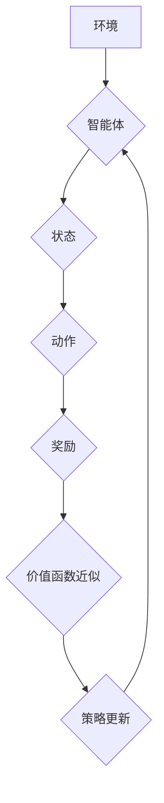

> 强化学习，价值函数，近似方法，神经网络，函数逼近，蒙特卡罗方法，TD学习

## 1. 背景介绍

强化学习 (Reinforcement Learning, RL) 作为机器学习的一个重要分支，旨在训练智能体在环境中通过与环境交互学习最优策略，以最大化累积奖励。在强化学习算法中，价值函数 (Value Function) 扮演着至关重要的角色。价值函数评估了某个状态或状态-动作对的长期价值，为智能体选择最优动作提供决策依据。然而，在实际应用中，环境状态空间通常非常庞大，直接计算所有状态的价值函数往往不可行。因此，近似价值函数成为强化学习算法的关键技术之一。

## 2. 核心概念与联系

**2.1 强化学习基本概念**

强化学习的核心要素包括：

* **智能体 (Agent):**  学习和决策的实体。
* **环境 (Environment):** 智能体所处的外部世界。
* **状态 (State):** 环境的当前描述。
* **动作 (Action):** 智能体在特定状态下可以执行的操作。
* **奖励 (Reward):** 环境对智能体动作的反馈，通常是一个标量值。
* **策略 (Policy):** 智能体在不同状态下选择动作的规则。

**2.2 价值函数**

价值函数评估了某个状态或状态-动作对的长期价值。常见的价值函数类型包括：

* **状态价值函数 (State-Value Function):**  评估了某个状态的长期奖励总和。
* **动作价值函数 (Action-Value Function):**  评估了在某个状态执行某个动作的长期奖励总和。

**2.3 近似价值函数**

近似价值函数是指使用函数逼近来估计价值函数的方法。常见的近似方法包括：

* **神经网络:** 利用神经网络的非线性拟合能力逼近价值函数。
* **线性回归:** 使用线性函数来近似价值函数。
* **决策树:** 使用决策树结构来近似价值函数。

**2.4  价值函数近似方法流程图**



## 3. 核心算法原理 & 具体操作步骤

**3.1 算法原理概述**

价值函数近似方法的核心思想是将价值函数表示为一个可学习的函数，并通过训练这个函数来逼近真实价值函数。常用的训练方法包括蒙特卡罗方法和TD学习。

**3.2 算法步骤详解**

1. **初始化:** 初始化价值函数参数，例如神经网络的权重。
2. **环境交互:** 智能体与环境交互，收集状态、动作和奖励数据。
3. **价值函数更新:** 根据收集到的数据，更新价值函数参数。
4. **策略更新:** 根据更新后的价值函数，更新策略参数。
5. **重复步骤2-4:** 重复以上步骤，直到价值函数收敛或达到预设的性能指标。

**3.3 算法优缺点**

* **优点:**
    * 可以处理高维状态空间。
    * 可以学习复杂的价值函数。
    * 能够在线学习，即在与环境交互的过程中不断更新价值函数。
* **缺点:**
    * 需要大量的训练数据。
    * 训练过程可能比较复杂。
    * 容易陷入局部最优解。

**3.4 算法应用领域**

价值函数近似方法广泛应用于各种强化学习任务，例如：

* **游戏 AI:** 训练游戏 AI 策略，例如 AlphaGo、AlphaStar。
* **机器人控制:** 训练机器人控制策略，例如自主导航、抓取物体。
* **推荐系统:** 训练推荐系统策略，例如个性化推荐。
* **医疗保健:** 训练医疗诊断和治疗策略。

## 4. 数学模型和公式 & 详细讲解 & 举例说明

**4.1 数学模型构建**

假设智能体在环境中采取动作 $a$，从状态 $s$ 转移到状态 $s'$，获得奖励 $r$。价值函数 $V(s)$ 表示状态 $s$ 的期望长期奖励总和。

**4.2 公式推导过程**

* **Bellman 方程:**  Bellman 方程描述了价值函数的更新规则。

$$
V(s) = \max_a \mathbb{E}[r + \gamma V(s')]
$$

其中，$\gamma$ 是折扣因子，控制未来奖励的权重。

* **蒙特卡罗方法:** 蒙特卡罗方法通过收集轨迹数据来估计价值函数。

$$
V(s) = \frac{1}{N} \sum_{i=1}^{N} G_i
$$

其中，$G_i$ 是第 $i$ 个轨迹的总奖励。

* **TD学习:** TD学习通过利用当前状态和下一个状态的价值估计来更新价值函数。

$$
V(s) = V(s) + \alpha [r + \gamma V(s') - V(s)]
$$

其中，$\alpha$ 是学习率。

**4.3 案例分析与讲解**

例如，在玩游戏时，智能体可以利用价值函数近似方法来学习最优策略。通过训练价值函数，智能体可以评估每个状态的价值，并根据价值函数选择最优动作。

## 5. 项目实践：代码实例和详细解释说明

**5.1 开发环境搭建**

* Python 3.x
* TensorFlow 或 PyTorch

**5.2 源代码详细实现**

```python
import tensorflow as tf

# 定义价值函数网络
class ValueNetwork(tf.keras.Model):
    def __init__(self):
        super(ValueNetwork, self).__init__()
        self.dense1 = tf.keras.layers.Dense(64, activation='relu')
        self.dense2 = tf.keras.layers.Dense(1)

    def call(self, state):
        x = self.dense1(state)
        x = self.dense2(x)
        return x

# 实例化价值函数网络
value_network = ValueNetwork()

# 定义训练函数
def train_value_function(states, rewards, target_values):
    with tf.GradientTape() as tape:
        predicted_values = value_network(states)
        loss = tf.keras.losses.MSE(target_values, predicted_values)
    gradients = tape.gradient(loss, value_network.trainable_variables)
    optimizer.apply_gradients(zip(gradients, value_network.trainable_variables))

# ... 训练代码 ...
```

**5.3 代码解读与分析**

* 代码定义了一个价值函数网络，使用两层全连接神经网络。
* 训练函数使用均方误差损失函数，并使用梯度下降算法更新价值函数网络的参数。

**5.4 运行结果展示**

训练完成后，可以评估价值函数的性能，例如使用测试集数据计算平均绝对误差 (MAE)。

## 6. 实际应用场景

**6.1 游戏 AI**

价值函数近似方法在游戏 AI 中被广泛应用，例如 AlphaGo 和 AlphaStar。这些系统通过训练价值函数来学习最优策略，从而在游戏中取得优异的成绩。

**6.2 机器人控制**

价值函数近似方法也用于训练机器人控制策略，例如自主导航和抓取物体。通过学习价值函数，机器人可以评估不同动作的价值，并选择最优动作来完成任务。

**6.3 推荐系统**

价值函数近似方法可以用于训练推荐系统策略，例如个性化推荐。通过学习用户对不同物品的价值函数，推荐系统可以推荐更符合用户偏好的物品。

**6.4 未来应用展望**

随着人工智能技术的不断发展，价值函数近似方法将在更多领域得到应用，例如医疗保健、金融、交通运输等。

## 7. 工具和资源推荐

**7.1 学习资源推荐**

* **书籍:**
    * Reinforcement Learning: An Introduction by Richard S. Sutton and Andrew G. Barto
    * Deep Reinforcement Learning Hands-On by Maxim Lapan
* **在线课程:**
    * Coursera: Reinforcement Learning Specialization by David Silver
    * Udacity: Deep Reinforcement Learning Nanodegree

**7.2 开发工具推荐**

* **TensorFlow:** https://www.tensorflow.org/
* **PyTorch:** https://pytorch.org/

**7.3 相关论文推荐**

* Deep Q-Network (DQN)
* Proximal Policy Optimization (PPO)
* Trust Region Policy Optimization (TRPO)

## 8. 总结：未来发展趋势与挑战

**8.1 研究成果总结**

近年来，价值函数近似方法取得了显著的进展，在各种强化学习任务中取得了优异的性能。

**8.2 未来发展趋势**

* **更有效的近似方法:** 研究更有效的价值函数近似方法，例如基于深度学习的近似方法。
* **更鲁棒的算法:** 开发更鲁棒的强化学习算法，能够应对更复杂的环境和任务。
* **理论分析:** 加深对强化学习算法的理论理解，例如价值函数的性质和收敛性。

**8.3 面临的挑战**

* **数据效率:** 强化学习算法通常需要大量的训练数据，如何提高数据效率是一个重要的挑战。
* **样本复杂度:** 强化学习算法的样本复杂度较高，如何降低样本复杂度是一个重要的研究方向。
* **安全性和可解释性:** 强化学习算法的安全性、可解释性和公平性需要进一步研究和改进。

**8.4 研究展望**

未来，价值函数近似方法将继续是强化学习研究的热点方向，并将在更多领域得到应用。


## 9. 附录：常见问题与解答

**9.1 如何选择合适的价值函数近似方法？**

选择合适的价值函数近似方法取决于具体的应用场景和任务需求。例如，对于高维状态空间的任务，可以使用神经网络进行近似；对于低维状态空间的任务，可以使用线性回归或决策树进行近似。

**9.2 如何评估价值函数的性能？**

常用的评估方法包括平均绝对误差 (MAE) 和均方误差 (MSE)。

**9.3 如何提高价值函数的训练效率？**

可以使用一些技巧来提高价值函数的训练效率，例如：

* 使用经验回放 (Experience Replay) 技术。
* 使用目标网络 (Target Network) 技术。
* 使用异步更新 (Asynchronous Updates) 技术。


作者：禅与计算机程序设计艺术 / Zen and the Art of Computer Programming 
<end_of_turn>