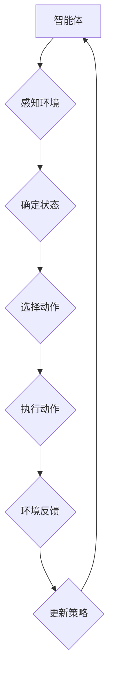

> 强化学习，强化学习算法，Q-learning，SARSA，陆地自行车，控制问题，模型预测，状态空间，动作空间

## 1. 背景介绍

陆地自行车控制一直是人工智能领域一个经典且具有挑战性的问题。由于其非线性的动力学特性、复杂的运动环境以及多样的目标任务，传统的控制方法难以有效地解决。近年来，强化学习 (Reinforcement Learning, RL) 作为一种能够学习复杂系统行为的机器学习方法，在解决陆地自行车控制问题方面展现出巨大的潜力。

强化学习的核心思想是通过设计一个智能体，使其在与环境的交互中学习最优策略。智能体通过与环境的交互，获得奖励信号，并根据奖励信号更新其策略，最终学习到能够最大化累积奖励的策略。

## 2. 核心概念与联系

**2.1 强化学习基本概念**

* **智能体 (Agent):**  与环境交互并采取行动的实体。
* **环境 (Environment):** 智能体所处的外部世界，会根据智能体的行动产生新的状态和奖励信号。
* **状态 (State):** 环境的当前描述，例如自行车的位置、速度、方向等。
* **动作 (Action):** 智能体可以采取的行动，例如加速、减速、转向等。
* **奖励 (Reward):** 环境对智能体行动的反馈，可以是正向奖励或负向奖励。
* **策略 (Policy):** 智能体根据当前状态选择动作的规则。

**2.2 强化学习算法**

* **Q-learning:**  一种基于价值函数的强化学习算法，通过学习状态-动作对的价值函数，选择能够获得最大价值的动作。
* **SARSA:**  一种基于策略的强化学习算法，通过学习状态-动作对的价值函数，选择能够获得最大价值的策略。

**2.3 强化学习与陆地自行车控制**

在陆地自行车控制问题中，智能体可以看作是自行车控制系统，环境是自行车运动的物理世界，状态是自行车的位置、速度、方向等，动作是控制油门、刹车、方向盘等，奖励是完成任务的成功程度或避免碰撞等。

**2.4 Mermaid 流程图**



## 3. 核心算法原理 & 具体操作步骤

### 3.1  算法原理概述

Q-learning 是一种基于价值函数的强化学习算法，其目标是学习一个状态-动作对的价值函数，该函数估计在给定状态下采取特定动作的长期回报。

Q-learning 算法的核心思想是通过迭代更新价值函数，使价值函数逐渐逼近最优价值函数。更新规则如下：

$$
Q(s, a) = (1 - \alpha)Q(s, a) + \alpha [r + \gamma \max_{a'} Q(s', a')]
$$

其中：

* $Q(s, a)$ 是状态 $s$ 下采取动作 $a$ 的价值函数。
* $\alpha$ 是学习率，控制着学习速度。
* $r$ 是从状态 $s$ 到状态 $s'$ 后获得的奖励。
* $\gamma$ 是折扣因子，控制着未来奖励的权重。
* $s'$ 是采取动作 $a$ 后进入的状态。
* $\max_{a'} Q(s', a')$ 是在状态 $s'$ 下采取所有动作的价值函数的最大值。

### 3.2  算法步骤详解

1. 初始化价值函数 $Q(s, a)$ 为 0。
2. 在环境中随机探索，收集状态-动作-奖励-下一个状态的样本数据。
3. 根据更新规则迭代更新价值函数 $Q(s, a)$。
4. 重复步骤 2 和 3，直到价值函数收敛。

### 3.3  算法优缺点

**优点:**

* 能够学习复杂系统的最优策略。
* 不需要事先知道环境模型。
* 能够处理离散和连续状态空间。

**缺点:**

* 训练过程可能需要很长时间。
* 容易陷入局部最优解。
* 需要大量的样本数据进行训练。

### 3.4  算法应用领域

Q-learning 算法广泛应用于各种领域，例如：

* 机器人控制
* 游戏人工智能
* 自动驾驶
* 医疗诊断

## 4. 数学模型和公式 & 详细讲解 & 举例说明

### 4.1  数学模型构建

在陆地自行车控制问题中，我们可以构建一个马尔可夫决策过程 (MDP) 模型来描述智能体与环境的交互。

* 状态空间 $S$: 包含自行车的位置、速度、方向等信息。
* 动作空间 $A$: 包含加速、减速、转向等动作。
* 转移概率 $P(s', r | s, a)$: 表示从状态 $s$ 执行动作 $a$ 后，进入状态 $s'$ 并获得奖励 $r$ 的概率。
* 奖励函数 $R(s, a)$: 表示在状态 $s$ 执行动作 $a$ 后获得的奖励。

### 4.2  公式推导过程

Q-learning 算法的目标是学习一个价值函数 $Q(s, a)$，该函数估计在状态 $s$ 下采取动作 $a$ 的长期回报。

根据 Bellman 方程，我们可以得到 Q-learning 更新规则：

$$
Q(s, a) = (1 - \alpha)Q(s, a) + \alpha [r + \gamma \max_{a'} Q(s', a')]
$$

其中：

* $\alpha$ 是学习率，控制着学习速度。
* $\gamma$ 是折扣因子，控制着未来奖励的权重。

### 4.3  案例分析与讲解

假设我们有一个陆地自行车控制问题，目标是让自行车从起点到达终点。我们可以将状态空间定义为自行车的位置和速度，动作空间定义为加速、减速和转向。

通过 Q-learning 算法，我们可以学习到一个价值函数，该函数可以告诉我们在每个状态下采取哪个动作能够获得最大的长期回报。

## 5. 项目实践：代码实例和详细解释说明

### 5.1  开发环境搭建

* Python 3.x
* OpenAI Gym
* NumPy
* Matplotlib

### 5.2  源代码详细实现

```python
import gym
import numpy as np

# 定义 Q-learning 算法
class QLearningAgent:
    def __init__(self, state_size, action_size, learning_rate=0.1, discount_factor=0.9, epsilon=0.1):
        self.state_size = state_size
        self.action_size = action_size
        self.learning_rate = learning_rate
        self.discount_factor = discount_factor
        self.epsilon = epsilon
        self.q_table = np.zeros((state_size, action_size))

    def choose_action(self, state):
        if np.random.uniform(0, 1) < self.epsilon:
            return np.random.randint(self.action_size)
        else:
            return np.argmax(self.q_table[state])

    def update_q_table(self, state, action, reward, next_state):
        self.q_table[state, action] = (1 - self.learning_rate) * self.q_table[state, action] + self.learning_rate * (reward + self.discount_factor * np.max(self.q_table[next_state]))

# 创建环境
env = gym.make('CartPole-v1')

# 初始化 Q-learning 算法
agent = QLearningAgent(state_size=env.observation_space.shape[0], action_size=env.action_space.n)

# 训练
for episode in range(1000):
    state = env.reset()
    done = False
    total_reward = 0
    while not done:
        action = agent.choose_action(state)
        next_state, reward, done, _ = env.step(action)
        agent.update_q_table(state, action, reward, next_state)
        state = next_state
        total_reward += reward
    print(f'Episode {episode+1}: Total Reward = {total_reward}')

# 测试
state = env.reset()
while True:
    env.render()
    action = agent.choose_action(state)
    next_state, reward, done, _ = env.step(action)
    state = next_state
    if done:
        break
env.close()
```

### 5.3  代码解读与分析

* **QLearningAgent 类:** 定义了 Q-learning 算法的核心逻辑，包括初始化 Q-table，选择动作，更新 Q-table 等。
* **choose_action 方法:** 根据 epsilon-greedy 策略选择动作，以一定的概率随机选择动作，以一定的概率选择价值函数最大的动作。
* **update_q_table 方法:** 根据 Bellman 方程更新 Q-table，学习最优策略。
* **训练循环:** 训练过程中，智能体与环境交互，收集样本数据，并根据样本数据更新 Q-table。
* **测试循环:** 测试过程中，智能体使用已学习的策略与环境交互，并展示控制结果。

### 5.4  运行结果展示

运行代码后，会看到智能体在 CartPole 环境中学习控制自行车，并最终能够保持平衡一段时间。

## 6. 实际应用场景

### 6.1  自动驾驶

强化学习可以用于训练自动驾驶汽车，使其能够在复杂道路环境中安全驾驶。

### 6.2  机器人控制

强化学习可以用于训练机器人执行各种任务，例如抓取物体、导航、组装等。

### 6.3  游戏人工智能

强化学习可以用于训练游戏人工智能，使其能够学习玩游戏并取得高分。

### 6.4  未来应用展望

强化学习在陆地自行车控制领域还有很大的发展潜力，例如：

* 使用更复杂的模型和算法，提高控制性能。
* 将强化学习与其他机器学习方法结合，例如深度学习，进一步提高控制精度。
* 将强化学习应用于更复杂的陆地自行车控制任务，例如自动驾驶自行车。

## 7. 工具和资源推荐

### 7.1  学习资源推荐

* **强化学习：强化学习算法**
* **强化学习：Sutton & Barto**
* **OpenAI Gym**

### 7.2  开发工具推荐

* **Python**
* **NumPy**
* **TensorFlow**
* **PyTorch**

### 7.3  相关论文推荐

* **Deep Reinforcement Learning with Double Q-learning**
* **Proximal Policy Optimization Algorithms**
* **Asynchronous Methods for Deep Reinforcement Learning**

## 8. 总结：未来发展趋势与挑战

### 8.1  研究成果总结

强化学习在陆地自行车控制领域取得了显著的成果，能够有效地学习控制策略，提高控制性能。

### 8.2  未来发展趋势

未来强化学习在陆地自行车控制领域的发展趋势包括：

* 使用更复杂的模型和算法，提高控制性能。
* 将强化学习与其他机器学习方法结合，例如深度学习，进一步提高控制精度。
* 将强化学习应用于更复杂的陆地自行车控制任务，例如自动驾驶自行车。

### 8.3  面临的挑战

强化学习在陆地自行车控制领域仍然面临一些挑战，例如：

* 训练过程可能需要很长时间。
* 容易陷入局部最优解。
* 需要大量的样本数据进行训练。

### 8.4  研究展望

未来研究方向包括：

* 开发更有效的强化学习算法，提高训练效率和控制性能。
* 研究如何解决强化学习算法容易陷入局部最优解的问题。
* 研究如何减少强化学习算法对样本数据的需求。

## 9. 附录：常见问题与解答