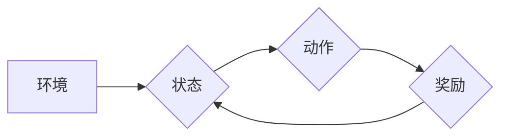

> 强化学习，状态-动作对，策略梯度，价值函数，Q学习，深度强化学习，环境交互

## 1. 背景介绍

强化学习 (Reinforcement Learning, RL) 作为机器学习的一个重要分支，旨在训练智能体在与环境交互的过程中学习最优策略，以最大化累积的奖励。与监督学习和无监督学习不同，强化学习不需要明确的标签数据，而是通过试错和反馈机制来学习。

在强化学习中，智能体与环境进行交互，根据当前状态采取动作，并根据环境的反馈获得奖励。智能体的目标是学习一个策略，该策略能够在长期内最大化累积的奖励。

状态-动作对 (State-Action Pair) 是强化学习的核心概念之一。状态描述了智能体所处的环境情况，动作是智能体可以采取的行动。状态-动作对决定了智能体在当前状态下采取的行动，进而影响了环境的下一个状态和获得的奖励。

## 2. 核心概念与联系

**2.1 强化学习基本要素**

* **智能体 (Agent):**  学习和决策的实体，例如游戏中的角色、自动驾驶汽车等。
* **环境 (Environment):** 智能体所处的外部世界，包括状态和奖励机制。
* **状态 (State):** 环境的当前描述，例如游戏中的棋盘状态、自动驾驶汽车的周围环境等。
* **动作 (Action):** 智能体可以采取的行动，例如游戏中的棋步、自动驾驶汽车的转向等。
* **奖励 (Reward):** 环境对智能体采取的动作给予的反馈，可以是正向奖励或负向惩罚。
* **策略 (Policy):** 智能体根据当前状态选择动作的规则，可以是确定性策略或概率性策略。
* **价值函数 (Value Function):**  评估状态或状态-动作对的长期价值，例如状态的期望累积奖励。

**2.2 状态-动作对的选择**

状态-动作对的选择是强化学习的核心问题。智能体需要根据当前状态选择最优的动作，以最大化累积的奖励。

**2.3 强化学习算法**

强化学习算法可以分为值函数法和策略梯度法两大类。

* **值函数法:**  通过学习状态或状态-动作对的价值函数来选择动作。例如 Q 学习算法。
* **策略梯度法:**  直接优化策略，通过梯度上升算法来更新策略参数。例如 REINFORCE 算法。

**Mermaid 流程图**



## 3. 核心算法原理 & 具体操作步骤

### 3.1 算法原理概述

Q 学习算法是一种经典的强化学习算法，属于值函数法。它通过学习状态-动作对的 Q 值来选择动作。Q 值表示从当前状态执行某个动作后，获得的期望累积奖励。

### 3.2 算法步骤详解

1. **初始化 Q 值表:**  将所有状态-动作对的 Q 值初始化为 0。
2. **根据策略选择动作:**  智能体根据当前状态和策略选择一个动作。
3. **执行动作并获得奖励:**  智能体执行选择的动作，并从环境获得奖励。
4. **更新 Q 值:**  根据 Bellman 方程更新 Q 值:

 $$Q(s,a) = Q(s,a) + \alpha [r + \gamma \max_{a'} Q(s',a') - Q(s,a)]$$

其中:

* $Q(s,a)$ 是状态 $s$ 下执行动作 $a$ 的 Q 值。
* $\alpha$ 是学习率，控制着 Q 值更新的幅度。
* $r$ 是获得的奖励。
* $\gamma$ 是折扣因子，控制着未来奖励的权重。
* $s'$ 是执行动作 $a$ 后进入的下一个状态。
* $a'$ 是在下一个状态 $s'$ 中选择的最优动作。

5. **重复步骤 2-4:**  重复以上步骤，直到 Q 值收敛。

### 3.3 算法优缺点

**优点:**

* 算法简单易懂，易于实现。
* 可以应用于离散状态和动作空间的问题。

**缺点:**

* 对于连续状态和动作空间的问题，Q 值表会变得非常庞大，难以存储和更新。
* 算法的性能依赖于学习率和折扣因子的选择。

### 3.4 算法应用领域

Q 学习算法广泛应用于各种强化学习问题，例如:

* 游戏 AI
* 自动驾驶
* 机器人控制
* 医疗诊断

## 4. 数学模型和公式 & 详细讲解 & 举例说明

### 4.1 数学模型构建

强化学习的数学模型可以概括为一个马尔可夫决策过程 (MDP)。

MDP 由以下要素组成:

* 状态空间 $S$: 所有可能的系统状态的集合。
* 动作空间 $A$: 在每个状态下可执行的动作集合。
* 转移概率 $P(s'|s,a)$: 从状态 $s$ 执行动作 $a$ 后转移到状态 $s'$ 的概率。
* 奖励函数 $R(s,a)$: 在状态 $s$ 执行动作 $a$ 后获得的奖励。
* 折扣因子 $\gamma$: 控制未来奖励的权重。

### 4.2 公式推导过程

Q 学习算法的目标是学习状态-动作对的 Q 值，即从状态 $s$ 执行动作 $a$ 后获得的期望累积奖励。

Bellman 方程描述了 Q 值的更新规则:

$$Q(s,a) = Q(s,a) + \alpha [r + \gamma \max_{a'} Q(s',a') - Q(s,a)]$$

其中:

* $Q(s,a)$ 是状态 $s$ 下执行动作 $a$ 的 Q 值。
* $\alpha$ 是学习率。
* $r$ 是获得的奖励。
* $\gamma$ 是折扣因子。
* $s'$ 是执行动作 $a$ 后进入的下一个状态。
* $a'$ 是在下一个状态 $s'$ 中选择的最优动作。

### 4.3 案例分析与讲解

假设有一个简单的强化学习问题，智能体在一个环境中移动，目标是到达终点。环境由一系列状态组成，每个状态代表智能体的位置。智能体可以采取向上、向下、向左、向右四个动作。

在每个状态下，智能体执行一个动作，并获得相应的奖励。到达终点时获得最大奖励，其他状态获得较小的奖励。

使用 Q 学习算法，可以学习到每个状态下执行每个动作的 Q 值。通过 Q 值，智能体可以选择最优的动作，最终到达终点。

## 5. 项目实践：代码实例和详细解释说明

### 5.1 开发环境搭建

* Python 3.x
* TensorFlow 或 PyTorch

### 5.2 源代码详细实现

```python
import numpy as np

# 定义环境
class Environment:
    def __init__(self):
        self.state = 0

    def step(self, action):
        # 根据动作更新状态
        if action == 0:  # 上
            self.state = max(0, self.state - 1)
        elif action == 1:  # 下
            self.state = min(9, self.state + 1)
        elif action == 2:  # 左
            self.state = max(0, self.state - 3)
        elif action == 3:  # 右
            self.state = min(9, self.state + 3)

        # 返回奖励
        if self.state == 9:
            return 100, True
        else:
            return -1, False

# 定义 Q 学习算法
class QLearning:
    def __init__(self, env, alpha=0.1, gamma=0.9, epsilon=0.1):
        self.env = env
        self.alpha = alpha
        self.gamma = gamma
        self.epsilon = epsilon
        self.q_table = np.zeros((10, 4))

    def choose_action(self, state):
        if np.random.uniform(0, 1) < self.epsilon:
            return np.random.choice(4)
        else:
            return np.argmax(self.q_table[state])

    def learn(self, state, action, reward, next_state):
        self.q_table[state, action] = (1 - self.alpha) * self.q_table[state, action] + self.alpha * (reward + self.gamma * np.max(self.q_table[next_state]))

# 创建环境和 Q 学习算法
env = Environment()
agent = QLearning(env)

# 训练
for episode in range(1000):
    state = env.state
    done = False
    while not done:
        action = agent.choose_action(state)
        next_state, reward, done = env.step(action)
        agent.learn(state, action, reward, next_state)
        state = next_state

# 测试
state = env.state
while state != 9:
    action = agent.choose_action(state)
    next_state, reward, done = env.step(action)
    state = next_state

print("训练完成！")
```

### 5.3 代码解读与分析

* **环境类:** 定义了环境的规则和状态转移。
* **Q 学习类:** 实现 Q 学习算法的核心逻辑，包括 Q 值表初始化、动作选择、Q 值更新等。
* **训练循环:** 训练 Q 学习算法，通过与环境交互，更新 Q 值表。
* **测试循环:** 使用训练好的 Q 值表，测试智能体的行为。

### 5.4 运行结果展示

运行代码后，智能体将在环境中学习并最终到达终点。

## 6. 实际应用场景

### 6.1 游戏 AI

强化学习可以用于训练游戏 AI，例如 AlphaGo 和 AlphaZero。这些 AI 通过与人类玩家或自身进行博弈，学习最优策略。

### 6.2 自动驾驶

强化学习可以用于训练自动驾驶汽车，例如控制转向、加速和制动。

### 6.3 机器人控制

强化学习可以用于训练机器人执行各种任务，例如抓取物体、导航和组装。

### 6.4 未来应用展望

强化学习在未来将有更广泛的应用，例如:

* 个性化推荐系统
* 医疗诊断和治疗
* 金融投资
* 科学研究

## 7. 工具和资源推荐

### 7.1 学习资源推荐

* **书籍:**
    * Reinforcement Learning: An Introduction by Richard S. Sutton and Andrew G. Barto
    * Deep Reinforcement Learning Hands-On by Maxim Lapan
* **在线课程:**
    * Coursera: Reinforcement Learning Specialization by David Silver
    * Udacity: Deep Reinforcement Learning Nanodegree

### 7.2 开发工具推荐

* **TensorFlow:** 开源深度学习框架，支持强化学习算法的实现。
* **PyTorch:** 开源深度学习框架，也支持强化学习算法的实现。
* **OpenAI Gym:** 强化学习环境库，提供各种标准的强化学习任务。

### 7.3 相关论文推荐

* Deep Q-Network (DQN)
* Proximal Policy Optimization (PPO)
* Trust Region Policy Optimization (TRPO)

## 8. 总结：未来发展趋势与挑战

### 8.1 研究成果总结

强化学习近年来取得了显著进展，在游戏 AI、自动驾驶、机器人控制等领域取得了突破性成果。

### 8.2 未来发展趋势

* **深度强化学习:** 将深度神经网络与强化学习结合，提高算法的学习能力和泛化能力。
* **离线强化学习:** 从离线数据中学习强化策略，无需与环境交互。
* **多智能体强化学习:** 研究多个智能体在同一环境中协作或竞争的强化学习算法。

### 8