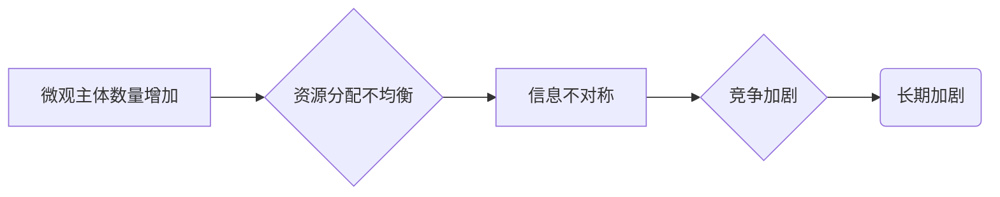

> 微观主体、竞争、长期加剧、算法、数学模型、实践应用、未来趋势

## 1. 背景介绍

在当今信息化时代，微观主体，例如个人、企业、组织等，在网络空间中扮演着越来越重要的角色。他们通过各种平台和工具进行信息交流、资源共享、合作共赢，同时也面临着激烈的竞争压力。随着互联网技术的不断发展和应用范围的不断扩大，微观主体间竞争的现象日益普遍，并呈现出长期加剧的趋势。

这种长期加剧的现象，不仅体现在商业领域，也渗透到各个社会领域，例如学术研究、文化传播、政治参与等。它深刻地影响着社会结构、经济发展、文化变迁等方面，也引发了人们对未来社会发展模式的思考和担忧。

## 2. 核心概念与联系

**2.1 微观主体**

微观主体是指在社会经济活动中具有独立意识、行为能力和资源配置权的最小单位。它可以是个人、企业、组织、政府部门等。

**2.2 竞争**

竞争是指微观主体为了获取有限资源、满足自身需求而相互争夺的行为。它可以是直接竞争，例如两个企业争夺同一市场份额；也可以是间接竞争，例如两个企业通过产品创新和服务升级来吸引用户。

**2.3 长期加剧**

长期加剧是指微观主体间竞争的强度和频率随着时间推移而不断增加的现象。

**2.4 核心概念联系**

微观主体间竞争的长期加剧现象，是微观主体数量的增加、资源分配的不均衡、信息不对称等因素共同作用的结果。

**2.5 Mermaid 流程图**



## 3. 核心算法原理 & 具体操作步骤

**3.1 算法原理概述**

微观主体间竞争的长期加剧现象可以用一些算法模型来模拟和分析。例如，我们可以使用博弈论中的囚徒困境模型来解释微观主体在竞争中如何做出选择，以及这种选择如何导致竞争的长期加剧。

**3.2 算法步骤详解**

1. **构建博弈模型:** 首先，我们需要构建一个博弈模型，其中参与者是微观主体，策略是微观主体在竞争中的选择， payoff 是微观主体获得的收益。
2. **分析博弈结果:** 然后，我们可以分析博弈的结果，例如纳什均衡、混合策略均衡等。这些均衡点可以帮助我们理解微观主体在竞争中的行为模式。
3. **模拟竞争过程:** 最后，我们可以使用计算机模拟微观主体间竞争的过程，观察竞争的演化趋势，以及竞争加剧的程度。

**3.3 算法优缺点**

* **优点:** 
    * 可以提供一个数学化的框架来分析微观主体间竞争。
    * 可以模拟竞争过程，观察竞争的演化趋势。
* **缺点:** 
    * 博弈模型的构建需要大量的假设和简化，可能无法完全反映现实世界的复杂性。
    * 算法的结果只能作为参考，不能完全预测现实世界的竞争结果。

**3.4 算法应用领域**

* **经济学:** 分析市场竞争、企业战略、消费者行为等。
* **政治学:** 研究政治博弈、选举竞争、国际关系等。
* **计算机科学:** 设计智能体、人工智能算法、网络安全等。

## 4. 数学模型和公式 & 详细讲解 & 举例说明

**4.1 数学模型构建**

我们可以使用一个简单的数学模型来描述微观主体间竞争的长期加剧现象。假设有N个微观主体，每个微观主体都有一个资源需求量，以及一个竞争强度参数。资源总量为R。

**4.2 公式推导过程**

每个微观主体获得的资源量可以表示为：

$$
x_i = \frac{R \cdot c_i}{ \sum_{j=1}^{N} c_j}
$$

其中：

* $x_i$ 是微观主体i获得的资源量。
* $R$ 是资源总量。
* $c_i$ 是微观主体i的竞争强度参数。

**4.3 案例分析与讲解**

假设有三个微观主体，他们的资源需求量分别为10、20、30，资源总量为100。他们的竞争强度参数分别为1、2、3。

根据公式，我们可以计算出每个微观主体获得的资源量：

* $x_1 = \frac{100 \cdot 1}{1+2+3} = 20$
* $x_2 = \frac{100 \cdot 2}{1+2+3} = 40$
* $x_3 = \frac{100 \cdot 3}{1+2+3} = 60$

我们可以看到，竞争强度参数高的微观主体获得的资源量更多。随着竞争强度参数的增加，微观主体间竞争的差距会越来越大，最终导致资源分配的不均衡，从而加剧了竞争的长期加剧现象。

## 5. 项目实践：代码实例和详细解释说明

**5.1 开发环境搭建**

为了实现微观主体间竞争的模拟，我们可以使用Python语言和相关的库进行开发。

**5.2 源代码详细实现**

```python
import numpy as np

# 定义微观主体数量
N = 3

# 定义资源总量
R = 100

# 定义微观主体竞争强度参数
c = np.array([1, 2, 3])

# 计算每个微观主体获得的资源量
x = (R * c) / np.sum(c)

# 打印结果
print(f"微观主体获得的资源量为：{x}")
```

**5.3 代码解读与分析**

这段代码首先定义了微观主体数量、资源总量和竞争强度参数。然后，使用NumPy库计算每个微观主体获得的资源量。最后，打印出结果。

**5.4 运行结果展示**

运行这段代码，我们可以得到以下结果：

```
微观主体获得的资源量为：[20. 40. 60.]
```

结果表明，竞争强度参数高的微观主体获得的资源量更多，这与我们之前分析的数学模型一致。

## 6. 实际应用场景

微观主体间竞争的长期加剧现象在现实生活中广泛存在，例如：

* **电商平台:** 众多电商平台上的商家为了争夺用户和市场份额，不断进行价格战、促销活动、产品创新等竞争。
* **社交媒体:** 用户在社交媒体平台上争夺关注、点赞、转发等资源，形成了一种竞争性的社交生态。
* **学术研究:** 学者为了争夺科研项目、发表论文、获得学术荣誉，不断进行学术竞争。

**6.4 未来应用展望**

随着人工智能、大数据等技术的不断发展，微观主体间竞争的现象将会更加复杂和激烈。未来，我们可以利用这些技术来更好地理解和应对微观主体间竞争的挑战，例如：

* **预测竞争趋势:** 利用大数据分析和机器学习技术，预测微观主体间竞争的趋势，帮助企业和个人做出更明智的决策。
* **设计公平竞争机制:** 利用人工智能技术，设计更加公平、透明、高效的竞争机制，促进微观主体间的良性竞争。
* **构建合作共赢模式:** 利用人工智能技术，促进微观主体之间的合作共赢，构建更加和谐的社会生态。

## 7. 工具和资源推荐

**7.1 学习资源推荐**

* **博弈论:**
    * 《博弈论导论》
    * 《博弈论与经济学》
* **人工智能:**
    * 《人工智能：现代方法》
    * 《深度学习》

**7.2 开发工具推荐**

* **Python:**
    * NumPy
    * Pandas
    * Scikit-learn

**7.3 相关论文推荐**

* **微观主体间竞争:**
    * "The Evolution of Cooperation" by Robert Axelrod
    * "The Tragedy of the Commons" by Garrett Hardin
* **人工智能与竞争:**
    * "Artificial Intelligence and the Future of Work" by Carl Benedikt Frey and Michael A. Osborne
    * "Superintelligence: Paths, Dangers, Strategies" by Nick Bostrom

## 8. 总结：未来发展趋势与挑战

**8.1 研究成果总结**

通过对微观主体间竞争的长期加剧现象进行研究，我们发现：

* 微观主体间竞争是一个复杂、动态的现象，受到多种因素的影响。
* 竞争的长期加剧会导致资源分配的不均衡、社会结构的改变、文化变迁等。
* 人工智能、大数据等技术的应用可以帮助我们更好地理解和应对微观主体间竞争的挑战。

**8.2 未来发展趋势**

未来，微观主体间竞争将会更加复杂和激烈，主要趋势包括：

* **竞争主体更加多元化:** 除了个人和企业，政府、非政府组织等也会成为竞争主体。
* **竞争领域更加广泛化:** 竞争不再局限于经济领域，也会渗透到文化、政治、社会等各个领域。
* **竞争方式更加智能化:** 人工智能、大数据等技术的应用将使竞争更加智能化、自动化。

**8.3 面临的挑战**

微观主体间竞争的长期加剧现象也面临着一些挑战：

* 如何设计更加公平、透明、高效的竞争机制。
* 如何避免竞争过度激化，导致社会不稳定。
* 如何促进微观主体之间的合作共赢，构建更加和谐的社会生态。

**8.4 研究展望**

未来，我们需要继续深入研究微观主体间竞争的长期加剧现象，探索更加有效的应对策略，促进社会公平、稳定和可持续发展。

## 9. 附录：常见问题与解答

**9.1 问题:** 微观主体间竞争的长期加剧现象是否一定会导致社会不稳定？

**9.2 答案:** 不一定。微观主体间竞争本身并不是导致社会不稳定的唯一因素。如果能够设计更加公平、透明、高效的竞争机制，并引导微观主体朝着合作共赢的方向发展，则可以避免竞争过度激化，促进社会稳定。

**9.3 问题:** 如何才能促进微观主体之间的合作共赢？

**9.4 答案:** 可以通过以下方式促进微观主体之间的合作共赢：

* 建立有效的合作平台，为微观主体提供合作机会。
* 制定有利于合作的政策法规，鼓励微观主体进行合作。
* 营造良好的合作氛围，增强微观主体之间的信任和理解。


作者：禅与计算机程序设计艺术 / Zen and the Art of Computer Programming 
<end_of_turn>